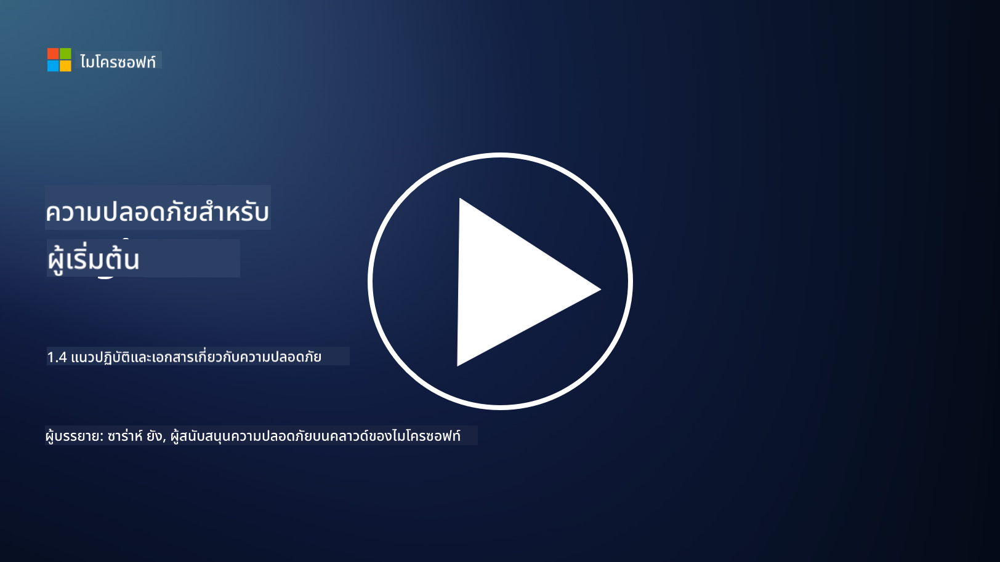

<!--
CO_OP_TRANSLATOR_METADATA:
{
  "original_hash": "d33500902124e52870935bdce4546fcc",
  "translation_date": "2025-09-04T00:19:53+00:00",
  "source_file": "1.4 Security practices and documentation.md",
  "language_code": "th"
}
-->
# แนวปฏิบัติด้านความปลอดภัยและเอกสารประกอบ

คุณอาจเคยได้ยินคำว่า “นโยบายความปลอดภัย”, “มาตรฐานความปลอดภัย” ฯลฯ มาก่อน แต่ในความเป็นจริง ผู้เชี่ยวชาญด้านความปลอดภัยไซเบอร์หลายคนไม่ได้ใช้คำเหล่านี้อย่างถูกต้อง ดังนั้นในส่วนนี้เราจะอธิบายความหมายของแต่ละคำและเหตุผลที่องค์กรควรนำไปใช้

## บทนำ

ในบทเรียนนี้ เราจะครอบคลุมหัวข้อ:

- นโยบายความปลอดภัยคืออะไร?

- มาตรฐานความปลอดภัยคืออะไร?

- ความปลอดภัยขั้นต่ำ (Baseline) คืออะไร?

- แนวทางปฏิบัติด้านความปลอดภัยคืออะไร?

- ขั้นตอนปฏิบัติด้านความปลอดภัยคืออะไร?

- กฎหมายและข้อบังคับในบริบทของความปลอดภัยไซเบอร์คืออะไร?

คำเหล่านี้มักถูกใช้ในบริบทของความปลอดภัยไซเบอร์เพื่อกำหนดระดับต่าง ๆ ของเอกสารและแนวปฏิบัติด้านความปลอดภัยในองค์กร เรามาอธิบายแต่ละคำให้ชัดเจน:

## นโยบายความปลอดภัยคืออะไร?

นโยบายความปลอดภัยเป็นเอกสารระดับสูงที่กำหนดเป้าหมาย หลักการ และแนวทางโดยรวมขององค์กรในด้านความปลอดภัย มันเป็นกรอบสำหรับการตัดสินใจที่เกี่ยวข้องกับความปลอดภัยและกำหนดทิศทางของท่าทีด้านความปลอดภัยขององค์กร นโยบายความปลอดภัยมักครอบคลุมหัวข้อต่าง ๆ เช่น การใช้งานทรัพยากรอย่างเหมาะสม การปกป้องข้อมูล การควบคุมการเข้าถึง การตอบสนองต่อเหตุการณ์ และอื่น ๆ นโยบายนี้ไม่ขึ้นอยู่กับโซลูชันหรือเทคโนโลยี ตัวอย่างของนโยบายความปลอดภัยที่หลายคนคุ้นเคยคือ นโยบายการใช้งานที่ยอมรับได้ขององค์กร

## มาตรฐานความปลอดภัยคืออะไร?

มาตรฐานความปลอดภัยเป็นเอกสารที่มีรายละเอียดและเฉพาะเจาะจงมากขึ้น ซึ่งให้แนวทางและข้อกำหนดสำหรับการนำมาตรการและการควบคุมด้านความปลอดภัยไปใช้ในองค์กร มาตรฐานมีความเป็นรูปธรรมและทางเทคนิคมากกว่านโยบาย โดยให้คำแนะนำและคำแนะนำเฉพาะสำหรับการกำหนดค่าและการดูแลระบบ เครือข่าย และกระบวนการต่าง ๆ เพื่อให้บรรลุเป้าหมายด้านความปลอดภัย ตัวอย่างของมาตรฐานความปลอดภัยคือ _“ข้อมูลภายในทั้งหมดต้องถูกเข้ารหัสทั้งในขณะพักและขณะส่งผ่าน”_

## ความปลอดภัยขั้นต่ำ (Baseline) คืออะไร?

ความปลอดภัยขั้นต่ำคือชุดของการกำหนดค่าความปลอดภัยขั้นต่ำที่ถือว่าเป็นสิ่งจำเป็นสำหรับระบบ แอปพลิเคชัน หรือสภาพแวดล้อมเฉพาะ ณ เวลาหนึ่ง มันกำหนดจุดเริ่มต้นสำหรับความปลอดภัยที่ควรนำไปใช้ในทุกกรณีที่เกี่ยวข้อง ความปลอดภัยขั้นต่ำช่วยให้มั่นใจถึงความสม่ำเสมอและระดับความปลอดภัยที่แน่นอนทั่วทั้งโครงสร้างพื้นฐานด้านไอทีขององค์กร ตัวอย่างของความปลอดภัยขั้นต่ำคือ _“Azure VMs ต้องไม่มีการเข้าถึงอินเทอร์เน็ตโดยตรง”_

## แนวทางปฏิบัติด้านความปลอดภัยคืออะไร?

แนวทางปฏิบัติด้านความปลอดภัยเป็นเอกสารที่ให้คำแนะนำและข้อเสนอแนะเมื่อมาตรฐานความปลอดภัยเฉพาะไม่สามารถนำไปใช้ได้ แนวทางปฏิบัติพยายามจัดการกับ “พื้นที่สีเทา” ที่เกิดขึ้นเมื่อมาตรฐานไม่ครอบคลุม หรือครอบคลุมเพียงบางส่วนในเรื่องนั้น ๆ

## ขั้นตอนปฏิบัติด้านความปลอดภัยคืออะไร?

ขั้นตอนปฏิบัติด้านความปลอดภัยเป็นคู่มือที่มีรายละเอียดแบบทีละขั้นตอน ซึ่งกำหนดการกระทำและงานเฉพาะที่ต้องดำเนินการเพื่อดำเนินกระบวนการหรือภารกิจที่เกี่ยวข้องกับความปลอดภัย ขั้นตอนปฏิบัติเป็นเอกสารที่ใช้งานได้จริงและสามารถดำเนินการได้ โดยให้ลำดับการกระทำที่ชัดเจนสำหรับการตอบสนองต่อเหตุการณ์ การบำรุงรักษาระบบ การเริ่มต้นใช้งานผู้ใช้ และกิจกรรมอื่น ๆ ที่เกี่ยวข้องกับความปลอดภัย ตัวอย่างของขั้นตอนปฏิบัติด้านความปลอดภัยคือ _“เมื่อเกิดเหตุการณ์ความปลอดภัยระดับ P1 โดย Microsoft Sentinel ศูนย์ปฏิบัติการด้านความปลอดภัย (SOC) ต้องแจ้งผู้จัดการด้านความปลอดภัยที่อยู่เวรทันทีและส่งรายละเอียดของเหตุการณ์ไปให้พวกเขา”_

โดยสรุป คำเหล่านี้แสดงถึงระดับต่าง ๆ ของเอกสารและแนวทางในกรอบการทำงานด้านความปลอดภัยไซเบอร์ขององค์กร นโยบายความปลอดภัยกำหนดเป้าหมายระดับสูง มาตรฐานให้ข้อกำหนดที่ละเอียดและเฉพาะเจาะจง ความปลอดภัยขั้นต่ำกำหนดค่าความปลอดภัยขั้นต่ำ แนวทางปฏิบัติให้คำแนะนำที่ดีที่สุด และขั้นตอนปฏิบัติให้ขั้นตอนที่สามารถดำเนินการได้สำหรับกระบวนการด้านความปลอดภัย

## กฎหมายและข้อบังคับในบริบทของความปลอดภัยไซเบอร์คืออะไร?

กฎหมายและข้อบังคับหมายถึงกรอบทางกฎหมายที่รัฐบาลและหน่วยงานกำกับดูแลกำหนดขึ้นเพื่อกำหนดและบังคับใช้กฎ มาตรฐาน และข้อกำหนดสำหรับการรักษาความปลอดภัยระบบดิจิทัล ข้อมูล และสารสนเทศ กฎหมายและข้อบังคับเหล่านี้แตกต่างกันไปตามเขตอำนาจศาล และมุ่งเน้นไปที่แง่มุมต่าง ๆ ของความปลอดภัยไซเบอร์ เช่น การปกป้องข้อมูล ความเป็นส่วนตัว การรายงานเหตุการณ์ และความปลอดภัยของโครงสร้างพื้นฐานที่สำคัญ ตัวอย่างของกฎหมายและข้อบังคับที่เกี่ยวข้องกับความปลอดภัยไซเบอร์ ได้แก่ General Data Protection Regulation (GDPR), Health Insurance Portability and Accountability Act (HIPAA), California Consumer Privacy Act (CCPA), Payment Card Industry Data Security Standard (PCI DSS)

## อ่านเพิ่มเติม

[Information Security Policy Templates | SANS Institute](https://www.sans.org/information-security-policy/)

[Compliance with Cybersecurity and Privacy Laws and Regulations | NIST](https://www.nist.gov/mep/cybersecurity-resources-manufacturers/compliance-cybersecurity-and-privacy-laws-and-regulations)

---

**ข้อจำกัดความรับผิดชอบ**:  
เอกสารนี้ได้รับการแปลโดยใช้บริการแปลภาษา AI [Co-op Translator](https://github.com/Azure/co-op-translator) แม้ว่าเราจะพยายามให้การแปลมีความถูกต้อง แต่โปรดทราบว่าการแปลอัตโนมัติอาจมีข้อผิดพลาดหรือความไม่แม่นยำ เอกสารต้นฉบับในภาษาต้นทางควรถือเป็นแหล่งข้อมูลที่เชื่อถือได้ สำหรับข้อมูลที่สำคัญ ขอแนะนำให้ใช้บริการแปลภาษาจากผู้เชี่ยวชาญ เราไม่รับผิดชอบต่อความเข้าใจผิดหรือการตีความที่ผิดพลาดซึ่งเกิดจากการใช้การแปลนี้