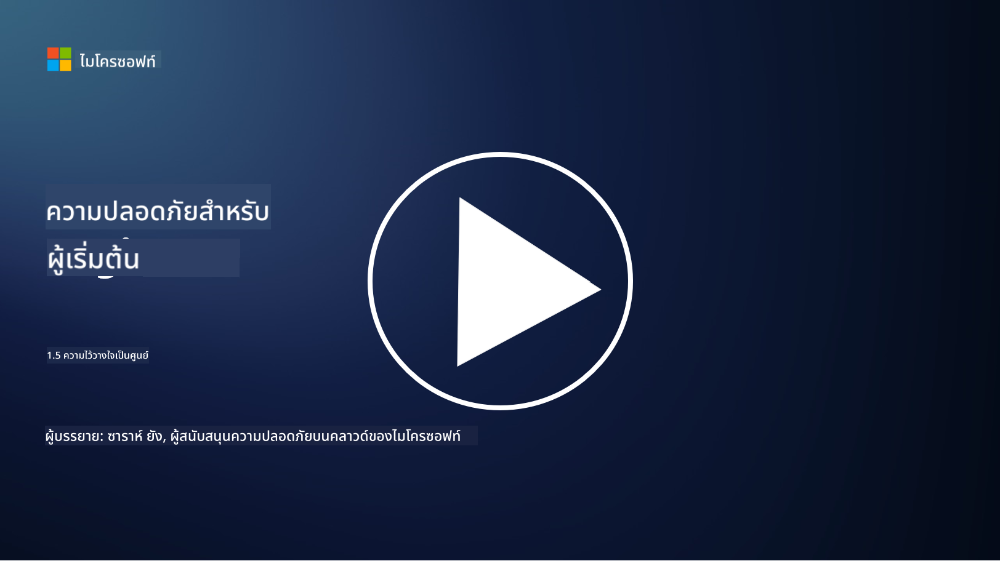
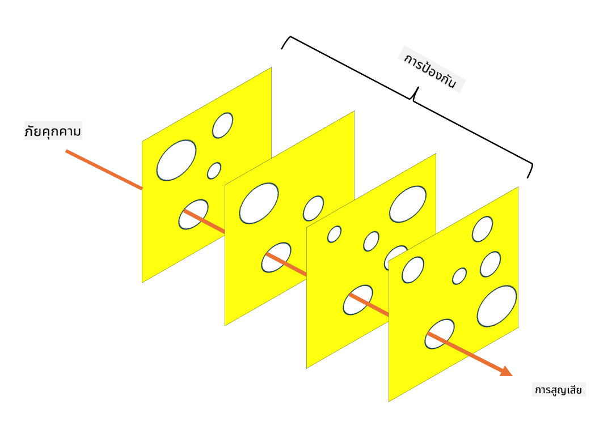

<!--
CO_OP_TRANSLATOR_METADATA:
{
  "original_hash": "75f77f972d2233c584f87c1eb96c983b",
  "translation_date": "2025-09-03T23:47:19+00:00",
  "source_file": "1.5 Zero trust.md",
  "language_code": "th"
}
-->
# Zero Trust

“Zero trust” เป็นคำที่ถูกพูดถึงอย่างมากในวงการความปลอดภัยในปัจจุบัน แต่จริงๆ แล้วมันหมายความว่าอะไร? หรือเป็นเพียงแค่คำที่ดูเก๋ๆ? ในบทเรียนนี้ เราจะมาทำความเข้าใจว่า Zero Trust คืออะไร

## บทนำ

 - ในบทเรียนนี้ เราจะพูดถึง:
   
   
 - Zero Trust คืออะไร?

   
  

 - Zero Trust แตกต่างจากสถาปัตยกรรมความปลอดภัยแบบดั้งเดิมอย่างไร?

   
   

 - Defense in Depth คืออะไร?

## Zero Trust

Zero Trust เป็นแนวทางด้านความปลอดภัยทางไซเบอร์ที่ท้าทายแนวคิดแบบดั้งเดิมที่ว่า "เชื่อก่อนแล้วค่อยตรวจสอบ" โดยตั้งสมมติฐานว่าไม่มีสิ่งใด ไม่ว่าจะอยู่ภายในหรือภายนอกเครือข่ายขององค์กร ควรได้รับความไว้วางใจโดยอัตโนมัติ Zero Trust สนับสนุนให้มีการตรวจสอบผู้ใช้ อุปกรณ์ และแอปพลิเคชันทุกตัวที่พยายามเข้าถึงทรัพยากร ไม่ว่าจะอยู่ที่ใด หลักการสำคัญของ Zero Trust คือการลด "พื้นผิวการโจมตี" และลดผลกระทบที่อาจเกิดขึ้นจากการละเมิดความปลอดภัย

ในโมเดล Zero Trust หลักการสำคัญที่เน้นมีดังนี้:

1. **การยืนยันตัวตน**: การตรวจสอบสิทธิ์และการอนุญาตถูกนำมาใช้อย่างเข้มงวดกับผู้ใช้และอุปกรณ์ทุกตัว ไม่ว่าจะอยู่ที่ใด โปรดจำไว้ว่าตัวตนไม่ได้หมายถึงแค่คนเท่านั้น แต่ยังรวมถึงอุปกรณ์ แอปพลิเคชัน ฯลฯ

2. **สิทธิ์ขั้นต่ำ**: ผู้ใช้และอุปกรณ์จะได้รับสิทธิ์การเข้าถึงในระดับต่ำที่สุดที่จำเป็นต่อการทำงาน เพื่อลดความเสียหายหากถูกโจมตี

3. **การแบ่งส่วนย่อย**: ทรัพยากรเครือข่ายถูกแบ่งออกเป็นส่วนย่อยๆ เพื่อลดการเคลื่อนที่ในแนวราบภายในเครือข่ายในกรณีที่เกิดการละเมิด

4. **การตรวจสอบอย่างต่อเนื่อง**: มีการตรวจสอบและวิเคราะห์พฤติกรรมของผู้ใช้และอุปกรณ์อย่างต่อเนื่องเพื่อค้นหาความผิดปกติและภัยคุกคาม การใช้เทคนิคการตรวจสอบสมัยใหม่ยังรวมถึงการใช้ Machine Learning, AI และ Threat Intelligence เพื่อเพิ่มรายละเอียดและบริบทในการตรวจสอบ

5. **การเข้ารหัสข้อมูล**: ข้อมูลถูกเข้ารหัสทั้งในระหว่างการส่งและเมื่อจัดเก็บ เพื่อป้องกันการเข้าถึงโดยไม่ได้รับอนุญาต

6. **การควบคุมการเข้าถึงอย่างเข้มงวด**: การควบคุมการเข้าถึงถูกบังคับใช้ตามบริบท เช่น บทบาทของผู้ใช้ สุขภาพของอุปกรณ์ และตำแหน่งเครือข่าย

Microsoft แบ่ง Zero Trust ออกเป็น 5 เสาหลัก ซึ่งเราจะพูดถึงในบทเรียนถัดไป

## ความแตกต่างจากสถาปัตยกรรมความปลอดภัยแบบดั้งเดิม

Zero Trust แตกต่างจากสถาปัตยกรรมความปลอดภัยแบบดั้งเดิม เช่น โมเดลที่เน้นปริมณฑล ในหลายๆ ด้าน:

1. **ปริมณฑล vs. การเน้นตัวตน**: โมเดลแบบดั้งเดิมมุ่งเน้นการรักษาความปลอดภัยที่ปริมณฑลของเครือข่าย และสมมติว่าผู้ใช้และอุปกรณ์ภายในสามารถเชื่อถือได้เมื่อเข้ามาแล้ว Zero Trust ในทางกลับกัน สมมติว่าภัยคุกคามสามารถมาจากทั้งภายในและภายนอกเครือข่าย และบังคับใช้การควบคุมที่เน้นตัวตนอย่างเข้มงวด

2. **ความไว้วางใจโดยปริยาย vs. ความไว้วางใจโดยชัดเจน**: โมเดลแบบดั้งเดิมไว้วางใจผู้ใช้และอุปกรณ์ภายในเครือข่ายโดยปริยายจนกว่าจะพิสูจน์เป็นอย่างอื่น Zero Trust ตรวจสอบตัวตนอย่างชัดเจนและตรวจสอบความผิดปกติอย่างต่อเนื่อง

3. **เครือข่ายแบบแบน vs. เครือข่ายแบบแบ่งส่วน**: สถาปัตยกรรมแบบดั้งเดิมมักเกี่ยวข้องกับเครือข่ายแบบแบนที่ผู้ใช้ภายในสามารถเข้าถึงได้กว้างขวาง Zero Trust สนับสนุนการแบ่งเครือข่ายออกเป็นโซนเล็กๆ ที่แยกจากกันเพื่อลดผลกระทบจากการละเมิด

4. **การตอบสนอง vs. การป้องกันล่วงหน้า**: ความปลอดภัยแบบดั้งเดิมมักพึ่งพามาตรการตอบสนอง เช่น ไฟร์วอลล์ปริมณฑลและระบบตรวจจับการบุกรุก Zero Trust ใช้วิธีการเชิงรุกโดยสมมติว่าการละเมิดมีโอกาสเกิดขึ้นและลดผลกระทบให้น้อยที่สุด

## Defense in Depth

Defense in Depth หรือที่เรียกว่าความปลอดภัยแบบหลายชั้น เป็นกลยุทธ์ด้านความปลอดภัยทางไซเบอร์ที่เกี่ยวข้องกับการใช้มาตรการควบคุมและมาตรการรักษาความปลอดภัยหลายชั้นเพื่อปกป้องทรัพย์สินขององค์กร เป้าหมายคือการสร้างชั้นป้องกันที่ซ้อนทับกันเพื่อให้หากชั้นหนึ่งถูกเจาะ อีกชั้นยังสามารถให้การป้องกันได้ แต่ละชั้นมุ่งเน้นไปที่แง่มุมที่แตกต่างกันของความปลอดภัยและเพิ่มความแข็งแกร่งโดยรวมขององค์กร

Defense in Depth ประกอบด้วยการผสมผสานระหว่างมาตรการด้านเทคนิค กระบวนการ และความปลอดภัยทางกายภาพ ซึ่งอาจรวมถึงไฟร์วอลล์ ระบบตรวจจับการบุกรุก การควบคุมการเข้าถึง การเข้ารหัส การฝึกอบรมผู้ใช้ นโยบายความปลอดภัย และอื่นๆ แนวคิดคือการสร้างอุปสรรคหลายชั้นที่รวมกันทำให้ยากต่อการที่ผู้โจมตีจะเจาะระบบและเครือข่ายขององค์กรได้ นี่บางครั้งเรียกว่า "โมเดลชีสสวิส" ซึ่งยังใช้ในอุตสาหกรรมอื่นๆ เช่น การป้องกันอุบัติเหตุในระบบขนส่ง

## อ่านเพิ่มเติม

[What is Zero Trust?](https://learn.microsoft.com/security/zero-trust/zero-trust-overview?WT.mc_id=academic-96948-sayoung)

[Evolving Zero Trust – Microsoft Position Paper](https://query.prod.cms.rt.microsoft.com/cms/api/am/binary/RWJJdT?WT.mc_id=academic-96948-sayoung)

[Zero Trust and BeyondCorp Google Cloud | Google Cloud Blog](https://cloud.google.com/blog/topics/developers-practitioners/zero-trust-and-beyondcorp-google-cloud)

---

**ข้อจำกัดความรับผิดชอบ**:  
เอกสารนี้ได้รับการแปลโดยใช้บริการแปลภาษา AI [Co-op Translator](https://github.com/Azure/co-op-translator) แม้ว่าเราจะพยายามให้การแปลมีความถูกต้อง แต่โปรดทราบว่าการแปลอัตโนมัติอาจมีข้อผิดพลาดหรือความไม่แม่นยำ เอกสารต้นฉบับในภาษาต้นทางควรถือเป็นแหล่งข้อมูลที่เชื่อถือได้ สำหรับข้อมูลที่สำคัญ ขอแนะนำให้ใช้บริการแปลภาษาจากผู้เชี่ยวชาญ เราไม่รับผิดชอบต่อความเข้าใจผิดหรือการตีความที่ผิดพลาดซึ่งเกิดจากการใช้การแปลนี้