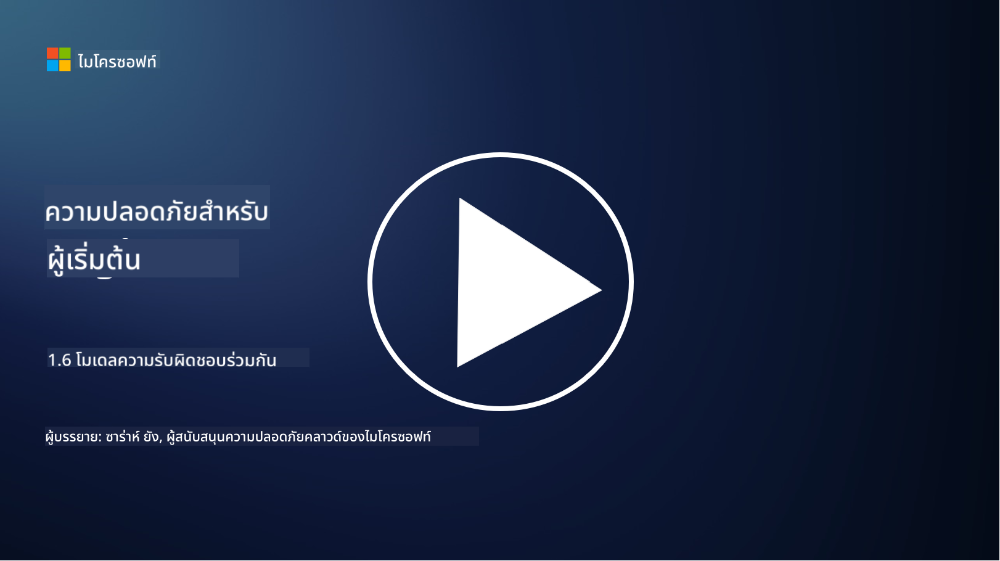

<!--
CO_OP_TRANSLATOR_METADATA:
{
  "original_hash": "a48db640d80c786b928ca178c414f084",
  "translation_date": "2025-09-04T00:26:03+00:00",
  "source_file": "1.6 Shared responsibility model.md",
  "language_code": "th"
}
-->
# โมเดลความรับผิดชอบร่วมกัน

ความรับผิดชอบร่วมกันเป็นแนวคิดใหม่ในด้านไอทีที่เกิดขึ้นพร้อมกับการมาของระบบคลาวด์คอมพิวติ้ง จากมุมมองด้านความปลอดภัยไซเบอร์ การเข้าใจว่าใครเป็นผู้ให้การควบคุมด้านความปลอดภัยในส่วนใดเป็นสิ่งสำคัญ เพื่อหลีกเลี่ยงช่องว่างในการป้องกัน

## บทนำ

ในบทเรียนนี้ เราจะพูดถึง:

 - ความรับผิดชอบร่วมกันในบริบทของความปลอดภัยไซเบอร์คืออะไร?
   
 - ความแตกต่างของความรับผิดชอบร่วมกันสำหรับการควบคุมด้านความปลอดภัยระหว่าง IaaS, PaaS และ SaaS คืออะไร?

 - คุณสามารถค้นหาข้อมูลเกี่ยวกับการควบคุมด้านความปลอดภัยที่แพลตฟอร์มคลาวด์ของคุณให้บริการได้จากที่ไหน?

 - "เชื่อแต่ต้องตรวจสอบ" หมายถึงอะไร?

## ความรับผิดชอบร่วมกันในบริบทของความปลอดภัยไซเบอร์คืออะไร?

ความรับผิดชอบร่วมกันในด้านความปลอดภัยไซเบอร์หมายถึงการแบ่งหน้าที่ความรับผิดชอบด้านความปลอดภัยระหว่างผู้ให้บริการคลาวด์ (CSP) และลูกค้า ในสภาพแวดล้อมคลาวด์คอมพิวติ้ง เช่น Infrastructure as a Service (IaaS), Platform as a Service (PaaS) และ Software as a Service (SaaS) ทั้ง CSP และลูกค้าต่างมีบทบาทในการรักษาความปลอดภัยของข้อมูล แอปพลิเคชัน และระบบ

## ความแตกต่างของความรับผิดชอบร่วมกันสำหรับการควบคุมด้านความปลอดภัยระหว่าง IaaS, PaaS และ SaaS คืออะไร?

การแบ่งหน้าที่ความรับผิดชอบมักขึ้นอยู่กับประเภทของบริการคลาวด์ที่ใช้งาน:

 - **IaaS (Infrastructure as a Service)**: CSP ให้บริการโครงสร้างพื้นฐานพื้นฐาน (เซิร์ฟเวอร์, เครือข่าย, การจัดเก็บข้อมูล) ในขณะที่ลูกค้ารับผิดชอบการจัดการระบบปฏิบัติการ แอปพลิเคชัน และการตั้งค่าความปลอดภัยบนโครงสร้างพื้นฐานนั้น
   
 - **PaaS (Platform as a Service):** CSP ให้บริการแพลตฟอร์มที่ลูกค้าสามารถสร้างและปรับใช้แอปพลิเคชัน CSP จะจัดการโครงสร้างพื้นฐานพื้นฐาน และลูกค้าจะมุ่งเน้นไปที่การพัฒนาแอปพลิเคชันและความปลอดภัยของข้อมูล

 - **SaaS (Software as a Service):** CSP ให้บริการแอปพลิเคชันที่ใช้งานได้เต็มรูปแบบผ่านอินเทอร์เน็ต ในกรณีนี้ CSP รับผิดชอบด้านความปลอดภัยของแอปพลิเคชันและโครงสร้างพื้นฐาน ในขณะที่ลูกค้าจัดการการเข้าถึงของผู้ใช้และการใช้งานข้อมูล

การเข้าใจความรับผิดชอบร่วมกันเป็นสิ่งสำคัญ เพราะช่วยให้ชัดเจนว่าด้านใดของความปลอดภัยที่ CSP ครอบคลุม และด้านใดที่ลูกค้าต้องดูแลเอง สิ่งนี้ช่วยป้องกันความเข้าใจผิดและทำให้มั่นใจว่ามาตรการความปลอดภัยถูกนำมาใช้อย่างครบถ้วน

## คุณสามารถค้นหาข้อมูลเกี่ยวกับการควบคุมด้านความปลอดภัยที่แพลตฟอร์มคลาวด์ของคุณให้บริการได้จากที่ไหน?

ในการค้นหาข้อมูลเกี่ยวกับการควบคุมด้านความปลอดภัยที่แพลตฟอร์มคลาวด์ของคุณให้บริการ คุณต้องอ้างอิงเอกสารและทรัพยากรของผู้ให้บริการคลาวด์ ซึ่งรวมถึง:

 - **เว็บไซต์และเอกสารของ CSP**: เว็บไซต์ของ CSP จะมีข้อมูลเกี่ยวกับฟีเจอร์และการควบคุมด้านความปลอดภัยที่รวมอยู่ในบริการของพวกเขา CSP มักมีเอกสารรายละเอียดที่อธิบายแนวปฏิบัติด้านความปลอดภัย การควบคุม และคำแนะนำ ซึ่งอาจรวมถึงเอกสารไวท์เปเปอร์ คู่มือความปลอดภัย และเอกสารทางเทคนิค
   
 - **การประเมินและการตรวจสอบด้านความปลอดภัย**: CSP ส่วนใหญ่จะให้ผู้เชี่ยวชาญด้านความปลอดภัยอิสระและองค์กรตรวจสอบการควบคุมด้านความปลอดภัยของพวกเขา การตรวจสอบเหล่านี้สามารถให้ข้อมูลเชิงลึกเกี่ยวกับคุณภาพของมาตรการความปลอดภัยของ CSP บางครั้งสิ่งนี้นำไปสู่การที่ CSP ได้รับใบรับรองความปลอดภัย (ดูหัวข้อถัดไป)
   
 - **ใบรับรองความปลอดภัยและการปฏิบัติตามข้อกำหนด**: CSP ส่วนใหญ่ได้รับใบรับรอง เช่น ISO:27001, SOC 2 และ FedRAMP เป็นต้น ใบรับรองเหล่านี้แสดงให้เห็นว่าผู้ให้บริการปฏิบัติตามมาตรฐานด้านความปลอดภัยและการปฏิบัติตามข้อกำหนดที่เฉพาะเจาะจง

โปรดจำไว้ว่า ระดับของรายละเอียดและความพร้อมใช้งานของข้อมูลอาจแตกต่างกันระหว่างผู้ให้บริการคลาวด์ ตรวจสอบให้แน่ใจเสมอว่าคุณกำลังอ้างอิงทรัพยากรที่เป็นทางการและทันสมัยจากผู้ให้บริการคลาวด์เพื่อการตัดสินใจที่มีข้อมูลครบถ้วนเกี่ยวกับความปลอดภัยของทรัพย์สินบนคลาวด์ของคุณ

## "เชื่อแต่ต้องตรวจสอบ" หมายถึงอะไร?

ในบริบทของการใช้ CSP ซอฟต์แวร์ของบุคคลที่สาม หรือบริการด้านความปลอดภัยไอทีอื่น ๆ องค์กรอาจเริ่มต้นด้วยการเชื่อในคำกล่าวอ้างของผู้ให้บริการเกี่ยวกับมาตรการความปลอดภัย อย่างไรก็ตาม เพื่อให้มั่นใจในความปลอดภัยของข้อมูลและระบบจริง ๆ องค์กรควรตรวจสอบคำกล่าวอ้างเหล่านี้ผ่านการประเมินด้านความปลอดภัย การทดสอบเจาะระบบ และการตรวจสอบการควบคุมด้านความปลอดภัยของบุคคลภายนอกก่อนที่จะรวมซอฟต์แวร์หรือบริการเข้ากับการดำเนินงานขององค์กร ทุกคนและทุกองค์กรควรมีแนวทาง "เชื่อแต่ต้องตรวจสอบ" สำหรับการควบคุมด้านความปลอดภัยที่พวกเขาไม่ได้รับผิดชอบโดยตรง

## ความรับผิดชอบร่วมกันภายในองค์กร

อย่าลืมว่าความรับผิดชอบร่วมกันด้านความปลอดภัยภายในองค์กรระหว่างทีมต่าง ๆ ก็ต้องนำมาพิจารณาด้วย ทีมความปลอดภัยมักไม่ได้ดำเนินการควบคุมทั้งหมดด้วยตัวเอง และจำเป็นต้องร่วมมือกับทีมปฏิบัติการ นักพัฒนา และส่วนอื่น ๆ ของธุรกิจเพื่อดำเนินการควบคุมด้านความปลอดภัยทั้งหมดที่จำเป็นเพื่อรักษาความปลอดภัยขององค์กร

## อ่านเพิ่มเติม
- [Shared responsibility in the cloud - Microsoft Azure | Microsoft Learn](https://learn.microsoft.com/azure/security/fundamentals/shared-responsibility?WT.mc_id=academic-96948-sayoung)
- [What is shared responsibility model? – Definition from TechTarget.com](https://www.techtarget.com/searchcloudcomputing/definition/shared-responsibility-model)
- [The shared responsibility model explained and what it means for cloud security | CSO Online](https://www.csoonline.com/article/570779/the-shared-responsibility-model-explained-and-what-it-means-for-cloud-security.html)
- [Shared Responsibility for Cloud Security: What You Need to Know (cisecurity.org)](https://www.cisecurity.org/insights/blog/shared-responsibility-cloud-security-what-you-need-to-know)

---

**ข้อจำกัดความรับผิดชอบ**:  
เอกสารนี้ได้รับการแปลโดยใช้บริการแปลภาษา AI [Co-op Translator](https://github.com/Azure/co-op-translator) แม้ว่าเราจะพยายามให้การแปลมีความถูกต้องมากที่สุด แต่โปรดทราบว่าการแปลโดยอัตโนมัติอาจมีข้อผิดพลาดหรือความไม่ถูกต้อง เอกสารต้นฉบับในภาษาดั้งเดิมควรถือเป็นแหล่งข้อมูลที่เชื่อถือได้ สำหรับข้อมูลที่สำคัญ ขอแนะนำให้ใช้บริการแปลภาษามืออาชีพ เราไม่รับผิดชอบต่อความเข้าใจผิดหรือการตีความที่ผิดพลาดซึ่งเกิดจากการใช้การแปลนี้