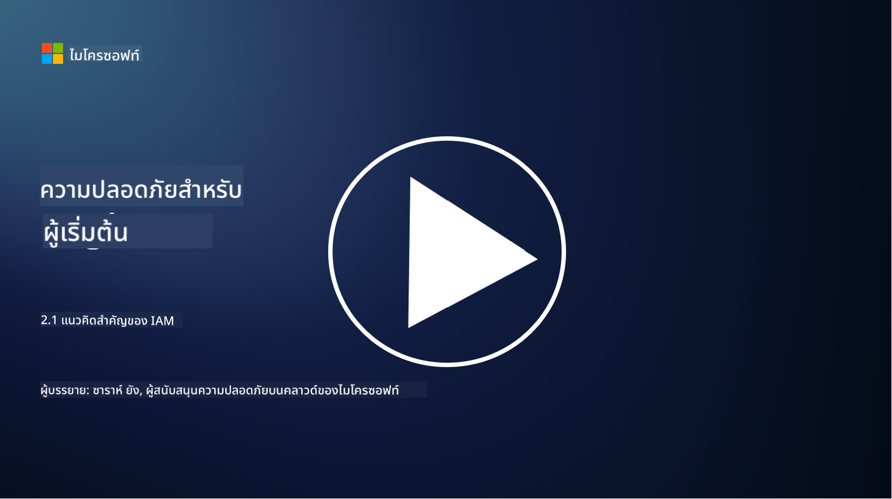

<!--
CO_OP_TRANSLATOR_METADATA:
{
  "original_hash": "2e3864e3d579f0dbb4ac2ec8c5f82acf",
  "translation_date": "2025-09-03T22:39:58+00:00",
  "source_file": "2.1 IAM key concepts.md",
  "language_code": "th"
}
-->
# แนวคิดสำคัญเกี่ยวกับ IAM

คุณเคยเข้าสู่ระบบคอมพิวเตอร์หรือเว็บไซต์หรือไม่? แน่นอนว่าคุณเคย! นั่นหมายความว่าคุณได้ใช้การควบคุมตัวตนในชีวิตประจำวันของคุณแล้ว การจัดการตัวตนและการเข้าถึง (IAM) เป็นหนึ่งในเสาหลักของความปลอดภัย เราจะเรียนรู้เพิ่มเติมเกี่ยวกับเรื่องนี้ในบทเรียนถัดไป

**บทนำ**

ในบทเรียนนี้ เราจะครอบคลุม:

- IAM ในบริบทของความปลอดภัยไซเบอร์หมายถึงอะไร?
- หลักการของสิทธิ์ขั้นต่ำคืออะไร?
- การแยกหน้าที่คืออะไร?
- การตรวจสอบตัวตนและการอนุญาตคืออะไร?

## IAM ในบริบทของความปลอดภัยไซเบอร์หมายถึงอะไร?

การจัดการตัวตนและการเข้าถึง (IAM) หมายถึงชุดของกระบวนการ เทคโนโลยี และนโยบายที่ถูกนำมาใช้เพื่อให้แน่ใจว่าบุคคลที่เหมาะสมมีสิทธิ์เข้าถึงทรัพยากรในสภาพแวดล้อมดิจิทัลขององค์กร IAM เกี่ยวข้องกับการจัดการตัวตนดิจิทัล (ผู้ใช้ พนักงาน พันธมิตร) และการเข้าถึงระบบ แอปพลิเคชัน ข้อมูล และเครือข่าย เป้าหมายหลักของ IAM คือการเพิ่มความปลอดภัย ทำให้การเข้าถึงของผู้ใช้เป็นไปอย่างราบรื่น และให้สอดคล้องกับนโยบายและข้อกำหนดขององค์กร โซลูชัน IAM มักครอบคลุมการตรวจสอบตัวตน การอนุญาต การจัดเตรียมตัวตน การควบคุมการเข้าถึง และการจัดการวงจรชีวิตของผู้ใช้ (เช่น การลบบัญชีเมื่อไม่ได้ใช้งานแล้ว)

## หลักการของสิทธิ์ขั้นต่ำคืออะไร?

หลักการของสิทธิ์ขั้นต่ำเป็นแนวคิดพื้นฐานที่สนับสนุนการให้สิทธิ์แก่ผู้ใช้และระบบเพียงเท่าที่จำเป็นสำหรับการทำงานหรือบทบาทที่ตั้งใจไว้ หลักการนี้ช่วยลดความเสียหายที่อาจเกิดขึ้นในกรณีที่เกิดการละเมิดความปลอดภัยหรือภัยคุกคามภายใน โดยการปฏิบัติตามหลักการของสิทธิ์ขั้นต่ำ องค์กรสามารถลดพื้นที่โจมตีและลดความเสี่ยงของการเข้าถึงโดยไม่ได้รับอนุญาต การละเมิดข้อมูล และการใช้งานสิทธิ์โดยไม่ตั้งใจ ในทางปฏิบัติ หมายความว่าผู้ใช้จะได้รับสิทธิ์เข้าถึงเฉพาะทรัพยากรและฟังก์ชันที่จำเป็นสำหรับบทบาทงานของพวกเขาเท่านั้น ตัวอย่างเช่น หากคุณต้องการเพียงอ่านเอกสาร การให้สิทธิ์ผู้ดูแลระบบเต็มรูปแบบสำหรับเอกสารนั้นจะถือว่าเกินความจำเป็น

## การแยกหน้าที่คืออะไร?

การแยกหน้าที่เป็นหลักการที่มุ่งป้องกันความขัดแย้งทางผลประโยชน์และลดความเสี่ยงของการฉ้อโกงและข้อผิดพลาดโดยการกระจายงานและความรับผิดชอบที่สำคัญไปยังบุคคลต่าง ๆ ในองค์กร ในบริบทของความปลอดภัยไซเบอร์ การแยกหน้าที่เกี่ยวข้องกับการทำให้แน่ใจว่าไม่มีบุคคลใดมีการควบคุมทุกด้านของกระบวนการหรือระบบที่สำคัญ เป้าหมายคือการสร้างระบบตรวจสอบและสมดุลที่ป้องกันไม่ให้บุคคลใดมีความสามารถในการดำเนินการทั้งขั้นตอนการตั้งค่าและการอนุมัติของกระบวนการ ตัวอย่างเช่น ในระบบการเงิน อาจกำหนดว่าผู้ที่ป้อนธุรกรรมเข้าสู่ระบบไม่ควรเป็นคนเดียวกับผู้ที่อนุมัติธุรกรรมนั้น สิ่งนี้ช่วยลดความเสี่ยงของการกระทำที่ไม่ได้รับอนุญาตหรือการฉ้อโกงที่ไม่ถูกตรวจพบ

## การตรวจสอบตัวตนและการอนุญาตคืออะไร?

การตรวจสอบตัวตนและการอนุญาตเป็นสองแนวคิดพื้นฐานในความปลอดภัยไซเบอร์ที่มีบทบาทสำคัญในการรักษาความปลอดภัยและความสมบูรณ์ของระบบคอมพิวเตอร์และข้อมูล แนวคิดเหล่านี้มักถูกใช้ร่วมกันเพื่อควบคุมการเข้าถึงทรัพยากรและปกป้องข้อมูลที่สำคัญ

**1. การตรวจสอบตัวตน**:  
การตรวจสอบตัวตนคือกระบวนการยืนยันตัวตนของผู้ใช้ ระบบ หรือหน่วยงานที่พยายามเข้าถึงระบบคอมพิวเตอร์หรือทรัพยากรเฉพาะ มันช่วยให้มั่นใจว่าตัวตนที่อ้างถึงนั้นเป็นของจริงและถูกต้อง วิธีการตรวจสอบตัวตนมักเกี่ยวข้องกับการใช้หนึ่งหรือมากกว่าหนึ่งปัจจัยดังต่อไปนี้:

   a. สิ่งที่คุณรู้: เช่น รหัสผ่าน รหัส PIN หรือข้อมูลลับอื่น ๆ ที่ผู้ใช้ที่ได้รับอนุญาตควรทราบ  
   b. สิ่งที่คุณมี: เช่น โทเค็นหรืออุปกรณ์ทางกายภาพ เช่น บัตรสมาร์ท โทเค็นความปลอดภัย หรือโทรศัพท์มือถือที่ใช้ยืนยันตัวตนของผู้ใช้  
   c. สิ่งที่คุณเป็น: เช่น ปัจจัยทางชีวภาพ เช่น ลายนิ้วมือ การจดจำใบหน้า หรือการสแกนม่านตาที่เป็นเอกลักษณ์เฉพาะบุคคล  

กลไกการตรวจสอบตัวตนถูกใช้เพื่อยืนยันว่าผู้ใช้เป็นผู้ที่พวกเขาอ้างว่าเป็นก่อนที่จะอนุญาตให้เข้าถึงระบบหรือทรัพยากร มันช่วยป้องกันการเข้าถึงโดยไม่ได้รับอนุญาตและทำให้มั่นใจว่ามีเพียงผู้ใช้ที่ถูกต้องเท่านั้นที่สามารถดำเนินการในระบบได้

**2. การอนุญาต**:  
การอนุญาตคือกระบวนการให้หรือปฏิเสธสิทธิ์และสิทธิพิเศษเฉพาะแก่ผู้ใช้หรือหน่วยงานที่ได้รับการตรวจสอบตัวตนแล้ว มันกำหนดว่าผู้ใช้สามารถดำเนินการหรือปฏิบัติการใดในระบบหรือทรัพยากรเฉพาะ การอนุญาตมักขึ้นอยู่กับนโยบายที่กำหนดไว้ล่วงหน้า กฎการควบคุมการเข้าถึง และบทบาทที่กำหนดให้กับผู้ใช้

การอนุญาตสามารถคิดได้ว่าเป็นการตอบคำถามว่า "ผู้ใช้ที่ได้รับการตรวจสอบตัวตนสามารถทำอะไรได้บ้าง?" มันเกี่ยวข้องกับการกำหนดและบังคับใช้นโยบายการควบคุมการเข้าถึงเพื่อปกป้องข้อมูลและทรัพยากรที่สำคัญจากการเข้าถึงหรือการแก้ไขโดยไม่ได้รับอนุญาต

**สรุป:**

- การตรวจสอบตัวตนช่วยยืนยันตัวตนของผู้ใช้หรือหน่วยงาน  
- การอนุญาตกำหนดว่าผู้ใช้ที่ได้รับการตรวจสอบตัวตนสามารถดำเนินการหรือเข้าถึงทรัพยากรใดได้บ้าง  

## อ่านเพิ่มเติม

- [Describe identity concepts - Training | Microsoft Learn](https://learn.microsoft.com/training/modules/describe-identity-principles-concepts/?WT.mc_id=academic-96948-sayoung)  
- [Introduction to identity - Microsoft Entra | Microsoft Learn](https://learn.microsoft.com/azure/active-directory/fundamentals/identity-fundamental-concepts?WT.mc_id=academic-96948-sayoung)  
- [What is Identity Access Management (IAM)? | Microsoft Security](https://www.microsoft.com/security/business/security-101/what-is-identity-access-management-iam?WT.mc_id=academic-96948-sayoung)  
- [What is IAM? Identity and access management explained | CSO Online](https://www.csoonline.com/article/518296/what-is-iam-identity-and-access-management-explained.html)  
- [What is IAM? (auth0.com)](https://auth0.com/blog/what-is-iam/)  
- [Security+: implementing Identity and Access Management (IAM) controls [updated 2021] | Infosec (infosecinstitute.com)](https://resources.infosecinstitute.com/certifications/securityplus/security-implementing-identity-and-access-management-iam-controls/)  
- [least privilege - Glossary | CSRC (nist.gov)](https://csrc.nist.gov/glossary/term/least_privilege)  
- [Security: The Principle of Least Privilege (POLP) - Microsoft Community Hub](https://techcommunity.microsoft.com/t5/azure-sql-blog/security-the-principle-of-least-privilege-polp/ba-p/2067390?WT.mc_id=academic-96948-sayoung)  
- [Principle of least privilege | CERT NZ](https://www.cert.govt.nz/it-specialists/critical-controls/principle-of-least-privilege/)  
- [Why is separation of duties required by NIST 800-171 and CMMC? - (totem.tech)](https://www.totem.tech/cmmc-separation-of-duties/)  

---

**ข้อจำกัดความรับผิดชอบ**:  
เอกสารนี้ได้รับการแปลโดยใช้บริการแปลภาษา AI [Co-op Translator](https://github.com/Azure/co-op-translator) แม้ว่าเราจะพยายามให้การแปลมีความถูกต้อง แต่โปรดทราบว่าการแปลโดยอัตโนมัติอาจมีข้อผิดพลาดหรือความไม่ถูกต้อง เอกสารต้นฉบับในภาษาดั้งเดิมควรถือเป็นแหล่งข้อมูลที่เชื่อถือได้ สำหรับข้อมูลที่สำคัญ ขอแนะนำให้ใช้บริการแปลภาษามืออาชีพ เราไม่รับผิดชอบต่อความเข้าใจผิดหรือการตีความผิดที่เกิดจากการใช้การแปลนี้