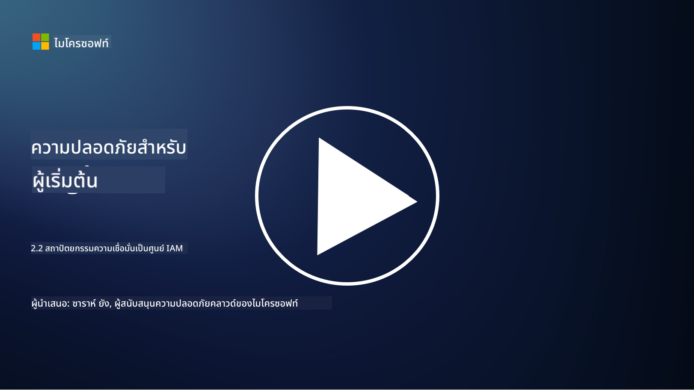

<!--
CO_OP_TRANSLATOR_METADATA:
{
  "original_hash": "4774a978af123f72ebb872199c4c4d4f",
  "translation_date": "2025-09-03T23:40:51+00:00",
  "source_file": "2.2 IAM zero trust architecture.md",
  "language_code": "th"
}
-->
# สถาปัตยกรรม IAM Zero Trust

การจัดการตัวตนเป็นส่วนสำคัญในการนำสถาปัตยกรรม Zero Trust มาใช้และสร้างขอบเขตสำหรับสภาพแวดล้อม IT ใดๆ ในส่วนนี้เราจะสำรวจว่าทำไมการใช้การควบคุมตัวตนจึงมีความสำคัญในการนำ Zero Trust มาใช้

## บทนำ

ในบทเรียนนี้ เราจะครอบคลุม:

 - ทำไมเราจึงต้องใช้ตัวตนเป็นขอบเขตในสภาพแวดล้อม IT สมัยใหม่?
   
 - สิ่งนี้แตกต่างจากสถาปัตยกรรม IT แบบดั้งเดิมอย่างไร?

 - ตัวตนถูกนำมาใช้ในการสร้างสถาปัตยกรรม Zero Trust อย่างไร?

## ทำไมเราจึงต้องใช้ตัวตนเป็นขอบเขตในสภาพแวดล้อม IT สมัยใหม่?

ในสภาพแวดล้อม IT สมัยใหม่ แนวคิดดั้งเดิมของขอบเขตทางกายภาพ (เช่น การใช้ไฟร์วอลล์และขอบเขตเครือข่าย) เป็นแนวป้องกันหลักต่อภัยคุกคามทางไซเบอร์เริ่มมีประสิทธิภาพน้อยลง เนื่องจากความซับซ้อนที่เพิ่มขึ้นของเทคโนโลยี การทำงานระยะไกลที่เพิ่มขึ้น และการนำบริการคลาวด์มาใช้ องค์กรจึงเปลี่ยนไปใช้ตัวตนเป็นขอบเขตใหม่ ซึ่งหมายความว่าความปลอดภัยมุ่งเน้นไปที่การตรวจสอบและจัดการตัวตนของผู้ใช้ อุปกรณ์ และแอปพลิเคชันที่พยายามเข้าถึงทรัพยากร โดยไม่คำนึงถึงตำแหน่งทางกายภาพของพวกเขา

เหตุผลที่การใช้ตัวตนเป็นขอบเขตมีความสำคัญในสภาพแวดล้อม IT สมัยใหม่:

**พนักงานทำงานระยะไกล**: ด้วยการทำงานระยะไกลและอุปกรณ์เคลื่อนที่ที่กลายเป็นเรื่องปกติ ผู้ใช้สามารถเข้าถึงทรัพยากรจากสถานที่และอุปกรณ์ต่างๆ วิธีการขอบเขตแบบดั้งเดิมไม่สามารถใช้งานได้เมื่อผู้ใช้ไม่ได้จำกัดอยู่ในสำนักงานทางกายภาพ

**สภาพแวดล้อมคลาวด์และไฮบริด**: องค์กรกำลังนำบริการคลาวด์และสภาพแวดล้อมไฮบริดมาใช้มากขึ้น ข้อมูลและแอปพลิเคชันไม่ได้อยู่ในสถานที่ขององค์กรอีกต่อไป ทำให้การป้องกันขอบเขตแบบดั้งเดิมไม่เกี่ยวข้อง

**ความปลอดภัยแบบ Zero Trust**: แนวคิดของความปลอดภัยแบบ Zero Trust ถือว่าไม่มีหน่วยงานใด ไม่ว่าจะอยู่ภายในหรือภายนอกเครือข่าย ควรได้รับความไว้วางใจโดยอัตโนมัติ ตัวตนจึงกลายเป็นรากฐานสำหรับการตรวจสอบคำขอการเข้าถึง โดยไม่คำนึงถึงแหล่งที่มา

**ภูมิทัศน์ภัยคุกคาม**: ภัยคุกคามทางไซเบอร์กำลังพัฒนา และผู้โจมตีกำลังหาวิธีหลีกเลี่ยงการป้องกันขอบเขตแบบดั้งเดิม ฟิชชิง การหลอกลวงทางสังคม และภัยคุกคามภายในมักใช้ประโยชน์จากช่องโหว่ของมนุษย์แทนที่จะพยายามเจาะขอบเขตเครือข่าย

**แนวทางการปกป้องข้อมูล**: การปกป้องข้อมูลที่สำคัญเป็นสิ่งสำคัญ โดยการมุ่งเน้นไปที่ตัวตน องค์กรสามารถควบคุมว่าใครเข้าถึงข้อมูลใด ลดความเสี่ยงของการละเมิดข้อมูล

## สิ่งนี้แตกต่างจากสถาปัตยกรรม IT แบบดั้งเดิมอย่างไร?

สถาปัตยกรรม IT แบบดั้งเดิมพึ่งพารูปแบบความปลอดภัยที่เน้นขอบเขต ซึ่งไฟร์วอลล์และขอบเขตเครือข่ายมีบทบาทสำคัญในการป้องกันภัยคุกคาม ความแตกต่างหลักระหว่างวิธีการแบบดั้งเดิมและวิธีการที่เน้นตัวตนมีดังนี้:

|      ด้าน                  |      สถาปัตยกรรม IT แบบดั้งเดิม                                                              |      วิธีการที่เน้นตัวตน                                                                                 |
|-----------------------------|----------------------------------------------------------------------------------------------------|------------------------------------------------------------------------------------------------------------|
|     จุดเน้น                |     เน้นขอบเขต: พึ่งพาการป้องกันขอบเขต เช่น ไฟร์วอลล์และการควบคุมการเข้าถึง.               |     เน้นการตรวจสอบตัวตน: เปลี่ยนจากขอบเขตเครือข่ายไปสู่การตรวจสอบตัวตนของผู้ใช้/อุปกรณ์.             |
|     ตำแหน่ง                |     ขึ้นอยู่กับตำแหน่ง: - ความปลอดภัยผูกติดกับสถานที่ทำงานและขอบเขตเครือข่าย.              |     อิสระจากตำแหน่ง: ความปลอดภัยไม่ผูกติดกับสถานที่เฉพาะ; เข้าถึงได้จากทุกที่.                         |
|     สมมติฐานความไว้วางใจ  |     สมมติฐานความไว้วางใจ: สมมติว่าภายในขอบเขตเครือข่ายผู้ใช้/อุปกรณ์ได้รับความไว้วางใจ.     |     แนวทาง Zero Trust: ไม่เคยสมมติความไว้วางใจ; การเข้าถึงได้รับการตรวจสอบตามตัวตนและบริบท.         |
|     การพิจารณาอุปกรณ์      |     ความหลากหลายของอุปกรณ์: สมมติว่าอุปกรณ์ภายในขอบเขตเครือข่ายมีความปลอดภัย.              |     การรับรู้เกี่ยวกับอุปกรณ์: พิจารณาสุขภาพและท่าทีความปลอดภัยของอุปกรณ์ โดยไม่คำนึงถึงตำแหน่ง.      |
|     การปกป้องข้อมูล        |     การปกป้องข้อมูล: มุ่งเน้นไปที่การรักษาความปลอดภัยขอบเขตเครือข่ายเพื่อปกป้องข้อมูล.       |     การปกป้องข้อมูลแบบเน้นข้อมูล: มุ่งเน้นไปที่การควบคุมการเข้าถึงข้อมูลตามตัวตนและความอ่อนไหวของข้อมูล. |

## ตัวตนถูกนำมาใช้ในการสร้างสถาปัตยกรรม Zero Trust อย่างไร?

ในสถาปัตยกรรม Zero Trust หลักการพื้นฐานคือการไม่ไว้วางใจหน่วยงานใดๆ โดยอัตโนมัติ ไม่ว่าจะอยู่ภายในหรือภายนอกขอบเขตเครือข่าย ตัวตนมีบทบาทสำคัญในการนำแนวทาง Zero Trust มาใช้ โดยช่วยให้สามารถตรวจสอบหน่วยงานที่พยายามเข้าถึงทรัพยากรได้อย่างต่อเนื่อง การควบคุมความปลอดภัยของตัวตนในยุคใหม่ช่วยให้ผู้ใช้ อุปกรณ์ แอปพลิเคชัน และบริการทุกตัวที่ต้องการเข้าถึงทรัพยากรต้องได้รับการระบุและตรวจสอบอย่างละเอียดก่อนที่จะได้รับอนุญาตให้เข้าถึง ซึ่งรวมถึงการตรวจสอบตัวตนดิจิทัลผ่านวิธีต่างๆ เช่น การใช้ชื่อผู้ใช้/รหัสผ่าน การยืนยันตัวตนหลายปัจจัย (MFA) ไบโอเมตริก และกลไกการยืนยันตัวตนที่แข็งแกร่งอื่นๆ

## อ่านเพิ่มเติม

- [Securing identity with Zero Trust | Microsoft Learn](https://learn.microsoft.com/security/zero-trust/deploy/identity?WT.mc_id=academic-96948-sayoung)
- [Zero Trust Principles and Guidance for Identity and Access | CSA (cloudsecurityalliance.org)](https://cloudsecurityalliance.org/artifacts/zero-trust-principles-and-guidance-for-iam/)
- [Zero Trust Identity Controls - Essentials Series - Episode 2 - YouTube](https://www.youtube.com/watch?v=fQZQznIKcGM&list=PLXtHYVsvn_b_gtX1-NB62wNervQx1Fhp4&index=13)

---

**ข้อจำกัดความรับผิดชอบ**:  
เอกสารนี้ได้รับการแปลโดยใช้บริการแปลภาษา AI [Co-op Translator](https://github.com/Azure/co-op-translator) แม้ว่าเราจะพยายามให้การแปลมีความถูกต้อง แต่โปรดทราบว่าการแปลอัตโนมัติอาจมีข้อผิดพลาดหรือความไม่แม่นยำ เอกสารต้นฉบับในภาษาดั้งเดิมควรถือเป็นแหล่งข้อมูลที่เชื่อถือได้ สำหรับข้อมูลที่สำคัญ แนะนำให้ใช้บริการแปลภาษาจากผู้เชี่ยวชาญ เราไม่รับผิดชอบต่อความเข้าใจผิดหรือการตีความที่ผิดพลาดซึ่งเกิดจากการใช้การแปลนี้