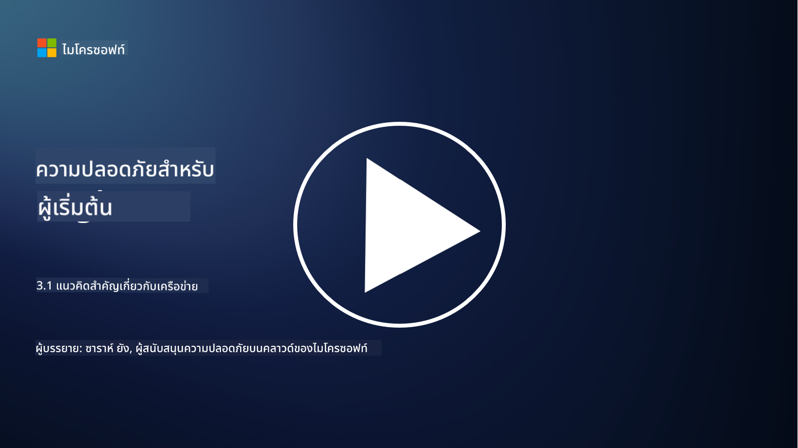

<!--
CO_OP_TRANSLATOR_METADATA:
{
  "original_hash": "252724eceeb183fb9018f88c5e1a3f0c",
  "translation_date": "2025-09-04T01:46:10+00:00",
  "source_file": "3.1 Networking key concepts.md",
  "language_code": "th"
}
-->
# แนวคิดสำคัญเกี่ยวกับเครือข่าย

หากคุณเคยทำงานด้านไอทีมาก่อน คุณอาจเคยเจอแนวคิดเกี่ยวกับเครือข่าย แม้ว่าในสภาพแวดล้อมสมัยใหม่เราจะใช้การยืนยันตัวตนเป็นการควบคุมปริมณฑลหลัก แต่ก็ไม่ได้หมายความว่าการควบคุมเครือข่ายจะหมดความสำคัญ ในบทเรียนนี้เราจะพูดถึงแนวคิดสำคัญบางประการเกี่ยวกับเครือข่าย

ในบทเรียนนี้เราจะพูดถึง:

- IP Address คืออะไร?

- OSI Model คืออะไร?

- TCP/UDP คืออะไร?

- Port Numbers คืออะไร?

- การเข้ารหัสข้อมูลขณะพักและขณะส่งคืออะไร?

## IP Address คืออะไร?

IP Address หรือ Internet Protocol Address คือป้ายกำกับตัวเลขที่กำหนดให้กับอุปกรณ์ทุกชนิดที่เชื่อมต่อกับเครือข่ายคอมพิวเตอร์ที่ใช้ Internet Protocol ในการสื่อสาร มันทำหน้าที่เป็นตัวระบุเฉพาะสำหรับอุปกรณ์ในเครือข่าย ทำให้อุปกรณ์สามารถส่งและรับข้อมูลผ่านอินเทอร์เน็ตหรือเครือข่ายที่เชื่อมต่อกันได้ มีสองเวอร์ชันหลักของ IP Address คือ IPv4 (Internet Protocol version 4) และ IPv6 (Internet Protocol version 6) โดย IP Address มักจะแสดงในรูปแบบ IPv4 (เช่น 192.168.1.1) หรือ IPv6 (เช่น 2001:0db8:85a3:0000:0000:8a2e:0370:7334)

## OSI Model คืออะไร?

OSI (Open Systems Interconnection) Model เป็นกรอบแนวคิดที่มาตรฐานการทำงานของระบบสื่อสารแบ่งออกเป็นเจ็ดชั้น แต่ละชั้นมีหน้าที่เฉพาะและสื่อสารกับชั้นที่อยู่ติดกันเพื่อให้การสื่อสารข้อมูลระหว่างอุปกรณ์ในเครือข่ายมีประสิทธิภาพและเชื่อถือได้ ชั้นต่าง ๆ เรียงจากล่างขึ้นบนมีดังนี้:

1. Physical Layer

2. Data Link Layer

3. Network Layer

4. Transport Layer

5. Session Layer

6. Presentation Layer

7. Application Layer

OSI Model ให้การอ้างอิงร่วมกันสำหรับการทำความเข้าใจว่าโปรโตคอลและเทคโนโลยีเครือข่ายทำงานร่วมกันอย่างไร โดยไม่คำนึงถึงฮาร์ดแวร์หรือซอฟต์แวร์ที่ใช้

_ref: https://en.wikipedia.org/wiki/OSI_model_

## TCP/UDP คืออะไร?

TCP (Transmission Control Protocol) และ UDP (User Datagram Protocol) เป็นโปรโตคอลชั้นการขนส่งที่สำคัญสองตัวที่ใช้ในเครือข่ายคอมพิวเตอร์เพื่ออำนวยความสะดวกในการสื่อสารระหว่างอุปกรณ์ผ่านอินเทอร์เน็ตหรือในเครือข่ายท้องถิ่น ทั้งสองทำหน้าที่แบ่งข้อมูลออกเป็นแพ็กเก็ตสำหรับการส่งและประกอบแพ็กเก็ตเหล่านั้นกลับเป็นข้อมูลต้นฉบับที่ปลายทาง แต่มีความแตกต่างในลักษณะและการใช้งาน

**TCP (Transmission Control Protocol)**:

TCP เป็นโปรโตคอลที่มีการเชื่อมต่อซึ่งให้การส่งข้อมูลที่เชื่อถือได้และเรียงลำดับระหว่างอุปกรณ์ มันจะสร้างการเชื่อมต่อระหว่างผู้ส่งและผู้รับก่อนเริ่มการแลกเปลี่ยนข้อมูล TCP รับรองว่าแพ็กเก็ตข้อมูลมาถึงในลำดับที่ถูกต้องและสามารถจัดการการส่งซ้ำของแพ็กเก็ตที่สูญหายเพื่อรับประกันความสมบูรณ์ของข้อมูล ทำให้ TCP เหมาะสำหรับแอปพลิเคชันที่ต้องการการส่งข้อมูลที่เชื่อถือได้ เช่น การท่องเว็บ อีเมล การโอนย้ายไฟล์ (FTP) และการสื่อสารฐานข้อมูล

**UDP (User Datagram Protocol)**:

UDP เป็นโปรโตคอลที่ไม่มีการเชื่อมต่อซึ่งให้การส่งข้อมูลที่รวดเร็วกว่าแต่ไม่ให้ความเชื่อถือในระดับเดียวกับ TCP มันไม่สร้างการเชื่อมต่ออย่างเป็นทางการก่อนการส่งข้อมูลและไม่มีกลไกสำหรับการยืนยันหรือการส่งซ้ำของแพ็กเก็ตที่สูญหาย UDP เหมาะสำหรับแอปพลิเคชันที่ความเร็วและประสิทธิภาพสำคัญกว่าการรับประกันการส่งข้อมูล เช่น การสื่อสารแบบเรียลไทม์ การสตรีมสื่อ เกมออนไลน์ และการค้นหา DNS

สรุปได้ว่า TCP ให้ความสำคัญกับความเชื่อถือได้และการส่งข้อมูลที่เรียงลำดับ ทำให้เหมาะสำหรับแอปพลิเคชันที่ต้องการความถูกต้องของข้อมูล ในขณะที่ UDP เน้นความเร็วและประสิทธิภาพ ทำให้เหมาะสำหรับแอปพลิเคชันที่การสูญเสียข้อมูลเล็กน้อยหรือการเรียงลำดับใหม่ของข้อมูลเป็นที่ยอมรับได้เพื่อแลกกับการลดความล่าช้า การเลือกใช้ TCP หรือ UDP ขึ้นอยู่กับความต้องการเฉพาะของแอปพลิเคชันหรือบริการที่ใช้งาน

## Port Numbers คืออะไร?

ในเครือข่าย Port Number คือหมายเลขตัวระบุที่ใช้แยกแยะบริการหรือแอปพลิเคชันต่าง ๆ ที่กำลังทำงานบนอุปกรณ์เดียวกันในเครือข่าย Port ช่วยในการส่งข้อมูลที่เข้ามาไปยังแอปพลิเคชันที่เหมาะสม Port Numbers เป็นตัวเลข 16 บิตแบบไม่ลงนาม ซึ่งหมายความว่ามีช่วงตั้งแต่ 0 ถึง 65535 โดยแบ่งออกเป็นสามช่วง:

- Well-Known Ports (0-1023): สงวนไว้สำหรับบริการมาตรฐาน เช่น HTTP (port 80) และ FTP (port 21)

- Registered Ports (1024-49151): ใช้สำหรับแอปพลิเคชันและบริการที่ไม่ได้อยู่ในช่วง Well-Known แต่ได้รับการลงทะเบียนอย่างเป็นทางการ

- Dynamic/Private Ports (49152-65535): ใช้ได้สำหรับการใช้งานชั่วคราวหรือส่วนตัวโดยแอปพลิเคชัน

## การเข้ารหัสข้อมูลขณะพักและขณะส่งคืออะไร?

การเข้ารหัสคือกระบวนการแปลงข้อมูลให้อยู่ในรูปแบบที่ปลอดภัยเพื่อป้องกันการเข้าถึงหรือการแก้ไขโดยไม่ได้รับอนุญาต การเข้ารหัสสามารถใช้กับข้อมูลทั้ง "ขณะพัก" (เมื่อเก็บไว้ในอุปกรณ์หรือเซิร์ฟเวอร์) และ "ขณะส่ง" (เมื่อถูกส่งระหว่างอุปกรณ์หรือผ่านเครือข่าย)

การเข้ารหัสข้อมูลขณะพัก: เป็นการเข้ารหัสข้อมูลที่เก็บไว้ในอุปกรณ์ เซิร์ฟเวอร์ หรือระบบจัดเก็บข้อมูล แม้ว่าผู้โจมตีจะเข้าถึงสื่อจัดเก็บข้อมูลได้ พวกเขาก็ไม่สามารถเข้าถึงข้อมูลได้หากไม่มีคีย์การเข้ารหัส สิ่งนี้สำคัญสำหรับการปกป้องข้อมูลที่ละเอียดอ่อนในกรณีที่อุปกรณ์ถูกขโมย การละเมิดข้อมูล หรือการเข้าถึงโดยไม่ได้รับอนุญาต

การเข้ารหัสข้อมูลขณะส่ง: เป็นการเข้ารหัสข้อมูลขณะที่มันเดินทางระหว่างอุปกรณ์หรือผ่านเครือข่าย สิ่งนี้ช่วยป้องกันการดักฟังและการสกัดกั้นข้อมูลโดยไม่ได้รับอนุญาตในระหว่างการส่ง โปรโตคอลทั่วไปสำหรับการเข้ารหัสข้อมูลขณะส่งรวมถึง HTTPS สำหรับการสื่อสารทางเว็บและ TLS/SSL สำหรับการรักษาความปลอดภัยของการรับส่งข้อมูลเครือข่ายประเภทต่าง ๆ

## อ่านเพิ่มเติม
- [How Do IP Addresses Work? (howtogeek.com)](https://www.howtogeek.com/341307/how-do-ip-addresses-work/)
- [Understanding IP Address: An Introductory Guide (geekflare.com)](https://geekflare.com/understanding-ip-address/)
- [What is the OSI model? The 7 layers of OSI explained (techtarget.com)](https://www.techtarget.com/searchnetworking/definition/OSI)
- [The OSI Model – The 7 Layers of Networking Explained in Plain English (freecodecamp.org)](https://www.freecodecamp.org/news/osi-model-networking-layers-explained-in-plain-english/)
- [TCP/IP protocols - IBM Documentation](https://www.ibm.com/docs/en/aix/7.3?topic=protocol-tcpip-protocols)
- [Common Ports Cheat Sheet: The Ultimate Ports & Protocols List (stationx.net)](https://www.stationx.net/common-ports-cheat-sheet/)
- [Azure Data Encryption-at-Rest - Azure Security | Microsoft Learn](https://learn.microsoft.com/azure/security/fundamentals/encryption-atrest?WT.mc_id=academic-96948-sayoung)

---

**ข้อจำกัดความรับผิดชอบ**:  
เอกสารนี้ได้รับการแปลโดยใช้บริการแปลภาษา AI [Co-op Translator](https://github.com/Azure/co-op-translator) แม้ว่าเราจะพยายามให้การแปลมีความถูกต้อง แต่โปรดทราบว่าการแปลอัตโนมัติอาจมีข้อผิดพลาดหรือความไม่แม่นยำ เอกสารต้นฉบับในภาษาต้นทางควรถือเป็นแหล่งข้อมูลที่เชื่อถือได้ สำหรับข้อมูลที่สำคัญ ขอแนะนำให้ใช้บริการแปลภาษามนุษย์มืออาชีพ เราไม่รับผิดชอบต่อความเข้าใจผิดหรือการตีความที่ผิดพลาดซึ่งเกิดจากการใช้การแปลนี้