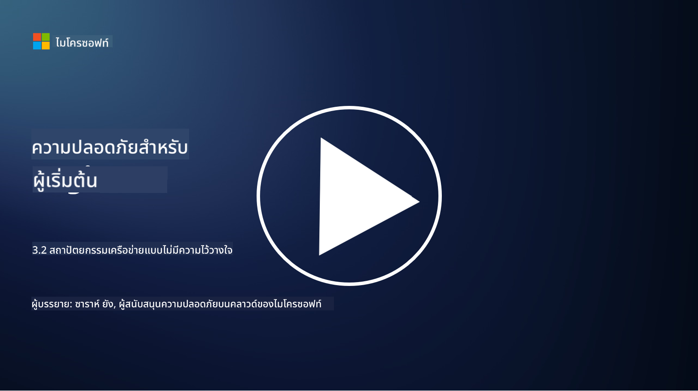

<!--
CO_OP_TRANSLATOR_METADATA:
{
  "original_hash": "680d6e14d9d33fc471c22f44679713f8",
  "translation_date": "2025-09-04T00:38:03+00:00",
  "source_file": "3.2 Networking zero trust architecture.md",
  "language_code": "th"
}
-->
# สถาปัตยกรรมเครือข่ายแบบ Zero Trust

เครือข่ายเป็นชั้นสำคัญในมาตรการควบคุมแบบ Zero Trust ในบทเรียนนี้เราจะเรียนรู้เพิ่มเติมเกี่ยวกับ:

- การแบ่งส่วนเครือข่ายคืออะไร?  
- การแบ่งส่วนเครือข่ายช่วยในการนำ Zero Trust มาใช้ได้อย่างไร?  
- การเข้ารหัสแบบปลายทางถึงปลายทางคืออะไร?

## การแบ่งส่วนเครือข่ายคืออะไร?

การแบ่งส่วนเครือข่ายคือการปฏิบัติในการแบ่งเครือข่ายออกเป็นส่วนย่อยหรือเครือข่ายย่อยที่แยกออกจากกัน แต่ละส่วนจะถูกแยกออกจากกัน และการเข้าถึงระหว่างส่วนต่าง ๆ จะถูกควบคุมและจำกัดตามนโยบายความปลอดภัยเฉพาะ การแบ่งส่วนเครือข่ายถูกใช้เพื่อเพิ่มความปลอดภัยโดยการจำกัดผลกระทบของการละเมิดที่อาจเกิดขึ้นและลดการเคลื่อนที่ด้านข้างของผู้โจมตีภายในเครือข่าย

ด้วยการแบ่งส่วนเครือข่าย องค์กรสามารถสร้าง "โซน" ที่แยกผู้ใช้ แอปพลิเคชัน และข้อมูลประเภทต่าง ๆ ออกจากกัน ซึ่งช่วยลดพื้นที่ที่อาจถูกโจมตีและลดความเสียหายที่อาจเกิดขึ้นจากเหตุการณ์ด้านความปลอดภัย การแบ่งส่วนเครือข่ายสามารถทำได้ผ่านเทคโนโลยี เช่น VLANs, ไฟร์วอลล์ และการควบคุมการเข้าถึง

## การแบ่งส่วนเครือข่ายช่วยในการนำ Zero Trust มาใช้ได้อย่างไร?

การแบ่งส่วนเครือข่ายสอดคล้องกับหลักการของโมเดล Zero Trust อย่างใกล้ชิด ในสถาปัตยกรรม Zero Trust การแบ่งส่วนเครือข่ายช่วยบังคับใช้หลักการ "สิทธิ์ขั้นต่ำ" โดยการรับรองว่าผู้ใช้และอุปกรณ์สามารถเข้าถึงเฉพาะทรัพยากรและบริการที่จำเป็นต่อการทำงานของพวกเขาเท่านั้น ด้วยการแบ่งเครือข่ายออกเป็นโซนเล็ก ๆ องค์กรสามารถใช้การควบคุมการเข้าถึงที่เข้มงวด แยกทรัพย์สินสำคัญ และป้องกันการเคลื่อนที่ด้านข้างของผู้โจมตี

การแบ่งส่วนเครือข่ายยังช่วยในการบังคับใช้การควบคุมการเข้าถึงตามตัวตน ซึ่งผู้ใช้และอุปกรณ์จะได้รับการตรวจสอบและอนุญาตอย่างละเอียดก่อนที่จะเข้าถึงส่วนต่าง ๆ สิ่งนี้ช่วยป้องกันการเข้าถึงทรัพยากรที่สำคัญโดยไม่ได้รับอนุญาตและลดผลกระทบที่อาจเกิดขึ้นจากข้อมูลรับรองที่ถูกละเมิด

## การเข้ารหัสแบบปลายทางถึงปลายทางคืออะไร?

การเข้ารหัสแบบปลายทางถึงปลายทาง (End-to-End Encryption หรือ E2E) เป็นมาตรการความปลอดภัยที่รับรองว่าข้อมูลจะถูกเข้ารหัสตลอดการเดินทางจากผู้ส่งถึงผู้รับ ในกระบวนการนี้ ข้อมูลจะถูกเข้ารหัสที่ฝั่งผู้ส่ง และมีเพียงผู้รับเท่านั้นที่มีคีย์ถอดรหัสเพื่อปลดล็อกและอ่านข้อมูล การเข้ารหัสและการถอดรหัสจะเกิดขึ้นที่จุดปลายทาง ทำให้ฝ่ายที่ไม่ได้รับอนุญาต รวมถึงผู้ให้บริการและตัวกลาง ไม่สามารถเข้าถึงข้อมูลในรูปแบบที่อ่านได้

การเข้ารหัสแบบปลายทางถึงปลายทางให้ระดับความลับและความปลอดภัยสูงสำหรับการส่งข้อมูล แม้ว่าข้อมูลจะผ่านระบบตัวกลางหรือเครือข่ายต่าง ๆ ก็ตาม มันถูกใช้บ่อยในแอปส่งข้อความที่ปลอดภัย บริการอีเมล และแพลตฟอร์มการสื่อสารอื่น ๆ เพื่อปกป้องข้อมูลที่สำคัญจากการถูกดักจับและการเข้าถึงโดยไม่ได้รับอนุญาต

วิธีการเข้ารหัสนี้รับรองว่าแม้ผู้โจมตีจะสามารถเข้าถึงข้อมูลที่กำลังส่งผ่านได้ พวกเขาจะเห็นเพียงข้อมูลที่ถูกเข้ารหัสซึ่งไม่มีความหมายหากไม่มีคีย์ถอดรหัส การเข้ารหัสแบบปลายทางถึงปลายทางมีบทบาทสำคัญในการปกป้องความเป็นส่วนตัวของผู้ใช้และป้องกันข้อมูลสำคัญจากการถูกเปิดเผยต่อฝ่ายที่ไม่ได้รับอนุญาต

## SASE คืออะไร?

SASE ย่อมาจาก "Secure Access Service Edge" ซึ่งเป็นกรอบงานและสถาปัตยกรรมด้านความปลอดภัยไซเบอร์ที่รวมความปลอดภัยเครือข่ายและความสามารถเครือข่ายแบบ WAN เข้าไว้ในบริการบนคลาวด์เดียว SASE ถูกออกแบบมาเพื่อให้การเข้าถึงทรัพยากรเครือข่าย แอปพลิเคชัน และข้อมูลที่ปลอดภัยและปรับขนาดได้สำหรับผู้ใช้ที่ทำงานระยะไกลและเคลื่อนที่ พร้อมทั้งลดความซับซ้อนของการจัดการเครือข่ายและสถาปัตยกรรมความปลอดภัยแบบดั้งเดิม

ลักษณะสำคัญและองค์ประกอบของ SASE ได้แก่:

1. **บนคลาวด์:** SASE ถูกส่งมอบในรูปแบบบริการบนคลาวด์ ซึ่งหมายความว่าฟังก์ชันด้านความปลอดภัยและเครือข่ายจะถูกให้บริการจากคลาวด์แทนที่จะพึ่งพาฮาร์ดแวร์และอุปกรณ์ในองค์กรแบบดั้งเดิม  
   
2. **การรวมความปลอดภัยและเครือข่าย:** SASE รวมบริการด้านความปลอดภัยต่าง ๆ เช่น Secure Web Gateways (SWG), Firewall as a Service (FWaaS), Data Loss Prevention (DLP), Zero-Trust Network Access (ZTNA) และการปรับแต่ง WAN เข้ากับความสามารถเครือข่ายแบบ WAN การรวมนี้ช่วยปรับปรุงการดำเนินงานด้านความปลอดภัยและเครือข่าย  

3. **Zero Trust:** SASE ดำเนินการตามหลักการของ Zero Trust ซึ่งหมายความว่ามันบังคับใช้การควบคุมการเข้าถึงที่เข้มงวดและนโยบายการเข้าถึงแบบสิทธิ์ขั้นต่ำ ผู้ใช้และอุปกรณ์จะไม่ได้รับความไว้วางใจโดยอัตโนมัติ และต้องได้รับการตรวจสอบและอนุญาตก่อนเข้าถึงทรัพยากร  

4. **เน้นตัวตน:** SASE มุ่งเน้นไปที่ตัวตนของผู้ใช้และอุปกรณ์เป็นพื้นฐานสำหรับการควบคุมการเข้าถึง นโยบายที่อิงตามตัวตนและบริบทถูกใช้เพื่อกำหนดสิทธิ์การเข้าถึง และนโยบายเหล่านี้ปรับเปลี่ยนแบบไดนามิกตามพฤติกรรมและบริบทของผู้ใช้  

5. **ปรับขนาดและยืดหยุ่น:** SASE สามารถปรับขนาดได้ง่ายเพื่อรองรับผู้ใช้และอุปกรณ์จำนวนมาก ทำให้เหมาะสำหรับองค์กรที่มีความต้องการด้านเครือข่ายและความปลอดภัยที่หลากหลายและเปลี่ยนแปลง  

SASE มีความสำคัญอย่างยิ่งในยุคปัจจุบันของการทำงานระยะไกลและการนำคลาวด์มาใช้ เนื่องจากมันให้วิธีการที่ครอบคลุมและคล่องตัวในการรักษาความปลอดภัยและจัดการการเข้าถึงเครือข่าย มันช่วยให้องค์กรปรับตัวต่อความต้องการด้านความปลอดภัยและเครือข่ายที่เปลี่ยนแปลงไป พร้อมทั้งรักษาโฟกัสที่โมเดลความปลอดภัยแบบเน้นผู้ใช้และ Zero Trust

## อ่านเพิ่มเติม

- [What Is Network Segmentation? - Cisco](https://www.cisco.com/c/en/us/products/security/what-is-network-segmentation.html#~benefits)  
- [What Is Micro-Segmentation? - Cisco](https://www.cisco.com/c/en/us/products/security/what-is-microsegmentation.html)  
- [Implementing Network Segmentation and Segregation | Cyber.gov.au](https://www.cyber.gov.au/resources-business-and-government/maintaining-devices-and-systems/system-hardening-and-administration/network-hardening/implementing-network-segmentation-and-segregation)  
- [What Is Network Segmentation and Why It Matters | CompTIA](https://www.comptia.org/blog/security-awareness-training-network-segmentation)  
- [Network Segmentation: Concepts and Practices (cmu.edu)](https://insights.sei.cmu.edu/blog/network-segmentation-concepts-and-practices/)  
- [Secure networks with Zero Trust | Microsoft Learn](https://learn.microsoft.com/security/zero-trust/deploy/networks?WT.mc_id=academic-96948-sayoung)  
- [What is end-to-end encryption? | IBM](https://www.ibm.com/topics/end-to-end-encryption)  
- [What Is End-to-End Encryption, and Why Does It Matter? (howtogeek.com)](https://www.howtogeek.com/711656/what-is-end-to-end-encryption-and-why-does-it-matter/)  
- [Definition of Secure Access Service Edge (SASE) - Gartner Information Technology Glossary](https://www.gartner.com/en/information-technology/glossary/secure-access-service-edge-sase)  
- [What Is Secure Access Service Edge (SASE)? | Microsoft Security](https://www.microsoft.com/security/business/security-101/what-is-sase?WT.mc_id=academic-96948-sayoung)  

---

**ข้อจำกัดความรับผิดชอบ**:  
เอกสารนี้ได้รับการแปลโดยใช้บริการแปลภาษา AI [Co-op Translator](https://github.com/Azure/co-op-translator) แม้ว่าเราจะพยายามให้การแปลมีความถูกต้อง แต่โปรดทราบว่าการแปลอัตโนมัติอาจมีข้อผิดพลาดหรือความไม่แม่นยำ เอกสารต้นฉบับในภาษาต้นทางควรถือเป็นแหล่งข้อมูลที่เชื่อถือได้ สำหรับข้อมูลที่สำคัญ ขอแนะนำให้ใช้บริการแปลภาษาจากผู้เชี่ยวชาญ เราไม่รับผิดชอบต่อความเข้าใจผิดหรือการตีความที่ผิดพลาดซึ่งเกิดจากการใช้การแปลนี้