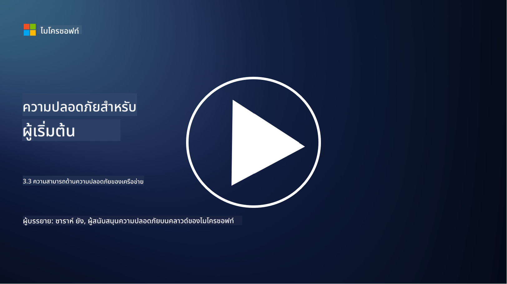

<!--
CO_OP_TRANSLATOR_METADATA:
{
  "original_hash": "c3aba077bb98eebc925dd58d870229ab",
  "translation_date": "2025-09-03T23:33:28+00:00",
  "source_file": "3.3 Network security capabilities.md",
  "language_code": "th"
}
-->
# ความสามารถด้านความปลอดภัยเครือข่าย

ในบทเรียนนี้ เราจะเรียนรู้เกี่ยวกับความสามารถต่าง ๆ ที่สามารถใช้เพื่อรักษาความปลอดภัยเครือข่าย:

 - ไฟร์วอลล์แบบดั้งเดิม
 - ไฟร์วอลล์สำหรับแอปพลิเคชันเว็บ
 - กลุ่มความปลอดภัยบนคลาวด์
 - CDN
 - ตัวกระจายโหลด
 - Bastion hosts
 - VPNs
 - เครื่องมือป้องกัน DDoS

## ไฟร์วอลล์แบบดั้งเดิม

ไฟร์วอลล์แบบดั้งเดิมเป็นอุปกรณ์รักษาความปลอดภัยที่ควบคุมและตรวจสอบการรับส่งข้อมูลเครือข่ายทั้งขาเข้าและขาออกตามกฎความปลอดภัยที่กำหนดไว้ล่วงหน้า ทำหน้าที่เป็นกำแพงกั้นระหว่างเครือข่ายภายในที่เชื่อถือได้และเครือข่ายภายนอกที่ไม่น่าเชื่อถือ โดยกรองข้อมูลเพื่อป้องกันการเข้าถึงที่ไม่ได้รับอนุญาตและภัยคุกคามที่อาจเกิดขึ้น

## ไฟร์วอลล์สำหรับแอปพลิเคชันเว็บ

ไฟร์วอลล์สำหรับแอปพลิเคชันเว็บ (Web Application Firewalls - WAFs) เป็นไฟร์วอลล์เฉพาะทางที่ออกแบบมาเพื่อปกป้องแอปพลิเคชันเว็บจากการโจมตีต่าง ๆ เช่น การฉีด SQL, การโจมตีแบบ cross-site scripting และช่องโหว่อื่น ๆ โดยวิเคราะห์คำขอและการตอบกลับ HTTP เพื่อระบุและบล็อกการรับส่งข้อมูลที่เป็นอันตรายที่มุ่งเป้าไปยังแอปพลิเคชันเว็บ

## กลุ่มความปลอดภัยบนคลาวด์

กลุ่มความปลอดภัยเป็นฟีเจอร์พื้นฐานด้านความปลอดภัยเครือข่ายที่ผู้ให้บริการคลาวด์นำเสนอ ทำหน้าที่เป็นไฟร์วอลล์เสมือนที่ควบคุมการรับส่งข้อมูลขาเข้าและขาออกไปยังและจากทรัพยากรบนคลาวด์ เช่น เครื่องเสมือน (VMs) และอินสแตนซ์ กลุ่มความปลอดภัยช่วยให้องค์กรสามารถกำหนดกฎที่ระบุว่าประเภทของการรับส่งข้อมูลใดที่อนุญาตและปฏิเสธ เพิ่มชั้นป้องกันเพิ่มเติมให้กับการใช้งานบนคลาวด์

## เครือข่ายการส่งเนื้อหา (CDN)

เครือข่ายการส่งเนื้อหา (Content Delivery Network - CDN) เป็นเครือข่ายเซิร์ฟเวอร์ที่กระจายอยู่ในตำแหน่งทางภูมิศาสตร์ต่าง ๆ CDN ช่วยปรับปรุงประสิทธิภาพและความพร้อมใช้งานของเว็บไซต์โดยการแคชเนื้อหาและให้บริการจากเซิร์ฟเวอร์ที่อยู่ใกล้กับผู้ใช้ นอกจากนี้ยังให้การป้องกันในระดับหนึ่งจากการโจมตี DDoS โดยการกระจายการรับส่งข้อมูลไปยังตำแหน่งเซิร์ฟเวอร์หลายแห่ง

## ตัวกระจายโหลด

ตัวกระจายโหลด (Load Balancers) ทำหน้าที่กระจายการรับส่งข้อมูลเครือข่ายขาเข้าระหว่างเซิร์ฟเวอร์หลายตัวเพื่อเพิ่มประสิทธิภาพการใช้ทรัพยากร รับรองความพร้อมใช้งานสูง และปรับปรุงประสิทธิภาพของแอปพลิเคชัน ช่วยป้องกันการโอเวอร์โหลดของเซิร์ฟเวอร์และรักษาเวลาตอบสนองที่มีประสิทธิภาพ เพิ่มความยืดหยุ่นของเครือข่าย

## Bastion Hosts

Bastion hosts เป็นเซิร์ฟเวอร์ที่มีความปลอดภัยสูงและแยกตัวออกจากเครือข่าย ซึ่งให้การเข้าถึงที่ควบคุมไปยังเครือข่ายจากเครือข่ายภายนอกที่ไม่น่าเชื่อถือ (เช่น อินเทอร์เน็ต) ทำหน้าที่เป็นจุดเข้าใช้งานสำหรับผู้ดูแลระบบเพื่อเข้าถึงระบบภายในอย่างปลอดภัย Bastion hosts มักถูกกำหนดค่าด้วยมาตรการรักษาความปลอดภัยที่เข้มงวดเพื่อลดพื้นผิวการโจมตี

## เครือข่ายส่วนตัวเสมือน (VPNs)

VPNs สร้างช่องทางการเข้ารหัสระหว่างอุปกรณ์ของผู้ใช้และเซิร์ฟเวอร์ระยะไกล เพื่อให้การสื่อสารมีความปลอดภัยและเป็นส่วนตัวบนเครือข่ายที่อาจไม่ปลอดภัย เช่น อินเทอร์เน็ต VPNs มักถูกใช้เพื่อให้การเข้าถึงระยะไกลไปยังเครือข่ายภายใน ช่วยให้ผู้ใช้สามารถเข้าถึงทรัพยากรได้เหมือนกับว่าพวกเขาอยู่ในเครือข่ายเดียวกัน

## เครื่องมือป้องกัน DDoS

เครื่องมือและบริการป้องกัน DDoS (Distributed Denial of Service) ถูกออกแบบมาเพื่อลดผลกระทบจากการโจมตี DDoS ซึ่งอุปกรณ์ที่ถูกโจมตีหลายตัวจะส่งข้อมูลจำนวนมากไปยังเครือข่ายหรือบริการเพื่อทำให้ระบบล่ม เครื่องมือป้องกัน DDoS จะระบุและกรองการรับส่งข้อมูลที่เป็นอันตราย เพื่อให้การรับส่งข้อมูลที่ถูกต้องสามารถเข้าถึงปลายทางที่ตั้งใจไว้ได้

## อ่านเพิ่มเติม

- [What Is a Firewall? - Cisco](https://www.cisco.com/c/en/us/products/security/firewalls/what-is-a-firewall.html#~types-of-firewalls)
- [What Does a Firewall Actually Do? (howtogeek.com)](https://www.howtogeek.com/144269/htg-explains-what-firewalls-actually-do/)
- [What is a Firewall? How Firewalls Work & Types of Firewalls (kaspersky.com)](https://www.kaspersky.com/resource-center/definitions/firewall)
- [Network security group - how it works | Microsoft Learn](https://learn.microsoft.com/azure/virtual-network/network-security-group-how-it-works)
- [Introduction to Azure Content Delivery Network (CDN) - Training | Microsoft Learn](https://learn.microsoft.com/training/modules/intro-to-azure-content-delivery-network/?WT.mc_id=academic-96948-sayoung)
- [What is a content delivery network (CDN)? - Azure | Microsoft Learn](https://learn.microsoft.com/azure/cdn/cdn-overview?WT.mc_id=academic-96948-sayoung)
- [What Is Load Balancing? How Load Balancers Work (nginx.com)](https://www.nginx.com/resources/glossary/load-balancing/)
- [Bastion hosts vs. VPNs · Tailscale](https://tailscale.com/learn/bastion-hosts-vs-vpns/)
- [What is VPN? How It Works, Types of VPN (kaspersky.com)](https://www.kaspersky.com/resource-center/definitions/what-is-a-vpn)
- [Introduction to Azure DDoS Protection - Training | Microsoft Learn](https://learn.microsoft.com/training/modules/introduction-azure-ddos-protection/?WT.mc_id=academic-96948-sayoung)
- [What Is a DDoS Attack? | Microsoft Security](https://www.microsoft.com/security/business/security-101/what-is-a-ddos-attack?WT.mc_id=academic-96948-sayoung)

---

**ข้อจำกัดความรับผิดชอบ**:  
เอกสารนี้ได้รับการแปลโดยใช้บริการแปลภาษา AI [Co-op Translator](https://github.com/Azure/co-op-translator) แม้ว่าเราจะพยายามให้การแปลมีความถูกต้อง แต่โปรดทราบว่าการแปลโดยอัตโนมัติอาจมีข้อผิดพลาดหรือความไม่ถูกต้อง เอกสารต้นฉบับในภาษาดั้งเดิมควรถือเป็นแหล่งข้อมูลที่เชื่อถือได้ สำหรับข้อมูลที่สำคัญ ขอแนะนำให้ใช้บริการแปลภาษามืออาชีพ เราไม่รับผิดชอบต่อความเข้าใจผิดหรือการตีความผิดที่เกิดจากการใช้การแปลนี้