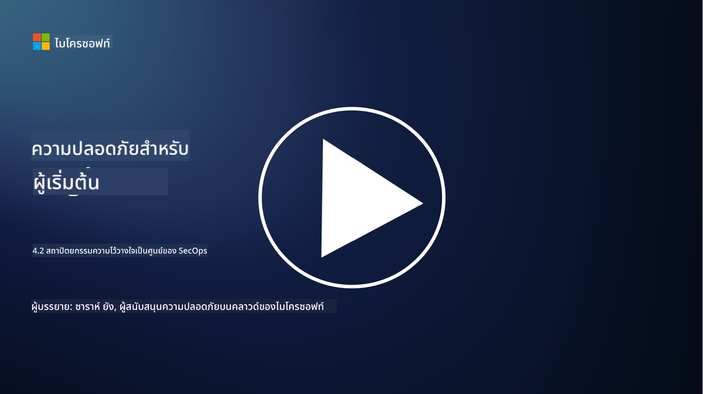

<!--
CO_OP_TRANSLATOR_METADATA:
{
  "original_hash": "45bbdc114e70936816b0b3e7c40189cf",
  "translation_date": "2025-09-04T00:44:51+00:00",
  "source_file": "4.2 SecOps zero trust architecture.md",
  "language_code": "th"
}
-->
# สถาปัตยกรรม Zero Trust สำหรับการดำเนินงานด้านความปลอดภัย

การดำเนินงานด้านความปลอดภัยเป็นส่วนสำคัญของสถาปัตยกรรม Zero Trust และในบทเรียนนี้เราจะเรียนรู้เกี่ยวกับสองประเด็นสำคัญ:

- สถาปัตยกรรม IT ควรถูกออกแบบอย่างไรเพื่อรองรับการรวบรวมบันทึกแบบรวมศูนย์?

- แนวทางปฏิบัติที่ดีที่สุดสำหรับการดำเนินงานด้านความปลอดภัยในสภาพแวดล้อม IT สมัยใหม่คืออะไร?

## สถาปัตยกรรม IT ควรถูกออกแบบอย่างไรเพื่อรองรับการรวบรวมบันทึกแบบรวมศูนย์?

การรวบรวมบันทึกแบบรวมศูนย์เป็นองค์ประกอบสำคัญของการดำเนินงานด้านความปลอดภัยในยุคปัจจุบัน ช่วยให้องค์กรสามารถรวบรวมบันทึกและข้อมูลจากแหล่งต่าง ๆ เช่น เซิร์ฟเวอร์ แอปพลิเคชัน อุปกรณ์เครือข่าย และเครื่องมือด้านความปลอดภัย ไปยังที่เก็บข้อมูลรวมศูนย์เพื่อการวิเคราะห์ การตรวจสอบ และการตอบสนองต่อเหตุการณ์ ต่อไปนี้คือแนวทางปฏิบัติที่ดีที่สุดสำหรับการออกแบบสถาปัตยกรรม IT เพื่อรองรับการรวบรวมบันทึกแบบรวมศูนย์:

1. **การรวมแหล่งบันทึก**:

- ตรวจสอบให้แน่ใจว่าอุปกรณ์และระบบที่เกี่ยวข้องทั้งหมดถูกตั้งค่าให้สร้างบันทึก ซึ่งรวมถึงเซิร์ฟเวอร์ ไฟร์วอลล์ เราเตอร์ สวิตช์ แอปพลิเคชัน และอุปกรณ์รักษาความปลอดภัย

- ตั้งค่าแหล่งบันทึกให้ส่งบันทึกไปยังตัวรวบรวมบันทึกหรือระบบจัดการแบบรวมศูนย์

2. **เลือกเครื่องมือ SIEM (Security Information and Event Management) ที่เหมาะสม**:

- เลือกโซลูชัน SIEM ที่สอดคล้องกับความต้องการและขนาดขององค์กร

- ตรวจสอบให้แน่ใจว่าโซลูชันที่เลือกสามารถรองรับการรวบรวมบันทึก การรวมข้อมูล การวิเคราะห์ และการรายงาน

3. **ความสามารถในการขยายและความซ้ำซ้อน**:

- ออกแบบสถาปัตยกรรมให้สามารถขยายได้เพื่อรองรับจำนวนแหล่งบันทึกที่เพิ่มขึ้นและปริมาณบันทึกที่มากขึ้น

- ใช้ความซ้ำซ้อนเพื่อให้ระบบมีความพร้อมใช้งานสูงและป้องกันการหยุดชะงักจากความล้มเหลวของฮาร์ดแวร์หรือเครือข่าย

4. **การส่งบันทึกอย่างปลอดภัย**:

- ใช้โปรโตคอลที่ปลอดภัย เช่น TLS/SSL หรือ IPsec ในการส่งบันทึกจากแหล่งข้อมูลไปยังที่เก็บข้อมูลรวมศูนย์

- ใช้การตรวจสอบสิทธิ์และการควบคุมการเข้าถึงเพื่อให้แน่ใจว่าเฉพาะอุปกรณ์ที่ได้รับอนุญาตเท่านั้นที่สามารถส่งบันทึกได้

5. **การทำให้ข้อมูลเป็นมาตรฐาน**:

- มาตรฐานรูปแบบบันทึกและปรับข้อมูลให้เป็นมาตรฐานเพื่อความสม่ำเสมอและง่ายต่อการวิเคราะห์

6. **การจัดเก็บและการเก็บรักษา**:

- กำหนดระยะเวลาการเก็บรักษาบันทึกที่เหมาะสมตามข้อกำหนดด้านการปฏิบัติตามกฎระเบียบและความปลอดภัย

- จัดเก็บบันทึกอย่างปลอดภัยเพื่อป้องกันการเข้าถึงโดยไม่ได้รับอนุญาตและการแก้ไขข้อมูล

## แนวทางปฏิบัติที่ดีที่สุดสำหรับการดำเนินงานด้านความปลอดภัยในสภาพแวดล้อม IT สมัยใหม่คืออะไร?

นอกเหนือจากการรวบรวมบันทึกแบบรวมศูนย์ ต่อไปนี้คือแนวทางปฏิบัติที่ดีที่สุดสำหรับการดำเนินงานด้านความปลอดภัยในสภาพแวดล้อม IT สมัยใหม่:

1. **การตรวจสอบอย่างต่อเนื่อง**: ใช้การตรวจสอบกิจกรรมเครือข่ายและระบบอย่างต่อเนื่องเพื่อค้นหาและตอบสนองต่อภัยคุกคามแบบเรียลไทม์

2. **ข่าวกรองภัยคุกคาม**: ติดตามข้อมูลเกี่ยวกับภัยคุกคามและช่องโหว่ใหม่ ๆ โดยใช้ฟีดและบริการข่าวกรองภัยคุกคาม

3. **การฝึกอบรมผู้ใช้งาน**: จัดการฝึกอบรมความปลอดภัยให้กับพนักงานอย่างสม่ำเสมอเพื่อลดความเสี่ยงจากการโจมตีทางวิศวกรรมสังคมและฟิชชิง

4. **แผนตอบสนองต่อเหตุการณ์**: พัฒนาและทดสอบแผนตอบสนองต่อเหตุการณ์เพื่อให้สามารถตอบสนองต่อเหตุการณ์ด้านความปลอดภัยได้อย่างรวดเร็วและมีประสิทธิภาพ

5. **การทำงานอัตโนมัติด้านความปลอดภัย**: ใช้เครื่องมืออัตโนมัติและการประสานงานด้านความปลอดภัยเพื่อเพิ่มประสิทธิภาพในการตอบสนองต่อเหตุการณ์และงานที่ทำซ้ำ ๆ

6. **การสำรองข้อมูลและการกู้คืน**: ใช้โซลูชันการสำรองข้อมูลและการกู้คืนที่แข็งแกร่งเพื่อให้มั่นใจว่าข้อมูลยังคงสามารถใช้งานได้ในกรณีที่เกิดการสูญเสียข้อมูลหรือการโจมตีด้วยแรนซัมแวร์

## อ่านเพิ่มเติม

- [Microsoft Security Best Practices module: Security operations | Microsoft Learn](https://learn.microsoft.com/security/operations/security-operations-videos-and-decks?WT.mc_id=academic-96948-sayoung)
- [Security operations - Cloud Adoption Framework | Microsoft Learn](https://learn.microsoft.com/azure/cloud-adoption-framework/secure/security-operations?WT.mc_id=academic-96948-sayoung)
- [What is Security Operations and Analytics Platform Architecture? A Definition of SOAPA, How It Works, Benefits, and More (digitalguardian.com)](https://www.digitalguardian.com/blog/what-security-operations-and-analytics-platform-architecture-definition-soapa-how-it-works#:~:text=All%20in%20all%2C%20security%20operations%20and%20analytics%20platform,become%20more%20efficient%20and%20operative%20with%20your%20security.)

---

**ข้อจำกัดความรับผิดชอบ**:  
เอกสารนี้ได้รับการแปลโดยใช้บริการแปลภาษา AI [Co-op Translator](https://github.com/Azure/co-op-translator) แม้ว่าเราจะพยายามให้การแปลมีความถูกต้อง แต่โปรดทราบว่าการแปลอัตโนมัติอาจมีข้อผิดพลาดหรือความไม่แม่นยำ เอกสารต้นฉบับในภาษาต้นทางควรถือเป็นแหล่งข้อมูลที่เชื่อถือได้ สำหรับข้อมูลที่สำคัญ ขอแนะนำให้ใช้บริการแปลภาษาจากผู้เชี่ยวชาญ เราไม่รับผิดชอบต่อความเข้าใจผิดหรือการตีความที่ผิดพลาดซึ่งเกิดจากการใช้การแปลนี้