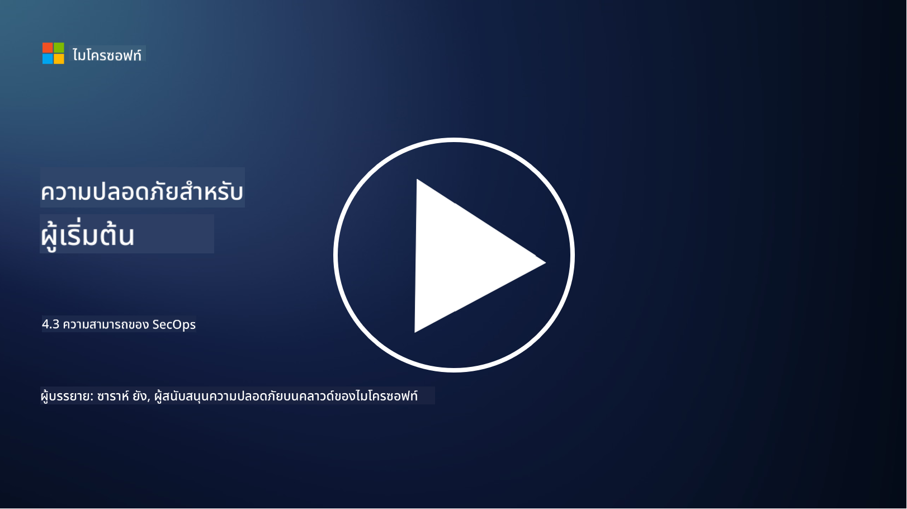

<!--
CO_OP_TRANSLATOR_METADATA:
{
  "original_hash": "553eb694c89f1caca0694e8d8ab89e0e",
  "translation_date": "2025-09-04T01:18:55+00:00",
  "source_file": "4.3 SecOps capabilities.md",
  "language_code": "th"
}
-->
# ความสามารถของ SecOps

ในส่วนนี้ เราจะพูดถึงรายละเอียดเพิ่มเติมเกี่ยวกับเครื่องมือและความสามารถหลักที่สามารถนำมาใช้ในงานปฏิบัติการด้านความปลอดภัย

ในบทเรียนนี้ เราจะพูดถึง:

- เครื่องมือจัดการข้อมูลและเหตุการณ์ด้านความปลอดภัย (SIEM) คืออะไร?

- XDR คืออะไร?

- ความสามารถแบบใดที่สามารถนำมาใช้เพื่อเพิ่มประสิทธิภาพการปฏิบัติการด้านความปลอดภัย?

## เครื่องมือจัดการข้อมูลและเหตุการณ์ด้านความปลอดภัย (SIEM) คืออะไร?

เครื่องมือจัดการข้อมูลและเหตุการณ์ด้านความปลอดภัย (Security Information and Event Management หรือ SIEM) ใช้สำหรับวิเคราะห์การแจ้งเตือนด้านความปลอดภัยที่เกิดขึ้นในสภาพแวดล้อม IT ขององค์กร โดยรวบรวม, รวมข้อมูล, เชื่อมโยง และวิเคราะห์ข้อมูลล็อกและเหตุการณ์ด้านความปลอดภัยจากแหล่งต่าง ๆ เช่น อุปกรณ์เครือข่าย, เซิร์ฟเวอร์, แอปพลิเคชัน และระบบรักษาความปลอดภัย

ฟังก์ชันและความสามารถหลักของเครื่องมือ SIEM ได้แก่:

1. **การรวบรวมล็อก**: เครื่องมือ SIEM รวบรวมข้อมูลล็อกและเหตุการณ์ด้านความปลอดภัยจากอุปกรณ์, ระบบ และแอปพลิเคชันหลากหลาย เช่น ไฟร์วอลล์, ระบบตรวจจับการบุกรุก, ซอฟต์แวร์ป้องกันไวรัส และอื่น ๆ

2. **การทำให้ข้อมูลเป็นมาตรฐาน**: ทำให้ข้อมูลล็อกอยู่ในรูปแบบที่เป็นมาตรฐานเพื่อให้ง่ายต่อการวิเคราะห์และเชื่อมโยง

3. **การเชื่อมโยงเหตุการณ์**: เชื่อมโยงเหตุการณ์เพื่อระบุรูปแบบและความผิดปกติที่อาจบ่งชี้ถึงเหตุการณ์ด้านความปลอดภัยหรือภัยคุกคาม

4. **การแจ้งเตือนและการแจ้งข้อมูล**: สร้างการแจ้งเตือนและการแจ้งข้อมูลแบบเรียลไทม์เมื่อพบกิจกรรมที่น่าสงสัยหรือการละเมิดความปลอดภัย เพื่อให้สามารถตอบสนองได้ทันที

5. **การตรวจจับเหตุการณ์**: ช่วยในการตรวจจับเหตุการณ์ด้านความปลอดภัย เช่น การเข้าถึงโดยไม่ได้รับอนุญาต, การละเมิดข้อมูล, การติดมัลแวร์ และภัยคุกคามภายใน

6. **การวิเคราะห์พฤติกรรมของผู้ใช้และเอนทิตี (UEBA)**: เครื่องมือ SIEM บางตัวมีความสามารถ UEBA เพื่อระบุพฤติกรรมที่ผิดปกติของผู้ใช้และเอนทิตีที่อาจบ่งชี้ถึงบัญชีที่ถูกบุกรุกหรือภัยคุกคามภายใน

7. **การผสานรวมข้อมูลภัยคุกคาม**: สามารถผสานรวมกับฟีดข้อมูลภัยคุกคามเพื่อเพิ่มประสิทธิภาพการตรวจจับภัยคุกคามโดยการเปรียบเทียบตัวบ่งชี้การบุกรุก (IOCs) กับกิจกรรมในเครือข่าย

8. **ระบบอัตโนมัติและการประสานงาน**: ฟีเจอร์ระบบอัตโนมัติช่วยให้ SIEM สามารถตอบสนองต่อเหตุการณ์ด้านความปลอดภัยทั่วไปได้โดยอัตโนมัติ ลดเวลาในการตอบสนองและความพยายามด้วยตนเอง

9. **แดชบอร์ดและการแสดงผล**: มีแดชบอร์ดและเครื่องมือแสดงผลสำหรับการติดตามข้อมูลด้านความปลอดภัยและสร้างรายงานที่กำหนดเอง

10. **การผสานรวมกับเครื่องมือรักษาความปลอดภัยอื่น ๆ**: เครื่องมือ SIEM มักผสานรวมกับเครื่องมือและเทคโนโลยีรักษาความปลอดภัยอื่น ๆ เช่น โซลูชัน EDR เพื่อให้มุมมองที่ครอบคลุมเกี่ยวกับสถานะความปลอดภัยขององค์กร

## XDR คืออะไร?

XDR (Extended Detection and Response) เป็นเทคโนโลยีที่ขยายความสามารถของ Endpoint Detection and Response (EDR) แบบดั้งเดิม และรวมเข้ากับข้อมูลด้านความปลอดภัยจากแหล่งต่าง ๆ เพื่อให้มุมมองที่ครอบคลุมมากขึ้นเกี่ยวกับสถานะความปลอดภัยขององค์กร XDR มีเป้าหมายเพื่อปรับปรุงการตรวจจับภัยคุกคาม, การตอบสนองต่อเหตุการณ์ และความปลอดภัยโดยรวม โดยแก้ไขข้อจำกัดของการพึ่งพา EDR, SIEM หรือเครื่องมือรักษาความปลอดภัยแบบแยกส่วนอื่น ๆ เพียงอย่างเดียว

ลักษณะและองค์ประกอบสำคัญของ XDR ได้แก่:

1. **การรวมข้อมูล**: XDR รวมข้อมูลจากแหล่งต่าง ๆ เช่น อุปกรณ์ปลายทาง, ทราฟฟิกเครือข่าย, บริการคลาวด์, อีเมล และอื่น ๆ การรวบรวมข้อมูลที่ครอบคลุมนี้ช่วยให้มีบริบทที่กว้างขึ้นสำหรับการตรวจจับและวิเคราะห์ภัยคุกคาม

2. **การวิเคราะห์ขั้นสูง**: ใช้การวิเคราะห์ขั้นสูง, การเรียนรู้ของเครื่อง และการวิเคราะห์พฤติกรรมเพื่อระบุและจัดลำดับความสำคัญของภัยคุกคาม โดยค้นหารูปแบบและความผิดปกติในข้อมูลที่รวมกัน

3. **การตรวจจับภัยคุกคามอัตโนมัติ**: XDR ตรวจจับภัยคุกคามและความผิดปกติโดยอัตโนมัติผ่านการเชื่อมโยงข้อมูลจากแหล่งต่าง ๆ สามารถระบุห่วงโซ่การโจมตีที่ซับซ้อนซึ่งอาจครอบคลุมหลายเวกเตอร์

4. **การสืบสวนและตอบสนองต่อเหตุการณ์**: มีเครื่องมือสำหรับการสืบสวนและตอบสนองต่อเหตุการณ์ ช่วยให้ทีมรักษาความปลอดภัยประเมินขอบเขตและผลกระทบของเหตุการณ์ได้อย่างรวดเร็วและดำเนินการแก้ไขที่เหมาะสม

5. **การผสานรวมข้อมูลภัยคุกคาม**: ผสานรวมฟีดข้อมูลภัยคุกคามเพื่อเพิ่มประสิทธิภาพการตรวจจับภัยคุกคามโดยการเปรียบเทียบตัวบ่งชี้การบุกรุก (IOCs) กับกิจกรรมในเครือข่ายและอุปกรณ์ปลายทางขององค์กร

6. **คอนโซลแบบรวมศูนย์**: XDR มักมีคอนโซลหรือแดชบอร์ดแบบรวมศูนย์ที่ทีมรักษาความปลอดภัยสามารถดูและจัดการการแจ้งเตือนและเหตุการณ์ด้านความปลอดภัยจากแหล่งต่าง ๆ ได้ในที่เดียว

7. **การครอบคลุมข้ามแพลตฟอร์ม**: โซลูชัน XDR ครอบคลุมแพลตฟอร์มที่หลากหลาย เช่น อุปกรณ์ปลายทาง, เซิร์ฟเวอร์, สภาพแวดล้อมคลาวด์ และอุปกรณ์เคลื่อนที่ ทำให้เหมาะสำหรับสภาพแวดล้อม IT สมัยใหม่ที่มีหลายแพลตฟอร์ม

## ความสามารถแบบใดที่สามารถนำมาใช้เพื่อเพิ่มประสิทธิภาพการปฏิบัติการด้านความปลอดภัย?

เพื่อเพิ่มประสิทธิภาพการปฏิบัติการด้านความปลอดภัย องค์กรสามารถใช้ความสามารถหลายอย่างเพิ่มเติมจากเครื่องมือ SIEM:

1. **การเรียนรู้ของเครื่องและปัญญาประดิษฐ์**: ใช้การวิเคราะห์ขั้นสูง, การเรียนรู้ของเครื่อง และ AI เพื่อตรวจจับภัยคุกคามที่พัฒนาอย่างต่อเนื่องและทำการล่าภัยคุกคามโดยอัตโนมัติ

2. **การวิเคราะห์พฤติกรรมของผู้ใช้และเอนทิตี (UEBA)**: วิเคราะห์พฤติกรรมของผู้ใช้และเอนทิตีเพื่อระบุความผิดปกติและภัยคุกคามภายใน

3. **ฟีดข้อมูลภัยคุกคาม**: ผสานรวมฟีดข้อมูลภัยคุกคามเพื่ออัปเดตเกี่ยวกับภัยคุกคามล่าสุดและตัวบ่งชี้การบุกรุก

4. **แพลตฟอร์มการประสานงาน, ระบบอัตโนมัติ และการตอบสนองด้านความปลอดภัย (SOAR)**: ใช้แพลตฟอร์ม SOAR เพื่อทำให้การตอบสนองต่อเหตุการณ์เป็นอัตโนมัติและปรับปรุงกระบวนการทำงานด้านความปลอดภัย

5. **เทคโนโลยีการหลอกลวง**: ใช้เทคโนโลยีการหลอกลวงเพื่อหลอกล่อและตรวจจับผู้โจมตีภายในเครือข่าย

## อ่านเพิ่มเติม

- [What is SIEM? | Microsoft Security](https://www.microsoft.com/security/business/security-101/what-is-siem?WT.mc_id=academic-96948-sayoung)
- [What Is SIEM? - Security Information and Event Management - Cisco](https://www.cisco.com/c/en/us/products/security/what-is-siem.html)
- [Security information and event management - Wikipedia](https://en.wikipedia.org/wiki/Security_information_and_event_management)
- [What Is XDR? | Microsoft Security](https://www.microsoft.com/security/business/security-101/what-is-xdr?WT.mc_id=academic-96948-sayoung)
- [XDR & XDR Security (kaspersky.com.au)](https://www.kaspersky.com.au/resource-center/definitions/what-is-xdr)
- [The Power of SecOps: Redefining Core Security Capabilities - The New Stack](https://thenewstack.io/the-power-of-secops-redefining-core-security-capabilities/)
- [Seven Steps to Improve Your Security Operations and Response (securityintelligence.com)](https://securityintelligence.com/seven-steps-to-improve-your-security-operations-and-response/)

---

**ข้อจำกัดความรับผิดชอบ**:  
เอกสารนี้ได้รับการแปลโดยใช้บริการแปลภาษา AI [Co-op Translator](https://github.com/Azure/co-op-translator) แม้ว่าเราจะพยายามให้การแปลมีความถูกต้องมากที่สุด แต่โปรดทราบว่าการแปลอัตโนมัติอาจมีข้อผิดพลาดหรือความไม่ถูกต้อง เอกสารต้นฉบับในภาษาดั้งเดิมควรถือเป็นแหล่งข้อมูลที่เชื่อถือได้ สำหรับข้อมูลที่สำคัญ ขอแนะนำให้ใช้บริการแปลภาษามืออาชีพ เราไม่รับผิดชอบต่อความเข้าใจผิดหรือการตีความผิดที่เกิดจากการใช้การแปลนี้