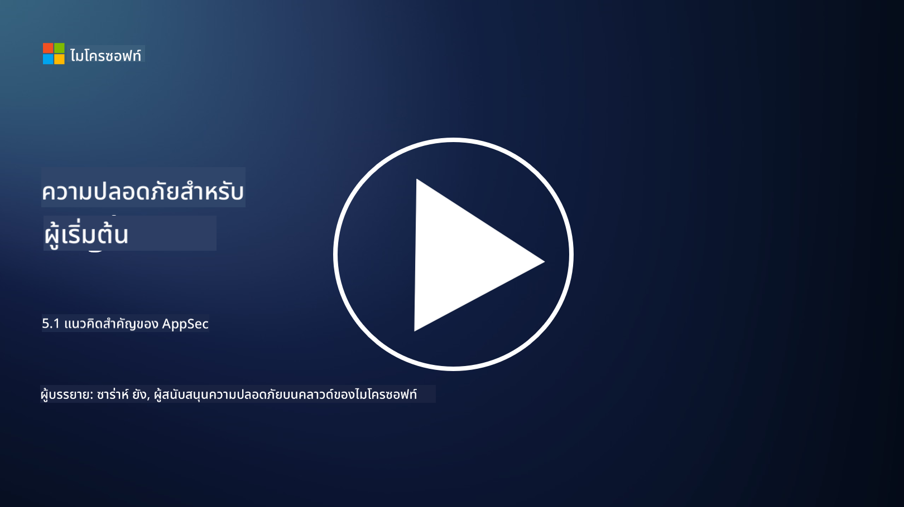

<!--
CO_OP_TRANSLATOR_METADATA:
{
  "original_hash": "e4b56bb23078d3ffb7ad407d280b0c36",
  "translation_date": "2025-09-04T00:32:08+00:00",
  "source_file": "5.1 AppSec key concepts.md",
  "language_code": "th"
}
-->
# แนวคิดสำคัญของ AppSec

ความปลอดภัยของแอปพลิเคชันเป็นสาขาความเชี่ยวชาญด้านความปลอดภัยในตัวมันเอง ในส่วนนี้ของหลักสูตร เราจะเจาะลึกเกี่ยวกับความปลอดภัยของแอปพลิเคชัน

## บทนำ

ในบทเรียนนี้ เราจะพูดถึง:

- ความปลอดภัยของแอปพลิเคชันคืออะไร?

- แนวคิด/หลักการสำคัญของความปลอดภัยของแอปพลิเคชันคืออะไร?

## ความปลอดภัยของแอปพลิเคชันคืออะไร?

ความปลอดภัยของแอปพลิเคชัน หรือที่มักเรียกกันว่า "AppSec" หมายถึงการปฏิบัติในการปกป้องแอปพลิเคชันซอฟต์แวร์จากภัยคุกคาม ช่องโหว่ และการโจมตีด้านความปลอดภัย ซึ่งครอบคลุมกระบวนการ เทคนิค และเครื่องมือที่ใช้ในการระบุ ลด และป้องกันความเสี่ยงด้านความปลอดภัยตลอดวงจรการพัฒนา การใช้งาน และการบำรุงรักษาแอปพลิเคชัน

ความปลอดภัยของแอปพลิเคชันมีความสำคัญเนื่องจากแอปพลิเคชันมักเป็นเป้าหมายของการโจมตีทางไซเบอร์ ผู้ไม่หวังดีใช้ช่องโหว่และจุดอ่อนในซอฟต์แวร์เพื่อเข้าถึงโดยไม่ได้รับอนุญาต ขโมยข้อมูล ขัดขวางบริการ หรือดำเนินกิจกรรมที่เป็นอันตรายอื่น ๆ ความปลอดภัยของแอปพลิเคชันที่มีประสิทธิภาพช่วยให้มั่นใจในความลับ ความสมบูรณ์ และความพร้อมใช้งานของแอปพลิเคชันและข้อมูลที่เกี่ยวข้อง

## แนวคิด/หลักการสำคัญของความปลอดภัยของแอปพลิเคชันคืออะไร?

แนวคิดและหลักการสำคัญที่เป็นพื้นฐานของความปลอดภัยของแอปพลิเคชัน ได้แก่:

1. **การออกแบบให้ปลอดภัยตั้งแต่ต้น**:

- ความปลอดภัยควรถูกรวมเข้ากับการออกแบบและสถาปัตยกรรมของแอปพลิเคชันตั้งแต่เริ่มต้น แทนที่จะเพิ่มเข้ามาภายหลัง

2. **การตรวจสอบความถูกต้องของข้อมูลที่ป้อน**:

- ข้อมูลที่ผู้ใช้ป้อนทั้งหมดควรได้รับการตรวจสอบเพื่อให้แน่ใจว่าเป็นไปตามรูปแบบที่คาดหวังและปราศจากโค้ดหรือข้อมูลที่เป็นอันตราย

3. **การเข้ารหัสข้อมูลที่ส่งออก**:

- ข้อมูลที่ส่งไปยังไคลเอนต์ควรได้รับการเข้ารหัสอย่างเหมาะสมเพื่อป้องกันช่องโหว่ เช่น การโจมตีแบบ Cross-Site Scripting (XSS)

4. **การยืนยันตัวตนและการอนุญาต**:

- ยืนยันตัวตนของผู้ใช้และอนุญาตการเข้าถึงทรัพยากรตามบทบาทและสิทธิ์ของพวกเขา

5. **การปกป้องข้อมูล**:

- ข้อมูลที่สำคัญควรได้รับการเข้ารหัสเมื่อจัดเก็บ ส่งผ่าน และประมวลผลเพื่อป้องกันการเข้าถึงโดยไม่ได้รับอนุญาต

6. **การจัดการเซสชัน**:

- การจัดการเซสชันที่ปลอดภัยช่วยปกป้องเซสชันของผู้ใช้จากการถูกแย่งชิงและการเข้าถึงโดยไม่ได้รับอนุญาต

7. **การใช้ไลบรารีและส่วนประกอบที่ปลอดภัย**:

- อัปเดตไลบรารีและส่วนประกอบของซอฟต์แวร์ทั้งหมดให้ทันสมัยด้วยแพตช์ความปลอดภัยเพื่อป้องกันช่องโหว่

8. **การจัดการข้อผิดพลาดและการบันทึก**:

- ใช้การจัดการข้อผิดพลาดที่ปลอดภัยเพื่อหลีกเลี่ยงการเปิดเผยข้อมูลที่สำคัญ และปฏิบัติตามแนวทางการบันทึกที่ปลอดภัย

9. **การทดสอบความปลอดภัย**:

- ทดสอบแอปพลิเคชันอย่างสม่ำเสมอเพื่อหาช่องโหว่โดยใช้วิธีการ เช่น การทดสอบเจาะระบบ การตรวจสอบโค้ด และเครื่องมือสแกนอัตโนมัติ

10. **วงจรการพัฒนาซอฟต์แวร์ที่ปลอดภัย (SDLC)**:

- รวมแนวทางปฏิบัติด้านความปลอดภัยในทุกขั้นตอนของวงจรการพัฒนาซอฟต์แวร์ ตั้งแต่การกำหนดความต้องการไปจนถึงการใช้งานและการบำรุงรักษา

## อ่านเพิ่มเติม

- [SheHacksPurple: What is Application Security? - YouTube](https://www.youtube.com/watch?v=eNmccQNzSSY)
- [What Is Application Security? - Cisco](https://www.cisco.com/c/en/us/solutions/security/application-first-security/what-is-application-security.html#~how-does-it-work)
- [What is application security? A process and tools for securing software | CSO Online](https://www.csoonline.com/article/566471/what-is-application-security-a-process-and-tools-for-securing-software.html)
- [OWASP Cheat Sheet Series | OWASP Foundation](https://owasp.org/www-project-cheat-sheets/)

---

**ข้อจำกัดความรับผิดชอบ**:  
เอกสารนี้ได้รับการแปลโดยใช้บริการแปลภาษา AI [Co-op Translator](https://github.com/Azure/co-op-translator) แม้ว่าเราจะพยายามให้การแปลมีความถูกต้อง แต่โปรดทราบว่าการแปลอัตโนมัติอาจมีข้อผิดพลาดหรือความไม่แม่นยำ เอกสารต้นฉบับในภาษาต้นทางควรถือเป็นแหล่งข้อมูลที่เชื่อถือได้ สำหรับข้อมูลที่สำคัญ ขอแนะนำให้ใช้บริการแปลภาษามนุษย์ที่เป็นมืออาชีพ เราจะไม่รับผิดชอบต่อความเข้าใจผิดหรือการตีความที่ผิดพลาดซึ่งเกิดจากการใช้การแปลนี้