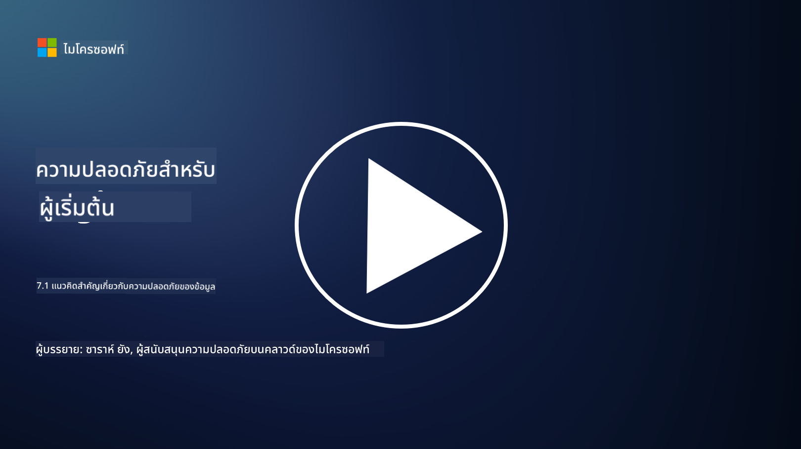

<!--
CO_OP_TRANSLATOR_METADATA:
{
  "original_hash": "9703868f41dcddd5a98dea9ea6fcd94d",
  "translation_date": "2025-09-03T23:56:35+00:00",
  "source_file": "7.1 Data security key concepts.md",
  "language_code": "th"
}
-->
# แนวคิดสำคัญเกี่ยวกับความปลอดภัยของข้อมูล

เราได้กล่าวถึงความปลอดภัยของข้อมูลและพูดถึงเรื่องนี้หลายครั้งในหลักสูตรนี้แล้ว ตอนนี้เรามาเจาะลึกในหัวข้อนี้กัน ในบทเรียนนี้คุณจะได้เรียนรู้:

- ความปลอดภัยของข้อมูลคืออะไร?

- การจัดประเภทข้อมูลคืออะไร?

- การจัดการวงจรชีวิตของข้อมูลคืออะไร?

- การป้องกันการสูญหายของข้อมูล (DLP) คืออะไร?

- ทำไมความปลอดภัยของข้อมูลจึงสำคัญต่อองค์กร?

## ความปลอดภัยของข้อมูลคืออะไร?

**ความปลอดภัยของข้อมูล** หมายถึงการปฏิบัติในการปกป้องข้อมูลดิจิทัล เช่น ฐานข้อมูล ไฟล์ และข้อมูลที่มีความสำคัญ จากการเข้าถึง การเปิดเผย การแก้ไข หรือการทำลายโดยไม่ได้รับอนุญาต วัตถุประสงค์หลักของความปลอดภัยของข้อมูลคือการรับรองความลับ ความถูกต้อง และความพร้อมใช้งานของข้อมูล ซึ่งเกี่ยวข้องกับการใช้มาตรการรักษาความปลอดภัยทั้งทางเทคนิค การบริหารจัดการ และทางกายภาพเพื่อป้องกันข้อมูลจากภัยคุกคามและช่องโหว่ต่างๆ เช่น การโจมตีทางไซเบอร์ ภัยคุกคามจากภายใน และการละเมิดข้อมูล มาตรการความปลอดภัยของข้อมูลอาจรวมถึงการเข้ารหัส การควบคุมการเข้าถึง การยืนยันตัวตน การตรวจสอบการใช้งาน และนโยบายความปลอดภัย

## การจัดประเภทข้อมูลคืออะไร?

**การจัดประเภทข้อมูล** คือกระบวนการจัดหมวดหมู่ข้อมูลตามความอ่อนไหว คุณค่า และความสำคัญต่อองค์กร วัตถุประสงค์ของการจัดประเภทข้อมูลคือเพื่อช่วยให้องค์กรระบุและจัดลำดับความสำคัญในการปกป้องและจัดการข้อมูลประเภทต่างๆ หมวดหมู่การจัดประเภทข้อมูลที่พบบ่อย ได้แก่ "สาธารณะ" "ภายใน" "ลับ" และ "จำกัด" หรือ "ลับมาก" เมื่อข้อมูลได้รับการจัดประเภทแล้ว องค์กรสามารถใช้มาตรการควบคุมความปลอดภัยและข้อจำกัดการเข้าถึงที่เหมาะสมเพื่อให้มั่นใจว่าข้อมูลที่อ่อนไหวได้รับการปกป้องอย่างเพียงพอและปฏิบัติตามข้อกำหนดด้านกฎระเบียบ

## การจัดการวงจรชีวิตของข้อมูลคืออะไร?

**การจัดการวงจรชีวิตของข้อมูล** คือแนวทางที่มีโครงสร้างในการจัดการข้อมูลตลอดวงจรชีวิตทั้งหมด ตั้งแต่การสร้างหรือการได้มาจนถึงการเก็บถาวรหรือการลบ วงจรชีวิตของข้อมูลมักประกอบด้วยขั้นตอนต่างๆ เช่น การสร้าง การจัดเก็บ การประมวลผล การส่งผ่าน การเก็บถาวร และการกำจัด การจัดการวงจรชีวิตของข้อมูลเกี่ยวข้องกับการกำหนดนโยบายและขั้นตอนสำหรับแต่ละขั้นตอนของวงจรชีวิตของข้อมูล รวมถึงการเก็บรักษาข้อมูล การควบคุมการเข้าถึง การสำรองข้อมูล และการล้างข้อมูล การจัดการวงจรชีวิตของข้อมูลอย่างมีประสิทธิภาพช่วยให้องค์กรเพิ่มประสิทธิภาพการจัดเก็บข้อมูล ปรับปรุงคุณภาพข้อมูล และปฏิบัติตามข้อกำหนดด้านการปกป้องข้อมูล

## การป้องกันการสูญหายของข้อมูล (DLP) คืออะไร?

**การป้องกันการสูญหายของข้อมูล (DLP)** หมายถึงชุดของเทคโนโลยี นโยบาย และแนวปฏิบัติที่ออกแบบมาเพื่อป้องกันการเข้าถึง การแบ่งปัน หรือการรั่วไหลของข้อมูลที่อ่อนไหวหรือเป็นความลับโดยไม่ได้รับอนุญาต โซลูชัน DLP ใช้การตรวจสอบเนื้อหาและการวิเคราะห์บริบทเพื่อตรวจสอบและควบคุมข้อมูลที่กำลังเคลื่อนที่ (เช่น อีเมล การรับส่งข้อมูลทางเว็บ) ข้อมูลที่อยู่ในที่จัดเก็บ (เช่น ไฟล์และฐานข้อมูลที่จัดเก็บไว้) และข้อมูลที่กำลังใช้งาน (เช่น ข้อมูลที่ผู้ใช้กำลังเข้าถึงหรือจัดการ) เป้าหมายของ DLP คือการระบุและบล็อกหรือเข้ารหัสข้อมูลที่อ่อนไหวเพื่อป้องกันการละเมิดข้อมูล ปฏิบัติตามข้อกำหนดด้านการปกป้องข้อมูล และปกป้องชื่อเสียงขององค์กร

## ทำไมความปลอดภัยของข้อมูลจึงสำคัญต่อองค์กร?

ความปลอดภัยของข้อมูลมีความสำคัญอย่างยิ่งต่อองค์กรด้วยเหตุผลหลายประการ:

- **การปกป้องข้อมูลที่อ่อนไหว**: องค์กรมักจัดเก็บข้อมูลที่อ่อนไหว เช่น ข้อมูลลูกค้า ทรัพย์สินทางปัญญา ข้อมูลทางการเงิน และข้อมูลพนักงาน ความปลอดภัยของข้อมูลช่วยปกป้องข้อมูลที่อ่อนไหวเหล่านี้จากการเข้าถึงหรือการขโมยโดยไม่ได้รับอนุญาต

- **การปฏิบัติตามข้อกำหนด**: หลายอุตสาหกรรมและเขตอำนาจศาลมีกฎระเบียบที่เข้มงวดเกี่ยวกับการปกป้องข้อมูลและความเป็นส่วนตัว ความปลอดภัยของข้อมูลช่วยให้องค์กรปฏิบัติตามกฎหมายเหล่านี้ หลีกเลี่ยงบทลงโทษทางกฎหมายและความเสียหายต่อชื่อเสียง

- **การป้องกันการละเมิดข้อมูล**: การละเมิดข้อมูลอาจส่งผลให้เกิดความสูญเสียทางการเงิน ความเสียหายต่อชื่อเสียง และผลกระทบทางกฎหมาย มาตรการความปลอดภัยของข้อมูลที่มีประสิทธิภาพช่วยป้องกันการละเมิดข้อมูลหรือจำกัดผลกระทบของมัน

- **การรักษาความไว้วางใจ**: ลูกค้าและผู้มีส่วนได้ส่วนเสียไว้วางใจองค์กรในการจัดการข้อมูลของพวกเขา การละเมิดความปลอดภัยของข้อมูลทำให้ความไว้วางใจลดลง การรักษาความปลอดภัยของข้อมูลที่แข็งแกร่งช่วยรักษาความไว้วางใจและความมั่นใจของลูกค้า

- **ความได้เปรียบทางการแข่งขัน**: การแสดงให้เห็นถึงความมุ่งมั่นในความปลอดภัยของข้อมูลสามารถเป็นข้อได้เปรียบทางการแข่งขัน ลูกค้าและพันธมิตรมีแนวโน้มที่จะทำงานกับองค์กรที่ให้ความสำคัญกับความปลอดภัยของข้อมูล

- **ความต่อเนื่องในการดำเนินงาน**: มาตรการความปลอดภัยของข้อมูล รวมถึงการสำรองข้อมูลและการวางแผนกู้คืนจากภัยพิบัติ ช่วยให้มั่นใจถึงความพร้อมใช้งานของข้อมูลที่สำคัญและความต่อเนื่องทางธุรกิจในกรณีที่เกิดการสูญหายของข้อมูลหรือภัยพิบัติ

- **การป้องกันภัยคุกคามจากภายใน**: มาตรการความปลอดภัยของข้อมูลยังช่วยจัดการกับภัยคุกคามจากภายในองค์กร รวมถึงการเปิดเผยข้อมูลโดยไม่ได้ตั้งใจจากพนักงานและการกระทำที่เป็นอันตรายจากบุคคลภายใน

โดยสรุป ความปลอดภัยของข้อมูลเป็นสิ่งสำคัญสำหรับการปกป้องข้อมูลที่อ่อนไหว การปฏิบัติตามข้อกำหนด การป้องกันการละเมิดข้อมูล การรักษาความไว้วางใจ และการรับรองความสำเร็จและชื่อเสียงขององค์กรในระยะยาว

## อ่านเพิ่มเติม

- [What Is Data Security? | Microsoft Security](https://www.microsoft.com/en-au/security/business/security-101/what-is-data-security?WT.mc_id=academic-96948-sayoung)
- [Automatically Classify & Protect Documents & Data | Microsoft Purview Information Protection](https://youtu.be/v8LqmzBUaOo)
- [Example data classification policy](https://www.cmu.edu/data/guidelines/data-classification.html)
- [What is Data Security? Data Security Definition and Overview | IBM](https://www.ibm.com/topics/data-security)
- [Data Lifecycle Management: A 2023 Guide for Your Business (cloudwards.net)](https://www.cloudwards.net/data-lifecycle-management/)
- [What is data loss prevention (DLP)? | Microsoft Security](https://www.microsoft.com/security/business/security-101/what-is-data-loss-prevention-dlp?WT.mc_id=academic-96948-sayoung)
- [What is DLP? How data loss prevention software works and why you need it | CSO Online](https://www.csoonline.com/article/569559/what-is-dlp-how-data-loss-prevention-software-works-and-why-you-need-it.html)

---

**ข้อจำกัดความรับผิดชอบ**:  
เอกสารนี้ได้รับการแปลโดยใช้บริการแปลภาษา AI [Co-op Translator](https://github.com/Azure/co-op-translator) แม้ว่าเราจะพยายามให้การแปลมีความถูกต้อง แต่โปรดทราบว่าการแปลโดยอัตโนมัติอาจมีข้อผิดพลาดหรือความไม่ถูกต้อง เอกสารต้นฉบับในภาษาดั้งเดิมควรถือเป็นแหล่งข้อมูลที่เชื่อถือได้ สำหรับข้อมูลที่สำคัญ ขอแนะนำให้ใช้บริการแปลภาษามืออาชีพ เราไม่รับผิดชอบต่อความเข้าใจผิดหรือการตีความผิดที่เกิดจากการใช้การแปลนี้