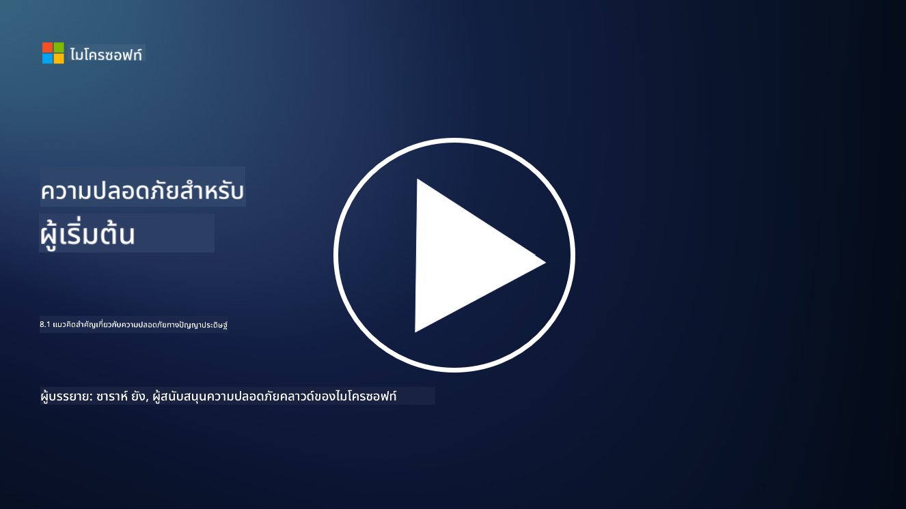

<!--
CO_OP_TRANSLATOR_METADATA:
{
  "original_hash": "66b61d96936cf25d20fcb411d4ce5227",
  "translation_date": "2025-09-03T22:47:58+00:00",
  "source_file": "8.1 AI security key concepts.md",
  "language_code": "th"
}
-->
# แนวคิดสำคัญเกี่ยวกับความปลอดภัยของ AI

## ความปลอดภัยของ AI แตกต่างจากความปลอดภัยทางไซเบอร์แบบดั้งเดิมอย่างไร?

การรักษาความปลอดภัยของระบบ AI มีความท้าทายเฉพาะตัวเมื่อเทียบกับความปลอดภัยทางไซเบอร์แบบดั้งเดิม เนื่องจากลักษณะการเรียนรู้และกระบวนการตัดสินใจของ AI ต่อไปนี้คือความแตกต่างสำคัญ:

-   **ความสมบูรณ์ของข้อมูล**: ระบบ AI พึ่งพาข้อมูลอย่างมากในการเรียนรู้ [การรักษาความสมบูรณ์ของข้อมูลนี้เป็นสิ่งสำคัญ เพราะผู้โจมตีสามารถปรับเปลี่ยนข้อมูลเพื่อส่งผลต่อพฤติกรรมของ AI ซึ่งเป็นกลยุทธ์ที่เรียกว่าการปนเปื้อนข้อมูล
-   **ความปลอดภัยของโมเดล**: โมเดลการตัดสินใจของ AI เองสามารถตกเป็นเป้าหมายได้ [ผู้โจมตีอาจพยายามย้อนกลับวิศวกรรมโมเดลหรือใช้จุดอ่อนของโมเดลเพื่อให้เกิดการตัดสินใจที่ผิดพลาดหรือเป็นอันตราย
-   **การโจมตีแบบปรปักษ์**: ระบบ AI อาจเสี่ยงต่อการโจมตีแบบปรปักษ์ ซึ่งการเปลี่ยนแปลงข้อมูลนำเข้าเพียงเล็กน้อยแต่มีผลกระทบสามารถทำให้ AI เกิดข้อผิดพลาดหรือการคาดการณ์ที่ไม่ถูกต้อง
-   **ความปลอดภัยของโครงสร้างพื้นฐาน**: แม้ความปลอดภัยทางไซเบอร์แบบดั้งเดิมจะมุ่งเน้นการปกป้องโครงสร้างพื้นฐาน แต่ระบบ AI อาจมีความซับซ้อนเพิ่มเติม เช่น บริการบนคลาวด์หรือฮาร์ดแวร์เฉพาะทางที่ต้องการมาตรการรักษาความปลอดภัยเฉพาะ
-   **ข้อพิจารณาด้านจริยธรรม**: การใช้ AI ในการรักษาความปลอดภัยนำมาซึ่งข้อพิจารณาด้านจริยธรรม เช่น ความกังวลเรื่องความเป็นส่วนตัวและความลำเอียงในการตัดสินใจ ซึ่งต้องได้รับการแก้ไขในกลยุทธ์การรักษาความปลอดภัย

โดยรวมแล้ว การรักษาความปลอดภัยของระบบ AI ต้องใช้แนวทางที่แตกต่างออกไป โดยคำนึงถึงลักษณะเฉพาะของเทคโนโลยี AI รวมถึงการปกป้องข้อมูล โมเดล และกระบวนการเรียนรู้ของ AI พร้อมทั้งจัดการกับผลกระทบด้านจริยธรรมจากการใช้งาน AI

ความปลอดภัยของ AI และความปลอดภัยทางไซเบอร์แบบดั้งเดิมมีความคล้ายคลึงกันหลายประการ แต่ก็มีความแตกต่างที่ชัดเจนเนื่องจากลักษณะเฉพาะและความสามารถของระบบปัญญาประดิษฐ์ ต่อไปนี้คือความแตกต่าง:

- **ความซับซ้อนของภัยคุกคาม**: ระบบ AI เพิ่มชั้นความซับซ้อนใหม่ให้กับความปลอดภัยทางไซเบอร์ ความปลอดภัยทางไซเบอร์แบบดั้งเดิมมักจัดการกับภัยคุกคาม เช่น มัลแวร์ การโจมตีแบบฟิชชิง และการบุกรุกเครือข่าย อย่างไรก็ตาม ระบบ AI อาจเสี่ยงต่อการโจมตี เช่น การโจมตีแบบปรปักษ์ การปนเปื้อนข้อมูล และการหลบหลีกโมเดล ซึ่งมุ่งเป้าไปที่อัลกอริทึมการเรียนรู้ของเครื่องโดยเฉพาะ

- **พื้นผิวการโจมตี**: ระบบ AI มักมีพื้นผิวการโจมตีที่ใหญ่กว่าระบบแบบดั้งเดิม เนื่องจากระบบเหล่านี้ไม่เพียงพึ่งพาซอฟต์แวร์เท่านั้น แต่ยังพึ่งพาข้อมูลและโมเดลด้วย ผู้โจมตีสามารถมุ่งเป้าไปที่ข้อมูลการฝึกอบรม ปรับเปลี่ยนโมเดล หรือใช้ประโยชน์จากช่องโหว่ในอัลกอริทึมเอง

- **การปรับตัวของภัยคุกคาม**: ระบบ AI สามารถปรับตัวและเรียนรู้จากสภาพแวดล้อม ซึ่งอาจทำให้ระบบมีความเสี่ยงต่อภัยคุกคามที่ปรับตัวและพัฒนาอย่างต่อเนื่อง มาตรการรักษาความปลอดภัยทางไซเบอร์แบบดั้งเดิมอาจไม่เพียงพอในการป้องกันการโจมตีที่พัฒนาไปตามพฤติกรรมของระบบ AI

- **การตีความและการอธิบายผลลัพธ์**: การทำความเข้าใจว่าทำไมระบบ AI จึงตัดสินใจบางอย่างมักจะท้าทายกว่าระบบซอฟต์แวร์แบบดั้งเดิม การขาดความสามารถในการตีความและอธิบายผลลัพธ์นี้อาจทำให้ยากต่อการตรวจจับและลดผลกระทบจากการโจมตีในระบบ AI ได้อย่างมีประสิทธิภาพ

- **ความกังวลเรื่องความเป็นส่วนตัวของข้อมูล**: ระบบ AI มักพึ่งพาข้อมูลจำนวนมาก ซึ่งอาจนำมาซึ่งความเสี่ยงด้านความเป็นส่วนตัวหากไม่ได้รับการจัดการอย่างเหมาะสม มาตรการรักษาความปลอดภัยทางไซเบอร์แบบดั้งเดิมอาจไม่สามารถจัดการกับความกังวลเรื่องความเป็นส่วนตัวของข้อมูลที่เฉพาะเจาะจงต่อระบบ AI ได้อย่างเพียงพอ

- **การปฏิบัติตามกฎระเบียบ**: ภูมิทัศน์ด้านกฎระเบียบสำหรับความปลอดภัยของ AI ยังคงพัฒนา โดยมีข้อบังคับและมาตรฐานเฉพาะที่เกิดขึ้นเพื่อจัดการกับความท้าทายเฉพาะที่ระบบ AI ก่อให้เกิดขึ้น กรอบการรักษาความปลอดภัยทางไซเบอร์แบบดั้งเดิมอาจต้องขยายหรือปรับเปลี่ยนเพื่อให้สอดคล้องกับข้อบังคับใหม่เหล่านี้

- **ข้อพิจารณาด้านจริยธรรม**: ความปลอดภัยของ AI ไม่เพียงเกี่ยวข้องกับการปกป้องระบบจากการโจมตีที่เป็นอันตราย แต่ยังรวมถึงการรับรองว่าระบบ AI ถูกใช้งานในลักษณะที่มีจริยธรรมและมีความรับผิดชอบด้วย ซึ่งรวมถึงข้อพิจารณา เช่น ความเป็นธรรม ความโปร่งใส และความรับผิดชอบ ซึ่งอาจไม่เด่นชัดในความปลอดภัยทางไซเบอร์แบบดั้งเดิม

## ความปลอดภัยของ AI เหมือนกับการรักษาความปลอดภัยของระบบ IT แบบดั้งเดิมอย่างไร?

การรักษาความปลอดภัยของระบบ AI มีหลักการพื้นฐานหลายประการที่เหมือนกับความปลอดภัยทางไซเบอร์แบบดั้งเดิม:

-   **การป้องกันภัยคุกคาม**: ทั้งระบบ AI และระบบแบบดั้งเดิมต้องได้รับการปกป้องจากการเข้าถึงโดยไม่ได้รับอนุญาต การแก้ไขข้อมูล และการทำลาย รวมถึงภัยคุกคามทั่วไปอื่น ๆ
-   **การจัดการช่องโหว่**: ช่องโหว่หลายอย่างที่ส่งผลกระทบต่อระบบแบบดั้งเดิม เช่น ข้อบกพร่องของซอฟต์แวร์หรือการตั้งค่าที่ผิดพลาด สามารถส่งผลกระทบต่อระบบ AI ได้เช่นกัน
-   **ความปลอดภัยของข้อมูล**: การปกป้องข้อมูลที่ถูกประมวลผลเป็นสิ่งสำคัญในทั้งสองโดเมนเพื่อป้องกันการละเมิดข้อมูลและรักษาความลับ
-   **ความปลอดภัยของห่วงโซ่อุปทาน**: ระบบทั้งสองประเภทมีความเสี่ยงต่อการโจมตีห่วงโซ่อุปทาน ซึ่งส่วนประกอบที่ถูกบุกรุกสามารถบั่นทอนความปลอดภัยของระบบทั้งหมดได้

ความคล้ายคลึงกันเหล่านี้แสดงให้เห็นว่า แม้ระบบ AI จะนำมาซึ่งความท้าทายด้านความปลอดภัยใหม่ ๆ แต่ก็ยังต้องใช้แนวทางปฏิบัติด้านความปลอดภัยทางไซเบอร์ที่มีอยู่เพื่อให้การปกป้องมีประสิทธิภาพ เป็นการผสมผสานระหว่างการใช้ภูมิปัญญาด้านความปลอดภัยแบบดั้งเดิมและการปรับตัวให้เข้ากับลักษณะเฉพาะของเทคโนโลยี AI

## อ่านเพิ่มเติม

- [Not with a Bug, But with a Sticker [Book] (oreilly.com)](https://www.oreilly.com/library/view/not-with-a/9781119883982/)
   
- [Intro to AI Security Part 1: AI Security 101 | by HarrietHacks | Medium](https://medium.com/@harrietfarlow/intro-to-ai-security-part-1-ai-security-101-b8662a9efe5)
   
- [Best practices for AI security risk management | Microsoft Security Blog](https://www.microsoft.com/en-us/security/blog/2021/12/09/best-practices-for-ai-security-risk-management/?WT.mc_id=academic-96948-sayoung)
   
- [OWASP AI Security and Privacy Guide | OWASP Foundation](https://owasp.org/www-project-ai-security-and-privacy-guide/)

---

**ข้อจำกัดความรับผิดชอบ**:  
เอกสารนี้ได้รับการแปลโดยใช้บริการแปลภาษา AI [Co-op Translator](https://github.com/Azure/co-op-translator) แม้ว่าเราจะพยายามให้การแปลมีความถูกต้องมากที่สุด แต่โปรดทราบว่าการแปลอัตโนมัติอาจมีข้อผิดพลาดหรือความไม่ถูกต้อง เอกสารต้นฉบับในภาษาดั้งเดิมควรถือเป็นแหล่งข้อมูลที่เชื่อถือได้ สำหรับข้อมูลที่สำคัญ ขอแนะนำให้ใช้บริการแปลภาษามืออาชีพ เราไม่รับผิดชอบต่อความเข้าใจผิดหรือการตีความผิดที่เกิดจากการใช้การแปลนี้