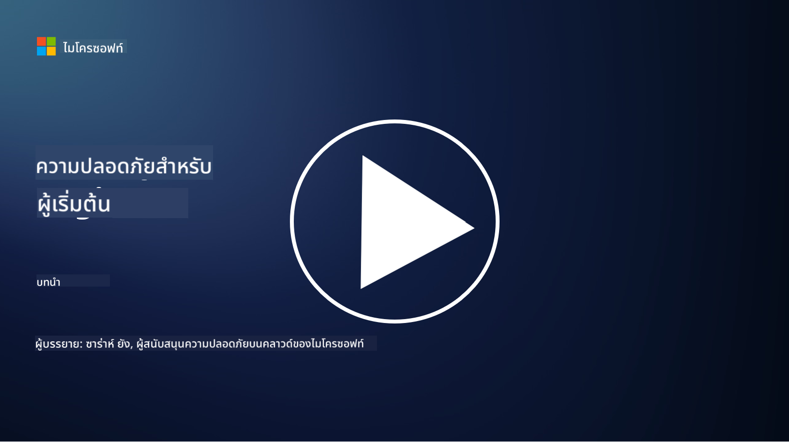

<!--
CO_OP_TRANSLATOR_METADATA:
{
  "original_hash": "33e83c2beb28a1b6e031416624dc23aa",
  "translation_date": "2025-10-11T10:57:20+00:00",
  "source_file": "README.md",
  "language_code": "th"
}
-->
  
  
  
  
  
  

### 🌐 การสนับสนุนหลายภาษา  

#### รองรับผ่าน GitHub Action (อัตโนมัติและอัปเดตเสมอ)  

<!-- CO-OP TRANSLATOR LANGUAGES TABLE START -->  
[Arabic](../ar/README.md) | [Bengali](../bn/README.md) | [Bulgarian](../bg/README.md) | [Burmese (Myanmar)](../my/README.md) | [Chinese (Simplified)](../zh/README.md) | [Chinese (Traditional, Hong Kong)](../hk/README.md) | [Chinese (Traditional, Macau)](../mo/README.md) | [Chinese (Traditional, Taiwan)](../tw/README.md) | [Croatian](../hr/README.md) | [Czech](../cs/README.md) | [Danish](../da/README.md) | [Dutch](../nl/README.md) | [Estonian](../et/README.md) | [Finnish](../fi/README.md) | [French](../fr/README.md) | [German](../de/README.md) | [Greek](../el/README.md) | [Hebrew](../he/README.md) | [Hindi](../hi/README.md) | [Hungarian](../hu/README.md) | [Indonesian](../id/README.md) | [Italian](../it/README.md) | [Japanese](../ja/README.md) | [Korean](../ko/README.md) | [Lithuanian](../lt/README.md) | [Malay](../ms/README.md) | [Marathi](../mr/README.md) | [Nepali](../ne/README.md) | [Norwegian](../no/README.md) | [Persian (Farsi)](../fa/README.md) | [Polish](../pl/README.md) | [Portuguese (Brazil)](../br/README.md) | [Portuguese (Portugal)](../pt/README.md) | [Punjabi (Gurmukhi)](../pa/README.md) | [Romanian](../ro/README.md) | [Russian](../ru/README.md) | [Serbian (Cyrillic)](../sr/README.md) | [Slovak](../sk/README.md) | [Slovenian](../sl/README.md) | [Spanish](../es/README.md) | [Swahili](../sw/README.md) | [Swedish](../sv/README.md) | [Tagalog (Filipino)](../tl/README.md) | [Tamil](../ta/README.md) | [Thai](./README.md) | [Turkish](../tr/README.md) | [Ukrainian](../uk/README.md) | [Urdu](../ur/README.md) | [Vietnamese](../vi/README.md)  
<!-- CO-OP TRANSLATOR LANGUAGES TABLE END -->  

**หากคุณต้องการให้มีการสนับสนุนภาษาเพิ่มเติม รายการภาษาที่รองรับสามารถดูได้ [ที่นี่](https://github.com/Azure/co-op-translator/blob/main/getting_started/supported-languages.md)**  

#### เข้าร่วมชุมชนของเรา  
  

# 🚀 ความปลอดภัยทางไซเบอร์สำหรับผู้เริ่มต้น – หลักสูตร  

ในยุคที่เทคโนโลยี AI กำลังเปลี่ยนแปลงอย่างรวดเร็ว การเข้าใจวิธีการรักษาความปลอดภัยของระบบ IT เป็นสิ่งสำคัญยิ่ง หลักสูตรนี้ออกแบบมาเพื่อสอนแนวคิดพื้นฐานเกี่ยวกับความปลอดภัยทางไซเบอร์ เพื่อเริ่มต้นการเรียนรู้ด้านความปลอดภัยของคุณ หลักสูตรนี้ไม่ขึ้นอยู่กับผู้ให้บริการใด ๆ และแบ่งออกเป็นบทเรียนสั้น ๆ ที่ใช้เวลาประมาณ 30-60 นาทีในการเรียนจบ แต่ละบทเรียนมีแบบทดสอบสั้น ๆ และลิงก์สำหรับการอ่านเพิ่มเติมหากคุณต้องการเจาะลึกในหัวข้อนั้น  

  

สิ่งที่หลักสูตรนี้ครอบคลุม 📚  

- 🔐 แนวคิดพื้นฐานเกี่ยวกับความปลอดภัยทางไซเบอร์ เช่น CIA triad ความแตกต่างระหว่างความเสี่ยงและภัยคุกคาม เป็นต้น  
- 🛡️ การทำความเข้าใจว่า Security Control คืออะไรและมีรูปแบบอย่างไร  
- 🌐 การทำความเข้าใจว่า Zero Trust คืออะไรและเหตุใดจึงสำคัญในความปลอดภัยทางไซเบอร์ยุคใหม่  
- 🔑 การทำความเข้าใจแนวคิดและธีมสำคัญในด้านตัวตน เครือข่าย การดำเนินงานด้านความปลอดภัย โครงสร้างพื้นฐาน และความปลอดภัยของข้อมูล  
- 🔧 ตัวอย่างเครื่องมือที่ใช้ในการดำเนินการ Security Control  

สิ่งที่หลักสูตรนี้ไม่ได้ครอบคลุม 🙅‍♂️  

- 🚫 วิธีการใช้เครื่องมือความปลอดภัยเฉพาะ  
- 🚫 วิธีการ "แฮก" หรือการทำ Red Teaming/Offensive Security  
- 🚫 การเรียนรู้เกี่ยวกับมาตรฐานการปฏิบัติตามข้อกำหนดเฉพาะ  

  

เมื่อคุณเรียนจบหลักสูตรนี้ คุณสามารถต่อยอดการเรียนรู้ของคุณด้วยโมดูล Microsoft Learn ของเรา เราแนะนำให้คุณเรียนรู้เพิ่มเติมกับ [Microsoft Security, Compliance, and Identity Fundamentals.](https://learn.microsoft.com/training/paths/describe-concepts-of-security-compliance-identity/?WT.mc_id=academic-96948-sayoung)  

ในที่สุด คุณอาจพิจารณาสอบ [Exam SC-900: Microsoft Security, Compliance, and Identity Fundamentals exam.](https://learn.microsoft.com/credentials/certifications/exams/sc-900/?WT.mc_id=academic-96948-sayoung)  

> 💁 หากคุณมีความคิดเห็นหรือข้อเสนอแนะเกี่ยวกับหลักสูตรนี้ หรือเนื้อหาที่เรายังขาด เรายินดีรับฟังจากคุณ!  

## ภาพรวมของโมดูล 📝  
| **หมายเลขโมดูล** | **ชื่อโมดูล**                           | **แนวคิดที่สอน**                  | **วัตถุประสงค์การเรียนรู้**                                                                                          |  
|-------------------|-------------------------------------------|--------------------------------------|-----------------------------------------------------------------------------------------------------------------|  
| **1.1**           | แนวคิดพื้นฐานด้านความปลอดภัย                   | [The CIA triad](https://github.com/microsoft/Security-101/blob/main/1.1%20The%20CIA%20triad%20and%20other%20key%20concepts.md)                        | เรียนรู้เกี่ยวกับความลับ ความพร้อมใช้งาน และความสมบูรณ์ รวมถึงความถูกต้อง การปฏิเสธไม่ได้ และความเป็นส่วนตัว |  
| **1.2**           | แนวคิดพื้นฐานด้านความปลอดภัย                   | [Common cyber security threats](https://github.com/microsoft/Security-101/blob/main/1.2%20Common%20cybersecurity%20threats.md)        | เรียนรู้เกี่ยวกับภัยคุกคามทางไซเบอร์ทั่วไปที่บุคคลและองค์กรต้องเผชิญ |  
| **1.3**           | แนวคิดพื้นฐานด้านความปลอดภัย                   | [Understanding risk management](https://github.com/microsoft/Security-101/blob/main/1.3%20Understanding%20risk%20management.md)       | เรียนรู้เกี่ยวกับการประเมินและทำความเข้าใจความเสี่ยง – ผลกระทบ/ความน่าจะเป็น และการดำเนินการควบคุม |  
| **1.4**           | แนวคิดพื้นฐานด้านความปลอดภัย                   | [Security practices and documentation](https://github.com/microsoft/Security-101/blob/main/1.4%20Security%20practices%20and%20documentation.md) | เรียนรู้เกี่ยวกับความแตกต่างระหว่างนโยบาย ขั้นตอน มาตรฐาน และกฎระเบียบ/กฎหมาย |  
| **1.5**           | แนวคิดพื้นฐานด้านความปลอดภัย                   | [Zero trust](https://github.com/microsoft/Security-101/blob/main/1.5%20Zero%20trust.md)                           | เรียนรู้เกี่ยวกับ Zero Trust คืออะไร และส่งผลต่อสถาปัตยกรรมอย่างไร? Defense in Depth คืออะไร? |  
| **1.6**           | แนวคิดพื้นฐานด้านความปลอดภัย                   | [The shared responsibility model](https://github.com/microsoft/Security-101/blob/main/1.6%20Shared%20responsibility%20model.md)                           | Shared Responsibility Model คืออะไร และส่งผลต่อความปลอดภัยทางไซเบอร์อย่างไร? |  
| **1.7**           | [แบบทดสอบท้ายโมดูล](https://github.com/microsoft/Security-101/blob/main/1.7%20End%20of%20module%20quiz.md)                        |                                      |                                                                                                                 |  
| **2.1**           | พื้นฐานการจัดการตัวตนและการเข้าถึง | [IAM key concepts](https://github.com/microsoft/Security-101/blob/main/2.1%20IAM%20key%20concepts.md)                     | เรียนรู้เกี่ยวกับหลักการของ Least Privilege การแยกหน้าที่ และวิธีที่ IAM สนับสนุน Zero Trust |  
| **2.2**           | พื้นฐานการจัดการตัวตนและการเข้าถึง | [IAM zero trust architecture](https://github.com/microsoft/Security-101/blob/main/2.2%20IAM%20zero%20trust%20architecture.md)          | เรียนรู้เกี่ยวกับวิธีที่ตัวตนกลายเป็นขอบเขตใหม่สำหรับสภาพแวดล้อม IT สมัยใหม่ และภัยคุกคามที่สามารถลดลงได้ |  
| **2.3**           | พื้นฐานการจัดการตัวตนและการเข้าถึง | [IAM capabilities](https://github.com/microsoft/Security-101/blob/main/2.3%20IAM%20capabilities.md)                     | เรียนรู้เกี่ยวกับความสามารถและการควบคุม IAM เพื่อรักษาความปลอดภัยของตัวตน |  
| **2.4**           | [แบบทดสอบท้ายโมดูล](https://github.com/microsoft/Security-101/blob/main/2.4%20End%20of%20module%20quiz.md)                        |                                      |                                                                                                                 |  
| **3.1**           | พื้นฐานความปลอดภัยเครือข่าย             | [Networking key concepts](https://github.com/microsoft/Security-101/blob/main/3.1%20Networking%20key%20concepts.md)              | เรียนรู้เกี่ยวกับแนวคิดเครือข่าย (การกำหนด IP หมายเลขพอร์ต การเข้ารหัส เป็นต้น) |  
| **3.2**           | พื้นฐานความปลอดภัยเครือข่าย             | [Networking zero trust architecture](https://github.com/microsoft/Security-101/blob/main/3.2%20Networking%20zero%20trust%20architecture.md)   | เรียนรู้เกี่ยวกับวิธีที่เครือข่ายมีส่วนช่วยในสถาปัตยกรรม ZT แบบ E2E และภัยคุกคามที่สามารถลดลงได้ |  
| **3.3**           | พื้นฐานความปลอดภัยเครือข่าย             | [Network security capabilities](https://github.com/microsoft/Security-101/blob/main/3.3%20Network%20security%20capabilities.md)        | เรียนรู้เกี่ยวกับเครื่องมือความปลอดภัยเครือข่าย – ไฟร์วอลล์ WAF การป้องกัน DDoS เป็นต้น |  
| **3.4**           | [แบบทดสอบท้ายโมดูล](https://github.com/microsoft/Security-101/blob/main/3.4%20End%20of%20module%20quiz.md)                        |                                      |                                                                                                                 |  
| **4.1**           | พื้นฐานการดำเนินงานด้านความปลอดภัย          | [SecOps key concepts](https://github.com/microsoft/Security-101/blob/main/4.1%20SecOps%20key%20concepts.md)                  | เรียนรู้เกี่ยวกับเหตุผลที่การดำเนินงานด้านความปลอดภัยมีความสำคัญ และแตกต่างจากทีม IT Ops ทั่วไปอย่างไร |  
| **4.2**           | พื้นฐานการดำเนินงานด้านความปลอดภัย          | [SecOps zero trust architecture](https://github.com/microsoft/Security-101/blob/main/4.2%20SecOps%20zero%20trust%20architecture.md)       | เรียนรู้เกี่ยวกับวิธีที่ SecOps มีส่วนช่วยในสถาปัตยกรรม ZT แบบ E2E และภัยคุกคามที่สามารถลดลงได้ |  
| **4.3**           | พื้นฐานการดำเนินงานด้านความปลอดภัย          | [SecOps capabilities](https://github.com/microsoft/Security-101/blob/main/4.3%20SecOps%20capabilities.md)                  | เรียนรู้เกี่ยวกับเครื่องมือ SecOps – SIEM, XDR เป็นต้น |  
| **4.4**           | [แบบทดสอบท้ายโมดูล](https://github.com/microsoft/Security-101/blob/main/4.4%20End%20of%20module%20quiz.md)                        |                                      |                                                                                                                 |  
| **5.1**           | พื้นฐานความปลอดภัยแอปพลิเคชัน         | [AppSec key concepts](https://github.com/microsoft/Security-101/blob/main/5.1%20AppSec%20key%20concepts.md)                  | เรียนรู้เกี่ยวกับแนวคิด AppSec เช่น การออกแบบที่ปลอดภัย การตรวจสอบข้อมูลที่ป้อน เป็นต้น |  
| **5.2**           | พื้นฐานความปลอดภัยของแอปพลิเคชัน         | [ความสามารถของ AppSec](https://github.com/microsoft/Security-101/blob/main/5.2%20AppSec%20key%20capabilities.md)                  | เรียนรู้เกี่ยวกับเครื่องมือ AppSec: เครื่องมือรักษาความปลอดภัยใน pipeline, การสแกนโค้ด, การสแกนความลับ เป็นต้น                       |
| **5.3**           | [แบบทดสอบท้ายบท](https://github.com/microsoft/Security-101/blob/main/5.3%20End%20of%20module%20quiz.md)                        |                                      |                                                                                                                 |
| **6.1**           | พื้นฐานความปลอดภัยของโครงสร้างพื้นฐาน      | [แนวคิดสำคัญด้านความปลอดภัยของโครงสร้างพื้นฐาน](https://github.com/microsoft/Security-101/blob/main/6.1%20Infrastructure%20security%20key%20concepts.md) | เรียนรู้เกี่ยวกับการเพิ่มความปลอดภัยให้ระบบ, การอัปเดตแพตช์, สุขอนามัยด้านความปลอดภัย, ความปลอดภัยของคอนเทนเนอร์                                  |
| **6.2**           | พื้นฐานความปลอดภัยของโครงสร้างพื้นฐาน      | [ความสามารถด้านความปลอดภัยของโครงสร้างพื้นฐาน](https://github.com/microsoft/Security-101/blob/main/6.2%20Infrastructure%20security%20capabilities.md) | เรียนรู้เกี่ยวกับเครื่องมือที่ช่วยในด้านความปลอดภัยของโครงสร้างพื้นฐาน เช่น CSPM, ความปลอดภัยของคอนเทนเนอร์ เป็นต้น            |
| **6.3**           | [แบบทดสอบท้ายบท](https://github.com/microsoft/Security-101/blob/main/6.3%20End%20of%20module%20quiz.md)                        |                                      |                                                                                                                 |
| **7.1**           | พื้นฐานความปลอดภัยของข้อมูล                | [แนวคิดสำคัญด้านความปลอดภัยของข้อมูล](https://github.com/microsoft/Security-101/blob/main/7.1%20Data%20security%20key%20concepts.md)           | เรียนรู้เกี่ยวกับการจัดประเภทข้อมูลและการเก็บรักษาข้อมูล และเหตุผลที่สิ่งนี้สำคัญต่อองค์กร                     |
| **7.2**           | พื้นฐานความปลอดภัยของข้อมูล                | [ความสามารถด้านความปลอดภัยของข้อมูล](https://github.com/microsoft/Security-101/blob/main/7.2%20Data%20security%20capabilities.md)           | เรียนรู้เกี่ยวกับเครื่องมือด้านความปลอดภัยของข้อมูล – DLP, การจัดการความเสี่ยงภายใน, การกำกับดูแลข้อมูล เป็นต้น                          |
| **7.3**           | [แบบทดสอบท้ายบท](https://github.com/microsoft/Security-101/blob/main/7.3%20End%20of%20module%20quiz.md)                        |
| **8.1**           | พื้นฐานความปลอดภัยของ AI                | [แนวคิดสำคัญด้านความปลอดภัยของ AI](https://github.com/microsoft/Security-101/blob/main/8.1%20AI%20security%20key%20concepts.md)          | เรียนรู้เกี่ยวกับความแตกต่างและความคล้ายคลึงระหว่างความปลอดภัยแบบดั้งเดิมและความปลอดภัยของ AI                 |
| **8.2**           | พื้นฐานความปลอดภัยของ AI                | [ความสามารถด้านความปลอดภัยของ AI](https://github.com/microsoft/Security-101/blob/main/8.2%20AI%20security%20capabilities.md)           | เรียนรู้เกี่ยวกับเครื่องมือด้านความปลอดภัยของ AI และการควบคุมที่สามารถใช้เพื่อรักษาความปลอดภัยของ AI                         |
| **8.3**           | พื้นฐานความปลอดภัยของ AI                | [AI ที่มีความรับผิดชอบ](https://github.com/microsoft/Security-101/blob/main/8.3%20Responsible%20AI.md)          | เรียนรู้เกี่ยวกับ AI ที่มีความรับผิดชอบและอันตรายเฉพาะของ AI ที่ผู้เชี่ยวชาญด้านความปลอดภัยต้องตระหนักถึง                          |
| **8.4**           | [แบบทดสอบท้ายบท](https://github.com/microsoft/Security-101/blob/main/8.4%20End%20of%20module%20quiz.md)     

## 🎒 หลักสูตรอื่น ๆ 

ทีมของเราผลิตหลักสูตรอื่น ๆ ด้วย! ลองดู:

- [Generative AI สำหรับผู้เริ่มต้น](https://aka.ms/genai-beginners)
- [Generative AI สำหรับผู้เริ่มต้น .NET](https://github.com/microsoft/Generative-AI-for-beginners-dotnet)
- [Generative AI ด้วย JavaScript](https://github.com/microsoft/generative-ai-with-javascript)
- [Generative AI ด้วย Java](https://github.com/microsoft/Generative-AI-for-beginners-java)
- [AI สำหรับผู้เริ่มต้น](https://aka.ms/ai-beginners)
- [Data Science สำหรับผู้เริ่มต้น](https://aka.ms/datascience-beginners)
- [ML สำหรับผู้เริ่มต้น](https://aka.ms/ml-beginners)
- [Cybersecurity สำหรับผู้เริ่มต้น](https://github.com/microsoft/Security-101) 
- [Web Dev สำหรับผู้เริ่มต้น](https://aka.ms/webdev-beginners)
- [IoT สำหรับผู้เริ่มต้น](https://aka.ms/iot-beginners)
- [XR Development สำหรับผู้เริ่มต้น](https://github.com/microsoft/xr-development-for-beginners)
- [การใช้งาน GitHub Copilot สำหรับการเขียนโปรแกรมแบบคู่](https://github.com/microsoft/Mastering-GitHub-Copilot-for-Paired-Programming)
- [การใช้งาน GitHub Copilot สำหรับนักพัฒนา C#/.NET](https://github.com/microsoft/mastering-github-copilot-for-dotnet-csharp-developers)
- [เลือกการผจญภัย Copilot ของคุณเอง](https://github.com/microsoft/CopilotAdventures)

---

**ข้อจำกัดความรับผิดชอบ**:  
เอกสารนี้ได้รับการแปลโดยใช้บริการแปลภาษา AI [Co-op Translator](https://github.com/Azure/co-op-translator) แม้ว่าเราจะพยายามให้การแปลมีความถูกต้องมากที่สุด แต่โปรดทราบว่าการแปลอัตโนมัติอาจมีข้อผิดพลาดหรือความไม่ถูกต้อง เอกสารต้นฉบับในภาษาดั้งเดิมควรถือเป็นแหล่งข้อมูลที่เชื่อถือได้ สำหรับข้อมูลที่สำคัญ ขอแนะนำให้ใช้บริการแปลภาษามืออาชีพ เราไม่รับผิดชอบต่อความเข้าใจผิดหรือการตีความผิดที่เกิดจากการใช้การแปลนี้