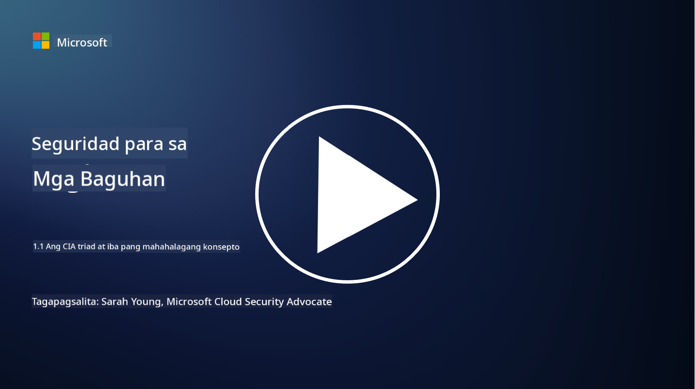
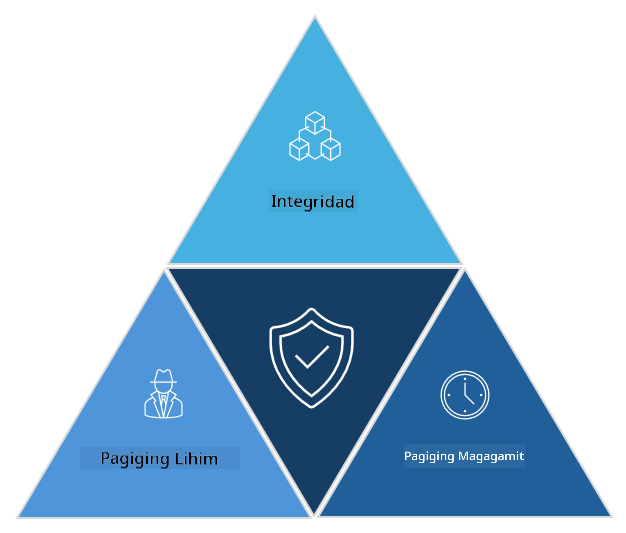

<!--
CO_OP_TRANSLATOR_METADATA:
{
  "original_hash": "16a76f9fa372fb63cffb6d76b855f023",
  "translation_date": "2025-09-04T01:11:24+00:00",
  "source_file": "1.1 The CIA triad and other key concepts.md",
  "language_code": "tl"
}
-->
# Ang CIA Triad at Iba Pang Mahahalagang Konsepto

## Panimula

Sa araling ito, tatalakayin natin ang:

 - Ano ang cybersecurity?
   
 - Ano ang cybersecurity CIA triad?

 - Ano ang authenticity, nonrepudiation, at privacy sa konteksto ng cybersecurity?

## Ano ang cybersecurity?

Ang cybersecurity, na kilala rin bilang information security, ay ang pagsasanay ng pagprotekta sa mga computer system, network, device, at data mula sa mga digital na pag-atake, hindi awtorisadong pag-access, pinsala, o pagnanakaw. Ang pangunahing layunin ng cybersecurity ay tiyakin ang pagiging kumpidensyal, integridad, at pagkakaroon ng mga digital na ari-arian at impormasyon. Ang mga propesyonal sa cybersecurity ay nagdidisenyo at nagpapatupad ng mga kontrol sa seguridad upang maprotektahan ang mga ari-arian, data, at impormasyon. Habang mas nagiging digital at online ang ating mga buhay, ang cybersecurity ay naging pangunahing alalahanin para sa parehong mga indibidwal at organisasyon.

## Ano ang cybersecurity CIA triad?

Ang cybersecurity triad ay tumutukoy sa modelo na sumasaklaw sa tatlong pangunahing konsiderasyon para sa anumang gawain sa cybersecurity o pagdidisenyo ng isang sistema/kapaligiran:

### Kumpidensyalidad (Confidentiality)

Ito ang konsiderasyon na madalas naiisip ng karamihan kapag naririnig ang "cybersecurity": ang kumpidensyalidad ay ang proseso ng pagprotekta sa data at impormasyon mula sa mga hindi awtorisadong pagtatangkang pag-access, ibig sabihin, tanging ang mga taong kailangang makakita ng impormasyon ang may kakayahang ma-access ito. Gayunpaman, hindi lahat ng data ay pantay-pantay, at karaniwang inuuri at pinoprotektahan ang data batay sa kung gaano kalaki ang pinsala kung ito ay ma-access ng maling tao.

### Integridad (Integrity)

Tumutukoy ito sa pagprotekta sa katumpakan at pagiging mapagkakatiwalaan ng data sa loob ng mga kapaligiran at hindi pinapayagan ang data na mabago o ma-edit ng mga hindi awtorisadong indibidwal. Halimbawa, isang estudyante ang nagbabago ng kanyang petsa ng kapanganakan sa talaan ng DMV upang magmukhang mas matanda at makakuha ng lisensya na may mas maagang petsa ng kapanganakan para makabili ng alak.

### Pagkakaroon (Availability)

Ito ay isang konsiderasyon sa kabuuang operasyon ng IT, ngunit mahalaga rin ang availability para sa cybersecurity. May mga partikular na uri ng pag-atake na tumutukoy sa availability na kailangang protektahan ng mga propesyonal sa seguridad (hal. distributed denial of service – DDoS – attacks).

**Cybersecurity CIA Triad**

## Ano ang authenticity, nonrepudiation, at privacy sa konteksto ng cybersecurity?

Ito ay mga karagdagang mahalagang konsepto na may kaugnayan sa pagtiyak ng seguridad at pagiging mapagkakatiwalaan ng mga sistema at data:

**Authenticity** - tumutukoy sa katiyakan na ang impormasyon, komunikasyon, o entidad na iyong kinakaharap ay tunay at hindi nabago o na-tamper ng mga hindi awtorisadong partido.

**Nonrepudiation** - ay ang konsepto ng pagtiyak na ang isang partido ay hindi maaaring itanggi ang kanilang pakikilahok o ang pagiging tunay ng isang transaksyon o komunikasyon. Pinipigilan nito ang isang tao na magsabing hindi nila ipinadala ang isang mensahe o ginawa ang isang partikular na aksyon kapag may ebidensyang kabaligtaran.

**Privacy** - tumutukoy sa pagprotekta ng sensitibo at personal na makikilalang impormasyon mula sa hindi awtorisadong pag-access, paggamit, pagbubunyag, o pagmamanipula. Kasama rito ang pagkontrol kung sino ang may access sa personal na data at kung paano kinokolekta, iniimbak, at ibinabahagi ang data na iyon.

## Karagdagang Pagbabasa

[What Is Information Security (InfoSec)? | Microsoft Security](https://www.microsoft.com/security/business/security-101/what-is-information-security-infosec#:~:text=Three%20pillars%20of%20information%20security%3A%20the%20CIA%20triad,as%20guiding%20principles%20for%20implementing%20an%20InfoSec%20plan.)

---

**Paunawa**:  
Ang dokumentong ito ay isinalin gamit ang AI translation service na [Co-op Translator](https://github.com/Azure/co-op-translator). Bagama't sinisikap naming maging tumpak, pakitandaan na ang mga awtomatikong pagsasalin ay maaaring maglaman ng mga pagkakamali o hindi pagkakatugma. Ang orihinal na dokumento sa orihinal nitong wika ang dapat ituring na opisyal na sanggunian. Para sa mahalagang impormasyon, inirerekomenda ang propesyonal na pagsasalin ng tao. Hindi kami mananagot sa anumang hindi pagkakaunawaan o maling interpretasyon na maaaring magmula sa paggamit ng pagsasaling ito.