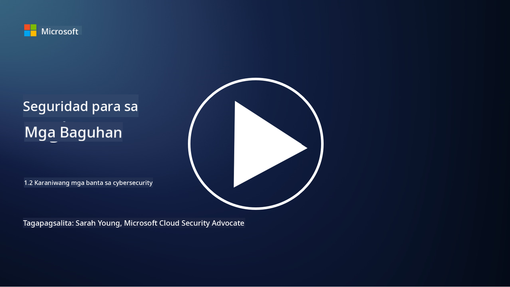

<!--
CO_OP_TRANSLATOR_METADATA:
{
  "original_hash": "6fc3030323139d7134a4ca9d03eccac9",
  "translation_date": "2025-09-03T23:27:13+00:00",
  "source_file": "1.2 Common cybersecurity threats.md",
  "language_code": "tl"
}
-->
# Mga Karaniwang Banta sa Cybersecurity

## Panimula

Sa araling ito, tatalakayin natin ang:

- Ano ang banta sa cybersecurity?

- Bakit nais ng mga malisyosong aktor na ma-kompromiso ang data at mga IT system?

- Ano ang mga pinakakaraniwang uri ng banta sa cybersecurity?

- Ano ang MITRE ATT&CK framework?

- Saan ako maaaring manatiling updated tungkol sa kalagayan ng mga banta sa cybersecurity?

## Ano ang banta sa cybersecurity?

Ang banta sa cybersecurity ay tumutukoy sa anumang potensyal na panganib o peligro na maaaring makompromiso ang pagiging kumpidensyal, integridad, o pagkakaroon ng access sa data o mga IT system. Ang mga banta na ito ay nagmumula sa mga malisyosong aktor na sinusubukang samantalahin ang mga kahinaan upang makakuha ng hindi awtorisadong access, magnakaw ng sensitibong impormasyon, guluhin ang operasyon, o magdulot ng pinsala sa mga indibidwal, organisasyon, o maging sa buong bansa. Ang mga banta sa cybersecurity ay maaaring mag-iba-iba ng anyo at targetin ang iba't ibang aspeto ng mga digital na sistema at data.

## Bakit nais ng mga malisyosong aktor na ma-kompromiso ang data at mga IT system?

Ang mga malisyosong aktor ay nagko-kompromiso ng data at mga IT system para sa iba't ibang dahilan, kadalasan ay hinihimok ng personal na pakinabang, ideolohikal na motibo, o kagustuhang magdulot ng kaguluhan. Ang pag-unawa sa mga motibong ito ay makakatulong sa mga organisasyon at indibidwal na mas mahusay na ipagtanggol ang kanilang sarili laban sa mga banta sa cyber. Ilan sa mga karaniwang dahilan kung bakit isinasagawa ng mga malisyosong aktor ang mga cyberattack ay:

1. **Pampinansyal na Pakinabang**: Maraming pag-atake ang hinihimok ng kagustuhang kumita ng pera. Ang mga malisyosong aktor ay maaaring magnakaw ng sensitibong impormasyon tulad ng mga numero ng credit card, detalye ng bank account, o personal na impormasyon upang magsagawa ng pandaraya, pagnanakaw ng pagkakakilanlan, mangikil, o ibenta ang ninakaw na data sa dark web.

2. **Espionage**: Ang mga bansa, kakumpitensya, o iba pang entidad ay maaaring magsagawa ng cyber espionage upang magnakaw ng sensitibong datos mula sa gobyerno, korporasyon, o pananaliksik para sa pampulitika, pang-ekonomiya, o pangmilitar na kalamangan.

3. **Panggugulo at Sabotahe**: Ang ilang pag-atake ay naglalayong guluhin ang mga kritikal na imprastruktura, serbisyo, o operasyon para sa pampulitika o ideolohikal na dahilan. Ang mga pag-atakeng ito ay maaaring magdulot ng malawakang kaguluhan, pagkawala ng pera, at pinsala sa reputasyon.

4. **Ideolohikal na Motibasyon**: Ang mga hacktivist at mga grupong may ideolohikal o pampulitikang layunin ay maaaring mag-kompromiso ng mga sistema upang magbigay ng kamalayan tungkol sa ilang isyu, itaguyod ang kanilang paniniwala, o magprotesta laban sa mga partikular na aksyon o organisasyon.

5. **Hindi Sinasadyang Aksyon**: Hindi lahat ng malisyosong aksyon ay sinasadya; ang ilang indibidwal ay maaaring hindi sinasadyang mag-ambag sa mga banta sa cyber sa pamamagitan ng pagiging biktima ng social engineering o pagiging bahagi ng isang compromised na network.

Sa huli, ang mga motibo para sa pag-kompromiso ng data at mga IT system ay maaaring mag-iba-iba, at ang epekto ng mga pag-atakeng ito ay maaaring maging malubha. Mahalagang seryosohin ng mga indibidwal, organisasyon, at gobyerno ang cybersecurity at magpatupad ng mga hakbang upang maprotektahan laban sa mga banta na ito.

## Ano ang mga pinakakaraniwang uri ng banta sa cybersecurity?

Mayroong ilang karaniwang uri ng mga cyberattack na ginagamit ng mga malisyosong aktor upang ma-kompromiso ang mga sistema, magnakaw ng data, at magdulot ng kaguluhan. Narito ang ilan sa mga pinakapangkaraniwan sa panahon ng pagsulat nito:

1. **Phishing**:

Ang phishing ay kinabibilangan ng pagpapadala ng mapanlinlang na mga email o mensahe na mukhang mula sa mga lehitimong pinagmulan upang linlangin ang mga tatanggap na ibunyag ang sensitibong impormasyon, tulad ng mga password, numero ng credit card, o personal na detalye. Ang phishing ay maaari ring magdala ng mga biktima sa mga malisyosong website o mag-download ng malware.

2. **Malware**:

Ang malware (malicious software) ay sumasaklaw sa iba't ibang uri ng mapanirang programa na idinisenyo upang ma-infect ang mga sistema, magnakaw ng data, o magdulot ng pinsala. Kasama sa mga uri ng malware ang:

- **Ransomware**: Ini-encrypt ang mga file at humihingi ng ransom para sa decryption.

- **Trojans**: Nagpapanggap bilang lehitimong software, nagbibigay ito ng hindi awtorisadong access sa mga attacker.

- **Viruses**: Mga self-replicating na programa na kumakabit sa mga file at kumakalat.

- **Worms**: Mga self-replicating na programa na kumakalat sa mga network.

3. **Denial of Service (DoS) at Distributed Denial of Service (DDoS)**:

Ang mga DoS attack ay nag-o-overload sa target na sistema, na nagiging sanhi ng hindi ito magamit ng mga user. Ang mga DDoS attack ay gumagamit ng network ng mga compromised na device upang bombahin ang target ng trapiko, na nagpapahirap sa sistema na gumana nang maayos o maaaring tuluyang huminto.

4. **SQL Injection**:

Sa pag-atakeng ito, ang mga attacker ay nagma-manipula ng mga input field ng web application upang mag-inject ng malisyosong SQL queries, na posibleng magbigay ng hindi awtorisadong access sa mga database at sensitibong data.

5. **Cross-Site Scripting (XSS)**:

Ang mga attacker ay nag-i-inject ng malisyosong script sa mga web application, na pagkatapos ay isinasagawa ng mga browser ng mga walang kamalay-malay na user. Maaari itong magdulot ng pagnanakaw ng data ng user at/o pagkalat ng malware.

6. **Social Engineering**:

Ang social engineering ay gumagamit ng sikolohiya ng tao upang manipulahin ang mga indibidwal na ibunyag ang kumpidensyal na impormasyon o magsagawa ng mga aksyon na nagko-kompromiso sa seguridad.

7. **Zero-Day (0day) Exploits**:

Ang mga pag-atakeng ito ay tina-target ang mga kahinaan sa software o hardware na hindi pa nalalaman ng vendor o publiko. Sinusamantala ng mga attacker ang mga kahinaang ito bago pa makagawa ng mga patch. Maraming organisasyon ang nangangamba sa zero-days dahil walang patch para dito, ngunit hindi ito kasing karaniwan ng iba pang pag-atake sa listahang ito. Kapag natuklasan ang isang zero-day, mabilis na gumagawa ng patch ang mga security researcher kaya't karaniwang maikli ang buhay ng mga zero-day.

8. **Credential Attacks**:

Kasama sa mga pag-atakeng ito ang brute force attacks, kung saan paulit-ulit na hinuhulaan ng mga attacker ang mga password, at credential stuffing attacks, kung saan ginagamit ang mga ninakaw na kredensyal mula sa isang site upang subukang makapasok sa iba pang mga site.

## Ano ang MITRE ATT&CK framework?

Ang [MITRE ATT&CK framework](https://attack.mitre.org/) (Adversarial Tactics, Techniques, and Common Knowledge) ay isang framework na nagka-catalog at nagka-categorize ng mga taktika, teknika, at pamamaraan (TTPs) na ginagamit ng mga kalaban sa panahon ng mga cyberattack. Ang framework na ito ay nilikha ng MITRE Corporation, isang non-profit na organisasyon na nagpapatakbo ng mga research at development center para sa iba't ibang ahensya ng gobyerno.

Ang MITRE ATT&CK framework ay nagbibigay ng isang standardized na paraan upang ilarawan at suriin ang mga banta sa cyber, na nagpapahintulot sa mga propesyonal sa cybersecurity na mas maunawaan at maipagtanggol ang kanilang sarili laban sa iba't ibang teknika ng pag-atake. Malawak itong ginagamit ng mga security team, threat hunters, at incident responders upang:

1. **Maunawaan ang Pag-uugali ng Kalaban**: Ang framework ay nagdodokumento ng mga aktwal na pag-uugali ng pag-atake, na naglalarawan ng mga hakbang na ginagawa ng mga attacker mula sa unang pagpasok hanggang sa pagkamit ng kanilang mga layunin. Sinasaklaw nito ang malawak na hanay ng mga teknika ng pag-atake na ginagamit ng iba't ibang grupo ng banta.

2. **Magplano at Magpatupad ng Mga Estratehiya sa Depensa**: Maaaring gamitin ng mga security team ang framework upang bumuo ng mga proaktibong estratehiya sa depensa na naaayon sa mga partikular na taktika at teknika na maaaring gamitin ng mga kalaban.

3. **Incident Response at Threat Hunting**: Kapag nagsisiyasat ng mga insidente o nagsasagawa ng threat hunting, maaaring sumangguni ang mga propesyonal sa seguridad sa framework upang matukoy at maibsan ang mga partikular na teknika na ginamit ng mga attacker.

Ang MITRE ATT&CK framework ay nakaayos sa mga matrix na naggugrupo ng mga teknika ng pag-atake batay sa mga partikular na platform at kapaligiran, tulad ng Windows, macOS, Linux, at mga cloud service. Ang bawat matrix ay nahahati sa mga taktika (mga layunin sa mataas na antas) at mga teknika (mga partikular na pamamaraan na ginagamit upang makamit ang mga layuning iyon). Para sa bawat teknika, nagbibigay ang framework ng impormasyon tungkol sa kung paano ito gumagana, mga posibleng mitigasyon, at mga kaugnay na sanggunian sa mga aktwal na threat actor na gumamit ng teknika.

Ang framework ay patuloy na ina-update at pinalalawak habang nakakalap ng bagong intelligence sa banta at habang nagbabago ang kalagayan ng cybersecurity. Isa itong mahalagang mapagkukunan para mapahusay ang cybersecurity posture ng isang organisasyon sa pamamagitan ng pagbibigay ng mas malalim na pag-unawa sa kung paano gumagana ang mga attacker at kung paano ipagtanggol ang sarili laban sa kanilang mga taktika.

## Saan ako maaaring manatiling updated tungkol sa kalagayan ng mga banta sa cybersecurity?

Maraming mapagkukunan na maaaring gamitin upang manatiling updated tungkol sa mga banta sa cybersecurity. Narito ang ilang mga halimbawa:

- [Open Web Application Security Project (OWASP) top 10 vulnerabilities](https://owasp.org/Top10/)
- [Common Vulnerabilities and Exposures (CVEs)](https://www.bing.com/ck/a?!&&p=53df6007f017bca2JmltdHM9MTY5MjU3NjAwMCZpZ3VpZD0zYmY4N2RiYS1jYWI1LTYwMDgtMWY1YS02ZmYyY2JjNjYxZWUmaW5zaWQ9NTc2OQ&ptn=3&hsh=3&fclid=3bf87dba-cab5-6008-1f5a-6ff2cbc661ee&psq=cve&u=a1aHR0cHM6Ly9iaW5nLmNvbS9hbGluay9saW5rP3VybD1odHRwcyUzYSUyZiUyZmN2ZS5taXRyZS5vcmclMmYmc291cmNlPXNlcnAtcnImaD1BZXN4S0VBWTNnbGhNZEFpd3daMlNSZkZQNTlrODhIUnYxRUtlSkY1RTk0JTNkJnA9a2NvZmZjaWFsd2Vic2l0ZQ&ntb=1 "Common Vulnerabilities and Exposures")
- [Microsoft Security Response Center blogs](https://msrc.microsoft.com/blog/)
- [National Institute of Standards and Technology (NIST)](https://www.dhs.gov/topics/cybersecurity): Nagbibigay ang NIST ng mga mapagkukunan, alerto, at pinakabagong update tungkol sa mga potensyal na banta sa cybersecurity.
- [Cybersecurity and Infrastructure Security Agency (CISA)](https://www.cisa.gov/resources-tools/resources/free-cybersecurity-services-and-tools): Nagbibigay ang CISA ng mga mapagkukunan sa cybersecurity at mga pinakamahusay na kasanayan para sa mga negosyo, ahensya ng gobyerno, at iba pang mga organisasyon. Nagbabahagi ang CISA ng mga up-to-date na impormasyon tungkol sa mga high-impact na uri ng aktibidad sa seguridad na nakakaapekto sa komunidad at malalim na pagsusuri sa mga bago at umuusbong na banta sa cyber.
- [National Cybersecurity Center of Excellence (NCCoE)](https://www.dhs.gov/topics/cybersecurity): Ang NCCoE ay isang hub na nagbibigay ng mga praktikal na solusyon sa cybersecurity na maaaring ilapat sa mga totoong sitwasyon.
- [US-CERT](https://www.cisa.gov/resources-tools/resources/free-cybersecurity-services-and-tools): Ang United States Computer Emergency Readiness Team (US-CERT) ay nagbibigay ng iba't ibang mapagkukunan sa cybersecurity, kabilang ang mga alerto, tips, at iba pa.
- Ang Cyber Emergency Response Team (CERT) ng iyong bansa

---

**Paunawa**:  
Ang dokumentong ito ay isinalin gamit ang AI translation service na [Co-op Translator](https://github.com/Azure/co-op-translator). Bagama't sinisikap naming maging tumpak, tandaan na ang mga awtomatikong pagsasalin ay maaaring maglaman ng mga pagkakamali o hindi pagkakatugma. Ang orihinal na dokumento sa kanyang katutubong wika ang dapat ituring na opisyal na sanggunian. Para sa mahalagang impormasyon, inirerekomenda ang propesyonal na pagsasalin ng tao. Hindi kami mananagot sa anumang hindi pagkakaunawaan o maling interpretasyon na maaaring magmula sa paggamit ng pagsasaling ito.