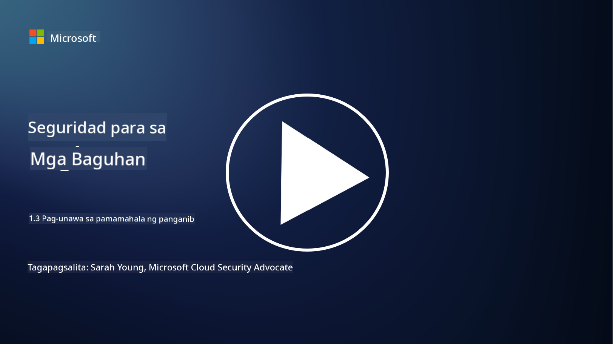
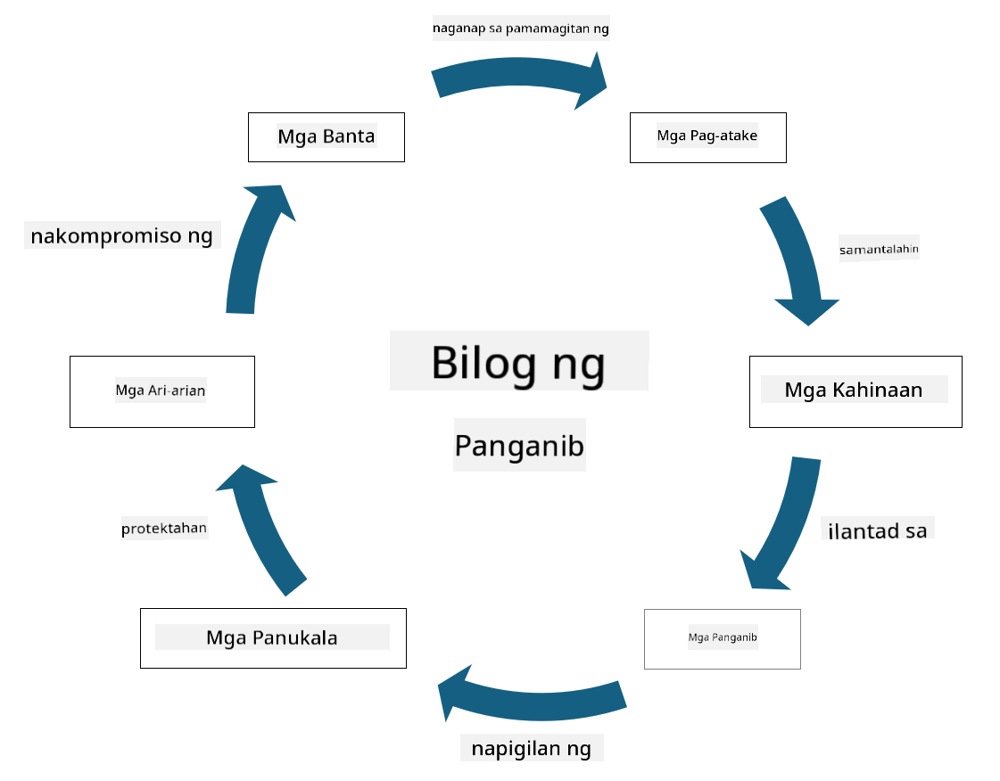

<!--
CO_OP_TRANSLATOR_METADATA:
{
  "original_hash": "fcca304f072cabf206388199e8e2e578",
  "translation_date": "2025-09-04T01:33:14+00:00",
  "source_file": "1.3 Understanding risk management.md",
  "language_code": "tl"
}
-->
# Pag-unawa sa Pamamahala ng Panganib

## Panimula

Sa araling ito, tatalakayin natin ang:

 - Mga kahulugan ng karaniwang ginagamit na terminolohiya sa seguridad
   
 - Mga uri ng kontrol sa seguridad

 - Pagtatasa ng mga panganib sa seguridad

## Mga Kahulugan ng Karaniwang Ginagamit na Terminolohiya sa Seguridad

Ang mga terminong ito ay mga pangunahing konsepto sa larangan ng cybersecurity at pamamahala ng panganib. Talakayin natin ang bawat termino at kung paano sila magkakaugnay:

1. **Threat Agent**:

Ang threat agent ay isang indibidwal, grupo, organisasyon, o awtomatikong sistema na may potensyal na samantalahin ang mga kahinaan sa isang sistema o network upang magdulot ng pinsala o sira. Ang mga threat agent ay maaaring mga hacker, may-akda ng malware, mga empleyadong may sama ng loob, o anumang entidad na nagdadala ng panganib sa mga sistema ng impormasyon at teknolohiya.

2. **Threat**:

Ang threat ay isang potensyal na pangyayari o aksyon na maaaring samantalahin ang mga kahinaan sa isang sistema at magdulot ng pinsala sa isang asset. Ang mga threat ay maaaring kabilang ang mga aksyon tulad ng hacking, data breaches, denial-of-service attacks, at iba pa. Ang mga threat ang "ano" sa konteksto ng potensyal na pinsala na maaaring idulot sa mga asset ng isang organisasyon.

3. **Vulnerability**:

Ang vulnerability ay isang kahinaan o depekto sa disenyo, implementasyon, o konfigurasyon ng isang sistema na maaaring samantalahin ng isang threat agent upang makompromiso ang seguridad ng sistema. Ang mga kahinaan ay maaaring nasa software, hardware, proseso, o pag-uugali ng tao. Ang pagtukoy at pagtugon sa mga kahinaan ay mahalaga upang mabawasan ang panganib ng matagumpay na pag-atake.

4. **Risk**:

Ang risk ay ang potensyal na pagkawala, pinsala, o sira na nagmumula sa interaksyon sa pagitan ng isang threat at isang vulnerability. Ito ang posibilidad na ang isang threat agent ay samantalahin ang isang kahinaan upang magdulot ng negatibong epekto. Ang mga panganib ay madalas na tinatasa batay sa kanilang potensyal na epekto at posibilidad ng paglitaw.

5. **Asset**:

Ang asset ay anumang bagay na may halaga na nais protektahan ng isang organisasyon. Ang mga asset ay maaaring kabilang ang mga pisikal na bagay (tulad ng mga computer at server), data (impormasyon ng customer, mga talaan sa pananalapi), intelektwal na ari-arian (mga trade secret, patent), at maging ang mga mapagkukunan ng tao (mga kasanayan at kaalaman ng mga empleyado). Ang proteksyon ng mga asset ay isang pangunahing layunin ng cybersecurity.

6. **Exposure**:

Ang exposure ay tumutukoy sa estado ng pagiging bulnerable sa mga potensyal na banta. Nangyayari ito kapag mayroong kahinaan na maaaring samantalahin ng isang threat agent. Ang exposure ay nagpapakita ng panganib na nauugnay sa pagkakaroon ng mga kahinaan sa isang sistema o network.

7. **Control**:

Ang control ay isang hakbang na inilalagay upang mabawasan ang panganib na nauugnay sa mga kahinaan at banta. Ang mga control ay maaaring teknikal, procedural, o administratibo sa kalikasan. Ang mga ito ay idinisenyo upang pigilan, tuklasin, o bawasan ang potensyal na epekto ng mga banta at kahinaan. Halimbawa nito ay ang mga firewall, access controls, encryption, mga patakaran sa seguridad, at pagsasanay ng mga empleyado.

Sa kabuuan, ang relasyon ng mga terminong ito ay ganito: Ang mga threat agent ay sinasamantala ang mga kahinaan upang isagawa ang mga banta, na maaaring magdulot ng mga panganib na may potensyal na magdulot ng pinsala sa mahahalagang asset. Ang exposure ay nangyayari kapag may mga kahinaan, at ang mga control ay inilalagay upang mabawasan ang panganib sa pamamagitan ng pagpigil o pagbawas ng epekto ng mga banta sa mga asset. Ang balangkas na ito ang bumubuo sa batayan ng pamamahala ng panganib sa cybersecurity, na gumagabay sa mga organisasyon sa pagtukoy, pagtatasa, at pagtugon sa mga potensyal na panganib sa kanilang mga sistema ng impormasyon at asset.

## Mga Uri ng Kontrol sa Seguridad

Ang mga kontrol sa seguridad ay mga hakbang o proteksyon na ipinatutupad upang maprotektahan ang mga sistema ng impormasyon at asset mula sa iba't ibang banta at kahinaan. Ang mga ito ay maaaring ikategorya batay sa kanilang pokus at layunin. Narito ang ilang karaniwang uri ng kontrol sa seguridad:

1. **Administrative Controls**:

Ang mga kontrol na ito ay nauugnay sa mga patakaran, pamamaraan, at gabay na namamahala sa mga kasanayan sa seguridad ng organisasyon at pag-uugali ng mga gumagamit.

- Mga patakaran at pamamaraan sa seguridad: Mga dokumentadong gabay na nagtatakda kung paano pinapanatili ang seguridad sa loob ng isang organisasyon.

- Kamalayan at pagsasanay sa seguridad: Mga programa upang turuan ang mga empleyado tungkol sa mga pinakamahusay na kasanayan sa seguridad at mga potensyal na banta.

- Pagtugon at pamamahala sa insidente: Mga plano para sa pagtugon at pagbawas ng epekto ng mga insidente sa seguridad.

2. **Technical Controls**:

Ang mga teknikal na kontrol ay gumagamit ng teknolohiya upang ipatupad ang mga hakbang sa seguridad at protektahan ang mga sistema at data. Halimbawa ng mga teknikal na kontrol ay:

- Access controls: Mga hakbang na naglilimita sa pag-access ng mga gumagamit sa mga mapagkukunan batay sa kanilang mga tungkulin at pahintulot.

- Encryption: Pag-convert ng data sa isang secure na format upang maiwasan ang hindi awtorisadong pag-access.

- Firewalls: Mga aparato sa seguridad ng network na nagsasala at kumokontrol sa papasok at palabas na trapiko.

- Intrusion Detection and Prevention Systems (IDPS): Mga tool na nagmo-monitor ng trapiko sa network para sa kahina-hinalang aktibidad.

- Antivirus at anti-malware software: Mga programang tumutukoy at nag-aalis ng malisyosong software.

- Authentication mechanisms: Mga paraan para sa pag-verify ng pagkakakilanlan ng mga gumagamit, tulad ng mga password, biometrics, at multi-factor authentication.

- Patch management: Regular na pag-update ng software upang matugunan ang mga kilalang kahinaan.

3. **Physical Controls**:

Ang mga pisikal na kontrol ay mga hakbang upang maprotektahan ang mga pisikal na asset at pasilidad.

- Mga security guard at tauhan sa access control: Mga tauhan na nagmo-monitor at kumokontrol sa pag-access sa mga pisikal na lugar.

- Surveillance cameras: Mga sistema ng video monitoring upang i-monitor at i-record ang mga aktibidad.

- Mga kandado at pisikal na harang: Mga pisikal na hakbang upang limitahan ang pag-access sa mga sensitibong lugar.

- Environmental controls: Mga hakbang upang i-regulate ang temperatura, halumigmig, at iba pang salik sa kapaligiran na nakakaapekto sa kagamitan at data centers.

4. **Operational Controls**:

Ang mga kontrol na ito ay nauugnay sa pang-araw-araw na operasyon at aktibidad na nagsisiguro ng patuloy na seguridad ng mga sistema.

- Change management: Mga proseso para sa pagsubaybay at pag-apruba ng mga pagbabago sa mga sistema at konfigurasyon.

- Backup at disaster recovery: Mga plano para sa pag-backup ng data at pagbawi sa kaso ng pagkabigo ng sistema o sakuna.

- Logging at auditing: Pagsubaybay at pagre-record ng mga aktibidad ng sistema para sa seguridad at pagsunod.

- Secure coding practices: Mga gabay para sa pagsusulat ng software upang mabawasan ang mga kahinaan.

5. **Legal at Regulatory Controls**:

Ang mga kontrol na ito ay nagsisiguro ng pagsunod sa mga kaugnay na batas, regulasyon, at pamantayan ng industriya. Ang mga pamantayan na kailangang sundin ng isang organisasyon ay nakadepende sa hurisdiksyon, industriya, at iba pang salik.

- Mga regulasyon sa proteksyon ng data: Pagsunod sa mga batas tulad ng GDPR, HIPAA, at CCPA.

- Mga pamantayan ng industriya: Pagsunod sa mga pamantayan tulad ng PCI DSS para sa seguridad ng data ng mga payment card.

Ang mga kategoryang ito ng kontrol sa seguridad ay nagtutulungan upang makabuo ng isang komprehensibong postura sa seguridad para sa mga organisasyon, na tumutulong na protektahan ang kanilang mga sistema, data, at asset mula sa iba't ibang banta.

## Pagtatasa ng Mga Panganib sa Seguridad

Ang ilang mga propesyonal sa seguridad ay naniniwala na ang pamamahala ng panganib ay trabaho lamang ng mga propesyonal sa panganib, ngunit mahalaga para sa sinumang propesyonal sa seguridad na maunawaan ang proseso ng pamamahala ng panganib upang maipahayag ang panganib sa seguridad sa wika na maiintindihan at magagawan ng aksyon ng buong organisasyon.

Ang mga organisasyon ay kailangang patuloy na tasahin ang mga panganib sa seguridad at magpasya kung anong aksyon (o hindi aksyon) ang gagawin laban sa mga panganib sa negosyo. Narito ang isang pangkalahatang-ideya kung paano ito karaniwang ginagawa. Tandaan na ang prosesong ito ay karaniwang isinasagawa sa iba't ibang mga koponan sa loob ng isang organisasyon; bihira na isang koponan lamang ang responsable para sa end-to-end na pamamahala ng panganib.

1. **Tukuyin ang Mga Asset at Banta**:

Tinutukoy ng organisasyon ang mga asset na nais nitong protektahan. Maaaring kabilang dito ang data, mga sistema, hardware, software, intelektwal na ari-arian, at iba pa. Susunod, tinutukoy nila ang mga potensyal na banta na maaaring tumarget sa mga asset na ito.

2. **Tasahin ang Mga Kahinaan**:

Tinutukoy ng mga organisasyon ang mga kahinaan o kahinaan sa mga sistema o proseso na maaaring samantalahin ng mga banta. Ang mga kahinaan na ito ay maaaring magmula sa mga depekto sa software, maling konfigurasyon, kakulangan ng mga kontrol sa seguridad, at pagkakamali ng tao.

3. **Pagtatasa ng Posibilidad**:

Sinusuri ng organisasyon ang posibilidad ng bawat banta na mangyari. Kasama rito ang pagsasaalang-alang sa mga makasaysayang datos, intelligence sa banta, mga uso sa industriya, at mga panloob na salik. Ang posibilidad ay maaaring ikategorya bilang mababa, katamtaman, o mataas batay sa posibilidad ng paglitaw ng banta.

4. **Pagtatasa ng Epekto**:

Susunod, tinutukoy ng organisasyon ang potensyal na epekto ng bawat banta kung ito ay sasamantalahin ang isang kahinaan. Ang epekto ay maaaring sumaklaw sa mga pagkalugi sa pananalapi, pagkaantala sa operasyon, pinsala sa reputasyon, legal na kahihinatnan, at iba pa. Ang epekto ay maaari ring ikategorya bilang mababa, katamtaman, o mataas batay sa potensyal na kahihinatnan.

5. **Kalkulasyon ng Panganib**:

Ang pagtatasa ng posibilidad at epekto ay pinagsasama upang kalkulahin ang kabuuang antas ng panganib para sa bawat natukoy na banta. Madalas itong ginagawa gamit ang isang risk matrix na nag-a-assign ng mga numerikal na halaga o deskriptor sa mga antas ng posibilidad at epekto. Ang resulta ng antas ng panganib ay tumutulong sa pag-priyoridad kung aling mga panganib ang nangangailangan ng agarang pansin.

6. **Pag-priyoridad at Paggawa ng Desisyon**:

Ang organisasyon ay magpaprayoridad ng mga panganib sa pamamagitan ng pagtutok sa mga may pinakamataas na pinagsamang halaga ng posibilidad at epekto. Pinapayagan nito silang maglaan ng mga mapagkukunan at magpatupad ng mga kontrol nang mas epektibo. Ang mga banta na may mataas na panganib ay nangangailangan ng agarang pansin, habang ang mga banta na may mababang panganib ay maaaring tugunan sa mas mahabang panahon.

7. **Paggamot sa Panganib**:

Batay sa pagtatasa ng panganib, tinutukoy ng organisasyon kung paano babawasan o pamamahalaan ang bawat panganib. Maaaring kabilang dito ang pagpapatupad ng mga kontrol sa seguridad, paglilipat ng panganib sa pamamagitan ng insurance, o pagtanggap ng ilang antas ng natitirang panganib kung ito ay itinuturing na mapangasiwaan/may mataas na gastos upang ayusin/atbp.

8. **Patuloy na Pagsubaybay at Pagsusuri**:

Ang pagtatasa ng panganib ay hindi isang beses na proseso. Dapat itong isagawa nang pana-panahon o tuwing may mga makabuluhang pagbabago sa kapaligiran ng organisasyon. Ang patuloy na pagsubaybay ay nagsisiguro na ang mga bagong banta, kahinaan, o pagbabago sa landscape ng negosyo ay isinasaalang-alang.

Sa pamamagitan ng pagtatasa ng mga panganib sa seguridad sa ganitong istrukturadong paraan, ang mga organisasyon ay makakagawa ng mga desisyong may kaalaman tungkol sa alokasyon ng mga mapagkukunan, mga kontrol sa seguridad, at mga estratehiya sa pangkalahatang pamamahala ng panganib. Ang layunin ay bawasan ang kabuuang exposure ng panganib ng organisasyon habang inaayon ang mga pagsisikap sa seguridad sa mga layunin at layunin ng negosyo ng organisasyon.

---

**Paunawa**:  
Ang dokumentong ito ay isinalin gamit ang AI translation service na [Co-op Translator](https://github.com/Azure/co-op-translator). Bagama't sinisikap naming maging tumpak, pakitandaan na ang mga awtomatikong pagsasalin ay maaaring maglaman ng mga pagkakamali o hindi pagkakatugma. Ang orihinal na dokumento sa orihinal nitong wika ang dapat ituring na opisyal na sanggunian. Para sa mahalagang impormasyon, inirerekomenda ang propesyonal na pagsasalin ng tao. Hindi kami mananagot sa anumang hindi pagkakaunawaan o maling interpretasyon na dulot ng paggamit ng pagsasaling ito.