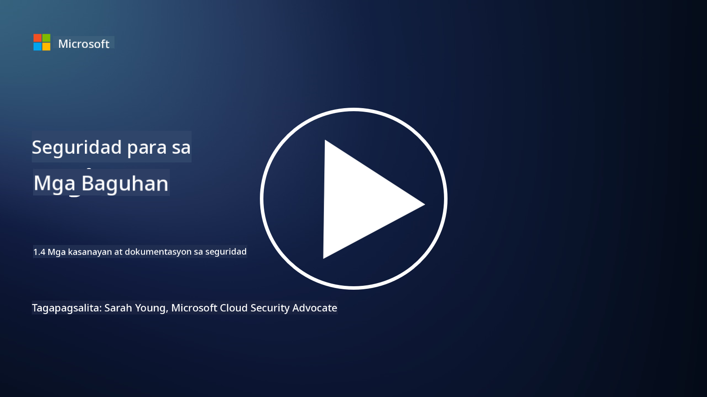

<!--
CO_OP_TRANSLATOR_METADATA:
{
  "original_hash": "d33500902124e52870935bdce4546fcc",
  "translation_date": "2025-09-04T00:21:30+00:00",
  "source_file": "1.4 Security practices and documentation.md",
  "language_code": "tl"
}
-->
# Mga Praktika sa Seguridad at Dokumentasyon

Maaaring narinig mo na ang mga pariralang “security policy”, “security standard”, at iba pa, ngunit ang katotohanan ay maraming mga propesyonal sa cybersecurity ang hindi tamang nagagamit ang mga ito. Sa seksyong ito, ipapaliwanag natin kung ano ang ibig sabihin ng bawat isa sa mga pariralang ito at kung bakit ginagamit ito ng isang organisasyon.

## Panimula

Sa araling ito, tatalakayin natin:

 - Ano ang security policy?
   
 - Ano ang security standard?

   

 - Ano ang security baseline?

   

 - Ano ang security guideline?
 - Ano ang security procedure?

   

 - Ano ang mga batas at regulasyon sa konteksto ng cybersecurity?

Ang mga terminong ito ay madalas ginagamit sa konteksto ng cybersecurity upang tukuyin ang iba't ibang antas ng dokumentasyon at mga praktika sa seguridad sa loob ng isang organisasyon. Linawin natin ang bawat termino:

## Ano ang security policy?

Ang security policy ay isang dokumentong mataas ang antas na naglalahad ng pangkalahatang layunin, prinsipyo, at mga alituntunin ng seguridad ng isang organisasyon. Nagbibigay ito ng balangkas para sa paggawa ng mga desisyon na may kaugnayan sa seguridad at nagtatakda ng tono para sa postura ng seguridad ng organisasyon. Karaniwang saklaw ng mga security policy ang mga paksa tulad ng tamang paggamit ng mga mapagkukunan, proteksyon ng data, kontrol sa pag-access, pagtugon sa insidente, at iba pa. Ang isang policy ay hindi nakadepende sa solusyon o teknolohiya. Isang halimbawa ng security policy na pamilyar sa marami ay ang acceptable use policy ng isang organisasyon.

## Ano ang security standard?

Ang security standard ay isang mas detalyado at tiyak na dokumento na nagbibigay ng mga alituntunin at kinakailangan para sa pagpapatupad ng mga kontrol at hakbang sa seguridad sa loob ng isang organisasyon. Ang mga standard ay mas konkretong teknikal kumpara sa mga policy, na nag-aalok ng mga tiyak na tagubilin at rekomendasyon para sa pag-configure at pagpapanatili ng mga sistema, network, at proseso upang maabot ang mga layunin sa seguridad. Isang halimbawa ng security standard ay _“Ang lahat ng internal na data ay dapat naka-encrypt habang nakaimbak at habang ipinapadala.”_

## Ano ang security baseline?

Ang security baseline ay isang hanay ng minimum na configuration ng seguridad na itinuturing na mahalaga para sa isang partikular na sistema, aplikasyon, o kapaligiran sa isang tiyak na panahon. Tinutukoy nito ang panimulang punto para sa seguridad na dapat ipatupad sa lahat ng kaugnay na mga instance. Ang mga security baseline ay tumutulong upang matiyak ang pagkakapare-pareho at isang tiyak na antas ng seguridad sa buong IT infrastructure ng isang organisasyon. Isang halimbawa ng security baseline ay _“Ang mga Azure VM ay hindi dapat magkaroon ng direktang access sa Internet.”_

## Ano ang security guideline?

Ang security guideline ay isang dokumento na nagbibigay ng mga rekomendasyon at gabay kapag ang isang partikular na security standard ay hindi naaangkop. Ang mga guideline ay sinusubukang tugunan ang mga “gray areas” na lumilitaw kapag ang isang standard ay hindi saklaw, o bahagyang saklaw lamang ang isang usapin.

## Ano ang security procedure?

Ang security procedure ay isang detalyado at sunud-sunod na gabay na naglalahad ng mga partikular na aksyon at gawain na kailangang isagawa upang maisakatuparan ang isang proseso o gawain na may kaugnayan sa seguridad. Ang mga procedure ay praktikal at maaksiyong dokumento na nagbibigay ng malinaw na pagkakasunod-sunod ng mga hakbang na dapat sundin sa pagtugon sa insidente, pagpapanatili ng sistema, onboarding ng user, at iba pang aktibidad na may kaugnayan sa seguridad. Isang halimbawa ng security procedure ay _“Kapag ang isang P1 security incident ay nabuo ng Microsoft Sentinel, ang security operations center (SOC) ay dapat agad na ipaalam sa on-call security manager at ipadala ang mga detalye ng insidente sa kanila.”_

Sa kabuuan, ang mga terminong ito ay kumakatawan sa iba't ibang antas ng dokumentasyon at gabay sa loob ng cybersecurity framework ng isang organisasyon. Ang mga security policy ay nagtatakda ng mga layunin sa mataas na antas, ang mga standard ay nagbibigay ng detalyadong mga kinakailangan, ang mga baseline ay nagtatakda ng minimum na configuration ng seguridad, ang mga guideline ay nag-aalok ng pinakamahusay na mga praktika, at ang mga procedure ay nagbibigay ng maaksiyong mga hakbang para sa mga proseso ng seguridad.

## Ano ang mga batas/regulasyon sa konteksto ng cybersecurity?

Ang mga batas at regulasyon ay tumutukoy sa mga legal na balangkas na itinatag ng mga gobyerno at mga regulatory body upang tukuyin at ipatupad ang mga patakaran, standard, at kinakailangan para sa pag-secure ng mga digital na sistema, data, at impormasyon. Ang mga batas at regulasyon na ito ay nagkakaiba-iba depende sa hurisdiksyon at nakatuon sa iba't ibang aspeto ng cybersecurity, kabilang ang proteksyon ng data, privacy, pag-uulat ng insidente, at seguridad ng kritikal na imprastraktura. Narito ang ilang halimbawa ng mga batas at regulasyon na may kaugnayan sa cybersecurity: e.g. General Data Protection Regulation (GDPR), Health Insurance Portability and Accountability Act (HIPAA), California Consumer Privacy Act (CCPA), Payment Card Industry Data Security Standard (PCI DSS).

## Karagdagang Pagbabasa

[Information Security Policy Templates | SANS Institute](https://www.sans.org/information-security-policy/)

[Compliance with Cybersecurity and Privacy Laws and Regulations | NIST](https://www.nist.gov/mep/cybersecurity-resources-manufacturers/compliance-cybersecurity-and-privacy-laws-and-regulations)

---

**Paunawa**:  
Ang dokumentong ito ay isinalin gamit ang AI translation service na [Co-op Translator](https://github.com/Azure/co-op-translator). Bagama't sinisikap naming maging tumpak, tandaan na ang mga awtomatikong pagsasalin ay maaaring maglaman ng mga pagkakamali o hindi pagkakatugma. Ang orihinal na dokumento sa kanyang katutubong wika ang dapat ituring na opisyal na sanggunian. Para sa mahalagang impormasyon, inirerekomenda ang propesyonal na pagsasalin ng tao. Hindi kami mananagot sa anumang hindi pagkakaunawaan o maling interpretasyon na maaaring magmula sa paggamit ng pagsasaling ito.