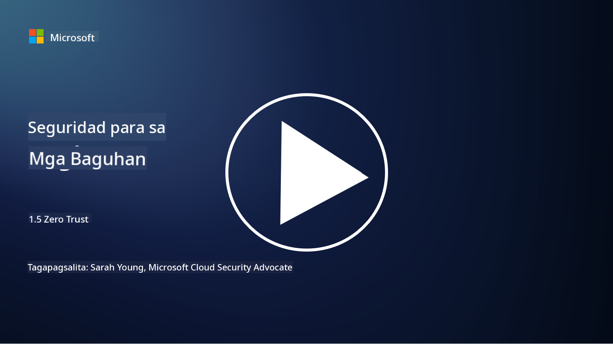
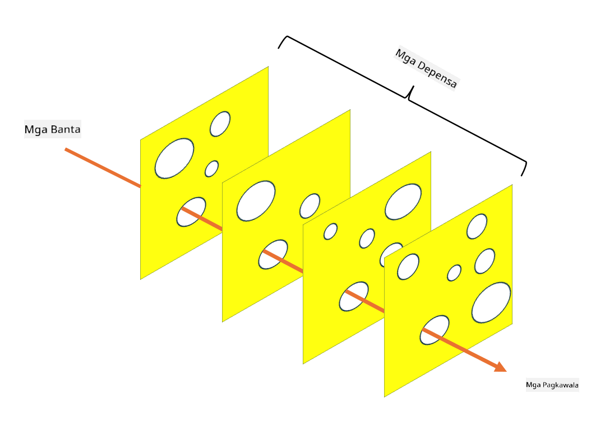

<!--
CO_OP_TRANSLATOR_METADATA:
{
  "original_hash": "75f77f972d2233c584f87c1eb96c983b",
  "translation_date": "2025-09-03T23:49:02+00:00",
  "source_file": "1.5 Zero trust.md",
  "language_code": "tl"
}
-->
# Zero Trust

“Zero trust” ay isang parirala na madalas gamitin sa mga usapan tungkol sa seguridad ngayon. Pero ano nga ba ang ibig sabihin nito? Isa lang ba itong buzzword? Sa araling ito, tatalakayin natin kung ano talaga ang zero trust.

## Panimula

 - Sa araling ito, tatalakayin natin:
   
   
 - Ano ang zero trust?

   
  

 - Paano naiiba ang zero trust sa tradisyunal na mga arkitektura ng seguridad?

   
   

 - Ano ang defense in depth?

## Zero Trust

Ang Zero Trust ay isang diskarte sa cybersecurity na hinahamon ang tradisyunal na konsepto ng "trust but verify" sa pamamagitan ng pag-aakalang walang entity, nasa loob man o labas ng network ng isang organisasyon, ang dapat agad pagkatiwalaan. Sa halip, ang Zero Trust ay nagtataguyod ng pag-verify sa bawat user, device, at application na sumusubok na ma-access ang mga resources, anuman ang kanilang lokasyon. Ang pangunahing prinsipyo ng Zero Trust ay bawasan ang "attack surface" at limitahan ang posibleng epekto ng mga paglabag sa seguridad.

Sa modelo ng Zero Trust, binibigyang-diin ang mga sumusunod na prinsipyo:

1. **Pag-verify ng Identidad**: Ang authentication at authorization ay mahigpit na ipinapatupad sa lahat ng user at device, anuman ang kanilang lokasyon. Tandaan na ang isang identidad ay hindi laging tao: maaari itong maging isang device, application, at iba pa.

2. **Pinakamaliit na Pribilehiyo**: Ang mga user at device ay binibigyan ng pinakamababang antas ng access na kinakailangan upang magawa ang kanilang mga gawain, na nagbabawas ng posibleng pinsala kung sakaling ma-kompromiso.

3. **Micro-Segmentation**: Ang mga network resources ay hinahati sa mas maliliit na bahagi upang limitahan ang lateral movement sa loob ng network sakaling magkaroon ng breach.

4. **Patuloy na Pagsubaybay**: Ang tuloy-tuloy na pagsubaybay at pagsusuri sa mga kilos ng user at device ay isinasagawa upang matukoy ang mga anomalya at posibleng banta. Ang paggamit ng modernong monitoring techniques ay gumagamit din ng machine learning, AI, at threat intelligence upang magbigay ng karagdagang detalye at konteksto sa pagsubaybay.

5. **Pag-encrypt ng Data**: Ang data ay ini-encrypt habang nasa transit at habang nakaimbak upang maiwasan ang hindi awtorisadong access.

6. **Mahigpit na Kontrol sa Access**: Ang mga access control ay ipinapatupad batay sa konteksto, tulad ng mga role ng user, kalagayan ng device, at lokasyon ng network.

Hinahati ng Microsoft ang zero trust sa limang haligi, na tatalakayin natin sa susunod na aralin.

## Pagkakaiba sa Tradisyunal na Arkitektura ng Seguridad

Ang Zero Trust ay naiiba sa tradisyunal na mga arkitektura ng seguridad, tulad ng mga modelong nakabatay sa perimeter, sa ilang paraan:

1. **Perimeter vs. Identity-Centric**: Ang tradisyunal na mga modelo ay nakatuon sa pag-secure ng perimeter ng network at inaakalang ang mga internal na user at device ay maaaring pagkatiwalaan kapag nasa loob na. Ang Zero Trust, sa kabilang banda, ay inaakalang ang mga banta ay maaaring magmula sa loob at labas ng network at nagpapatupad ng mahigpit na identity-based na mga kontrol.

2. **Implicit vs. Explicit Trust**: Ang tradisyunal na mga modelo ay implicit na nagtitiwala sa mga device at user sa loob ng network hanggang sa mapatunayan ang kabaligtaran. Ang Zero Trust ay explicit na nagve-verify ng mga identidad at tuloy-tuloy na nagsusubaybay para sa mga anomalya.

3. **Flat vs. Segmented Network**: Ang tradisyunal na mga arkitektura ay madalas may flat networks kung saan ang mga internal na user ay may malawak na access. Ang Zero Trust ay nagtataguyod ng paghahati ng network sa mas maliliit na mga zone upang pigilan ang posibleng pagkalat ng breach.

4. **Reactive vs. Proactive**: Ang tradisyunal na seguridad ay madalas umaasa sa mga reactive na hakbang tulad ng perimeter firewalls at intrusion detection. Ang Zero Trust ay gumagamit ng proactive na diskarte sa pamamagitan ng pag-aakalang ang mga breach ay malamang na mangyari at nililimitahan ang kanilang epekto.

## Defense in Depth

Ang Defense in Depth, na kilala rin bilang layered security, ay isang diskarte sa cybersecurity na naglalagay ng maraming layer ng mga kontrol at hakbang sa seguridad upang protektahan ang mga asset ng isang organisasyon. Ang layunin ay lumikha ng magkakapatong na mga layer ng depensa upang kung ang isang layer ay ma-breach, ang iba ay maaari pa ring magbigay ng proteksyon. Ang bawat layer ay nakatuon sa iba't ibang aspeto ng seguridad at nagpapataas ng kabuuang security posture ng isang organisasyon.

Ang Defense in Depth ay binubuo ng kombinasyon ng teknikal, procedural, at physical na mga hakbang sa seguridad. Kasama rito ang mga firewall, intrusion detection systems, access controls, encryption, user training, security policies, at iba pa. Ang ideya ay lumikha ng maraming hadlang na sama-samang nagpapahirap sa mga attacker na makapasok sa mga sistema at network ng isang organisasyon. Ito ay minsan ding tinatawag na "swiss cheese" model na ginagamit din sa pag-iwas sa aksidente sa ibang industriya (hal. transportasyon).

## Karagdagang Pagbabasa

[What is Zero Trust?](https://learn.microsoft.com/security/zero-trust/zero-trust-overview?WT.mc_id=academic-96948-sayoung)

[Evolving Zero Trust – Microsoft Position Paper](https://query.prod.cms.rt.microsoft.com/cms/api/am/binary/RWJJdT?WT.mc_id=academic-96948-sayoung)

[Zero Trust and BeyondCorp Google Cloud | Google Cloud Blog](https://cloud.google.com/blog/topics/developers-practitioners/zero-trust-and-beyondcorp-google-cloud)

---

**Paunawa**:  
Ang dokumentong ito ay isinalin gamit ang AI translation service na [Co-op Translator](https://github.com/Azure/co-op-translator). Bagama't sinisikap naming maging tumpak, pakitandaan na ang mga awtomatikong pagsasalin ay maaaring maglaman ng mga pagkakamali o hindi pagkakatugma. Ang orihinal na dokumento sa orihinal nitong wika ang dapat ituring na opisyal na sanggunian. Para sa mahalagang impormasyon, inirerekomenda ang propesyonal na pagsasalin ng tao. Hindi kami mananagot sa anumang hindi pagkakaunawaan o maling interpretasyon na maaaring magmula sa paggamit ng pagsasaling ito.