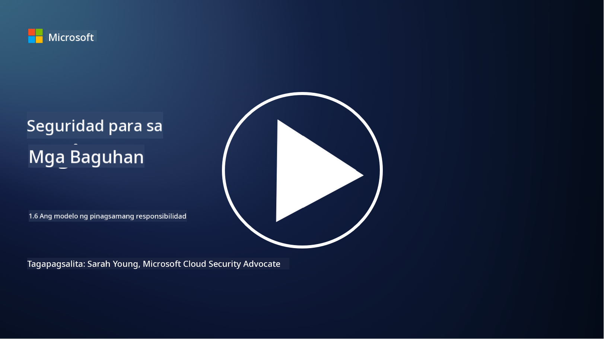

<!--
CO_OP_TRANSLATOR_METADATA:
{
  "original_hash": "a48db640d80c786b928ca178c414f084",
  "translation_date": "2025-09-04T00:27:47+00:00",
  "source_file": "1.6 Shared responsibility model.md",
  "language_code": "tl"
}
-->
# Ang modelo ng shared responsibility

Ang shared responsibility ay isang mas bagong konsepto sa IT na lumitaw kasabay ng pag-usbong ng cloud computing. Mula sa perspektibo ng cybersecurity, mahalagang maunawaan kung sino ang nagbibigay ng aling mga kontrol sa seguridad upang maiwasan ang mga puwang sa depensa.

## Panimula

Sa araling ito, tatalakayin natin:

 - Ano ang shared responsibility sa konteksto ng cybersecurity?
   
 - Ano ang pagkakaiba ng shared responsibility para sa mga kontrol sa seguridad
   sa pagitan ng IaaS, PaaS, at SaaS?

   

 - Saan mo matatagpuan ang impormasyon tungkol sa mga kontrol sa seguridad na ibinibigay ng iyong cloud platform?

   
 

 - Ano ang ibig sabihin ng “trust but verify”?

## Ano ang shared responsibility sa konteksto ng cybersecurity?

Ang shared responsibility sa cybersecurity ay tumutukoy sa pamamahagi ng mga responsibilidad sa seguridad sa pagitan ng cloud service provider (CSP) at ng mga customer nito. Sa mga cloud computing environment, tulad ng Infrastructure as a Service (IaaS), Platform as a Service (PaaS), at Software as a Service (SaaS), parehong may papel ang CSP at ang customer sa pagtiyak ng seguridad ng data, mga aplikasyon, at mga sistema.

## Ano ang pagkakaiba ng shared responsibility para sa mga kontrol sa seguridad sa pagitan ng IaaS, PaaS, at SaaS?

Ang pamamahagi ng mga responsibilidad ay karaniwang nakadepende sa uri ng cloud service na ginagamit:

 - **IaaS (Infrastructure as a Service)**: Ang CSP ang nagbibigay ng pundasyong imprastruktura (mga server, networking, storage), habang ang customer ang responsable sa pamamahala ng operating systems, mga aplikasyon, at mga konfigurasyon sa seguridad sa imprastrukturang iyon.
   
   
 - **PaaS (Platform as a Service):** Ang CSP ang nag-aalok ng platform kung saan maaaring bumuo at mag-deploy ng mga aplikasyon ang mga customer. Ang CSP ang namamahala sa pundasyong imprastruktura, at ang customer ay nakatuon sa pag-develop ng aplikasyon at seguridad ng data.

   

 - **SaaS (Software as a Service)**: Ang CSP ang nagbibigay ng ganap na gumaganang mga aplikasyon na naa-access sa internet. Sa kasong ito, ang CSP ang responsable sa seguridad ng aplikasyon at imprastruktura, habang ang customer ang namamahala sa pag-access ng user at paggamit ng data.

Ang pag-unawa sa shared responsibility ay mahalaga dahil nililinaw nito kung aling mga aspeto ng seguridad ang saklaw ng CSP at kung alin ang kailangang tugunan ng customer. Nakakatulong ito upang maiwasan ang mga hindi pagkakaunawaan at matiyak na ang mga hakbang sa seguridad ay naipatupad nang buo.

## Saan mo matatagpuan ang impormasyon tungkol sa mga kontrol sa seguridad na ibinibigay ng iyong cloud platform?

Upang malaman kung anong mga kontrol sa seguridad ang ibinibigay ng iyong cloud platform, kailangan mong sumangguni sa dokumentasyon at mga mapagkukunan ng cloud service provider. Kasama rito ang:

 - **Website at dokumentasyon ng CSP**: Ang website ng CSP ay may impormasyon tungkol sa mga tampok sa seguridad at mga kontrol na inaalok bilang bahagi ng kanilang mga serbisyo. Karaniwang nagbibigay ang mga CSP ng detalyadong dokumentasyon na nagpapaliwanag ng kanilang mga kasanayan sa seguridad, mga kontrol, at mga rekomendasyon. Maaaring kabilang dito ang mga whitepaper, gabay sa seguridad, at teknikal na dokumentasyon.
   
 - **Mga Pagsusuri at Audit sa Seguridad**: Karamihan sa mga CSP ay nagpapasuri ng kanilang mga kontrol sa seguridad sa mga independiyenteng eksperto at organisasyon sa seguridad. Ang mga pagsusuring ito ay maaaring magbigay ng pananaw sa kalidad ng mga hakbang sa seguridad ng CSP. Minsan, nagreresulta ito sa pagkuha ng CSP ng sertipikasyon sa seguridad (tingnan ang susunod na bullet point).
 - **Mga Sertipikasyon sa Pagsunod sa Seguridad**: Karamihan sa mga CSP ay nakakakuha ng mga sertipikasyon tulad ng ISO:27001, SOC 2, at FedRAMP, atbp. Ang mga sertipikasyong ito ay nagpapakita na ang provider ay nakakatugon sa mga partikular na pamantayan sa seguridad at pagsunod.

Tandaan na ang antas ng detalye at ang pagkakaroon ng impormasyon ay maaaring mag-iba sa pagitan ng mga cloud provider. Palaging tiyakin na kumukonsulta ka sa opisyal at napapanahong mga mapagkukunan na ibinibigay ng cloud service provider upang makagawa ng mga may kaalamang desisyon tungkol sa seguridad ng iyong mga asset na nakabase sa cloud.

## Ano ang ibig sabihin ng “trust but verify”?

Sa konteksto ng paggamit ng CSP, third-party software, o iba pang serbisyo sa IT security, maaaring magtiwala ang isang organisasyon sa mga pahayag ng provider tungkol sa mga hakbang sa seguridad. Gayunpaman, upang tunay na matiyak ang kaligtasan ng kanilang data at mga sistema, dapat nilang i-verify ang mga pahayag na ito sa pamamagitan ng mga pagsusuri sa seguridad, penetration testing, at pagsusuri ng mga kontrol sa seguridad ng panlabas na partido bago ganap na isama ang software o serbisyo sa kanilang operasyon. Ang lahat ng indibidwal at organisasyon ay dapat magtiwala ngunit mag-verify sa mga kontrol sa seguridad na hindi nila responsibilidad.

## Shared responsibility sa loob ng isang organisasyon

Tandaan, ang shared responsibility para sa seguridad sa loob ng isang organisasyon sa pagitan ng iba't ibang mga koponan ay kailangan ding isaalang-alang. Bihirang ipatupad ng security team ang lahat ng mga kontrol sa kanilang sarili at kailangang makipagtulungan sa mga operations team, mga developer, at iba pang bahagi ng negosyo upang maipatupad ang lahat ng mga kontrol sa seguridad na kinakailangan upang mapanatiling ligtas ang isang organisasyon.

## Karagdagang babasahin
- [Shared responsibility in the cloud - Microsoft Azure | Microsoft Learn](https://learn.microsoft.com/azure/security/fundamentals/shared-responsibility?WT.mc_id=academic-96948-sayoung)
- [What is shared responsibility model? – Definition from TechTarget.com](https://www.techtarget.com/searchcloudcomputing/definition/shared-responsibility-model)
- [The shared responsibility model explained and what it means for cloud security | CSO Online](https://www.csoonline.com/article/570779/the-shared-responsibility-model-explained-and-what-it-means-for-cloud-security.html)
- [Shared Responsibility for Cloud Security: What You Need to Know (cisecurity.org)](https://www.cisecurity.org/insights/blog/shared-responsibility-cloud-security-what-you-need-to-know)

---

**Paunawa**:  
Ang dokumentong ito ay isinalin gamit ang AI translation service na [Co-op Translator](https://github.com/Azure/co-op-translator). Bagama't sinisikap naming maging tumpak, tandaan na ang mga awtomatikong pagsasalin ay maaaring maglaman ng mga pagkakamali o hindi pagkakatugma. Ang orihinal na dokumento sa kanyang katutubong wika ang dapat ituring na opisyal na sanggunian. Para sa mahalagang impormasyon, inirerekomenda ang propesyonal na pagsasalin ng tao. Hindi kami mananagot sa anumang hindi pagkakaunawaan o maling interpretasyon na maaaring magmula sa paggamit ng pagsasaling ito.