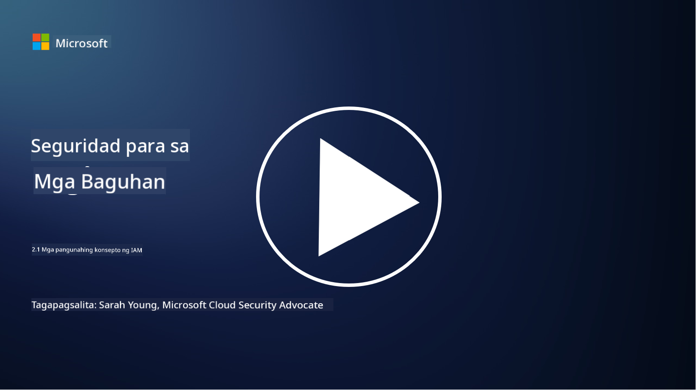

<!--
CO_OP_TRANSLATOR_METADATA:
{
  "original_hash": "2e3864e3d579f0dbb4ac2ec8c5f82acf",
  "translation_date": "2025-09-03T22:42:10+00:00",
  "source_file": "2.1 IAM key concepts.md",
  "language_code": "tl"
}
-->
# Mga pangunahing konsepto ng IAM

Nakapag-log in ka na ba sa isang computer o website? Siyempre naman! Ibig sabihin, gumagamit ka na ng mga kontrol sa pagkakakilanlan sa pang-araw-araw mong buhay. Ang Identity and Access Management (IAM) ay isang mahalagang haligi ng seguridad, at mas marami pa tayong matututunan tungkol dito sa mga susunod na aralin.

**Panimula**

Sa araling ito, tatalakayin natin ang:

- Ano ang ibig sabihin ng identity and access management (IAM) sa konteksto ng cybersecurity?  
- Ano ang prinsipyo ng least privilege?  
- Ano ang segregation of duties?  
- Ano ang authentication at authorization?  

## Ano ang ibig sabihin ng identity and access management (IAM) sa konteksto ng cybersecurity?

Ang Identity and Access Management (IAM) ay tumutukoy sa isang hanay ng mga proseso, teknolohiya, at patakaran na ipinatutupad upang matiyak na ang tamang mga indibidwal ay may angkop na access sa mga mapagkukunan sa loob ng digital na kapaligiran ng isang organisasyon. Ang IAM ay may kinalaman sa pamamahala ng mga digital na pagkakakilanlan (mga user, empleyado, kasosyo) at ang kanilang access sa mga sistema, aplikasyon, data, at network. Ang pangunahing layunin ng IAM ay mapahusay ang seguridad, gawing mas madali ang pag-access ng mga user, at matiyak ang pagsunod sa mga patakaran at regulasyon ng organisasyon. Karaniwang saklaw ng mga solusyon sa IAM ang user authentication, authorization, identity provisioning, access control, at user lifecycle management (pagtitiyak na ang mga account ay nabubura kapag hindi na ginagamit).

## Ano ang prinsipyo ng least privilege?

Ang prinsipyo ng least privilege ay isang pangunahing konsepto na nagmumungkahi ng pagbibigay sa mga user at sistema ng pinakamababang pribilehiyo na kinakailangan lamang upang maisagawa ang kanilang mga gawain o tungkulin. Ang prinsipyong ito ay tumutulong na limitahan ang posibleng pinsala na maaaring mangyari sa kaso ng isang security breach o banta mula sa loob. Sa pagsunod sa prinsipyo ng least privilege, nababawasan ng mga organisasyon ang attack surface at ang panganib ng hindi awtorisadong access, data breaches, at hindi sinasadyang maling paggamit ng mga pribilehiyo. Sa praktikal na aplikasyon, nangangahulugan ito na ang mga user ay binibigyan lamang ng access sa mga partikular na mapagkukunan at mga functionality na kinakailangan para sa kanilang mga tungkulin, at wala nang iba pa. Halimbawa, kung kailangan mo lang basahin ang isang dokumento, labis na ang pagbibigay sa iyo ng buong admin privileges para sa dokumentong iyon.

## Ano ang segregation of duties?

Ang segregation of duties ay isang prinsipyo na naglalayong maiwasan ang mga conflict of interest at mabawasan ang panganib ng pandaraya at pagkakamali sa pamamagitan ng pamamahagi ng mga kritikal na gawain at responsibilidad sa iba't ibang indibidwal sa loob ng isang organisasyon. Sa konteksto ng cybersecurity, ang segregation of duties ay nangangahulugan ng pagtitiyak na walang sinumang indibidwal ang may kontrol sa lahat ng aspeto ng isang kritikal na proseso o sistema. Ang layunin ay lumikha ng isang sistema ng checks and balances na pumipigil sa sinumang tao na magkaroon ng kakayahang isagawa ang parehong setup at approval na yugto ng isang proseso. Halimbawa, sa mga financial system, maaaring ipag-utos na ang taong nag-eencode ng mga transaksyon sa sistema ay hindi dapat siya rin ang taong nag-aapruba ng mga transaksyong iyon. Sa ganitong paraan, nababawasan ang panganib ng hindi awtorisado o mapanlinlang na mga aksyon na hindi natutuklasan.

## Ano ang authentication at authorization?

Ang authentication at authorization ay dalawang pangunahing konsepto sa cybersecurity na may mahalagang papel sa pagtitiyak ng seguridad at integridad ng mga computer system at data. Karaniwan silang ginagamit nang magkasama upang kontrolin ang pag-access sa mga mapagkukunan at protektahan ang sensitibong impormasyon.

**1. Authentication**: Ang authentication ay ang proseso ng pag-verify ng pagkakakilanlan ng isang user, sistema, o entity na sumusubok na mag-access sa isang computer system o partikular na mapagkukunan. Tinitiyak nito na ang inaangking pagkakakilanlan ay tunay at tama. Karaniwang gumagamit ang mga authentication method ng isa o higit pang mga sumusunod na salik:

   a. Isang bagay na alam mo: Kasama rito ang mga password, PIN, o iba pang lihim na impormasyon na dapat pagmamay-ari lamang ng awtorisadong user.  
   b. Isang bagay na mayroon ka: Kasama rito ang mga pisikal na token o device tulad ng smart cards, security tokens, o mga mobile phone na ginagamit upang kumpirmahin ang pagkakakilanlan ng user.  
   c. Isang bagay na ikaw: Tumutukoy ito sa mga biometric factor tulad ng fingerprint, facial recognition, o retinal scan na natatangi sa isang indibidwal.  

Ang mga mekanismo ng authentication ay ginagamit upang kumpirmahin na ang isang user ay siya nga ang sinasabi niyang siya bago payagan ang pag-access sa isang sistema o mapagkukunan. Tumutulong ito upang maiwasan ang hindi awtorisadong pag-access at matiyak na tanging mga lehitimong user lamang ang maaaring magsagawa ng mga aksyon sa loob ng isang sistema.

**2. Authorization**: Ang authorization ay ang proseso ng pagbibigay o pagtanggi ng mga partikular na pahintulot at pribilehiyo sa mga authenticated na user o entity kapag napatunayan na ang kanilang pagkakakilanlan. Tinutukoy nito kung anong mga aksyon o operasyon ang pinapayagan ng isang user na gawin sa loob ng isang sistema o sa mga partikular na mapagkukunan. Ang authorization ay karaniwang batay sa mga naunang itinakdang patakaran, mga access control rule, at mga tungkuling itinalaga sa mga user.

Ang authorization ay maaaring isipin bilang pagsagot sa tanong, "Ano ang maaaring gawin ng isang authenticated na user?" Kasama rito ang pagtukoy at pagpapatupad ng mga access control policy upang maprotektahan ang sensitibong data at mga mapagkukunan mula sa hindi awtorisadong pag-access o pagbabago.

**Sa kabuuan:**

- Ang authentication ay nagtatatag ng pagkakakilanlan ng mga user o entity.  
- Ang authorization ay tumutukoy kung anong mga aksyon at mapagkukunan ang maaaring ma-access o manipulahin ng mga authenticated na user.  

## Karagdagang babasahin

- [Describe identity concepts - Training | Microsoft Learn](https://learn.microsoft.com/training/modules/describe-identity-principles-concepts/?WT.mc_id=academic-96948-sayoung)  
- [Introduction to identity - Microsoft Entra | Microsoft Learn](https://learn.microsoft.com/azure/active-directory/fundamentals/identity-fundamental-concepts?WT.mc_id=academic-96948-sayoung)  
- [What is Identity Access Management (IAM)? | Microsoft Security](https://www.microsoft.com/security/business/security-101/what-is-identity-access-management-iam?WT.mc_id=academic-96948-sayoung)  
- [What is IAM? Identity and access management explained | CSO Online](https://www.csoonline.com/article/518296/what-is-iam-identity-and-access-management-explained.html)  
- [What is IAM? (auth0.com)](https://auth0.com/blog/what-is-iam/)  
- [Security+: implementing Identity and Access Management (IAM) controls [updated 2021] | Infosec (infosecinstitute.com)](https://resources.infosecinstitute.com/certifications/securityplus/security-implementing-identity-and-access-management-iam-controls/)  
- [least privilege - Glossary | CSRC (nist.gov)](https://csrc.nist.gov/glossary/term/least_privilege)  
- [Security: The Principle of Least Privilege (POLP) - Microsoft Community Hub](https://techcommunity.microsoft.com/t5/azure-sql-blog/security-the-principle-of-least-privilege-polp/ba-p/2067390?WT.mc_id=academic-96948-sayoung)  
- [Principle of least privilege | CERT NZ](https://www.cert.govt.nz/it-specialists/critical-controls/principle-of-least-privilege/)  
- [Why is separation of duties required by NIST 800-171 and CMMC? - (totem.tech)](https://www.totem.tech/cmmc-separation-of-duties/)  

---

**Paunawa**:  
Ang dokumentong ito ay isinalin gamit ang AI translation service na [Co-op Translator](https://github.com/Azure/co-op-translator). Bagama't sinisikap naming maging tumpak, pakitandaan na ang mga awtomatikong pagsasalin ay maaaring maglaman ng mga pagkakamali o hindi pagkakatugma. Ang orihinal na dokumento sa orihinal nitong wika ang dapat ituring na opisyal na sanggunian. Para sa mahalagang impormasyon, inirerekomenda ang propesyonal na pagsasalin ng tao. Hindi kami mananagot sa anumang hindi pagkakaunawaan o maling interpretasyon na maaaring magmula sa paggamit ng pagsasaling ito.