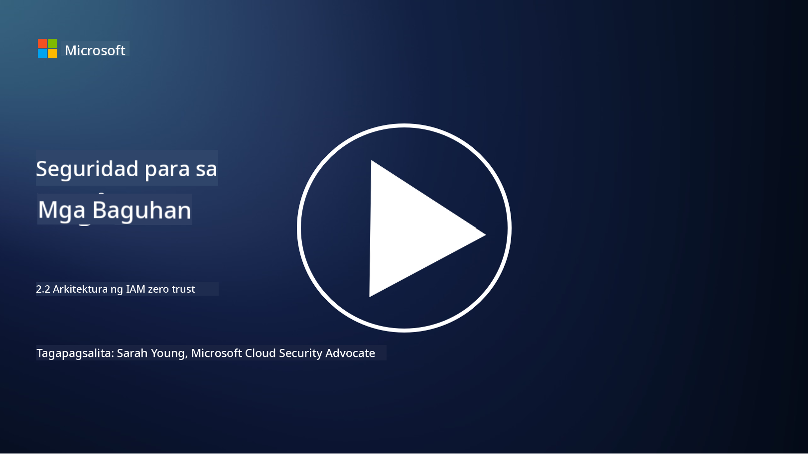

<!--
CO_OP_TRANSLATOR_METADATA:
{
  "original_hash": "4774a978af123f72ebb872199c4c4d4f",
  "translation_date": "2025-09-03T23:42:36+00:00",
  "source_file": "2.2 IAM zero trust architecture.md",
  "language_code": "tl"
}
-->
# IAM zero trust architecture

Ang pagkakakilanlan ay isang mahalagang bahagi ng pagpapatupad ng zero trust architecture at pagtatayo ng perimeter para sa anumang IT environment. Sa seksyong ito, tatalakayin natin kung bakit mahalagang gumamit ng mga kontrol sa pagkakakilanlan upang maipatupad ang zero trust.

## Panimula

Sa araling ito, tatalakayin natin:

 - Bakit kailangan nating gamitin ang pagkakakilanlan bilang ating perimeter sa mga modernong IT environment?
   
 - Paano ito naiiba sa tradisyunal na IT architectures?

 - Paano ginagamit ang pagkakakilanlan upang maipatupad ang zero trust architecture?

## Bakit kailangan nating gamitin ang pagkakakilanlan bilang ating perimeter sa mga modernong IT environment?

Sa mga modernong IT environment, ang tradisyunal na konsepto ng pisikal na perimeter (gamit ang mga tool tulad ng firewalls at network boundaries) bilang pangunahing depensa laban sa mga banta sa cyber ay nagiging hindi na epektibo dahil sa lumalaking komplikasyon ng teknolohiya, pag-usbong ng remote work, at paggamit ng cloud services. Sa halip, ang mga organisasyon ay lumilipat sa paggamit ng pagkakakilanlan bilang bagong perimeter. Nangangahulugan ito na umiikot ang seguridad sa pag-verify at pamamahala ng pagkakakilanlan ng mga user, device, at application na sumusubok na ma-access ang mga resource, anuman ang kanilang pisikal na lokasyon.

Narito kung bakit mahalaga ang paggamit ng pagkakakilanlan bilang perimeter sa mga modernong IT environment:

**Remote Workforce**: Dahil ang remote work at paggamit ng mobile devices ay nagiging karaniwan, maaaring ma-access ng mga user ang mga resource mula sa iba't ibang lokasyon at device. Hindi na epektibo ang tradisyunal na perimeter approach kapag ang mga user ay hindi na limitado sa pisikal na opisina.

**Cloud at Hybrid Environments**: Parami nang parami ang mga organisasyon na gumagamit ng cloud services at hybrid environments. Ang data at mga application ay hindi na eksklusibong nasa loob ng premises ng isang organisasyon, kaya't hindi na gaanong mahalaga ang tradisyunal na perimeter defenses.

**Zero Trust Security**: Ang konsepto ng zero trust security ay nag-aakala na walang entity, nasa loob man o labas ng network, ang dapat awtomatikong pagkatiwalaan. Ang pagkakakilanlan ang nagiging pundasyon para sa pag-verify ng mga access request, saan man ito nagmumula.

**Threat Landscape**: Ang mga banta sa cyber ay patuloy na nagbabago, at ang mga umaatake ay nakakahanap ng paraan upang malampasan ang tradisyunal na perimeter defenses. Ang phishing, social engineering, at insider threats ay madalas na umaasa sa kahinaan ng tao kaysa sa pagsira sa network perimeters.

**Data-Centric Approach**: Ang proteksyon ng sensitibong data ay napakahalaga. Sa pamamagitan ng pagtutok sa pagkakakilanlan, maaaring kontrolin ng mga organisasyon kung sino ang may access sa anong data, na binabawasan ang panganib ng data breaches.

## Paano ito naiiba sa tradisyunal na IT architectures?

Ang tradisyunal na IT architectures ay malaki ang pag-asa sa perimeter-based security models, kung saan ang firewalls at network boundaries ay may mahalagang papel sa pagpigil sa mga banta. Narito ang mga pangunahing pagkakaiba sa pagitan ng tradisyunal at identity-centric na mga approach:

|      Aspeto                |      Tradisyunal na IT Architectures                                                              |      Identity-Centric na Approach                                                                         |
|----------------------------|--------------------------------------------------------------------------------------------------|----------------------------------------------------------------------------------------------------------|
|     Pokus                  |     Pokus sa Perimeter: Umaasa sa perimeter defenses tulad ng firewalls at   access control.      |     Pokus sa Pag-verify ng Pagkakakilanlan: Lumipat mula sa network boundaries patungo sa pag-verify ng user/device identity. |
|     Lokasyon               |     Depende sa Lokasyon: Ang seguridad ay nakatali sa pisikal na lokasyon ng opisina at network boundaries. |     Hindi Depende sa Lokasyon: Ang seguridad ay hindi nakatali sa partikular na lokasyon; maaaring ma-access mula kahit saan. |
|     Palagay sa Tiwala      |     May Palagay na Tiwala: May palagay na tiwala sa loob ng network perimeter para sa mga user/device. |     Zero Trust na Approach: Walang palagay na tiwala; ang access ay sinusuri batay sa pagkakakilanlan at konteksto. |
|     Pagsasaalang-alang sa Device |     Pagkakaiba ng Device: May palagay na secure ang mga device sa loob ng network perimeter. |     Kamalayan sa Device: Isinasaalang-alang ang kalusugan at seguridad ng device, saan man ito naroroon. |
|     Proteksyon ng Data     |     Proteksyon ng Data: Nakatuon sa pag-secure ng network perimeters para sa proteksyon ng data.   |     Proteksyon na Nakatuon sa Data: Nakatuon sa pagkontrol ng access sa data batay sa pagkakakilanlan at sensitibidad ng data. |

## Paano ginagamit ang pagkakakilanlan upang maipatupad ang zero trust architecture?

Sa zero trust architecture, ang pangunahing prinsipyo ay huwag awtomatikong pagkatiwalaan ang anumang entity, nasa loob man o labas ng network perimeter. Ang pagkakakilanlan ay may mahalagang papel sa pagpapatupad ng zero trust approach sa pamamagitan ng pagpapahintulot sa tuloy-tuloy na pag-verify ng mga entity na sumusubok na ma-access ang mga resource. Ang mga modernong kontrol sa seguridad ng pagkakakilanlan ay nagbibigay-daan upang ang bawat user, device, application, at serbisyo na naghahangad ng access sa mga resource ay kailangang maayos na makilala at ma-authenticate bago mabigyan ng access. Kasama rito ang pag-verify ng kanilang digital identity sa pamamagitan ng mga pamamaraan tulad ng username/password combinations, multi-factor authentication (MFA), biometrics, at iba pang malalakas na mekanismo ng authentication.

## Karagdagang Pagbabasa

- [Securing identity with Zero Trust | Microsoft Learn](https://learn.microsoft.com/security/zero-trust/deploy/identity?WT.mc_id=academic-96948-sayoung)
- [Zero Trust Principles and Guidance for Identity and Access | CSA (cloudsecurityalliance.org)](https://cloudsecurityalliance.org/artifacts/zero-trust-principles-and-guidance-for-iam/)
- [Zero Trust Identity Controls - Essentials Series - Episode 2 - YouTube](https://www.youtube.com/watch?v=fQZQznIKcGM&list=PLXtHYVsvn_b_gtX1-NB62wNervQx1Fhp4&index=13)

---

**Paunawa**:  
Ang dokumentong ito ay isinalin gamit ang AI translation service na [Co-op Translator](https://github.com/Azure/co-op-translator). Bagama't sinisikap naming maging tumpak, pakitandaan na ang mga awtomatikong pagsasalin ay maaaring maglaman ng mga pagkakamali o hindi pagkakatugma. Ang orihinal na dokumento sa orihinal nitong wika ang dapat ituring na opisyal na sanggunian. Para sa mahalagang impormasyon, inirerekomenda ang propesyonal na pagsasalin ng tao. Hindi kami mananagot sa anumang hindi pagkakaunawaan o maling interpretasyon na maaaring magmula sa paggamit ng pagsasaling ito.