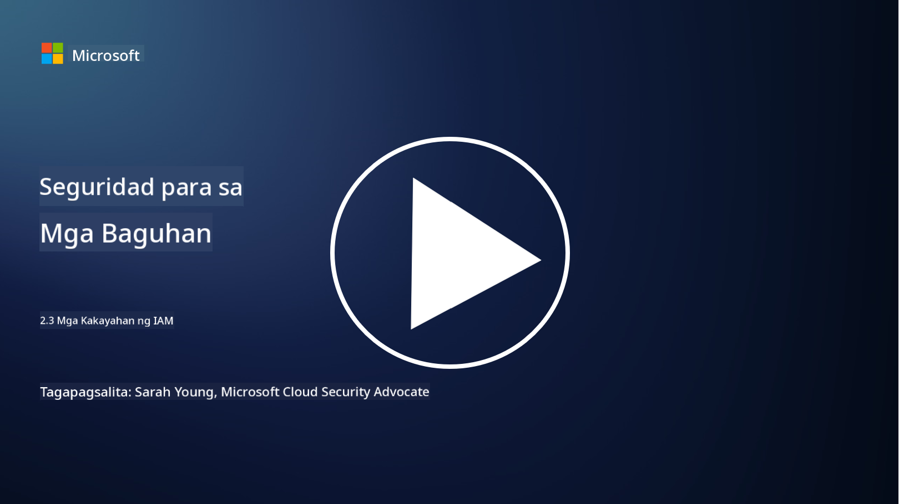

<!--
CO_OP_TRANSLATOR_METADATA:
{
  "original_hash": "bf0b8a54f2c69951744df5a94bc923f7",
  "translation_date": "2025-09-04T01:57:34+00:00",
  "source_file": "2.3 IAM capabilities.md",
  "language_code": "tl"
}
-->
# Mga Kakayahan ng IAM

Sa seksyong ito, tatalakayin natin ang mas detalyadong impormasyon tungkol sa mga pangunahing kasangkapan at kakayahan na ginagamit sa seguridad ng pagkakakilanlan.

## Panimula

Sa araling ito, tatalakayin natin:

 - Ano ang isang directory service?
      
     
    
 - Anong mga kakayahan ang maaaring gamitin upang mapanatiling ligtas ang mga pagkakakilanlan?
>
>        Multi-Factor Authentication (MFA)
> 
>        Single Sign-On (SSO)
> 
>        Role-Based Access Control (RBAC)
> 
>        Adaptive Authentication
> 
>        Biometric Authentication
> 
>        Privileged Access Management (PAM)
> 
>        Identity Governance and Administration (IGA)
> 
>        Behavioral Analytics

## Ano ang isang directory service?

Ang directory service ay isang espesyal na uri ng database na nag-iimbak at namamahala ng impormasyon tungkol sa mga mapagkukunan ng network, kabilang ang mga user, grupo, device, aplikasyon, at iba pang mga bagay. Ito ay nagsisilbing sentralisadong imbakan ng data na may kaugnayan sa pagkakakilanlan at pag-access, na nagbibigay-daan sa mga organisasyon na mahusay na pamahalaan at kontrolin ang user authentication, authorization, at iba pang mga gawain na may kaugnayan sa seguridad.

Ang mga directory service ay may mahalagang papel sa modernong IT environment sa pamamagitan ng pagbibigay ng pundasyon para sa mga solusyon sa identity at access management (IAM). Pinapadali nito ang ligtas na pag-access sa mga mapagkukunan, nagpapatupad ng mga polisiya sa pag-access, at pinapasimple ang mga gawaing administratibo. Isa sa mga pinakakilalang directory service ay ang Microsoft Active Directory, ngunit mayroon ding iba pang mga solusyon tulad ng LDAP (Lightweight Directory Access Protocol) directories na may parehong layunin.

Ang mga pangunahing tungkulin at tampok ng isang directory service sa konteksto ng cybersecurity ay kinabibilangan ng:

 - **User Authentication**: Ang mga directory service ay nagva-validate ng mga kredensyal ng user (tulad ng username at password) upang matiyak na tanging mga awtorisadong user lamang ang makakapasok sa network at mga mapagkukunan nito.
 - **User Authorization**: Tinutukoy nito ang antas ng pag-access ng bawat user batay sa kanilang role, pagiging miyembro ng grupo, at iba pang mga katangian. Tinitiyak nito na ang mga user ay may access lamang sa mga mapagkukunang nararapat sa kanila.
 - **Group Management**: Pinapayagan ng mga directory service ang mga administrador na ayusin ang mga user sa mga lohikal na grupo, na nagpapasimple sa pamamahala ng kontrol sa pag-access. Ang mga permiso ay maaaring italaga sa mga grupo sa halip na sa mga indibidwal na user.
 - **Password Policies**: Ipinapatupad nito ang mga patakaran sa pagiging kumplikado at expiration ng password, na nagpapahusay sa seguridad ng mga account ng user.
 - **Single Sign-On (SSO)**: Ang ilang directory service ay sumusuporta sa SSO, na nagbibigay-daan sa mga user na ma-access ang maraming aplikasyon at serbisyo gamit ang iisang set ng kredensyal.
 - **Centralized User Management**: Pinagsasama-sama ng mga directory service ang impormasyon ng user, na nagpapadali sa pamamahala ng mga account, profile, at katangian ng user mula sa isang lokasyon.
 - **Auditing and Logging**: Maaari nitong i-record ang mga aktibidad sa authentication at pag-access ng user, na nakakatulong sa mga security audit at pagsunod sa mga regulasyon.

## Anong mga kakayahan ang maaaring gamitin upang mapanatiling ligtas ang mga pagkakakilanlan?

**Multi-Factor Authentication (MFA)**

Ang MFA ay nangangailangan ng mga user na magbigay ng maraming anyo ng beripikasyon bago mabigyan ng access. Kadalasan, kabilang dito ang isang bagay na alam ng user (password), isang bagay na hawak ng user (smartphone o security token), at isang bagay na taglay ng user (biometric data tulad ng fingerprint o facial recognition).

**Single Sign-On (SSO)**

Ang SSO ay nagbibigay-daan sa mga user na ma-access ang maraming aplikasyon at sistema gamit ang iisang set ng kredensyal. Pinapabuti nito ang karanasan ng user at binabawasan ang panganib na dulot ng pamamahala ng maraming password.

**Role-Based Access Control (RBAC)**

Ang RBAC ay nagtatalaga ng mga permiso batay sa mga naunang itinakdang role. Ang mga user ay binibigyan ng access batay sa kanilang mga tungkulin sa loob ng isang organisasyon.

**Adaptive Authentication**

Ang adaptive authentication ay sinusuri ang mga salik ng panganib tulad ng lokasyon, device, oras ng pag-access, at pag-uugali ng user upang dynamic na ayusin ang antas ng kinakailangang authentication. Kung ang isang kahilingan ay mukhang kahina-hinala, maaaring ma-trigger ang karagdagang mga hakbang sa authentication.

**Biometric Authentication**

Ang biometric authentication ay gumagamit ng mga natatanging katangiang biyolohikal tulad ng mga fingerprint, facial features, voice patterns, at maging mga ugaling tulad ng bilis ng pagta-type para sa beripikasyon ng pagkakakilanlan.

**Privileged Access Management (PAM)**

Ang PAM ay nakatuon sa pag-secure ng access sa mga kritikal na sistema at data sa pamamagitan ng pagpapatupad ng mahigpit na kontrol sa mga privileged account. Kabilang dito ang mga tampok tulad ng just-in-time access at session monitoring.

**Identity Governance and Administration (IGA)**

Ang mga solusyon sa IGA ay namamahala sa mga pagkakakilanlan ng user at ang kanilang pag-access sa mga mapagkukunan sa buong lifecycle nito. Kasama rito ang onboarding, provisioning, role-based access control, at deprovisioning.

**Behavioral Analytics**

Ang behavioral analytics ay sinusubaybayan ang pag-uugali ng user at nagtatatag ng mga baseline pattern. Ang mga paglihis mula sa normal ay maaaring mag-trigger ng mga alerto para sa karagdagang imbestigasyon.

# Karagdagang Pagbabasa
- [Azure Active Directory fundamentals documentation - Microsoft Entra | Microsoft Learn](https://learn.microsoft.com/azure/active-directory/fundamentals/?WT.mc_id=academic-96948-sayoung)
- [What is Azure Active Directory? - Microsoft Entra | Microsoft Learn](https://learn.microsoft.com/azure/active-directory/fundamentals/whatis?WT.mc_id=academic-96948-sayoung)
- [Manage your multi-cloud identity infrastructure with Microsoft Entra - YouTube](https://www.youtube.com/watch?v=9qQiq3wTS2Y&list=PLXtHYVsvn_b_gtX1-NB62wNervQx1Fhp4&index=18)

---

**Paunawa**:  
Ang dokumentong ito ay isinalin gamit ang AI translation service na [Co-op Translator](https://github.com/Azure/co-op-translator). Bagama't sinisikap naming maging tumpak, tandaan na ang mga awtomatikong pagsasalin ay maaaring maglaman ng mga pagkakamali o hindi pagkakatugma. Ang orihinal na dokumento sa kanyang katutubong wika ang dapat ituring na opisyal na sanggunian. Para sa mahalagang impormasyon, inirerekomenda ang propesyonal na pagsasalin ng tao. Hindi kami mananagot sa anumang hindi pagkakaunawaan o maling interpretasyon na maaaring magmula sa paggamit ng pagsasaling ito.