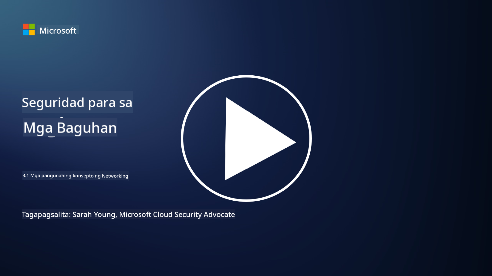

<!--
CO_OP_TRANSLATOR_METADATA:
{
  "original_hash": "252724eceeb183fb9018f88c5e1a3f0c",
  "translation_date": "2025-09-04T01:48:40+00:00",
  "source_file": "3.1 Networking key concepts.md",
  "language_code": "tl"
}
-->
# Mga Pangunahing Konsepto sa Networking

Kung ikaw ay may karanasan sa IT, malamang na naengkwentro mo na ang mga konsepto ng networking. Bagama't ginagamit natin ang identity bilang pangunahing perimeter control sa mga modernong kapaligiran, hindi ibig sabihin nito na hindi na mahalaga ang network controls. Bagama't malawak ang paksang ito, tatalakayin natin sa araling ito ang ilang mahahalagang konsepto sa networking.

Sa araling ito, tatalakayin natin ang:

- Ano ang IP addressing?

- Ano ang OSI model?

- Ano ang TCP/UDP?

- Ano ang mga port number?

- Ano ang encryption kapag nakaimbak at habang ipinapadala?

## Ano ang IP Addressing?

Ang IP addressing, o Internet Protocol addressing, ay isang numerikal na label na itinalaga sa bawat device na konektado sa isang computer network na gumagamit ng Internet Protocol para sa komunikasyon. Ito ay nagsisilbing natatanging pagkakakilanlan para sa mga device sa loob ng isang network, na nagpapahintulot sa mga ito na magpadala at tumanggap ng data sa internet o iba pang magkakaugnay na network. Mayroong dalawang pangunahing bersyon ng IP addressing: IPv4 (Internet Protocol version 4) at IPv6 (Internet Protocol version 6). Ang isang IP address ay karaniwang kinakatawan sa format na IPv4 (hal., 192.168.1.1) o format na IPv6 (hal., 2001:0db8:85a3:0000:0000:8a2e:0370:7334).

## Ano ang OSI Model?

Ang OSI (Open Systems Interconnection) model ay isang konseptwal na balangkas na nag-iistandardisa sa mga tungkulin ng isang communication system sa pitong magkakaibang layer. Ang bawat layer ay may partikular na gawain at nakikipag-ugnayan sa mga kalapit na layer upang matiyak ang mahusay at maaasahang komunikasyon ng data sa pagitan ng mga device sa isang network. Ang mga layer, mula sa ibaba pataas, ay ang mga sumusunod:

1. Physical Layer

2. Data Link Layer

3. Network Layer

4. Transport Layer

5. Session Layer

6. Presentation Layer

7. Application Layer

Ang OSI model ay nagbibigay ng karaniwang sanggunian para sa pag-unawa kung paano nagkakaugnay ang mga networking protocol at teknolohiya, anuman ang partikular na hardware o software na ginagamit.

  
_ref: https://en.wikipedia.org/wiki/OSI_model_

## Ano ang TCP/UDP?

Ang TCP (Transmission Control Protocol) at UDP (User Datagram Protocol) ay dalawang pangunahing transport layer protocol na ginagamit sa mga computer network upang mapadali ang komunikasyon sa pagitan ng mga device sa internet o sa loob ng isang lokal na network. Ang mga ito ay responsable sa paghahati ng data sa mga packet para sa pagpapadala at pagkatapos ay muling binubuo ang mga packet na iyon sa orihinal na data sa tumatanggap na dulo. Gayunpaman, magkaiba sila sa kanilang mga katangian at gamit.

**TCP (Transmission Control Protocol)**:

Ang TCP ay isang connection-oriented protocol na nagbibigay ng maaasahan at maayos na paghahatid ng data sa pagitan ng mga device. Nagtatatag ito ng koneksyon sa pagitan ng nagpapadala at tumatanggap bago magsimula ang pagpapalitan ng data. Tinitiyak ng TCP na ang mga data packet ay dumating sa tamang pagkakasunod-sunod at maaaring hawakan ang retransmission ng mga nawalang packet upang masiguro ang integridad at kumpletong data. Ang TCP ay angkop para sa mga aplikasyon na nangangailangan ng maaasahang paghahatid ng data, tulad ng web browsing, email, file transfer (FTP), at komunikasyon sa database.

**UDP (User Datagram Protocol)**:

Ang UDP ay isang connectionless protocol na nag-aalok ng mas mabilis na pagpapadala ng data ngunit hindi nagbibigay ng parehong antas ng pagiging maaasahan tulad ng TCP. Hindi ito nagtatatag ng pormal na koneksyon bago magpadala ng data at walang mekanismo para sa pagkilala o muling pagpapadala ng mga nawalang packet. Ang UDP ay angkop para sa mga aplikasyon kung saan mas mahalaga ang bilis at kahusayan kaysa sa garantisadong paghahatid, tulad ng real-time na komunikasyon, streaming media, online gaming, at DNS queries.

Sa kabuuan, inuuna ng TCP ang pagiging maaasahan at maayos na paghahatid, kaya angkop ito para sa mga aplikasyon na nangangailangan ng katumpakan ng data, habang binibigyang-diin ng UDP ang bilis at kahusayan, kaya angkop ito para sa mga aplikasyon kung saan katanggap-tanggap ang bahagyang pagkawala ng data o pagbabago ng pagkakasunod-sunod kapalit ng mas mababang latency. Ang pagpili sa pagitan ng TCP at UDP ay nakadepende sa partikular na pangangailangan ng aplikasyon o serbisyong ginagamit.

## Ano ang mga Port Number?

Sa networking, ang port number ay isang numerikal na tagapagkilala na ginagamit upang makilala ang iba't ibang serbisyo o aplikasyon na tumatakbo sa isang device sa loob ng isang network. Ang mga port ay tumutulong sa pagruruta ng papasok na data sa tamang aplikasyon. Ang mga port number ay 16-bit unsigned integers, na nangangahulugang ang mga ito ay nasa saklaw na 0 hanggang 65535. Ang mga ito ay nahahati sa tatlong saklaw:

- Well-Known Ports (0-1023): Nakalaan para sa mga karaniwang serbisyo tulad ng HTTP (port 80) at FTP (port 21).

- Registered Ports (1024-49151): Ginagamit para sa mga aplikasyon at serbisyo na hindi bahagi ng well-known range ngunit opisyal na nakarehistro.

- Dynamic/Private Ports (49152-65535): Available para sa pansamantalang o pribadong paggamit ng mga aplikasyon.

## Ano ang Encryption Kapag Nakaimbak at Habang Ipinapadala?

Ang encryption ay ang proseso ng pag-convert ng data sa isang secure na format upang maprotektahan ito mula sa hindi awtorisadong pag-access o pagbabago. Ang encryption ay maaaring i-apply sa data kapwa "nakaimbak" (kapag naka-save sa isang device o server) at "habang ipinapadala" (kapag ipinapadala sa pagitan ng mga device o sa mga network).

**Encryption Kapag Nakaimbak**: Ito ay tumutukoy sa pag-encrypt ng data na nakaimbak sa mga device, server, o storage system. Kahit na makakuha ng pisikal na access ang isang attacker sa storage media, hindi nila maa-access ang data nang walang encryption keys. Napakahalaga nito para sa pagprotekta sa sensitibong data sakaling magkaroon ng pagnanakaw ng device, data breach, o hindi awtorisadong pag-access.

**Encryption Habang Ipinapadala**: Ito ay tumutukoy sa pag-encrypt ng data habang ito ay naglalakbay sa pagitan ng mga device o sa mga network. Pinipigilan nito ang eavesdropping at hindi awtorisadong interception ng data habang ipinapadala. Ang mga karaniwang protocol para sa encryption habang ipinapadala ay kinabibilangan ng HTTPS para sa web communication at TLS/SSL para sa pag-secure ng iba't ibang uri ng network traffic.

## Karagdagang Pagbabasa
- [How Do IP Addresses Work? (howtogeek.com)](https://www.howtogeek.com/341307/how-do-ip-addresses-work/)
- [Understanding IP Address: An Introductory Guide (geekflare.com)](https://geekflare.com/understanding-ip-address/)
- [What is the OSI model? The 7 layers of OSI explained (techtarget.com)](https://www.techtarget.com/searchnetworking/definition/OSI)
- [The OSI Model – The 7 Layers of Networking Explained in Plain English (freecodecamp.org)](https://www.freecodecamp.org/news/osi-model-networking-layers-explained-in-plain-english/)
- [TCP/IP protocols - IBM Documentation](https://www.ibm.com/docs/en/aix/7.3?topic=protocol-tcpip-protocols)
- [Common Ports Cheat Sheet: The Ultimate Ports & Protocols List (stationx.net)](https://www.stationx.net/common-ports-cheat-sheet/)
- [Azure Data Encryption-at-Rest - Azure Security | Microsoft Learn](https://learn.microsoft.com/azure/security/fundamentals/encryption-atrest?WT.mc_id=academic-96948-sayoung)

---

**Paunawa**:  
Ang dokumentong ito ay isinalin gamit ang AI translation service na [Co-op Translator](https://github.com/Azure/co-op-translator). Bagama't sinisikap naming maging tumpak, pakitandaan na ang mga awtomatikong pagsasalin ay maaaring maglaman ng mga pagkakamali o hindi pagkakatugma. Ang orihinal na dokumento sa orihinal nitong wika ang dapat ituring na opisyal na sanggunian. Para sa mahalagang impormasyon, inirerekomenda ang propesyonal na pagsasalin ng tao. Hindi kami mananagot sa anumang hindi pagkakaunawaan o maling interpretasyon na maaaring magmula sa paggamit ng pagsasaling ito.