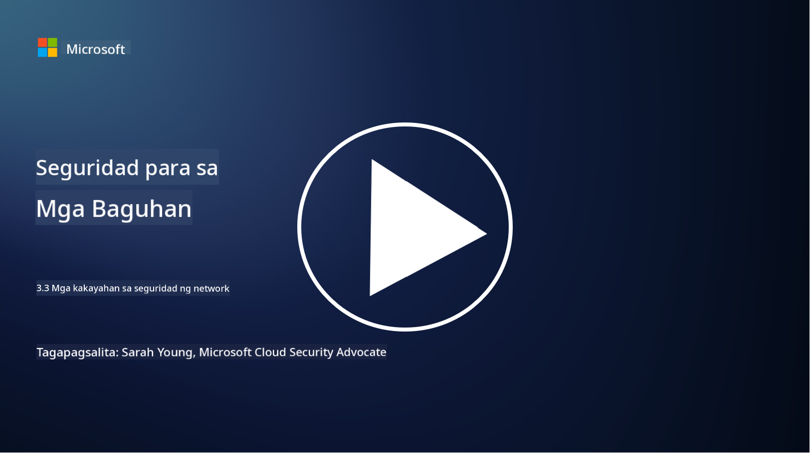

<!--
CO_OP_TRANSLATOR_METADATA:
{
  "original_hash": "c3aba077bb98eebc925dd58d870229ab",
  "translation_date": "2025-09-03T23:35:08+00:00",
  "source_file": "3.3 Network security capabilities.md",
  "language_code": "tl"
}
-->
# Mga kakayahan sa seguridad ng network

Sa araling ito, matututunan natin ang mga sumusunod na kakayahan na maaaring gamitin upang mapanatili ang seguridad ng isang network:

 - Tradisyunal na firewall
 - Web application firewall
 - Cloud security groups
 - CDN
 - Load balancer
 - Bastion host
 - VPN
 - Proteksyon laban sa DDoS

## Tradisyunal na Firewall

Ang tradisyunal na firewall ay mga security device na nagkokontrol at nagmomonitor ng papasok at palabas na network traffic batay sa mga nakatakdang security rules. Nagsisilbi itong harang sa pagitan ng pinagkakatiwalaang internal network at hindi pinagkakatiwalaang external networks, na nagfi-filter ng traffic upang maiwasan ang hindi awtorisadong pag-access at mga potensyal na banta.

## Web Application Firewall

Ang Web Application Firewall (WAF) ay mga espesyal na firewall na idinisenyo upang protektahan ang mga web application laban sa iba't ibang uri ng pag-atake, tulad ng SQL injection, cross-site scripting, at iba pang kahinaan. Sinusuri nila ang mga HTTP request at response upang matukoy at harangin ang malisyosong traffic na tumatarget sa mga web application.

## Cloud Security Groups

Ang security groups ay pangunahing tampok ng network security na ibinibigay ng mga cloud service provider. Nagsisilbi itong virtual firewall na nagkokontrol ng papasok at palabas na traffic sa mga cloud resources, tulad ng virtual machines (VMs) at instances. Pinapayagan ng security groups ang mga organisasyon na magtakda ng mga patakaran na tumutukoy kung anong uri ng traffic ang pinapayagan o tinatanggihan, na nagbibigay ng karagdagang layer ng depensa sa cloud deployments.

## Content Delivery Network (CDN)

Ang Content Delivery Network ay isang distributed network ng mga server na matatagpuan sa iba't ibang lokasyon. Ang CDN ay tumutulong na mapabuti ang performance at availability ng mga website sa pamamagitan ng pag-cache ng content at pagseserbisyo nito mula sa mga server na mas malapit sa user. Nagbibigay din ito ng proteksyon laban sa DDoS attacks sa pamamagitan ng pamamahagi ng traffic sa maraming lokasyon ng server.

## Load Balancer

Ang load balancer ay nagdi-distribute ng papasok na network traffic sa maraming server upang ma-optimize ang paggamit ng resources, matiyak ang mataas na availability, at mapabuti ang performance ng application. Tumutulong ito na maiwasan ang overload ng server at mapanatili ang mabilis na response time, na nagpapalakas sa resilience ng network.

## Bastion Host

Ang bastion host ay mga lubos na secure at isolated na server na nagbibigay ng kontroladong pag-access sa isang network mula sa external, hindi pinagkakatiwalaang network (tulad ng internet). Nagsisilbi itong entry point para sa mga administrator upang ma-access ang mga internal system nang ligtas. Karaniwang naka-configure ang bastion host na may matitibay na security measures upang mabawasan ang attack surface.

## Virtual Private Network (VPN)

Ang VPN ay lumilikha ng encrypted tunnels sa pagitan ng device ng user at ng remote server, na tinitiyak ang secure at pribadong komunikasyon sa mga potensyal na insecure na network tulad ng internet. Karaniwang ginagamit ang VPN upang magbigay ng remote access sa internal networks, na nagpapahintulot sa mga user na ma-access ang mga resources na parang nasa parehong network sila.

## Mga tool para sa proteksyon laban sa DDoS

Ang mga tool at serbisyo para sa proteksyon laban sa DDoS (Distributed Denial of Service) ay idinisenyo upang mabawasan ang epekto ng DDoS attacks, kung saan maraming compromised devices ang bumabaha sa isang network o serbisyo upang ito ay ma-overwhelm. Ang mga solusyon sa proteksyon laban sa DDoS ay tumutukoy at nagfi-filter ng malisyosong traffic, na tinitiyak na ang lehitimong traffic ay makakarating pa rin sa tamang destinasyon.

## Karagdagang babasahin

- [What Is a Firewall? - Cisco](https://www.cisco.com/c/en/us/products/security/firewalls/what-is-a-firewall.html#~types-of-firewalls)
- [What Does a Firewall Actually Do? (howtogeek.com)](https://www.howtogeek.com/144269/htg-explains-what-firewalls-actually-do/)
- [What is a Firewall? How Firewalls Work & Types of Firewalls (kaspersky.com)](https://www.kaspersky.com/resource-center/definitions/firewall)
- [Network security group - how it works | Microsoft Learn](https://learn.microsoft.com/azure/virtual-network/network-security-group-how-it-works)
- [Introduction to Azure Content Delivery Network (CDN) - Training | Microsoft Learn](https://learn.microsoft.com/training/modules/intro-to-azure-content-delivery-network/?WT.mc_id=academic-96948-sayoung)
- [What is a content delivery network (CDN)? - Azure | Microsoft Learn](https://learn.microsoft.com/azure/cdn/cdn-overview?WT.mc_id=academic-96948-sayoung)
- [What Is Load Balancing? How Load Balancers Work (nginx.com)](https://www.nginx.com/resources/glossary/load-balancing/)
- [Bastion hosts vs. VPNs · Tailscale](https://tailscale.com/learn/bastion-hosts-vs-vpns/)
- [What is VPN? How It Works, Types of VPN (kaspersky.com)](https://www.kaspersky.com/resource-center/definitions/what-is-a-vpn)
- [Introduction to Azure DDoS Protection - Training | Microsoft Learn](https://learn.microsoft.com/training/modules/introduction-azure-ddos-protection/?WT.mc_id=academic-96948-sayoung)
- [What Is a DDoS Attack? | Microsoft Security](https://www.microsoft.com/security/business/security-101/what-is-a-ddos-attack?WT.mc_id=academic-96948-sayoung)

---

**Paunawa**:  
Ang dokumentong ito ay isinalin gamit ang AI translation service na [Co-op Translator](https://github.com/Azure/co-op-translator). Bagama't sinisikap naming maging tumpak, tandaan na ang mga awtomatikong pagsasalin ay maaaring maglaman ng mga pagkakamali o hindi pagkakatugma. Ang orihinal na dokumento sa kanyang katutubong wika ang dapat ituring na opisyal na pinagmulan. Para sa mahalagang impormasyon, inirerekomenda ang propesyonal na pagsasalin ng tao. Hindi kami mananagot sa anumang hindi pagkakaunawaan o maling interpretasyon na maaaring magmula sa paggamit ng pagsasaling ito.