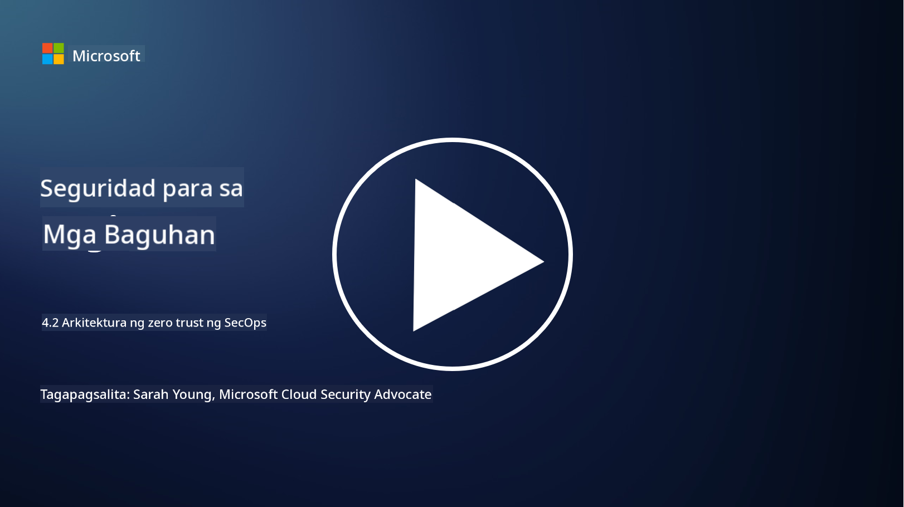

<!--
CO_OP_TRANSLATOR_METADATA:
{
  "original_hash": "45bbdc114e70936816b0b3e7c40189cf",
  "translation_date": "2025-09-04T00:46:22+00:00",
  "source_file": "4.2 SecOps zero trust architecture.md",
  "language_code": "tl"
}
-->
# SecOps zero trust architecture

Ang security operations ay binubuo ng dalawang bahagi ng zero trust architecture, at sa araling ito ay tatalakayin natin ang pareho:

- Paano dapat itayo ang IT architectures upang pahintulutan ang sentralisadong koleksyon ng log?

- Ano ang mga pinakamahusay na kasanayan para sa security operations sa makabagong IT environments?

## Paano dapat itayo ang IT architectures upang pahintulutan ang sentralisadong koleksyon ng log?

Ang sentralisadong koleksyon ng log ay isang mahalagang bahagi ng makabagong security operations. Pinapahintulutan nito ang mga organisasyon na pagsama-samahin ang mga log at datos mula sa iba't ibang pinagmulan, tulad ng mga server, aplikasyon, network devices, at security tools, sa isang sentral na repository para sa pagsusuri, pagmamanman, at pagtugon sa insidente. Narito ang ilang pinakamahusay na kasanayan para sa pagbuo ng IT architectures na sumusuporta sa sentralisadong koleksyon ng log:

1. **Integrasyon ng Log Source**:

- Siguraduhing ang lahat ng kaugnay na mga device at sistema ay naka-configure upang makabuo ng mga log. Kasama rito ang mga server, firewall, router, switch, aplikasyon, at security appliances.

- I-configure ang mga log source upang maipasa ang mga log sa isang sentralisadong log collector o management system.

2. **Piliin ang tamang SIEM (Security Information and Event Management) tool**:

- Pumili ng SIEM (Security Information and Event Management) solution na naaayon sa pangangailangan at saklaw ng iyong organisasyon.

- Siguraduhing sinusuportahan ng napiling solusyon ang koleksyon, pagsasama-sama, pagsusuri, at pag-uulat ng log.

3. **Scalability at Redundancy**:

- Idisenyo ang arkitektura para sa scalability upang matugunan ang lumalaking bilang ng mga log source at tumataas na dami ng log.

- Magpatupad ng redundancy para sa mataas na availability upang maiwasan ang pagkaantala dulot ng hardware o network failures.

4. **Ligtas na paglipat ng mga log**:

- Gumamit ng mga secure na protocol tulad ng TLS/SSL o IPsec para sa paglipat ng mga log mula sa mga pinagmulan patungo sa sentralisadong repository.

- Magpatupad ng authentication at access controls upang matiyak na tanging mga awtorisadong device lamang ang maaaring magpadala ng mga log.

5. **Normalisasyon**:

- I-standardize ang mga format ng log at i-normalize ang datos upang matiyak ang pagkakapare-pareho at kadalian ng pagsusuri.

6. **Imbakan at Retensyon**:

- Tukuyin ang angkop na panahon ng retensyon para sa mga log batay sa mga kinakailangan sa pagsunod at seguridad.

- Itago ang mga log nang ligtas, protektado laban sa hindi awtorisadong pag-access at pagbabago.

## Ano ang mga pinakamahusay na kasanayan para sa security operations sa makabagong IT environments?

Bukod sa sentralisadong koleksyon ng log, narito ang ilang pinakamahusay na kasanayan para sa security operations sa makabagong IT environments:

1. **Patuloy na Pagmamanman**: Magpatupad ng tuloy-tuloy na pagmamanman ng mga aktibidad sa network at sistema upang matukoy at matugunan ang mga banta sa real time.

2. **Threat Intelligence**: Manatiling may kaalaman tungkol sa mga bagong banta at kahinaan sa pamamagitan ng paggamit ng threat intelligence feeds at serbisyo.

3. **Pagsasanay ng User**: Magsagawa ng regular na pagsasanay sa seguridad para sa mga empleyado upang mabawasan ang mga panganib na dulot ng social engineering at phishing attacks.

4. **Plano sa Pagtugon sa Insidente**: Bumuo at subukan ang isang plano sa pagtugon sa insidente upang matiyak ang mabilis at epektibong pagtugon sa mga insidente sa seguridad.

5. **Security Automation**: Gamitin ang mga security automation at orchestration tools upang mapabilis ang pagtugon sa insidente at mga paulit-ulit na gawain.

6. **Backup at Pagbawi**: Magpatupad ng matibay na backup at disaster recovery solutions upang matiyak ang pagkakaroon ng datos sakaling magkaroon ng pagkawala ng datos o ransomware attacks.

## Karagdagang babasahin

- [Microsoft Security Best Practices module: Security operations | Microsoft Learn](https://learn.microsoft.com/security/operations/security-operations-videos-and-decks?WT.mc_id=academic-96948-sayoung)
- [Security operations - Cloud Adoption Framework | Microsoft Learn](https://learn.microsoft.com/azure/cloud-adoption-framework/secure/security-operations?WT.mc_id=academic-96948-sayoung)
- [What is Security Operations and Analytics Platform Architecture? A Definition of SOAPA, How It Works, Benefits, and More (digitalguardian.com)](https://www.digitalguardian.com/blog/what-security-operations-and-analytics-platform-architecture-definition-soapa-how-it-works#:~:text=All%20in%20all%2C%20security%20operations%20and%20analytics%20platform,become%20more%20efficient%20and%20operative%20with%20your%20security.)

---

**Paunawa**:  
Ang dokumentong ito ay isinalin gamit ang AI translation service na [Co-op Translator](https://github.com/Azure/co-op-translator). Bagama't sinisikap naming maging tumpak, tandaan na ang mga awtomatikong pagsasalin ay maaaring maglaman ng mga pagkakamali o hindi pagkakatugma. Ang orihinal na dokumento sa kanyang katutubong wika ang dapat ituring na opisyal na sanggunian. Para sa mahalagang impormasyon, inirerekomenda ang propesyonal na pagsasalin ng tao. Hindi kami mananagot sa anumang hindi pagkakaunawaan o maling interpretasyon na maaaring magmula sa paggamit ng pagsasaling ito.