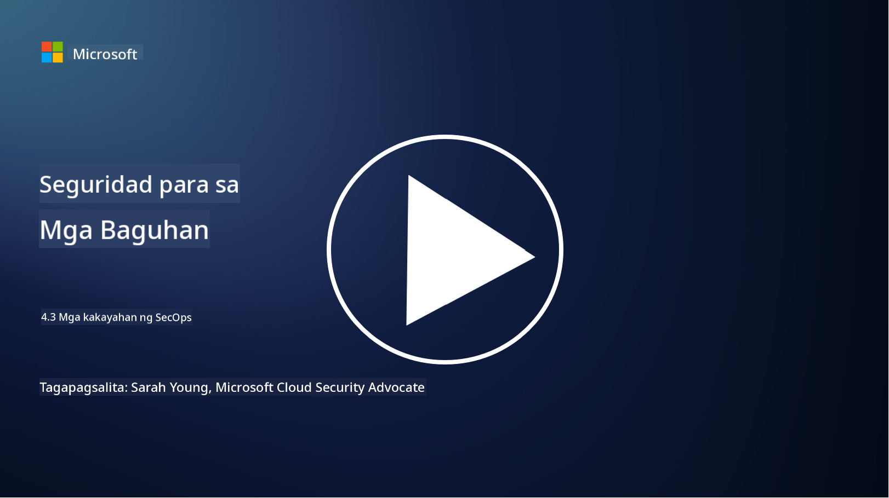

<!--
CO_OP_TRANSLATOR_METADATA:
{
  "original_hash": "553eb694c89f1caca0694e8d8ab89e0e",
  "translation_date": "2025-09-04T01:21:24+00:00",
  "source_file": "4.3 SecOps capabilities.md",
  "language_code": "tl"
}
-->
# Mga Kakayahan ng SecOps

Sa seksyong ito, tatalakayin natin ang mas detalyadong impormasyon tungkol sa mga pangunahing kasangkapan at kakayahan na maaaring gamitin sa mga operasyon sa seguridad.

Sa araling ito, tatalakayin natin:

- Ano ang isang security information and event management (SIEM) tool?

- Ano ang XDR?

- Anong mga kakayahan ang maaaring gamitin upang mapahusay ang mga operasyon sa seguridad?

## Ano ang isang security information and event management (SIEM) tool?

Ang Security Information and Event Management (SIEM) tool ay ginagamit upang magbigay ng pagsusuri sa mga alerto sa seguridad na nabubuo sa buong IT environment ng isang organisasyon. Kinokolekta, iniipon, kinokorelasyon, at sinusuri nito ang mga log data at mga kaganapan sa seguridad mula sa iba't ibang pinagmulan, tulad ng mga network device, server, aplikasyon, at mga sistema ng seguridad.

Ang mga pangunahing tungkulin at kakayahan ng mga SIEM tool ay kinabibilangan ng:

1. **Pagkolekta ng Log**: Kinokolekta ng mga SIEM tool ang mga log at data ng kaganapan sa seguridad mula sa malawak na hanay ng mga device, sistema, at aplikasyon, kabilang ang mga firewall, intrusion detection system, antivirus software, at iba pa.

2. **Pag-normalize ng Data**: Ino-normalize nila ang log data sa isang karaniwang format upang mapadali ang pagsusuri at korelasyon.

3. **Korelasyon ng Kaganapan**: Kinokorelasyon ng mga SIEM tool ang mga kaganapan upang matukoy ang mga pattern at anomalya na maaaring magpahiwatig ng mga insidente o banta sa seguridad.

4. **Pag-alerto at Notipikasyon**: Gumagawa ang mga SIEM tool ng mga alerto at notipikasyon sa real-time kapag may natukoy na kahina-hinalang aktibidad o paglabag sa seguridad, na nagbibigay-daan para sa agarang tugon.

5. **Pagtukoy ng Insidente**: Pinapadali nila ang pagtukoy ng mga insidente sa seguridad, kabilang ang hindi awtorisadong pag-access, data breaches, malware infections, at mga banta mula sa loob.

6. **User and Entity Behavior Analytics (UEBA)**: Ang ilang SIEM tool ay may kasamang UEBA na kakayahan upang matukoy ang hindi normal na kilos ng mga user at entity na maaaring magpahiwatig ng mga kompromisong account o banta mula sa loob.

7. **Integrasyon ng Threat Intelligence**: Maaaring mag-integrate ang mga SIEM tool sa mga threat intelligence feed upang mapahusay ang pagtukoy ng banta sa pamamagitan ng paghahambing ng mga kilalang indicator of compromise (IOCs) sa aktibidad ng network.

8. **Automation at Orkestrasyon**: Ang mga tampok na automation ay nagbibigay-daan sa mga SIEM na awtomatikong tumugon sa mga karaniwang insidente sa seguridad, na nagpapabawas ng oras ng tugon at manu-manong pagsisikap.

9. **Dashboard at Visualization**: Nag-aalok sila ng mga dashboard at tool sa visualization para sa pagsubaybay sa data ng seguridad at paggawa ng mga custom na ulat.

10. **Integrasyon sa Iba Pang Security Tools**: Madalas na nag-iintegrate ang mga SIEM tool sa iba pang mga kasangkapan at teknolohiya sa seguridad, tulad ng endpoint detection and response (EDR) solutions, upang magbigay ng holistic na pananaw sa seguridad ng isang organisasyon.

## Ano ang XDR?

Ang XDR (Extended Detection and Response) ay isang teknolohiya na nagpapalawak sa mga kakayahan ng tradisyunal na Endpoint Detection and Response (EDR) at pinagsasama ang mas malawak na telemetry ng seguridad mula sa iba't ibang pinagmulan upang magbigay ng mas komprehensibong pananaw sa seguridad ng isang organisasyon. Layunin ng XDR na mapabuti ang pagtukoy ng banta, pagtugon sa insidente, at pangkalahatang seguridad sa pamamagitan ng pagtugon sa mga limitasyon ng pag-asa lamang sa EDR, SIEM, o iba pang indibidwal na kasangkapan sa seguridad.

Ang mga pangunahing katangian at bahagi ng XDR ay kinabibilangan ng:

1. **Integrasyon ng Data**: Pinagsasama ng XDR ang data mula sa maraming pinagmulan, kabilang ang mga endpoint, trapiko sa network, mga serbisyo sa cloud, email, at iba pa. Ang komprehensibong pagsasama ng data na ito ay nagbibigay ng mas malawak na konteksto para sa pagtukoy at pagsusuri ng banta.

2. **Advanced Analytics**: Gumagamit ang XDR ng advanced analytics, machine learning, at pagsusuri ng pag-uugali upang matukoy at unahin ang mga banta sa seguridad. Hinahanap nito ang mga pattern at anomalya sa pinagsamang data upang matukoy ang parehong kilala at hindi kilalang mga banta.

3. **Awtomatikong Pagtukoy ng Banta**: Awtomatikong tinutukoy ng XDR ang mga banta sa seguridad at anomalya sa pamamagitan ng pagkokorelasyon ng impormasyon mula sa iba't ibang pinagmulan. Maaari nitong matukoy ang mga kumplikadong attack chain na maaaring sumaklaw sa maraming vector.

4. **Pagsisiyasat at Pagtugon sa Insidente**: Nagbibigay ang XDR ng mga kasangkapan para sa pagsisiyasat at pagtugon sa insidente, na tumutulong sa mga security team na mabilis na masuri ang saklaw at epekto ng mga insidente at gumawa ng angkop na aksyon.

5. **Integrasyon ng Threat Intelligence**: Ini-integrate nito ang mga threat intelligence feed at data upang mapahusay ang pagtukoy ng banta sa pamamagitan ng paghahambing ng mga kilalang indicator of compromise (IOCs) sa aktibidad ng network at endpoint ng organisasyon.

6. **Unified Console**: Karaniwang nag-aalok ang XDR ng isang unified console o dashboard kung saan maaaring tingnan at pamahalaan ng mga security team ang mga alerto at insidente sa seguridad mula sa iba't ibang pinagmulan sa isang sentralisadong paraan.

7. **Cross-Platform Coverage**: Sinasaklaw ng mga XDR solution ang malawak na hanay ng mga platform, kabilang ang mga endpoint, server, cloud environment, at mga mobile device, na angkop para sa modernong, multi-platform na IT environment.

## Anong mga kakayahan ang maaaring gamitin upang mapahusay ang mga operasyon sa seguridad?

Upang mapahusay ang mga operasyon sa seguridad, maaaring gamitin ng mga organisasyon ang ilang kakayahan bukod sa mga SIEM tool:

1. **Machine Learning at Artificial Intelligence**: Ipatupad ang advanced analytics, machine learning, at AI upang matukoy ang mga umuusbong na banta at awtomatikong maghanap ng banta.

2. **User and Entity Behavior Analytics (UEBA)**: Suriin ang kilos ng mga user at entity upang matukoy ang mga anomalya at banta mula sa loob.

3. **Threat Intelligence Feeds**: I-integrate ang mga threat intelligence feed upang manatiling updated sa pinakabagong mga banta at indicator of compromise.

4. **Security Orchestration, Automation, and Response (SOAR)**: Ipatupad ang mga SOAR platform upang awtomatikong tumugon sa mga insidente at i-streamline ang mga workflow ng operasyon sa seguridad.

5. **Deception Technologies**: Gumamit ng mga deception technology upang linlangin at matukoy ang mga umaatake sa loob ng network.

## Karagdagang Pagbabasa

- [What is SIEM? | Microsoft Security](https://www.microsoft.com/security/business/security-101/what-is-siem?WT.mc_id=academic-96948-sayoung)
- [What Is SIEM? - Security Information and Event Management - Cisco](https://www.cisco.com/c/en/us/products/security/what-is-siem.html)
- [Security information and event management - Wikipedia](https://en.wikipedia.org/wiki/Security_information_and_event_management)
- [What Is XDR? | Microsoft Security](https://www.microsoft.com/security/business/security-101/what-is-xdr?WT.mc_id=academic-96948-sayoung)
- [XDR & XDR Security (kaspersky.com.au)](https://www.kaspersky.com.au/resource-center/definitions/what-is-xdr)
- [The Power of SecOps: Redefining Core Security Capabilities - The New Stack](https://thenewstack.io/the-power-of-secops-redefining-core-security-capabilities/)
- [Seven Steps to Improve Your Security Operations and Response (securityintelligence.com)](https://securityintelligence.com/seven-steps-to-improve-your-security-operations-and-response/)

---

**Paunawa**:  
Ang dokumentong ito ay isinalin gamit ang AI translation service na [Co-op Translator](https://github.com/Azure/co-op-translator). Bagama't sinisikap naming maging tumpak, pakitandaan na ang mga awtomatikong pagsasalin ay maaaring maglaman ng mga pagkakamali o hindi pagkakatugma. Ang orihinal na dokumento sa orihinal nitong wika ang dapat ituring na opisyal na sanggunian. Para sa mahalagang impormasyon, inirerekomenda ang propesyonal na pagsasalin ng tao. Hindi kami mananagot sa anumang hindi pagkakaunawaan o maling interpretasyon na maaaring magmula sa paggamit ng pagsasaling ito.