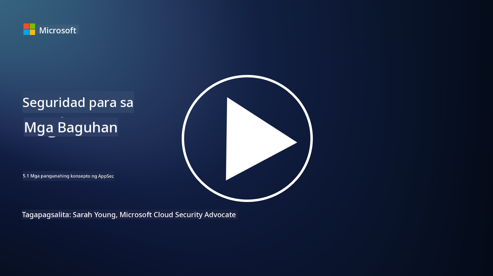

<!--
CO_OP_TRANSLATOR_METADATA:
{
  "original_hash": "e4b56bb23078d3ffb7ad407d280b0c36",
  "translation_date": "2025-09-04T00:33:26+00:00",
  "source_file": "5.1 AppSec key concepts.md",
  "language_code": "tl"
}
-->
# Mga pangunahing konsepto ng AppSec

Ang seguridad ng aplikasyon ay isang espesyalisasyon sa seguridad sa sarili nitong karapatan. Sa bahaging ito ng kurso, mas titingnan natin ang seguridad ng aplikasyon.

## Panimula

Sa araling ito, tatalakayin natin:

- Ano ang seguridad ng aplikasyon?

- Ano ang mga pangunahing konsepto/prinsipyo ng seguridad ng aplikasyon?

## Ano ang seguridad ng aplikasyon?

Ang seguridad ng aplikasyon, na madalas pinaikli bilang "AppSec," ay tumutukoy sa kasanayan ng pagprotekta sa mga software application laban sa mga banta, kahinaan, at pag-atake sa seguridad. Saklaw nito ang mga proseso, teknolohiya, at mga tool na ginagamit upang tukuyin, bawasan, at pigilan ang mga panganib sa seguridad sa buong lifecycle ng pag-develop, pag-deploy, at pagpapanatili ng isang aplikasyon.

Mahalaga ang seguridad ng aplikasyon dahil ang mga aplikasyon ay karaniwang target ng mga cyberattack. Sinusamantala ng mga malisyosong aktor ang mga kahinaan at kahinaan sa software upang makakuha ng hindi awtorisadong access, magnakaw ng data, magdulot ng pagkagambala sa serbisyo, o magsagawa ng iba pang malisyosong aktibidad. Ang epektibong seguridad ng aplikasyon ay tumutulong upang matiyak ang pagiging kumpidensyal, integridad, at pagkakaroon ng isang aplikasyon at ng kaugnay nitong data.

## Ano ang mga pangunahing konsepto/prinsipyo ng seguridad ng aplikasyon?

Ang mga pangunahing konsepto at prinsipyo na sumusuporta sa seguridad ng aplikasyon ay kinabibilangan ng:

1. **Secure by Design**:

- Ang seguridad ay dapat isama sa disenyo at arkitektura ng aplikasyon mula sa simula, sa halip na idagdag lamang pagkatapos.

2. **Input Validation**:

- Ang lahat ng input ng user ay dapat i-validate upang matiyak na sumusunod ito sa inaasahang format at walang malisyosong code o data.

3. **Output Encoding**:

- Ang data na ipinapadala sa client ay dapat maayos na ma-encode upang maiwasan ang mga kahinaan tulad ng cross-site scripting (XSS).

4. **Authentication at Authorization**:

- I-authenticate ang mga user at i-authorize ang kanilang access sa mga resources batay sa kanilang mga role at permiso.

5. **Proteksyon ng Data**:

- Ang sensitibong data ay dapat i-encrypt kapag iniimbak, ipinapadala, at pinoproseso upang maiwasan ang hindi awtorisadong access.

6. **Session Management**:

- Ang secure na pamamahala ng session ay tumitiyak na ang mga session ng user ay protektado laban sa hijacking at hindi awtorisadong access.

7. **Secure Dependencies**:

- Panatilihing updated ang lahat ng software dependencies gamit ang mga security patch upang maiwasan ang mga kahinaan.

8. **Error Handling at Logging**:

- Magpatupad ng secure na paghawak ng error upang maiwasan ang pagbubunyag ng sensitibong impormasyon at tiyakin ang secure na mga kasanayan sa pag-log.

9. **Security Testing**:

- Regular na subukan ang mga aplikasyon para sa mga kahinaan gamit ang mga pamamaraan tulad ng penetration testing, code reviews, at automated scanning tools.

10. **Secure Software Development Lifecycle (SDLC)**:

- Isama ang mga kasanayan sa seguridad sa bawat yugto ng lifecycle ng pag-develop ng software, mula sa mga kinakailangan hanggang sa pag-deploy at pagpapanatili.

## Karagdagang babasahin

- [SheHacksPurple: What is Application Security? - YouTube](https://www.youtube.com/watch?v=eNmccQNzSSY)
- [What Is Application Security? - Cisco](https://www.cisco.com/c/en/us/solutions/security/application-first-security/what-is-application-security.html#~how-does-it-work)
- [What is application security? A process and tools for securing software | CSO Online](https://www.csoonline.com/article/566471/what-is-application-security-a-process-and-tools-for-securing-software.html)
- [OWASP Cheat Sheet Series | OWASP Foundation](https://owasp.org/www-project-cheat-sheets/)

---

**Paunawa**:  
Ang dokumentong ito ay isinalin gamit ang AI translation service na [Co-op Translator](https://github.com/Azure/co-op-translator). Bagama't sinisikap naming maging tumpak, pakitandaan na ang mga awtomatikong pagsasalin ay maaaring maglaman ng mga pagkakamali o hindi pagkakatugma. Ang orihinal na dokumento sa kanyang katutubong wika ang dapat ituring na opisyal na sanggunian. Para sa mahalagang impormasyon, inirerekomenda ang propesyonal na pagsasalin ng tao. Hindi kami mananagot sa anumang hindi pagkakaunawaan o maling interpretasyon na maaaring magmula sa paggamit ng pagsasaling ito.