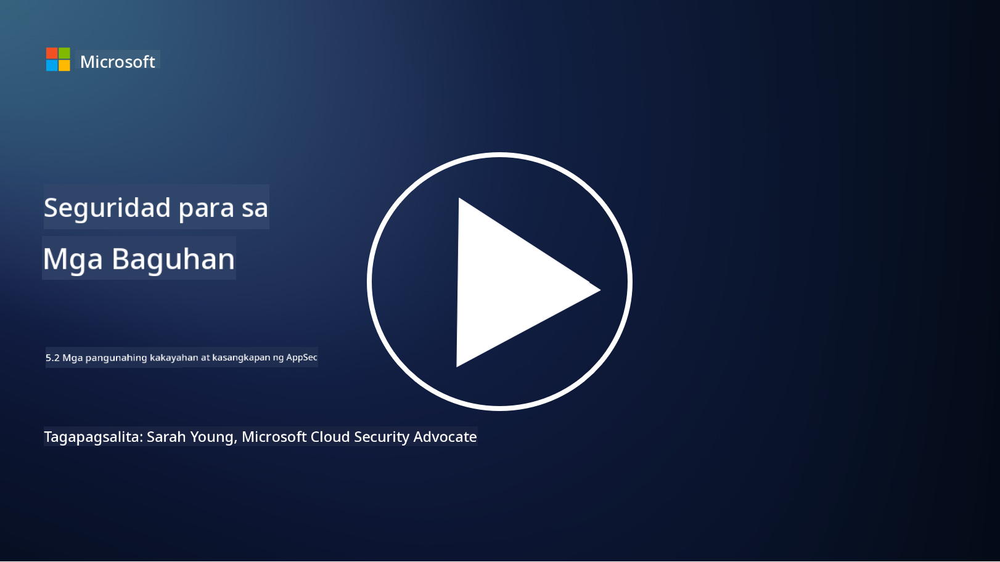

<!--
CO_OP_TRANSLATOR_METADATA:
{
  "original_hash": "790a3fa7e535ec60bb51bde13e759781",
  "translation_date": "2025-09-04T00:51:50+00:00",
  "source_file": "5.2 AppSec key capabilities.md",
  "language_code": "tl"
}
-->
## Panimula

Sa seksyong ito, tatalakayin natin ang mga pangunahing kakayahan at mga kasangkapan na ginagamit sa seguridad ng aplikasyon.

## Mga pangunahing kakayahan at kasangkapan sa AppSec

Ang mga pangunahing kakayahan at kasangkapan na ginagamit sa seguridad ng aplikasyon ay mahalaga para matukoy, mabawasan, at maiwasan ang mga kahinaan at banta sa seguridad ng mga software application. Narito ang ilan sa mga pinakamahalaga:

**1. Static Application Security Testing (SAST)**:

- **Kakayahan**: Sinusuri ang source code, bytecode, o binary code upang matukoy ang mga kahinaan sa seguridad sa codebase ng aplikasyon.

- **Mga Kasangkapan**: Halimbawa ay Fortify, Checkmarx, at Veracode.

**2. Dynamic Application Security Testing (DAST)**:

- **Kakayahan**: Sinusuri ang tumatakbong aplikasyon upang matukoy ang mga kahinaan sa pamamagitan ng pagpapadala ng mga input request at pagsusuri ng mga tugon.

- **Mga Kasangkapan**: Halimbawa ay ZAP, Burp Suite, at Qualys Web Application Scanning.

**3. Interactive Application Security Testing (IAST)**:

- **Kakayahan**: Pinagsasama ang mga elemento ng SAST at DAST upang suriin ang code habang tumatakbo ang aplikasyon, nagbibigay ng mas tumpak na resulta at binabawasan ang mga maling positibo.

- **Mga Kasangkapan**: Halimbawa ay Contrast Security at HCL AppScan.

**4. Runtime Application Self-Protection (RASP)**:

- **Kakayahan**: Binabantayan at pinoprotektahan ang mga aplikasyon sa real-time, natutukoy at tumutugon sa mga banta sa seguridad habang nangyayari ang mga ito.

- **Mga Kasangkapan**: Halimbawa ay Veracode Runtime Protection at F5 Advanced WAF with RASP.

**5. Web Application Firewalls (WAFs)**:

- **Kakayahan**: Nagbibigay ng proteksiyon sa pagitan ng aplikasyon at internet, sinasala ang papasok na trapiko at hinaharangan ang mga malisyosong kahilingan.

- **Mga Kasangkapan**: Halimbawa ay ModSecurity, AWS WAF, at Akamai Kona Site Defender.

**6. Dependency Scanning**:

- **Kakayahan**: Natutukoy ang mga kahinaan sa mga third-party na library at mga bahagi na ginagamit sa aplikasyon.

- **Mga Kasangkapan**: Halimbawa ay OWASP Dependency-Check at Snyk.

**7. Penetration Testing (Pen Testing)**:

- **Kakayahan**: Ginagaya ang mga totoong atake upang matuklasan ang mga kahinaan at masuri ang seguridad ng isang aplikasyon.

- **Mga Kasangkapan**: Isinasagawa ng mga sertipikadong ethical hacker at mga propesyonal sa seguridad gamit ang iba't ibang kasangkapan tulad ng Metasploit at Nmap.

**8. Security Scanning and Analysis**:

- **Kakayahan**: Sinusuri ang mga kilalang kahinaan, mga error sa configuration, at mga maling configuration sa seguridad.

- **Mga Kasangkapan**: Halimbawa ay Nessus, Qualys Vulnerability Management, at OpenVAS.

**9. Container Security Tools**:

- **Kakayahan**: Nakatuon sa pag-secure ng mga containerized na aplikasyon at ang kanilang mga kapaligiran.

- **Mga Kasangkapan**: Halimbawa ay Docker Security Scanning at Aqua Security.

**10. Secure Development Training**:

- **Kakayahan**: Nagbibigay ng mga programa sa pagsasanay at kamalayan para sa mga development team upang maisulong ang ligtas na mga kasanayan sa pag-coding.

- **Mga Kasangkapan**: Mga customized na programa sa pagsasanay at mga platform.

**11. Security Testing Frameworks**:

- **Kakayahan**: Nagbibigay ng komprehensibong mga framework para sa iba't ibang pangangailangan sa pagsusuri ng seguridad ng aplikasyon.

- **Mga Kasangkapan**: OWASP Amass, OWASP OWTF, at FrAppSec.

**12. Secure Code Review Tools**:

- **Kakayahan**: Sinusuri ang source code para sa mga kahinaan sa seguridad at mga pinakamahusay na kasanayan sa pag-coding.

- **Mga Kasangkapan**: Halimbawa ay SonarQube at Checkmarx.

**13. Secure APIs and Microservices Tools**:

- **Kakayahan**: Nakatuon sa pag-secure ng mga API at microservices, kabilang ang authentication, authorization, at proteksyon ng data.

- **Mga Kasangkapan**: Halimbawa ay Apigee, AWS API Gateway, at Istio.

## Karagdagang Pagbabasa

- [What Is Application Security? Concepts, Tools & Best Practices | HackerOne](https://www.hackerone.com/knowledge-center/what-application-security-concepts-tools-best-practices)  
- [What is IAST? (Interactive Application Security Testing) (comparitech.com)](https://www.comparitech.com/net-admin/what-is-iast/)  
- [10 Types of Application Security Testing Tools: When and How to Use Them (cmu.edu)](https://insights.sei.cmu.edu/blog/10-types-of-application-security-testing-tools-when-and-how-to-use-them/)  
- [Shifting the Balance of Cybersecurity Risk: Principles and Approaches for Security-by-Design and Default | Cyber.gov.au](https://www.cyber.gov.au/about-us/view-all-content/publications/principles-and-approaches-for-security-by-design-and-default)  

---

**Paunawa**:  
Ang dokumentong ito ay isinalin gamit ang AI translation service na [Co-op Translator](https://github.com/Azure/co-op-translator). Bagama't sinisikap naming maging tumpak, pakitandaan na ang mga awtomatikong pagsasalin ay maaaring maglaman ng mga pagkakamali o hindi pagkakatugma. Ang orihinal na dokumento sa kanyang orihinal na wika ang dapat ituring na opisyal na sanggunian. Para sa mahalagang impormasyon, inirerekomenda ang propesyonal na pagsasalin ng tao. Hindi kami mananagot sa anumang hindi pagkakaunawaan o maling interpretasyon na maaaring magmula sa paggamit ng pagsasaling ito.