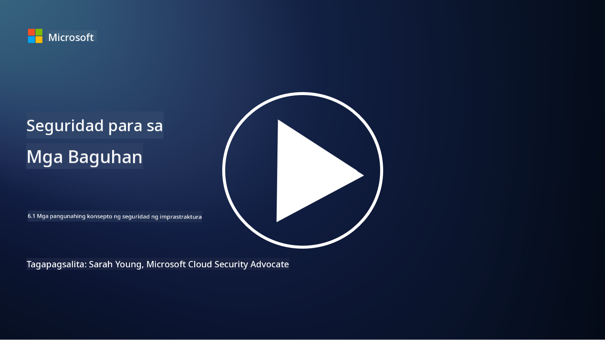

<!--
CO_OP_TRANSLATOR_METADATA:
{
  "original_hash": "882ebf66a648f419bcbf680ed6aefa00",
  "translation_date": "2025-09-03T23:16:00+00:00",
  "source_file": "6.1 Infrastructure security key concepts.md",
  "language_code": "tl"
}
-->
# Mga Pangunahing Konsepto sa Seguridad ng Imprastraktura

Ang "imprastraktura" ay tumutukoy sa mga pundasyon ng anumang IT environment, kabilang ang mga server, cloud services, at containers – isang malawak na hanay ng iba't ibang teknolohiya. Ang mga aplikasyon na tinalakay sa nakaraang seksyon ay tumatakbo sa imprastraktura, kaya maaari rin itong maging target ng mga umaatake.

Sa araling ito, tatalakayin natin:

- Ano ang security hygiene at bakit ito mahalaga?

- Ano ang security posture management?

- Ano ang patching at bakit ito mahalaga?

- Ano ang containers at ano ang kakaiba sa kanilang seguridad?

## Ano ang security hygiene at bakit ito mahalaga?

Ang **security hygiene** ay tumutukoy sa hanay ng mga gawi at asal na sinusunod ng mga indibidwal at organisasyon upang mapanatili ang mabuting cybersecurity habits. Kasama rito ang mga hakbang upang protektahan ang mga sistema, data, at network mula sa mga banta at kahinaan. Mahalagang magkaroon ng mabuting security hygiene dahil sa mga sumusunod na dahilan:

- **Pag-iwas sa Pag-atake**: Ang pagsunod sa mga pinakamahusay na gawi ay makakatulong upang maiwasan ang mga karaniwang cyberattacks, tulad ng phishing, malware infections, at hindi awtorisadong pag-access.

- **Pagprotekta sa Data**: Ang tamang security hygiene ay nagpoprotekta sa sensitibo at kumpidensyal na data mula sa pagnanakaw o pagkakalantad.

- **Pagpapanatili ng Tiwala**: Ang mga organisasyong nagpapakita ng mabuting security hygiene ay nakakapagbuo ng tiwala sa mga customer at kasosyo.

- **Pagsunod sa Regulasyon**: Maraming regulasyon at pamantayan ang nangangailangan ng pagsunod sa mga security hygiene practices.

- **Pagbawas ng Panganib**: Ang tuloy-tuloy na security hygiene ay nagpapababa ng kabuuang panganib ng mga insidente at paglabag sa seguridad.

Kasama sa security hygiene ang mga gawi tulad ng pag-update ng software, paggamit ng malalakas na password at multi-factor authentication, regular na backups, pagsasanay ng mga empleyado, at pagmamanman sa mga kahina-hinalang aktibidad. Ito ang pundasyon ng isang matibay na cybersecurity posture.

## Ano ang security posture management?

Ang Security Posture Management ay tumutukoy sa kasanayan ng pagsusuri, pagmamanman, at pamamahala sa kabuuang cybersecurity posture ng isang organisasyon. Ang cybersecurity posture ay tumutukoy sa kabuuang diskarte at kahandaan ng isang organisasyon na protektahan ang mga sistema ng impormasyon (IT), network, data, at mga asset nito mula sa mga banta at pag-atake. Kasama rito ang mga estratehiya, polisiya, gawi, at teknolohiya na ginagamit ng isang organisasyon upang mapangalagaan ang mga digital asset nito at mapanatili ang pagiging kumpidensyal, integridad, at availability ng impormasyon.

Kasama sa Security Posture Management ang pagsusuri at pagpapanatili ng seguridad ng mga sistema, network, aplikasyon, at data upang matiyak na naaayon ang mga ito sa mga polisiya sa seguridad, pinakamahusay na gawi, at mga kinakailangan sa pagsunod. Layunin ng SPM na magbigay ng komprehensibong pananaw sa kalagayan ng seguridad ng isang organisasyon, tukuyin ang mga kahinaan, at unahin ang mga hakbang sa pag-aayos.

## Ano ang patching at bakit ito mahalaga?

Ang **patching** ay tumutukoy sa proseso ng paglalapat ng mga update sa software, na kilala rin bilang patches o fixes, sa software, operating systems, at applications. Ang mga update na ito ay karaniwang tumutugon sa mga kahinaan sa seguridad, bugs, at iba pang isyu na maaaring samantalahin ng mga umaatake. Ang mga hardware device ay nangangailangan din ng patching: maaaring firmware o built-in OS ang kanilang ina-update. Ang hardware patching ay mas mahirap kumpara sa software patching.

Mahalaga ang patching dahil sa mga sumusunod na dahilan:

- **Seguridad**: Inaayos ng mga patches ang mga kilalang kahinaan na maaaring samantalahin ng mga umaatake upang makompromiso ang mga sistema at magnakaw ng data.

- **Katatagan**: Kadalasang kasama sa mga patches ang mga pagpapabuti sa katatagan at performance, na nagpapababa ng panganib ng pag-crash o pagkasira ng sistema.

- **Pagsunod sa Regulasyon**: Maraming regulasyon at pamantayan sa pagsunod ang nangangailangan ng agarang paglalapat ng mga security patches.

- **Pagpapanatili ng Tiwala**: Ang regular na patching ay nakakatulong upang mapanatili ang tiwala ng mga customer at stakeholder sa pamamagitan ng pagpapakita ng dedikasyon sa seguridad.

- **Pagbawas ng Panganib**: Ang patching ay nagpapababa ng attack surface at ng posibilidad ng matagumpay na cyberattacks.

Ang hindi agarang paglalapat ng patches ay maaaring mag-iwan ng mga sistema na mahina sa mga kilalang exploit, na nagpapataas ng panganib ng paglabag sa seguridad at pagkawala ng data.

## Ano ang containers at ano ang kakaiba sa kanilang seguridad?

Ang containers ay isang uri ng magaan, standalone, at executable na software packages na naglalaman ng lahat ng kinakailangan upang patakbuhin ang isang software, kabilang ang code, runtime, libraries, at system tools. Ang containers ay nagbibigay ng pare-pareho at nakahiwalay na environment para sa mga aplikasyon, na nagpapadali sa pag-develop, pag-package, at pag-deploy ng software sa iba't ibang environment at platform. Ang mga sikat na teknolohiya sa containerization ay kinabibilangan ng Docker at Kubernetes.

Ang Container Security ay tumutukoy sa mga kasanayan at teknolohiya na ginagamit upang protektahan ang containers at ang mga aplikasyon na kanilang hinahost mula sa iba't ibang banta at kahinaan sa seguridad. Mahalagang bigyang-pansin ang seguridad ng containers dahil, bagama't nagbibigay ang containers ng maraming benepisyo sa portability at scalability, nagdadala rin ito ng mga potensyal na hamon sa seguridad:

1. **Seguridad ng Imahe**: Ang mga container images ay maaaring maglaman ng mga kahinaan, at kung ang mga imaheng ito ay hindi regular na ina-update at inaayos, maaari itong samantalahin ng mga umaatake. Kasama sa container security ang pag-scan ng mga imahe para sa mga kilalang kahinaan at pagtiyak na tanging mga pinagkakatiwalaang imahe ang ginagamit.

2. **Seguridad sa Runtime**: Ang mga tumatakbong containers ay dapat na nakahiwalay sa isa't isa at sa host system upang maiwasan ang hindi awtorisadong pag-access at potensyal na pag-atake. Kasama sa runtime security ang mga mekanismo tulad ng container isolation technologies gaya ng namespaces at cgroups, pati na rin ang mga tool para sa pagmamanman at pag-audit ng container behavior.

3. **Seguridad ng Network**: Ang mga containers ay nakikipag-ugnayan sa isa't isa at sa mga external system sa pamamagitan ng network. Ang tamang network segmentation at firewall rules ay mahalaga upang kontrolin ang trapiko sa pagitan ng mga containers at maiwasan ang hindi awtorisadong pag-access.

4. **Pagkontrol sa Pag-access**: Ang pagtiyak na tanging mga awtorisadong user at proseso ang maaaring mag-access at mag-modify ng containers ay kritikal. Ang Role-Based Access Control (RBAC) at mga identity management tools ay kadalasang ginagamit para sa pagkontrol sa pag-access.

5. **Pag-log at Pagmamanman**: Kasama sa container security ang pagkolekta at pagsusuri ng mga log at monitoring data upang matukoy at tumugon sa mga insidente sa seguridad at mga anomalya sa real-time.

6. **Seguridad ng Orchestration**: Kapag gumagamit ng container orchestration platforms tulad ng Kubernetes, mahalaga rin ang pag-secure sa orchestration layer. Kasama rito ang pag-secure sa Kubernetes API server, pagtiyak sa tamang RBAC policies, at pag-audit ng cluster activity.

7. **Pamamahala ng Secrets**: Ang paghawak ng sensitibong impormasyon, tulad ng API keys at passwords, sa containers ay nangangailangan ng secure na storage at management solutions upang maiwasan ang pagkakalantad.

Ang mga solusyon sa container security ay kadalasang binubuo ng kombinasyon ng pinakamahusay na gawi sa seguridad, mga tool sa vulnerability scanning, mga mekanismo sa proteksyon sa runtime, mga configuration sa network security, at mga feature sa seguridad ng container orchestration. Ang tuloy-tuloy na pagmamanman at automation ay mahalagang bahagi ng container security upang mabilis na matukoy at tumugon sa mga banta habang ang mga containerized applications ay patuloy na nagbabago at lumalawak.

## Karagdagang Pagbabasa

- [The importance of security hygiene | Security Magazine](https://www.securitymagazine.com/articles/99510-the-importance-of-security-hygiene)
- [What is CSPM? | Microsoft Security](https://www.microsoft.com/security/business/security-101/what-is-cspm?WT.mc_id=academic-96948-sayoung)
- [What is Cloud Security Posture Management (CSPM)? | HackerOne](https://www.hackerone.com/knowledge-center/what-cloud-security-posture-management)
- [Function of cloud security posture management - Cloud Adoption Framework | Microsoft Learn](https://learn.microsoft.com/azure/cloud-adoption-framework/organize/cloud-security-posture-management?WT.mc_id=academic-96948-sayoung)
- [What Is a CNAPP? | Microsoft Security](https://www.microsoft.com/security/business/security-101/what-is-cnapp)
- [Why Everyone Is Talking About CNAPP (forbes.com)](https://www.forbes.com/sites/forbestechcouncil/2021/12/10/why-everyone-is-talking-about-cnapp/?sh=567275ca1549)
- [Why is patching important to cybersecurity? - CyberSmart](https://cybersmart.co.uk/blog/why-is-patching-important-to-cybersecurity/)
- [What Is Container Security? Complete Guide [2023] (aquasec.com)](https://www.aquasec.com/cloud-native-academy/container-security/container-security/)

---

**Paunawa**:  
Ang dokumentong ito ay isinalin gamit ang AI translation service na [Co-op Translator](https://github.com/Azure/co-op-translator). Bagama't sinisikap naming maging tumpak, pakitandaan na ang mga awtomatikong pagsasalin ay maaaring maglaman ng mga pagkakamali o hindi pagkakatugma. Ang orihinal na dokumento sa orihinal nitong wika ang dapat ituring na opisyal na sanggunian. Para sa mahalagang impormasyon, inirerekomenda ang propesyonal na pagsasalin ng tao. Hindi kami mananagot sa anumang hindi pagkakaunawaan o maling interpretasyon na maaaring magmula sa paggamit ng pagsasaling ito.