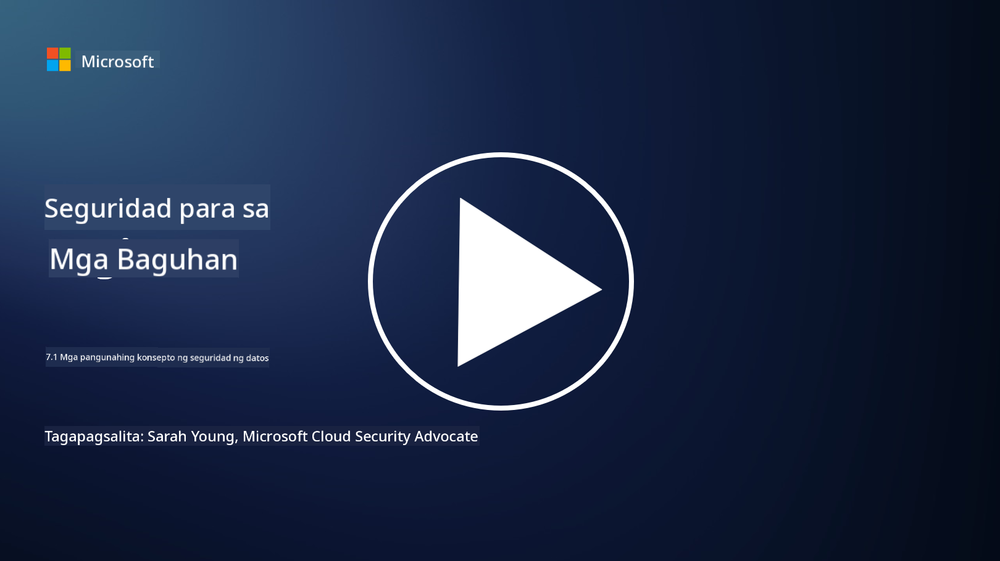

<!--
CO_OP_TRANSLATOR_METADATA:
{
  "original_hash": "9703868f41dcddd5a98dea9ea6fcd94d",
  "translation_date": "2025-09-03T23:58:41+00:00",
  "source_file": "7.1 Data security key concepts.md",
  "language_code": "tl"
}
-->
# Mga Pangunahing Konsepto sa Seguridad ng Datos

Nabanggit na natin ang seguridad ng datos at tinalakay ito nang ilang beses sa kursong ito. Ngayon, mas palalalimin natin ang pag-unawa sa paksang ito. Sa araling ito, matututunan mo:

- Ano ang seguridad ng datos?

- Ano ang klasipikasyon ng datos?

- Ano ang pamamahala sa lifecycle ng datos?

- Ano ang Data Loss Prevention (DLP)?

- Bakit mahalaga ang seguridad ng datos para sa isang organisasyon?

## Ano ang seguridad ng datos?

Ang **seguridad ng datos** ay tumutukoy sa kasanayan ng pagprotekta sa digital na datos, tulad ng mga database, file, at sensitibong impormasyon, mula sa hindi awtorisadong pag-access, pagbubunyag, pagbabago, o pagkasira. Ang pangunahing layunin ng seguridad ng datos ay tiyakin ang pagiging kumpidensyal, integridad, at pagkakaroon ng datos. Kasama rito ang pagpapatupad ng kombinasyon ng teknikal, administratibo, at pisikal na mga hakbang sa seguridad upang mapangalagaan ang datos laban sa iba't ibang banta at kahinaan, kabilang ang cyberattacks, panloob na banta, at data breaches. Ang mga hakbang sa seguridad ng datos ay maaaring kabilang ang encryption, access controls, authentication, audit trails, at mga patakaran sa seguridad.

## Ano ang klasipikasyon ng datos?

Ang **klasipikasyon ng datos** ay ang proseso ng pag-uuri ng datos batay sa pagiging sensitibo, halaga, at kahalagahan nito sa isang organisasyon. Ang layunin ng klasipikasyon ng datos ay tulungan ang mga organisasyon na tukuyin at unahin ang proteksyon at tamang paghawak sa iba't ibang uri ng datos. Karaniwang mga kategorya ng klasipikasyon ng datos ay "pampubliko," "panloob," "kumpidensyal," at "pinaghihigpitan" o "lubos na kumpidensyal." Kapag nauri na ang datos, maaaring magpatupad ang mga organisasyon ng naaangkop na mga kontrol sa seguridad at mga paghihigpit sa pag-access upang matiyak na ang sensitibong datos ay sapat na protektado at na ang pagsunod sa mga regulasyon ay natutugunan.

## Ano ang pamamahala sa lifecycle ng datos?

Ang **pamamahala sa lifecycle ng datos** ay isang istrukturadong paraan ng pamamahala sa datos sa buong lifecycle nito, mula sa paglikha o pagkuha hanggang sa pag-archive o pagtanggal. Karaniwang binubuo ang lifecycle ng datos ng mga yugto tulad ng paglikha, pag-iimbak, pagproseso, pagpapadala, pag-archive, at pagtatapon. Ang pamamahala sa lifecycle ng datos ay kinabibilangan ng pagtukoy ng mga patakaran at pamamaraan para sa bawat yugto ng lifecycle ng datos, kabilang ang pag-iingat ng datos, mga kontrol sa pag-access, backups, at paglilinis ng datos. Ang epektibong pamamahala sa lifecycle ng datos ay tumutulong sa mga organisasyon na i-optimize ang pag-iimbak ng datos, mapabuti ang kalidad ng datos, at matiyak ang pagsunod sa mga regulasyon sa proteksyon ng datos.

## Ano ang Data Loss Prevention (DLP)?

Ang **Data Loss Prevention (DLP)** ay tumutukoy sa hanay ng mga teknolohiya, patakaran, at kasanayan na idinisenyo upang maiwasan ang hindi awtorisadong pag-access, pagbabahagi, o pagtagas ng sensitibo o kumpidensyal na datos. Gumagamit ang mga solusyon sa DLP ng pagsusuri sa nilalaman at kontekstwal na pagsusuri upang subaybayan at kontrolin ang datos sa paggalaw (hal., email, web traffic), datos na nakaimbak (hal., mga file at database), at datos na ginagamit (hal., datos na ina-access o binabago ng mga user). Layunin ng DLP na tukuyin at harangan o i-encrypt ang sensitibong datos upang maiwasan ang data breaches, sumunod sa mga regulasyon sa proteksyon ng datos, at protektahan ang reputasyon ng isang organisasyon.

## Bakit mahalaga ang seguridad ng datos para sa isang organisasyon?

Napakahalaga ng seguridad ng datos para sa mga organisasyon dahil sa ilang mga dahilan:

- **Proteksyon ng Sensitibong Impormasyon**: Madalas na nag-iimbak ang mga organisasyon ng sensitibong datos, tulad ng mga tala ng customer, intellectual property, datos sa pananalapi, at impormasyon ng empleyado. Pinoprotektahan ng seguridad ng datos ang sensitibong impormasyong ito mula sa hindi awtorisadong pag-access o pagnanakaw.

- **Pagsunod sa Regulasyon**: Maraming industriya at hurisdiksyon ang may mahigpit na mga regulasyon sa proteksyon ng datos at privacy. Tinutulungan ng seguridad ng datos ang mga organisasyon na sumunod sa mga batas na ito, na iniiwasan ang mga legal na parusa at pinsala sa reputasyon.

- **Pag-iwas sa Data Breaches**: Ang data breaches ay maaaring magresulta sa mga pagkalugi sa pananalapi, pinsala sa reputasyon, at legal na mga kahihinatnan. Ang epektibong mga hakbang sa seguridad ng datos ay tumutulong na maiwasan ang data breaches o limitahan ang epekto nito.

- **Pagpapanatili ng Tiwala**: Pinagkakatiwalaan ng mga customer at stakeholder ang mga organisasyon sa kanilang datos. Ang mga paglabag sa seguridad ng datos ay sumisira sa tiwala. Ang pagpapanatili ng matibay na seguridad ng datos ay tumutulong na mapanatili ang tiwala at kumpiyansa ng mga customer.

- **Kalamangan sa Kompetisyon**: Ang pagpapakita ng dedikasyon sa seguridad ng datos ay maaaring maging isang kalamangan sa kompetisyon. Mas malamang na makipagtulungan ang mga customer at kasosyo sa mga organisasyong seryoso sa seguridad ng datos.

- **Pagpapatuloy ng Operasyon**: Ang mga hakbang sa seguridad ng datos, kabilang ang backups ng datos at disaster recovery planning, ay tumutulong na matiyak ang pagkakaroon ng mahahalagang datos at pagpapatuloy ng negosyo sa kaganapan ng pagkawala ng datos o sakuna.

- **Proteksyon Laban sa Panloob na Banta**: Ang mga hakbang sa seguridad ng datos ay tumutugon din sa mga banta mula sa loob ng organisasyon, kabilang ang hindi sinasadyang paglabas ng datos ng mga empleyado at malisyosong aksyon ng mga nasa loob.

Sa kabuuan, mahalaga ang seguridad ng datos para sa pagprotekta sa sensitibong impormasyon, pagsunod sa mga regulasyon, pag-iwas sa data breaches, pagpapanatili ng tiwala, at pagtiyak sa patuloy na tagumpay at reputasyon ng isang organisasyon.

## Karagdagang Pagbabasa

- [What Is Data Security? | Microsoft Security](https://www.microsoft.com/en-au/security/business/security-101/what-is-data-security?WT.mc_id=academic-96948-sayoung)
- [Automatically Classify & Protect Documents & Data | Microsoft Purview Information Protection](https://youtu.be/v8LqmzBUaOo)
- [Example data classification policy](https://www.cmu.edu/data/guidelines/data-classification.html)
- [What is Data Security? Data Security Definition and Overview | IBM](https://www.ibm.com/topics/data-security)
- [Data Lifecycle Management: A 2023 Guide for Your Business (cloudwards.net)](https://www.cloudwards.net/data-lifecycle-management/)
- [What is data loss prevention (DLP)? | Microsoft Security](https://www.microsoft.com/security/business/security-101/what-is-data-loss-prevention-dlp?WT.mc_id=academic-96948-sayoung)
- [What is DLP? How data loss prevention software works and why you need it | CSO Online](https://www.csoonline.com/article/569559/what-is-dlp-how-data-loss-prevention-software-works-and-why-you-need-it.html)

---

**Paunawa**:  
Ang dokumentong ito ay isinalin gamit ang AI translation service na [Co-op Translator](https://github.com/Azure/co-op-translator). Bagama't sinisikap naming maging tumpak, pakitandaan na ang mga awtomatikong pagsasalin ay maaaring maglaman ng mga pagkakamali o hindi pagkakatugma. Ang orihinal na dokumento sa kanyang orihinal na wika ang dapat ituring na opisyal na sanggunian. Para sa mahalagang impormasyon, inirerekomenda ang propesyonal na pagsasalin ng tao. Hindi kami mananagot sa anumang hindi pagkakaunawaan o maling interpretasyon na maaaring magmula sa paggamit ng pagsasaling ito.