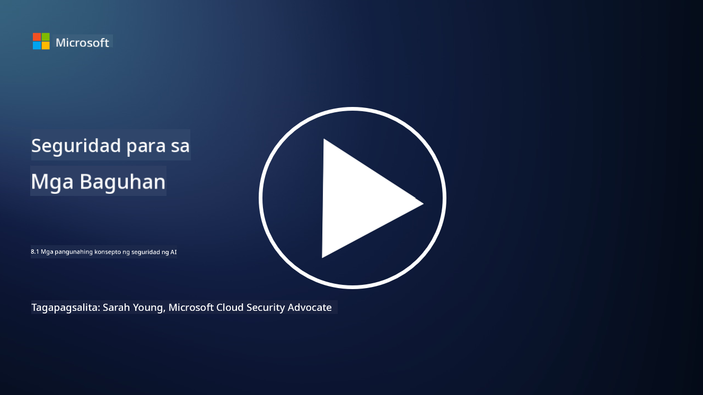

<!--
CO_OP_TRANSLATOR_METADATA:
{
  "original_hash": "66b61d96936cf25d20fcb411d4ce5227",
  "translation_date": "2025-09-03T22:50:01+00:00",
  "source_file": "8.1 AI security key concepts.md",
  "language_code": "tl"
}
-->
# Mga pangunahing konsepto sa seguridad ng AI

## Paano naiiba ang seguridad ng AI sa tradisyunal na cybersecurity?

Ang pag-secure ng mga sistema ng AI ay may natatanging hamon kumpara sa tradisyunal na cybersecurity, lalo na dahil sa kakayahan ng AI na matuto at gumawa ng desisyon. Narito ang ilang pangunahing pagkakaiba:

-   **Integridad ng Data**: Ang mga sistema ng AI ay lubos na umaasa sa data para sa pag-aaral. Ang [pagtiyak sa integridad ng data na ito ay mahalaga, dahil maaaring manipulahin ng mga umaatake ang data upang maimpluwensyahan ang kilos ng AI, isang taktika na tinatawag na data poisoning.
-   **Seguridad ng Modelo**: Ang modelo ng paggawa ng desisyon ng AI mismo ay maaaring maging target. [Maaaring subukan ng mga umaatake na i-reverse-engineer ang modelo o samantalahin ang mga kahinaan nito upang makagawa ng maling o mapanganib na desisyon.
-   **Adversarial Attacks**: Ang mga sistema ng AI ay maaaring maging mahina sa adversarial attacks, kung saan ang bahagya, madalas hindi halatang pagbabago sa input data ay maaaring magdulot ng pagkakamali o maling prediksyon ng AI.
-   **Seguridad ng Imprastraktura**: Bagamat ang tradisyunal na cybersecurity ay nakatuon din sa pagprotekta sa imprastraktura, ang mga sistema ng AI ay maaaring may karagdagang antas ng komplikasyon, tulad ng mga serbisyong nakabase sa cloud o espesyal na hardware, na nangangailangan ng partikular na hakbang sa seguridad.
-   **Mga Etikal na Pagsasaalang-alang**: Ang paggamit ng AI sa seguridad ay nagdadala ng mga etikal na pagsasaalang-alang, tulad ng mga alalahanin sa privacy at ang posibilidad ng bias sa paggawa ng desisyon, na kailangang tugunan sa estratehiya ng seguridad.

Sa kabuuan, ang pag-secure ng mga sistema ng AI ay nangangailangan ng ibang diskarte na isinasaalang-alang ang natatanging aspeto ng teknolohiya ng AI, kabilang ang proteksyon ng data, mga modelo, at proseso ng pag-aaral ng AI, habang tinutugunan din ang mga etikal na implikasyon ng paggamit ng AI.

Ang seguridad ng AI at tradisyunal na cybersecurity ay may maraming pagkakatulad, ngunit mayroon din silang mga natatanging pagkakaiba dahil sa mga natatanging katangian at kakayahan ng mga sistema ng artificial intelligence. Narito kung paano sila naiiba:

- **Kompleksidad ng Banta**: Ang mga sistema ng AI ay nagdadala ng bagong antas ng kompleksidad sa cybersecurity. Ang tradisyunal na cybersecurity ay pangunahing nakatuon sa mga banta tulad ng malware, phishing attacks, at network intrusions. Gayunpaman, ang mga sistema ng AI ay maaaring maging mahina sa mga atake tulad ng adversarial attacks, data poisoning, at model evasion, na partikular na tumatarget sa mga machine learning algorithm mismo.

- **Attack Surface**: Ang mga sistema ng AI ay madalas na may mas malawak na attack surface kumpara sa tradisyunal na mga sistema. Ito ay dahil hindi lamang sila umaasa sa software kundi pati na rin sa data at mga modelo. Maaaring targetin ng mga umaatake ang training data, manipulahin ang mga modelo, o samantalahin ang mga kahinaan sa mga algorithm mismo.

- **Pag-aangkop ng Banta**: Ang mga sistema ng AI ay maaaring umangkop at matuto mula sa kanilang kapaligiran, na maaaring gawing mas mahina sila sa mga adaptive at evolving threats. Ang tradisyunal na mga hakbang sa cybersecurity ay maaaring hindi sapat upang ipagtanggol laban sa mga atake na patuloy na nagbabago batay sa kilos ng sistema ng AI.

- **Interpretability at Explainability**: Ang pag-unawa kung bakit gumawa ng partikular na desisyon ang isang sistema ng AI ay madalas na mas mahirap kumpara sa tradisyunal na mga sistema ng software. Ang kakulangan ng interpretability at explainability ay maaaring gawing mahirap ang pagtuklas at pagmitiga ng mga atake sa mga sistema ng AI.

- **Mga Alalahanin sa Privacy ng Data**: Ang mga sistema ng AI ay madalas na umaasa sa malaking dami ng data, na maaaring magdala ng mga panganib sa privacy kung hindi maayos na pinangasiwaan. Ang tradisyunal na mga hakbang sa cybersecurity ay maaaring hindi sapat upang tugunan ang mga alalahanin sa privacy ng data na partikular sa mga sistema ng AI.

- **Pagsunod sa Regulasyon**: Ang regulasyong landscape para sa seguridad ng AI ay patuloy na umuunlad, na may mga partikular na regulasyon at pamantayan na lumilitaw upang tugunan ang mga natatanging hamon na dulot ng mga sistema ng AI. Ang tradisyunal na mga framework ng cybersecurity ay maaaring kailangang palawigin o iakma upang matiyak ang pagsunod sa mga bagong regulasyon.

- **Mga Etikal na Pagsasaalang-alang**: Ang seguridad ng AI ay hindi lamang tungkol sa pagprotekta sa mga sistema mula sa malisyosong atake kundi pati na rin sa pagtiyak na ang mga sistema ng AI ay ginagamit sa isang etikal at responsableng paraan. Kasama rito ang mga pagsasaalang-alang tulad ng pagiging patas, transparency, at accountability, na maaaring hindi gaanong binibigyang-diin sa tradisyunal na cybersecurity.

## Paano pareho ang seguridad ng AI sa pag-secure ng tradisyunal na mga sistema ng IT?

Ang pag-secure ng mga sistema ng AI ay may ilang mga pangunahing prinsipyo na kapareho ng tradisyunal na cybersecurity:

-   **Proteksyon sa Banta**: Parehong AI at tradisyunal na mga sistema ang kailangang protektahan laban sa hindi awtorisadong pag-access, pagbabago ng data, at pagkasira, pati na rin sa iba pang karaniwang banta.
-   **Pamamahala ng Kahinaan**: Maraming kahinaan na nakakaapekto sa tradisyunal na mga sistema, tulad ng mga bug sa software o maling configuration, ay maaari ring makaapekto sa mga sistema ng AI.
-   **Seguridad ng Data**: Ang proteksyon ng data na pinoproseso ay mahalaga sa parehong larangan upang maiwasan ang paglabag sa data at matiyak ang pagiging kumpidensyal.
-   **Seguridad ng Supply Chain**: Parehong uri ng mga sistema ay mahina sa mga atake sa supply chain, kung saan ang isang compromised na bahagi ay maaaring makasira sa seguridad ng buong sistema.

Ang mga pagkakatulad na ito ay nagpapakita na bagamat ang mga sistema ng AI ay nagdadala ng mga bagong hamon sa seguridad, kailangan din nila ang aplikasyon ng mga napatunayan nang kasanayan sa cybersecurity upang matiyak ang matibay na proteksyon. Ito ay isang kombinasyon ng paggamit ng tradisyunal na karunungan sa seguridad habang inaangkop sa natatanging aspeto ng teknolohiya ng AI.

## Karagdagang babasahin

- [Not with a Bug, But with a Sticker [Book] (oreilly.com)](https://www.oreilly.com/library/view/not-with-a/9781119883982/)
- [Intro to AI Security Part 1: AI Security 101 | by HarrietHacks | Medium](https://medium.com/@harrietfarlow/intro-to-ai-security-part-1-ai-security-101-b8662a9efe5)
- [Best practices for AI security risk management | Microsoft Security Blog](https://www.microsoft.com/en-us/security/blog/2021/12/09/best-practices-for-ai-security-risk-management/?WT.mc_id=academic-96948-sayoung)
- [OWASP AI Security and Privacy Guide | OWASP Foundation](https://owasp.org/www-project-ai-security-and-privacy-guide/)

---

**Paunawa**:  
Ang dokumentong ito ay isinalin gamit ang AI translation service na [Co-op Translator](https://github.com/Azure/co-op-translator). Bagama't sinisikap naming maging tumpak, tandaan na ang mga awtomatikong pagsasalin ay maaaring maglaman ng mga pagkakamali o hindi pagkakatugma. Ang orihinal na dokumento sa kanyang katutubong wika ang dapat ituring na opisyal na sanggunian. Para sa mahalagang impormasyon, inirerekomenda ang propesyonal na pagsasalin ng tao. Hindi kami mananagot sa anumang hindi pagkakaunawaan o maling interpretasyon na dulot ng paggamit ng pagsasaling ito.