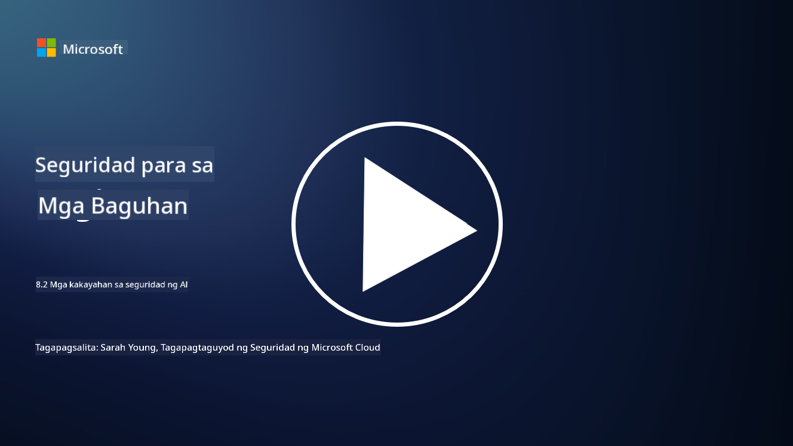

<!--
CO_OP_TRANSLATOR_METADATA:
{
  "original_hash": "b6bb7175672298d1e2f73ba7e0006f95",
  "translation_date": "2025-09-04T01:06:28+00:00",
  "source_file": "8.2 AI security capabilities.md",
  "language_code": "tl"
}
-->
# Mga kakayahan sa seguridad ng AI

## Anong mga tools at kakayahan ang mayroon tayo para siguruhin ang mga AI system sa kasalukuyan?

Sa kasalukuyan, may ilang tools at kakayahan na magagamit upang siguruhin ang mga AI system:

-   **Counterfit**: Isang open-source automation tool para sa pagsusuri ng seguridad ng mga AI system, na idinisenyo upang tulungan ang mga organisasyon sa pagsasagawa ng AI security risk assessments at tiyakin ang tibay ng kanilang mga algorithm.
-   **Adversarial Machine Learning Tools**: Ang mga tool na ito ay sumusuri sa tibay ng mga machine learning model laban sa mga adversarial attack, na tumutulong upang matukoy at mabawasan ang mga kahinaan.
-   **AI Security Toolkits**: May mga open-source toolkits na nagbibigay ng mga resources para sa pagsiguro ng mga AI system, kabilang ang mga library at framework para sa pagpapatupad ng mga hakbang sa seguridad.
-   **Collaborative Platforms**: Mga pakikipagtulungan sa pagitan ng mga kumpanya at AI communities upang bumuo ng mga AI-specific security scanner at iba pang tools para siguruhin ang AI supply chain.

Ang mga tools at kakayahan na ito ay bahagi ng lumalaking larangan na nakatuon sa pagpapahusay ng seguridad ng mga AI system laban sa iba't ibang banta. Ang mga ito ay kumakatawan sa kombinasyon ng pananaliksik, praktikal na tools, at pakikipagtulungan sa industriya na naglalayong tugunan ang mga natatanging hamon na dulot ng AI technologies.

## Paano naman ang AI red teaming? Paano ito naiiba sa tradisyunal na security red teaming?

Ang AI red teaming ay naiiba sa tradisyunal na security red teaming sa ilang mahahalagang aspeto:

-   **Pokusan sa AI Systems**: Ang AI red teaming ay partikular na nakatuon sa mga natatanging kahinaan ng mga AI system, tulad ng machine learning models at data pipelines, sa halip na tradisyunal na IT infrastructure.
-   **Pagsusuri sa Pag-uugali ng AI**: Kasama rito ang pagsusuri kung paano tumutugon ang mga AI system sa hindi pangkaraniwang o hindi inaasahang inputs, na maaaring magbunyag ng mga kahinaan na maaaring samantalahin ng mga umaatake.
-   **Paggalugad sa Pagkabigo ng AI**: Ang AI red teaming ay tumitingin sa parehong malisyoso at benign na pagkabigo, isinasaalang-alang ang mas malawak na hanay ng mga persona at potensyal na pagkabigo ng sistema bukod pa sa mga paglabag sa seguridad.
-   **Prompt Injection at Content Generation**: Kasama rin dito ang pagsusuri sa mga pagkabigo tulad ng prompt injection, kung saan manipulahin ng mga umaatake ang mga AI system upang makabuo ng mapanganib o hindi makatotohanang nilalaman.
-   **Etikal at Responsableng AI**: Bahagi ito ng pagtiyak ng responsableng AI sa disenyo, na sinisigurong ang mga AI system ay matibay laban sa mga pagtatangkang gawing hindi inaasahan ang kanilang pag-uugali.

Sa kabuuan, ang AI red teaming ay isang pinalawak na praktika na hindi lamang sumasaklaw sa pagsusuri ng mga kahinaan sa seguridad kundi pati na rin sa pagsusuri ng iba pang uri ng pagkabigo ng sistema na partikular sa AI technologies. Ito ay mahalagang bahagi ng pagbuo ng mas ligtas na AI system sa pamamagitan ng pag-unawa at pagbawas sa mga bagong panganib na kaugnay ng paggamit ng AI.

## Karagdagang babasahin

 - [Microsoft AI Red Team building future of safer AI | Microsoft Security Blog](https://www.microsoft.com/en-us/security/blog/2023/08/07/microsoft-ai-red-team-building-future-of-safer-ai/?WT.mc_id=academic-96948-sayoung)
 - [Announcing Microsoft’s open automation framework to red team generative AI Systems | Microsoft Security Blog](https://www.microsoft.com/en-us/security/blog/2024/02/22/announcing-microsofts-open-automation-framework-to-red-team-generative-ai-systems/?WT.mc_id=academic-96948-sayoung)
 - [AI Security Tools: The Open-Source Toolkit | Wiz](https://www.wiz.io/academy/ai-security-tools)

---

**Paunawa**:  
Ang dokumentong ito ay isinalin gamit ang AI translation service na [Co-op Translator](https://github.com/Azure/co-op-translator). Bagama't sinisikap naming maging tumpak, pakitandaan na ang mga awtomatikong pagsasalin ay maaaring maglaman ng mga pagkakamali o hindi pagkakatugma. Ang orihinal na dokumento sa orihinal nitong wika ang dapat ituring na opisyal na sanggunian. Para sa mahalagang impormasyon, inirerekomenda ang propesyonal na pagsasalin ng tao. Hindi kami mananagot sa anumang hindi pagkakaunawaan o maling interpretasyon na dulot ng paggamit ng pagsasaling ito.