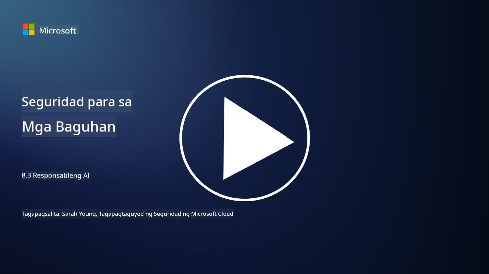

<!--
CO_OP_TRANSLATOR_METADATA:
{
  "original_hash": "5e9775ee91bde7d44577891d5f11c4c5",
  "translation_date": "2025-09-04T00:07:14+00:00",
  "source_file": "8.3 Responsible AI.md",
  "language_code": "tl"
}
-->
# Responsableng AI

## Ano ang responsableng AI at paano ito nauugnay sa seguridad ng AI?

Ang responsableng AI ay tumutukoy sa pagbuo at paggamit ng artificial intelligence sa paraang etikal, malinaw, at naaayon sa mga pinahahalagahan ng lipunan. Saklaw nito ang mga prinsipyo tulad ng pagiging patas, pananagutan, at katatagan, na tinitiyak na ang mga sistema ng AI ay idinisenyo at pinapatakbo upang makinabang ang mga indibidwal, komunidad, at lipunan sa kabuuan.

Ang kaugnayan ng responsableng AI sa seguridad ng AI ay mahalaga dahil:

-   **Mga Etikal na Pagsasaalang-alang**: Ang responsableng AI ay may kasamang mga etikal na pagsasaalang-alang na direktang nakakaapekto sa seguridad, tulad ng privacy at proteksyon ng data. Ang pagtiyak na ang mga sistema ng AI ay gumagalang sa privacy ng gumagamit at pinoprotektahan ang personal na data ay isang mahalagang aspeto ng responsableng AI.
-   **Katatagan at Kahusayan**: Ang mga sistema ng AI ay kailangang maging matatag laban sa manipulasyon at mga pag-atake, na isang pangunahing prinsipyo ng parehong responsableng AI at seguridad ng AI. Kasama rito ang proteksyon laban sa mga adversarial attack at pagtiyak sa integridad ng mga proseso ng paggawa ng desisyon ng AI.
-   **Kalinawan at Paliwanag**: Bahagi ng responsableng AI ang pagtiyak na ang mga sistema ng AI ay malinaw at ang kanilang mga desisyon ay maipapaliwanag. Mahalaga ito para sa seguridad, dahil kailangang maunawaan ng mga stakeholder kung paano gumagana ang mga sistema ng AI upang magtiwala sa kanilang mga hakbang sa seguridad.
-   **Pananagutan**: Ang mga sistema ng AI ay dapat managot sa kanilang mga aksyon, ibig sabihin, kailangang may mga mekanismo upang masubaybayan ang mga desisyon at maitama ang anumang problema. Ito ay naaayon sa mga kasanayan sa seguridad na nagmo-monitor at nag-a-audit ng mga aktibidad ng sistema upang maiwasan at tugunan ang mga paglabag.

Sa kabuuan, ang responsableng AI at seguridad ng AI ay magkaugnay, kung saan ang mga kasanayan sa responsableng AI ay nagpapahusay sa seguridad ng mga sistema ng AI at vice versa. Ang pagpapatupad ng mga prinsipyo ng responsableng AI ay tumutulong sa paglikha ng mga sistema ng AI na hindi lamang etikal kundi mas ligtas din laban sa mga potensyal na banta.

## Paano ko masisiguro na ang aking sistema ng AI ay parehong ligtas at etikal?

Ang pagtiyak na ang iyong sistema ng AI ay parehong ligtas at etikal ay nangangailangan ng isang multi-faceted na diskarte na kinabibilangan ng mga sumusunod na hakbang:

- **Sumunod sa Mga Prinsipyo ng Etika**: Sundin ang mga itinatag na alituntunin sa etika na binibigyang-diin ang kapakanan ng tao, lipunan, at kapaligiran; pagiging patas; proteksyon ng privacy; pagiging maaasahan; kalinawan; contestability; at pananagutan.

- **Magpatupad ng Matatag na Mga Hakbang sa Seguridad**: Gumamit ng proactive na pagsusuri sa seguridad at mga programa sa pamamahala ng tiwala, panganib, at seguridad ng AI upang maprotektahan laban sa mga banta at kahinaan.

- **Makilahok sa Iba't Ibang Stakeholder**: Isama ang malawak na hanay ng mga kalahok sa proseso ng pagbuo ng AI, kabilang ang mga ethicist, social scientist, at mga kinatawan mula sa mga apektadong komunidad upang matiyak na isinasaalang-alang ang iba't ibang pananaw at pinahahalagahan.

- **Siguraduhin ang Kalinawan at Paliwanag**: Tiyakin na ang mga proseso ng paggawa ng desisyon ng AI ay malinaw at maipapaliwanag, na nagbibigay-daan sa mas mataas na tiwala at mas madaling pagkilala sa mga potensyal na bias o error.

- **Panatilihin ang Privacy ng Data**: Protektahan ang privacy at pagiging tunay ng data sa pamamagitan ng encryption at iba pang mga hakbang sa proteksyon ng data upang igalang ang mga karapatan sa privacy ng mga gumagamit.

- **Magbigay ng Human Oversight**: Magpatupad ng mga mekanismo para sa human oversight upang payagan ang contestability ng mga desisyon na ginawa ng mga sistema ng AI at upang matiyak ang pananagutan.

- **Manatiling Impormado sa Kaligtasan ng AI**: Panatilihing updated sa pinakabagong pananaliksik at talakayan tungkol sa kaligtasan ng AI upang maunawaan ang patuloy na pagbabago sa larangan ng seguridad at etika ng AI.

- **Sumunod sa Mga Regulasyon**: Tiyakin na ang iyong sistema ng AI ay sumusunod sa lahat ng nauugnay na batas at regulasyon, na maaaring kabilang ang mga batas sa proteksyon ng data, mga batas laban sa diskriminasyon, at mga alituntunin na partikular sa industriya.

## Maaari mo bang ibigay ang ilang halimbawa ng isyu sa seguridad na dulot ng hindi etikal na paggamit ng AI?

Narito ang ilang halimbawa ng mga isyu sa seguridad na maaaring lumitaw mula sa hindi etikal na paggamit ng AI:

- **Bias sa Paggawa ng Desisyon**: Ang mga sistema ng AI ay maaaring magpatuloy at magpalala ng umiiral na bias kung sila ay sinanay sa mga biased na data set. Halimbawa, kung ang isang search engine ay sinanay sa data na sumasalamin sa mga stereotype ng lipunan, maaari itong magpakita ng biased na mga resulta ng paghahanap, na maaaring humantong sa hindi patas na pagtrato o diskriminasyon.

- **AI sa Mga Sistemang Panghukuman**: Ang paggamit ng AI sa paggawa ng desisyon sa legal na aspeto ay maaaring magdulot ng mga etikal na alalahanin, lalo na kung ang proseso ng paggawa ng desisyon ng AI ay kulang sa kalinawan o naiimpluwensyahan ng biased na data. Maaari itong magresulta sa hindi makatarungang mga legal na resulta at paglabag sa mga karapatan ng indibidwal.

- **Manipulasyon ng Mga Sistema ng AI**: Ang mga sistema ng AI ay maaaring maging mahina sa mga adversarial attack, kung saan ang bahagyang pagbabago sa input data ay maaaring magdulot ng maling resulta. Halimbawa, ang mga autonomous na sasakyan ay maaaring malinlang upang maling ma-interpret ang mga traffic sign, na nagdudulot ng panganib sa kaligtasan.

- **AI-Powered Surveillance**: Ang paggamit ng AI para sa surveillance ay maaaring magdulot ng paglabag sa privacy, lalo na kung ginamit nang walang tamang pahintulot o sa mga paraang lumalabag sa mga kalayaan ng indibidwal. Ito ay maaaring maging partikular na problema sa mga awtoritaryang rehimen na maaaring gumamit ng AI upang subaybayan at supilin ang dissent.

Ang mga halimbawang ito ay nagpapakita ng kahalagahan ng etikal na pagsasaalang-alang sa pagbuo at paggamit ng mga sistema ng AI upang maiwasan ang mga isyu sa seguridad at maprotektahan ang mga karapatan at privacy ng mga indibidwal.

## Karagdagang Pagbabasa

 - [Microsoft Responsible AI Standard v2 General Requirements](https://query.prod.cms.rt.microsoft.com/cms/api/am/binary/RE5cmFl?culture=en-us&country=us&WT.mc_id=academic-96948-sayoung)
 - [Responsible AI (mit.edu)](https://sloanreview.mit.edu/big-ideas/responsible-ai/)
 - [13 Principles for Using AI Responsibly (hbr.org)](https://hbr.org/2023/06/13-principles-for-using-ai-responsibly)

---

**Paunawa**:  
Ang dokumentong ito ay isinalin gamit ang AI translation service na [Co-op Translator](https://github.com/Azure/co-op-translator). Bagama't sinisikap naming maging tumpak, pakitandaan na ang mga awtomatikong pagsasalin ay maaaring maglaman ng mga pagkakamali o hindi pagkakatugma. Ang orihinal na dokumento sa orihinal nitong wika ang dapat ituring na opisyal na sanggunian. Para sa mahalagang impormasyon, inirerekomenda ang propesyonal na pagsasalin ng tao. Hindi kami mananagot sa anumang hindi pagkakaunawaan o maling interpretasyon na maaaring magmula sa paggamit ng pagsasaling ito.