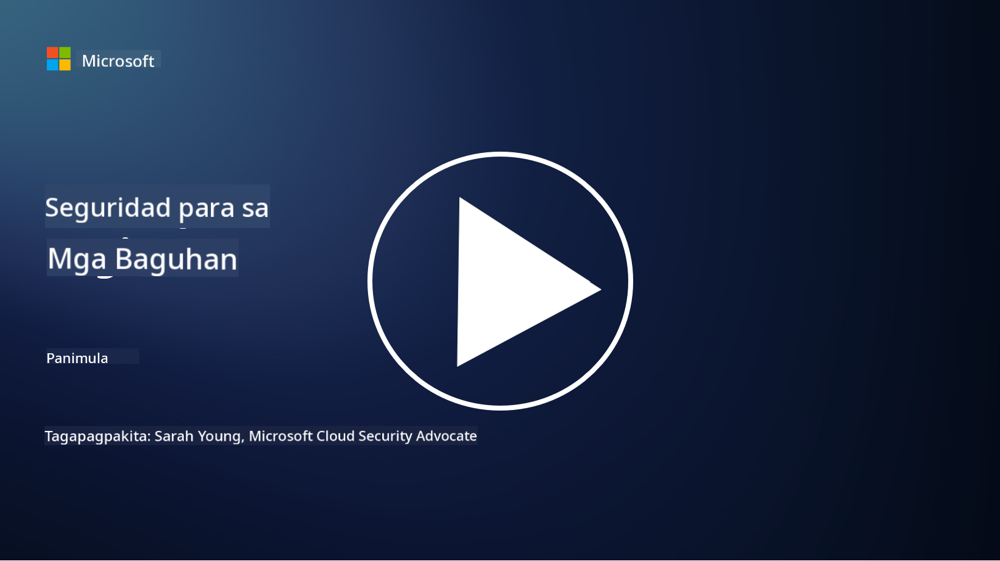

<!--
CO_OP_TRANSLATOR_METADATA:
{
  "original_hash": "79a7e63fa60f649eb3560e1cd7246272",
  "translation_date": "2025-11-18T17:40:12+00:00",
  "source_file": "README.md",
  "language_code": "tl"
}
-->
  
  
  
  
  
  

### 🌐 Suporta sa Maraming Wika

#### Sinusuportahan sa pamamagitan ng GitHub Action (Awtomatiko at Laging Napapanahon)

<!-- CO-OP TRANSLATOR LANGUAGES TABLE START -->
[Arabic](../ar/README.md) | [Bengali](../bn/README.md) | [Bulgarian](../bg/README.md) | [Burmese (Myanmar)](../my/README.md) | [Chinese (Simplified)](../zh/README.md) | [Chinese (Traditional, Hong Kong)](../hk/README.md) | [Chinese (Traditional, Macau)](../mo/README.md) | [Chinese (Traditional, Taiwan)](../tw/README.md) | [Croatian](../hr/README.md) | [Czech](../cs/README.md) | [Danish](../da/README.md) | [Dutch](../nl/README.md) | [Estonian](../et/README.md) | [Finnish](../fi/README.md) | [French](../fr/README.md) | [German](../de/README.md) | [Greek](../el/README.md) | [Hebrew](../he/README.md) | [Hindi](../hi/README.md) | [Hungarian](../hu/README.md) | [Indonesian](../id/README.md) | [Italian](../it/README.md) | [Japanese](../ja/README.md) | [Korean](../ko/README.md) | [Lithuanian](../lt/README.md) | [Malay](../ms/README.md) | [Marathi](../mr/README.md) | [Nepali](../ne/README.md) | [Nigerian Pidgin](../pcm/README.md) | [Norwegian](../no/README.md) | [Persian (Farsi)](../fa/README.md) | [Polish](../pl/README.md) | [Portuguese (Brazil)](../br/README.md) | [Portuguese (Portugal)](../pt/README.md) | [Punjabi (Gurmukhi)](../pa/README.md) | [Romanian](../ro/README.md) | [Russian](../ru/README.md) | [Serbian (Cyrillic)](../sr/README.md) | [Slovak](../sk/README.md) | [Slovenian](../sl/README.md) | [Spanish](../es/README.md) | [Swahili](../sw/README.md) | [Swedish](../sv/README.md) | [Tagalog (Filipino)](./README.md) | [Tamil](../ta/README.md) | [Thai](../th/README.md) | [Turkish](../tr/README.md) | [Ukrainian](../uk/README.md) | [Urdu](../ur/README.md) | [Vietnamese](../vi/README.md)
<!-- CO-OP TRANSLATOR LANGUAGES TABLE END -->

**Kung nais mong magkaroon ng karagdagang mga wika para sa pagsasalin, ang mga sinusuportahang wika ay nakalista [dito](https://github.com/Azure/co-op-translator/blob/main/getting_started/supported-languages.md)**

#### Sumali sa Aming Komunidad  

# 🚀 Cybersecurity para sa mga Baguhan – isang kurikulum

Sa mabilis na pagbabago ng panahon ng paggamit ng teknolohiyang AI, mas mahalaga na maunawaan kung paano protektahan ang mga IT system. Ang kursong ito ay idinisenyo upang turuan ka ng mga pangunahing konsepto ng cybersecurity upang simulan ang iyong pag-aaral sa seguridad. Ito ay hindi nakatuon sa anumang partikular na vendor at hinati sa maliliit na aralin na maaaring matapos sa loob ng 30-60 minuto. Ang bawat aralin ay may kasamang maikling pagsusulit at mga link para sa karagdagang pagbabasa kung nais mong mas palalimin ang iyong kaalaman sa paksa.

Ano ang saklaw ng kursong ito 📚

- 🔐 Mga pangunahing konsepto ng cybersecurity tulad ng CIA triad, ang mga pagkakaiba sa pagitan ng mga panganib, banta, at iba pa.
- 🛡️ Pag-unawa kung ano ang isang security control at ang iba't ibang anyo nito.
- 🌐 Pag-unawa kung ano ang zero trust at kung bakit ito mahalaga sa modernong cybersecurity.
- 🔑 Pag-unawa sa mga pangunahing konsepto at tema sa identity, networking, security operations, infrastructure, at data security.
- 🔧 Pagbibigay ng ilang halimbawa ng mga tool na ginagamit upang ipatupad ang mga security control.

Ano ang hindi saklaw ng kursong ito 🙅‍♂️

- 🚫 Paano gamitin ang mga partikular na security tool.
- 🚫 Paano "mag-hack" o gumawa ng red teaming/offensive security.
- 🚫 Pag-aaral tungkol sa mga partikular na compliance standards.

Kapag natapos mo na ang kursong ito, maaari kang magpatuloy sa ilan sa aming mga Microsoft Learn module. Inirerekomenda naming ipagpatuloy mo ang iyong pag-aaral sa [Microsoft Security, Compliance, and Identity Fundamentals.](https://learn.microsoft.com/training/paths/describe-concepts-of-security-compliance-identity/?WT.mc_id=academic-96948-sayoung)  

Sa huli, maaari mong isaalang-alang ang pagkuha ng [Exam SC-900: Microsoft Security, Compliance, and Identity Fundamentals exam.](https://learn.microsoft.com/credentials/certifications/exams/sc-900/?WT.mc_id=academic-96948-sayoung)  

> 💁 Kung mayroon kang anumang feedback o mungkahi tungkol sa kursong ito at anumang nilalaman na sa tingin mo ay kulang, nais naming marinig ito mula sa iyo!

## Pangkalahatang-ideya ng mga Module 📝  
| **Numero ng Module** | **Pangalan ng Module**                  | **Mga Konseptong Itinuturo**          | **Mga Layunin sa Pagkatuto**                                                                                     |
|-----------------------|-----------------------------------------|---------------------------------------|------------------------------------------------------------------------------------------------------------------|
| **1.1**               | Mga pangunahing konsepto ng seguridad  | [Ang CIA triad](https://github.com/microsoft/Security-101/blob/main/1.1%20The%20CIA%20triad%20and%20other%20key%20concepts.md)                        | Matutunan ang tungkol sa confidentiality, availability, at integrity. Gayundin ang authenticity, nonrepudiation, at privacy. |
| **1.2**               | Mga pangunahing konsepto ng seguridad  | [Karaniwang banta sa cybersecurity](https://github.com/microsoft/Security-101/blob/main/1.2%20Common%20cybersecurity%20threats.md)        | Matutunan ang tungkol sa mga karaniwang banta sa cybersecurity na kinakaharap ng mga indibidwal at organisasyon.             |
| **1.3**               | Mga pangunahing konsepto ng seguridad  | [Pag-unawa sa pamamahala ng panganib](https://github.com/microsoft/Security-101/blob/main/1.3%20Understanding%20risk%20management.md)       | Matutunan ang pagtatasa at pag-unawa sa panganib – epekto/posibilidad at pagpapatupad ng mga control.                        |
| **1.4**               | Mga pangunahing konsepto ng seguridad  | [Mga kasanayan at dokumentasyon sa seguridad](https://github.com/microsoft/Security-101/blob/main/1.4%20Security%20practices%20and%20documentation.md) | Matutunan ang pagkakaiba sa pagitan ng mga patakaran, pamamaraan, pamantayan, at regulasyon/batas.                            |
| **1.5**               | Mga pangunahing konsepto ng seguridad  | [Zero trust](https://github.com/microsoft/Security-101/blob/main/1.5%20Zero%20trust.md)                           | Matutunan kung ano ang zero trust at paano ito nakakaapekto sa arkitektura? Ano ang defense in depth?                         |
| **1.6**               | Mga pangunahing konsepto ng seguridad  | [Ang shared responsibility model](https://github.com/microsoft/Security-101/blob/main/1.6%20Shared%20responsibility%20model.md)                           | Ano ang shared responsibility model at paano ito nakakaapekto sa cybersecurity?                                              |
| **1.7**               | [Pagsusulit sa dulo ng module](https://github.com/microsoft/Security-101/blob/main/1.7%20End%20of%20module%20quiz.md)                        |                                       |                                                                                                                              |
| **2.1**               | Mga pangunahing kaalaman sa identity at access management | [Mga pangunahing konsepto ng IAM](https://github.com/microsoft/Security-101/blob/main/2.1%20IAM%20key%20concepts.md)                     | Matutunan ang prinsipyo ng least privilege, segregation of duties, at paano sinusuportahan ng IAM ang zero trust.             |
| **2.2**               | Mga pangunahing kaalaman sa identity at access management | [IAM zero trust architecture](https://github.com/microsoft/Security-101/blob/main/2.2%20IAM%20zero%20trust%20architecture.md)          | Matutunan kung paano ang identity ang bagong perimeter para sa modernong IT environment at ang mga banta na nalulutas nito.  |
| **2.3**               | Mga pangunahing kaalaman sa identity at access management | [Mga kakayahan ng IAM](https://github.com/microsoft/Security-101/blob/main/2.3%20IAM%20capabilities.md)                     | Matutunan ang mga kakayahan at control ng IAM upang maprotektahan ang mga identity.                                           |
| **2.4**               | [Pagsusulit sa dulo ng module](https://github.com/microsoft/Security-101/blob/main/2.4%20End%20of%20module%20quiz.md)                        |                                       |                                                                                                                              |
| **3.1**               | Mga pangunahing kaalaman sa network security             | [Mga pangunahing konsepto sa networking](https://github.com/microsoft/Security-101/blob/main/3.1%20Networking%20key%20concepts.md)              | Matutunan ang mga konsepto sa networking (IP addressing, port numbers, encryption, atbp.)                                     |
| **3.2**               | Mga pangunahing kaalaman sa network security             | [Networking zero trust architecture](https://github.com/microsoft/Security-101/blob/main/3.2%20Networking%20zero%20trust%20architecture.md)   | Matutunan kung paano nakakatulong ang networking sa isang E2E ZT architecture at ang mga banta na nalulutas nito.            |
| **3.3**               | Mga pangunahing kaalaman sa network security             | [Mga kakayahan sa network security](https://github.com/microsoft/Security-101/blob/main/3.3%20Network%20security%20capabilities.md)        | Matutunan ang mga tool sa network security – firewalls, WAF, proteksyon sa DDoS, atbp.                                       |
| **3.4**               | [Pagsusulit sa dulo ng module](https://github.com/microsoft/Security-101/blob/main/3.4%20End%20of%20module%20quiz.md)                        |                                       |                                                                                                                              |
| **4.1**               | Mga pangunahing kaalaman sa security operations          | [Mga pangunahing konsepto ng SecOps](https://github.com/microsoft/Security-101/blob/main/4.1%20SecOps%20key%20concepts.md)                  | Matutunan kung bakit mahalaga ang security operations at paano ito naiiba sa normal na IT ops teams.                         |
| **4.2**               | Mga pangunahing kaalaman sa security operations          | [SecOps zero trust architecture](https://github.com/microsoft/Security-101/blob/main/4.2%20SecOps%20zero%20trust%20architecture.md)       | Matutunan kung paano nakakatulong ang SecOps sa isang E2E ZT architecture at ang mga banta na nalulutas nito.                |
| **4.3**               | Mga pangunahing kaalaman sa security operations          | [Mga kakayahan ng SecOps](https://github.com/microsoft/Security-101/blob/main/4.3%20SecOps%20capabilities.md)                  | Matutunan ang mga tool ng SecOps – SIEM, XDR, atbp.                                                                          |
| **4.4**               | [Pagsusulit sa dulo ng module](https://github.com/microsoft/Security-101/blob/main/4.4%20End%20of%20module%20quiz.md)                        |                                       |                                                                                                                              |
| **5.1**               | Mga pangunahing kaalaman sa application security         | [Mga pangunahing konsepto ng AppSec](https://github.com/microsoft/Security-101/blob/main/5.1%20AppSec%20key%20concepts.md)                  | Matutunan ang mga konsepto ng AppSec tulad ng secure by design, input validation, atbp.                                       |
| **5.2**           | Mga pangunahing kaalaman sa seguridad ng aplikasyon         | [Mga kakayahan ng AppSec](https://github.com/microsoft/Security-101/blob/main/5.2%20AppSec%20key%20capabilities.md)                  | Alamin ang tungkol sa mga tool ng AppSec: mga tool sa seguridad ng pipeline, pag-scan ng code, pag-scan ng mga lihim, atbp.                       |
| **5.3**           | [Pagsusulit sa dulo ng module](https://github.com/microsoft/Security-101/blob/main/5.3%20End%20of%20module%20quiz.md)                        |                                      |                                                                                                                 |
| **6.1**           | Mga pangunahing kaalaman sa seguridad ng imprastraktura      | [Mga pangunahing konsepto ng seguridad ng imprastraktura](https://github.com/microsoft/Security-101/blob/main/6.1%20Infrastructure%20security%20key%20concepts.md) | Alamin ang tungkol sa pagpapalakas ng mga sistema, pag-patch, kalinisan sa seguridad, seguridad ng container.                                  |
| **6.2**           | Mga pangunahing kaalaman sa seguridad ng imprastraktura      | [Mga kakayahan sa seguridad ng imprastraktura](https://github.com/microsoft/Security-101/blob/main/6.2%20Infrastructure%20security%20capabilities.md) | Alamin ang tungkol sa mga tool na makakatulong sa seguridad ng imprastraktura tulad ng CSPM, seguridad ng container, atbp.            |
| **6.3**           | [Pagsusulit sa dulo ng module](https://github.com/microsoft/Security-101/blob/main/6.3%20End%20of%20module%20quiz.md)                        |                                      |                                                                                                                 |
| **7.1**           | Mga pangunahing kaalaman sa seguridad ng datos                | [Mga pangunahing konsepto ng seguridad ng datos](https://github.com/microsoft/Security-101/blob/main/7.1%20Data%20security%20key%20concepts.md)           | Alamin ang tungkol sa pag-uuri at pagpapanatili ng datos at kung bakit ito mahalaga sa isang organisasyon.                     |
| **7.2**           | Mga pangunahing kaalaman sa seguridad ng datos                | [Mga kakayahan sa seguridad ng datos](https://github.com/microsoft/Security-101/blob/main/7.2%20Data%20security%20capabilities.md)           | Alamin ang tungkol sa mga tool sa seguridad ng datos – DLP, pamamahala ng panloob na panganib, pamamahala ng datos, atbp.                          |
| **7.3**           | [Pagsusulit sa dulo ng module](https://github.com/microsoft/Security-101/blob/main/7.3%20End%20of%20module%20quiz.md)                        |
| **8.1**           | Mga pangunahing kaalaman sa seguridad ng AI                | [Mga pangunahing konsepto ng seguridad ng AI](https://github.com/microsoft/Security-101/blob/main/8.1%20AI%20security%20key%20concepts.md)          | Alamin ang mga pagkakaiba at pagkakatulad sa pagitan ng tradisyunal na seguridad at seguridad ng AI.                 |
| **8.2**           | Mga pangunahing kaalaman sa seguridad ng AI                | [Mga kakayahan sa seguridad ng AI](https://github.com/microsoft/Security-101/blob/main/8.2%20AI%20security%20capabilities.md)           | Alamin ang tungkol sa mga tool sa seguridad ng AI at ang mga kontrol na maaaring gamitin upang mapanatili ang seguridad ng AI.                         |
| **8.3**           | Mga pangunahing kaalaman sa seguridad ng AI                | [Responsableng AI](https://github.com/microsoft/Security-101/blob/main/8.3%20Responsible%20AI.md)          | Alamin kung ano ang responsableng AI at ang mga partikular na panganib ng AI na kailangang malaman ng mga propesyonal sa seguridad.                          |
| **8.4**           | [Pagsusulit sa dulo ng module](https://github.com/microsoft/Security-101/blob/main/8.4%20End%20of%20module%20quiz.md)     

## 🎒 Iba Pang Kurso 

Ang aming koponan ay gumagawa rin ng iba pang mga kurso! Tingnan ang:

### Azure / Edge / MCP / Mga Ahente

---
 
### Serye ng Generative AI

[-9333EA?style=for-the-badge&labelColor=E5E7EB&color=9333EA)](https://github.com/microsoft/Generative-AI-for-beginners-dotnet?WT.mc_id=academic-105485-koreyst)
[-C084FC?style=for-the-badge&labelColor=E5E7EB&color=C084FC)](https://github.com/microsoft/generative-ai-for-beginners-java?WT.mc_id=academic-105485-koreyst)
[-E879F9?style=for-the-badge&labelColor=E5E7EB&color=E879F9)](https://github.com/microsoft/generative-ai-with-javascript?WT.mc_id=academic-105485-koreyst)

---
 
### Pangunahing Pag-aaral

---
 
### Serye ng Copilot

## Pagkuha ng Tulong

Kung ikaw ay nahihirapan o may mga tanong tungkol sa paggawa ng mga AI app, sumali sa mga kapwa mag-aaral at mga bihasang developer sa mga talakayan tungkol sa MCP. Ito ay isang suportadong komunidad kung saan ang mga tanong ay malugod at ang kaalaman ay malayang ibinabahagi.

Kung mayroon kang feedback sa produkto o mga error habang gumagawa, bisitahin:

---

<!-- CO-OP TRANSLATOR DISCLAIMER START -->
**Paunawa**:  
Ang dokumentong ito ay isinalin gamit ang AI translation service [Co-op Translator](https://github.com/Azure/co-op-translator). Bagamat sinisikap naming maging tumpak, mangyaring tandaan na ang mga awtomatikong pagsasalin ay maaaring maglaman ng mga pagkakamali o hindi pagkakatugma. Ang orihinal na dokumento sa kanyang katutubong wika ang dapat ituring na opisyal na sanggunian. Para sa mahalagang impormasyon, inirerekomenda ang propesyonal na pagsasalin ng tao. Hindi kami mananagot sa anumang hindi pagkakaunawaan o maling interpretasyon na dulot ng paggamit ng pagsasaling ito.
<!-- CO-OP TRANSLATOR DISCLAIMER END -->