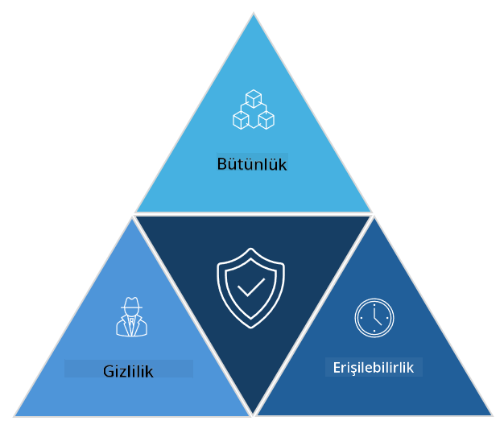

<!--
CO_OP_TRANSLATOR_METADATA:
{
  "original_hash": "16a76f9fa372fb63cffb6d76b855f023",
  "translation_date": "2025-09-04T01:09:45+00:00",
  "source_file": "1.1 The CIA triad and other key concepts.md",
  "language_code": "tr"
}
-->
# CIA Üçlüsü ve Diğer Temel Kavramlar

## Giriş

Bu derste şunları ele alacağız:

- Siber güvenlik nedir?

- Siber güvenlik CIA üçlüsü nedir?

- Siber güvenlik bağlamında özgünlük, inkâr edilemezlik ve gizlilik nedir?

## Siber güvenlik nedir?

Siber güvenlik, bilgi güvenliği olarak da bilinir ve bilgisayar sistemlerini, ağları, cihazları ve verileri dijital saldırılardan, yetkisiz erişimden, hasardan veya hırsızlıktan koruma uygulamasıdır. Siber güvenliğin temel amacı, dijital varlıkların ve bilgilerin gizliliğini, bütünlüğünü ve erişilebilirliğini sağlamaktır. Siber güvenlik uzmanları, varlıkları, verileri ve bilgileri korumak için güvenlik kontrolleri tasarlar ve uygular. Hayatımızın giderek dijitalleşmesi ve çevrimiçi hale gelmesiyle birlikte, siber güvenlik hem bireyler hem de kuruluşlar için en önemli konulardan biri haline gelmiştir.

## Siber güvenlik CIA üçlüsü nedir?

Siber güvenlik üçlüsü, herhangi bir siber güvenlik çalışması veya bir sistem/çevre tasarımı için üç ana hususu içeren modeli ifade eder:

### Gizlilik

Bu, çoğu kişinin "siber güvenlik" düşündüğünde aşina olduğu husustur: gizlilik, veri ve bilgilerin yetkisiz erişim girişimlerinden korunması sürecidir, yani yalnızca bilgilere erişmesi gereken kişiler erişebilir. Ancak tüm veriler eşit yaratılmamıştır ve veriler genellikle yanlış kişilerin erişmesi durumunda ne kadar zarar göreceğine göre kategorize edilir ve korunur.

### Bütünlük

Verilerin doğruluğunu ve güvenilirliğini korumayı ve yetkisiz kişiler tarafından değiştirilmesine veya düzenlenmesine izin vermemeyi ifade eder. Örneğin, bir öğrencinin DMV'deki sürücü kaydında doğum tarihini değiştirerek daha yaşlı görünmesi ve bu şekilde doğum tarihini daha erken bir tarihle yeniden yazdırarak alkol satın alması.

### Erişilebilirlik

Operasyonel BT genelinde bir husus olmakla birlikte, erişilebilirlik siber güvenlik için de önemlidir. Güvenlik uzmanlarının koruması gereken, erişilebilirliği hedef alan belirli saldırı türleri vardır (örneğin, dağıtılmış hizmet reddi – DDoS – saldırıları).

**Siber Güvenlik CIA Üçlüsü**

## Siber güvenlik bağlamında özgünlük, inkâr edilemezlik ve gizlilik nedir?

Bunlar, sistemlerin ve verilerin güvenliğini ve güvenilirliğini sağlamaya ilişkin ek önemli kavramlardır:

**Özgünlük** - etkileşimde bulunduğunuz bilginin, iletişimin veya varlığın gerçek olduğuna ve yetkisiz kişiler tarafından değiştirilmediğine veya üzerinde oynanmadığına dair güvenceyi ifade eder.

**İnkâr edilemezlik** - bir tarafın bir işlem veya iletişimdeki katılımını veya özgünlüğünü inkâr edememesini sağlama kavramıdır. Birinin bir mesaj göndermediğini veya belirli bir eylemi gerçekleştirmediğini iddia etmesini, aksi yönde kanıt olduğunda engeller.

**Gizlilik** - hassas ve kişisel olarak tanımlanabilir bilgilerin yetkisiz erişimden, kullanımdan, ifşadan veya manipülasyondan korunmasını ifade eder. Kişisel verilere kimin erişebileceğini ve bu verilerin nasıl toplandığını, saklandığını ve paylaşıldığını kontrol etmeyi içerir.

## Ek Okuma

[Bilgi Güvenliği (InfoSec) Nedir? | Microsoft Security](https://www.microsoft.com/security/business/security-101/what-is-information-security-infosec#:~:text=Three%20pillars%20of%20information%20security%3A%20the%20CIA%20triad,as%20guiding%20principles%20for%20implementing%20an%20InfoSec%20plan.)

---

**Feragatname**:  
Bu belge, [Co-op Translator](https://github.com/Azure/co-op-translator) adlı yapay zeka çeviri hizmeti kullanılarak çevrilmiştir. Doğruluk için çaba göstersek de, otomatik çevirilerin hata veya yanlışlıklar içerebileceğini lütfen unutmayın. Belgenin orijinal dili, yetkili kaynak olarak kabul edilmelidir. Kritik bilgiler için profesyonel insan çevirisi önerilir. Bu çevirinin kullanımından kaynaklanan yanlış anlamalar veya yanlış yorumlamalar için sorumluluk kabul etmiyoruz.