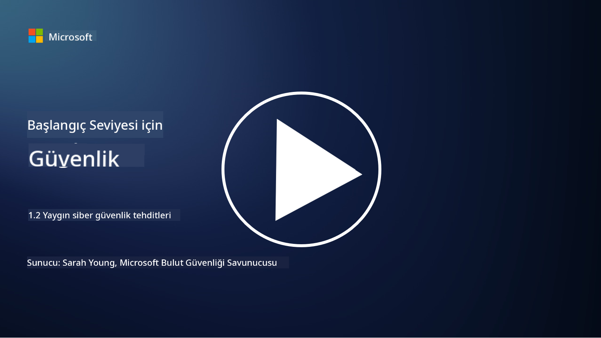

<!--
CO_OP_TRANSLATOR_METADATA:
{
  "original_hash": "6fc3030323139d7134a4ca9d03eccac9",
  "translation_date": "2025-09-03T23:23:33+00:00",
  "source_file": "1.2 Common cybersecurity threats.md",
  "language_code": "tr"
}
-->
# Yaygın Siber Güvenlik Tehditleri

## Giriş

Bu derste şunları ele alacağız:

- Siber güvenlik tehdidi nedir?

- Kötü niyetli aktörler neden veri ve BT sistemlerini ele geçirmek ister?

- En yaygın siber güvenlik tehditleri nelerdir?

- MITRE ATT&CK çerçevesi nedir?

- Siber güvenlik tehdit ortamını takip etmek için nereden bilgi alabilirim?

## Siber güvenlik tehdidi nedir?

Siber güvenlik tehdidi, verilerin veya BT sistemlerinin gizliliğini, bütünlüğünü veya erişilebilirliğini tehlikeye atma potansiyeline sahip herhangi bir risk veya tehlikeyi ifade eder. Bu tehditler, güvenlik açıklarını kötüye kullanarak yetkisiz erişim sağlamak, hassas bilgileri çalmak, operasyonları aksatmak veya bireylere, kuruluşlara ya da hatta uluslara zarar vermek isteyen kötü niyetli aktörler tarafından oluşturulur. Siber güvenlik tehditleri çeşitli şekillerde ortaya çıkabilir ve dijital sistemlerin ve verilerin farklı yönlerini hedef alabilir.

## Kötü niyetli aktörler neden veri ve BT sistemlerini ele geçirmek ister?

Kötü niyetli aktörler, kişisel kazanç, ideolojik motivasyonlar veya kaos yaratma isteği gibi çeşitli nedenlerle veri ve BT sistemlerini ele geçirir. Bu motivasyonları anlamak, bireylerin ve kuruluşların siber tehditlere karşı daha iyi savunma yapmasına yardımcı olabilir. Kötü niyetli aktörlerin siber saldırılara yönelmesinin bazı yaygın nedenleri şunlardır:

1. **Finansal Kazanç**: Birçok saldırı, finansal kazanç elde etme isteğiyle gerçekleştirilir. Kötü niyetli aktörler, kredi kartı numaraları, banka hesap bilgileri veya kişisel kimlik bilgileri gibi hassas verileri çalarak dolandırıcılık, kimlik hırsızlığı yapabilir, bir bireyi veya kuruluşu fidye ödemeye zorlayabilir ya da çalınan verileri karanlık ağda satabilir.

2. **Casusluk**: Devletler, rakipler veya diğer kuruluşlar, siyasi, ekonomik veya askeri avantaj elde etmek için hassas hükümet, şirket veya araştırma verilerini çalmak amacıyla siber casusluk yapabilir.

3. **Bozulma ve Sabotaj**: Bazı saldırılar, siyasi veya ideolojik nedenlerle kritik altyapıyı, hizmetleri veya operasyonları aksatmayı hedefler. Bu tür saldırılar, geniş çaplı kaosa, finansal kayıplara ve itibar zararına yol açabilir.

4. **İdeolojik Motivasyonlar**: Hacktivistler ve ideolojik veya politik motivasyonlara sahip gruplar, belirli konular hakkında farkındalık yaratmak, inançlarını yaymak veya belirli eylemlere ya da kuruluşlara karşı protesto etmek için sistemleri ele geçirebilir.

5. **İstemeden Yapılan Eylemler**: Tüm kötü niyetli eylemler kasıtlı değildir; bazı bireyler, sosyal mühendislik saldırılarına kurban düşerek veya ele geçirilmiş bir ağın parçası olarak farkında olmadan siber tehditlere katkıda bulunabilir.

Sonuç olarak, veri ve BT sistemlerini ele geçirme motivasyonları oldukça çeşitlidir ve bu saldırıların etkisi ciddi olabilir. Bireylerin, kuruluşların ve hükümetlerin siber güvenliği ciddiye alması ve bu tehditlere karşı koruma önlemleri uygulaması önemlidir.

## En yaygın siber güvenlik tehditleri nelerdir?

Kötü niyetli aktörlerin sistemleri ele geçirmek, veri çalmak ve aksaklıklar yaratmak için kullandığı birçok yaygın siber saldırı türü vardır. İşte yazının yazıldığı dönemde en yaygın olanlardan bazıları:

1. **Phishing (Oltalama)**:

Phishing, alıcıları şifreler, kredi kartı numaraları veya kişisel bilgiler gibi hassas verileri ifşa etmeye kandırmak için meşru kaynaklardan geliyormuş gibi görünen aldatıcı e-postalar veya mesajlar göndermeyi içerir. Phishing ayrıca kurbanları kötü amaçlı web sitelerine yönlendirebilir veya kötü amaçlı yazılım indirmelerine neden olabilir.

2. **Malware (Kötü Amaçlı Yazılım)**:

Malware, sistemleri enfekte etmek, veri çalmak veya zarar vermek için tasarlanmış bir dizi kötü amaçlı programı kapsar. Malware türleri şunlardır:

- **Ransomware (Fidye Yazılımı)**: Dosyaları şifreler ve şifre çözme için fidye talep eder.

- **Trojans (Truva Atları)**: Meşru yazılım gibi görünen, ancak saldırganlara yetkisiz erişim sağlayan yazılımlar.

- **Virüsler**: Dosyalara eklenerek kendini çoğaltan programlar.

- **Worms (Solucanlar)**: Ağlar üzerinden yayılan kendini çoğaltan programlar.

3. **Denial of Service (DoS) ve Distributed Denial of Service (DDoS)**:

DoS saldırıları, bir hedef sistemi aşırı yükleyerek kullanıcılar için erişilemez hale getirir. DDoS saldırıları, bir hedefi trafikle doldurmak için ele geçirilmiş cihazlardan oluşan bir ağ kullanır ve sistemin düzgün çalışmasını zorlaştırır veya tamamen durdurabilir.

4. **SQL Injection**:

Bu saldırıda, saldırganlar bir web uygulamasının giriş alanlarını manipüle ederek kötü amaçlı SQL sorguları enjekte eder ve bu da veritabanlarına ve hassas verilere yetkisiz erişim sağlayabilir.

5. **Cross-Site Scripting (XSS)**:

Saldırganlar, web uygulamalarına kötü amaçlı komut dosyaları enjekte eder ve bu komutlar, kullanıcıların tarayıcılarında çalıştırılır. Bu, kullanıcı verilerinin çalınmasına veya kötü amaçlı yazılım yayılmasına yol açabilir.

6. **Social Engineering (Sosyal Mühendislik)**:

Sosyal mühendislik, bireyleri gizli bilgileri ifşa etmeye veya güvenliği tehlikeye atan eylemleri gerçekleştirmeye manipüle etmek için insan psikolojisini kullanır.

7. **Zero-Day (0day) Exploits**:

Bu saldırılar, yazılım veya donanımdaki henüz satıcı veya kamu tarafından bilinmeyen güvenlik açıklarını hedef alır. Saldırganlar, yamalar geliştirilmeden önce bu güvenlik açıklarından yararlanır. Birçok kuruluş, sıfır gün açıklarından endişe duyar çünkü bunlara karşı bir yama bulunmaz, ancak bu listedeki diğer saldırılar kadar yaygın değildir. Bir sıfır gün açığı keşfedildiğinde, güvenlik araştırmacıları hızla bir yama geliştirmek için çalışır ve bu nedenle sıfır gün açıkları genellikle kısa ömürlüdür.

8. **Credential Attacks (Kimlik Bilgisi Saldırıları)**:

Bu saldırılar, saldırganların şifreleri tekrar tekrar tahmin ettiği brute force saldırılarını ve bir siteden çalınan kimlik bilgilerini diğer sitelerde erişim denemek için kullandığı credential stuffing saldırılarını içerir.

## MITRE ATT&CK çerçevesi nedir?

[MITRE ATT&CK çerçevesi](https://attack.mitre.org/) (Adversarial Tactics, Techniques, and Common Knowledge), saldırganların siber saldırılar sırasında kullandığı taktikleri, teknikleri ve prosedürleri (TTP'ler) kataloglayan ve kategorize eden bir çerçevedir. Çerçeve, çeşitli hükümet ajansları için araştırma ve geliştirme merkezleri işleten kar amacı gütmeyen bir kuruluş olan MITRE Corporation tarafından oluşturulmuştur.

MITRE ATT&CK çerçevesi, siber tehditleri tanımlamak ve analiz etmek için standart bir yöntem sunar, böylece siber güvenlik uzmanları çeşitli saldırı tekniklerini daha iyi anlayabilir ve bunlara karşı savunma yapabilir. Güvenlik ekipleri, tehdit avcıları ve olay müdahale ekipleri tarafından yaygın olarak kullanılır:

1. **Saldırgan Davranışını Anlamak**: Çerçeve, saldırganların ilk girişten hedeflerine ulaşmaya kadar attığı adımları belgeleyerek gerçek dünya saldırı davranışlarını açıklar. Farklı tehdit grupları tarafından kullanılan geniş bir saldırı tekniği yelpazesini kapsar.

2. **Savunma Stratejileri Planlamak ve Uygulamak**: Güvenlik ekipleri, saldırganların kullanabileceği belirli taktik ve tekniklere uygun proaktif savunma stratejileri geliştirmek için çerçeveyi kullanabilir.

3. **Olay Müdahalesi ve Tehdit Avcılığı**: Olayları araştırırken veya tehdit avcılığı yaparken, güvenlik uzmanları saldırganlar tarafından kullanılan belirli teknikleri tanımlamak ve azaltmak için çerçeveye başvurabilir.

MITRE ATT&CK çerçevesi, Windows, macOS, Linux ve bulut hizmetleri gibi belirli platformlar ve ortamlar temelinde saldırı tekniklerini gruplandıran matrisler halinde düzenlenmiştir. Her matris, taktiklere (yüksek düzeyli hedefler) ve tekniklere (bu hedeflere ulaşmak için kullanılan belirli yöntemler) ayrılmıştır. Her teknik için çerçeve, nasıl çalıştığı, olası azaltma yöntemleri ve bu tekniği kullanan gerçek dünya tehdit aktörlerine ilişkin ilgili referanslar hakkında bilgi sağlar.

Çerçeve, yeni tehdit istihbaratı toplandıkça ve siber güvenlik ortamı geliştikçe sürekli olarak güncellenir ve genişletilir. Saldırganların nasıl çalıştığını ve taktiklerine karşı nasıl savunma yapılacağını daha iyi anlamayı sağlayarak bir kuruluşun siber güvenlik duruşunu geliştirmek için değerli bir kaynaktır.

## Siber güvenlik tehdit ortamını takip etmek için nereden bilgi alabilirim?

Siber güvenlik tehditlerini takip etmek için kullanılabilecek birçok kaynak vardır, işte bunlardan bazıları:

- [Open Web Application Security Project (OWASP) top 10 vulnerabilities](https://owasp.org/Top10/)
- [Common Vulnerabilities and Exposures (CVEs)](https://www.bing.com/ck/a?!&&p=53df6007f017bca2JmltdHM9MTY5MjU3NjAwMCZpZ3VpZD0zYmY4N2RiYS1jYWI1LTYwMDgtMWY1YS02ZmYyY2JjNjYxZWUmaW5zaWQ9NTc2OQ&ptn=3&hsh=3&fclid=3bf87dba-cab5-6008-1f5a-6ff2cbc661ee&psq=cve&u=a1aHR0cHM6Ly9iaW5nLmNvbS9hbGluay9saW5rP3VybD1odHRwcyUzYSUyZiUyZmN2ZS5taXRyZS5vcmclMmYmc291cmNlPXNlcnAtcnImaD1BZXN4S0VBWTNnbGhNZEFpd3daMlNSZkZQNTlrODhIUnYxRUtlSkY1RTk0JTNkJnA9a2NvZmZjaWFsd2Vic2l0ZQ&ntb=1 "Common Vulnerabilities and Exposures")
- [Microsoft Security Response Center blogs](https://msrc.microsoft.com/blog/)
- [National Institute of Standards and Technology (NIST)](https://www.dhs.gov/topics/cybersecurity): NIST, potansiyel siber güvenlik tehditleri hakkında kaynaklar, uyarılar ve en son güncellemeleri sağlar.
- [Cybersecurity and Infrastructure Security Agency (CISA)](https://www.cisa.gov/resources-tools/resources/free-cybersecurity-services-and-tools): CISA, işletmeler, hükümet ajansları ve diğer kuruluşlar için siber güvenlik kaynakları ve en iyi uygulamaları sağlar. CISA, toplumu geniş ölçekte etkileyen yüksek etkili güvenlik etkinlikleri türleri ve yeni ve gelişen siber tehditler hakkında derinlemesine analizler paylaşır.
- [National Cybersecurity Center of Excellence (NCCoE)](https://www.dhs.gov/topics/cybersecurity): NCCoE, gerçek dünya durumlarında uygulanabilecek pratik siber güvenlik çözümleri sunan bir merkezdir.
- [US-CERT](https://www.cisa.gov/resources-tools/resources/free-cybersecurity-services-and-tools): Amerika Birleşik Devletleri Bilgisayar Acil Durum Hazırlık Ekibi (US-CERT), uyarılar, ipuçları ve daha fazlasını içeren çeşitli siber güvenlik kaynakları sağlar.
- Ülkenizin Siber Acil Durum Müdahale Ekibi (CERT)

---

**Feragatname**:  
Bu belge, AI çeviri hizmeti [Co-op Translator](https://github.com/Azure/co-op-translator) kullanılarak çevrilmiştir. Doğruluk için çaba göstersek de, otomatik çevirilerin hata veya yanlışlıklar içerebileceğini lütfen unutmayın. Belgenin orijinal dili, yetkili kaynak olarak kabul edilmelidir. Kritik bilgiler için profesyonel insan çevirisi önerilir. Bu çevirinin kullanımından kaynaklanan yanlış anlamalar veya yanlış yorumlamalar için sorumluluk kabul etmiyoruz.