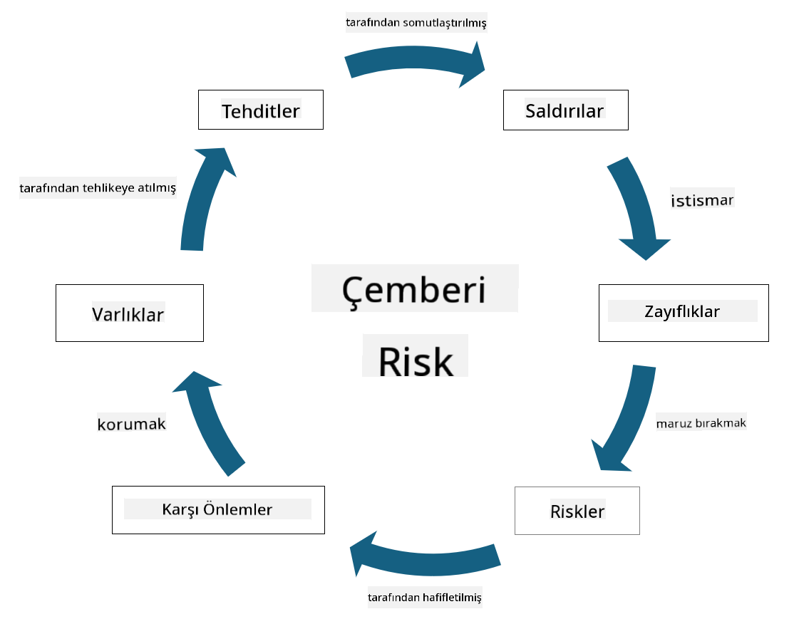

<!--
CO_OP_TRANSLATOR_METADATA:
{
  "original_hash": "fcca304f072cabf206388199e8e2e578",
  "translation_date": "2025-09-04T01:29:13+00:00",
  "source_file": "1.3 Understanding risk management.md",
  "language_code": "tr"
}
-->
# Risk Yönetimini Anlama

## Giriş

Bu derste şunları ele alacağız:

- Sıkça kullanılan güvenlik terimlerinin tanımları

- Güvenlik kontrollerinin türleri

- Güvenlik risklerini değerlendirme

## Sıkça Kullanılan Güvenlik Terimlerinin Tanımları

Bu terimler, siber güvenlik ve risk yönetimi alanında temel kavramlardır. Her bir terimi ve birbirleriyle nasıl ilişkili olduklarını inceleyelim:

1. **Tehdit Ajanı**:

Tehdit ajanı, bir sistemdeki veya ağdaki açıkları kullanarak zarar verme veya hasar oluşturma potansiyeline sahip birey, grup, organizasyon veya otomatik bir sistemdir. Tehdit ajanları arasında hackerlar, kötü amaçlı yazılım yazarları, memnuniyetsiz çalışanlar veya bilgi ve teknoloji sistemlerine risk oluşturan herhangi bir varlık yer alabilir.

2. **Tehdit**:

Tehdit, bir sistemdeki açıkları kullanarak bir varlığa zarar verebilecek potansiyel bir olay veya eylemdir. Tehditler arasında hackleme, veri ihlalleri, hizmet reddi saldırıları gibi eylemler yer alabilir. Tehditler, bir organizasyonun varlıklarına zarar verebilecek potansiyel tehlikelerin "ne" olduğunu ifade eder.

3. **Açık (Zafiyet)**:

Açık, bir sistemin tasarımında, uygulamasında veya yapılandırmasında bulunan ve bir tehdit ajanı tarafından sistemin güvenliğini tehlikeye atmak için kullanılabilecek bir zayıflık veya kusurdur. Açıklar yazılımda, donanımda, süreçlerde veya insan davranışlarında bulunabilir. Açıkları belirlemek ve ele almak, başarılı saldırı riskini en aza indirmek için önemlidir.

4. **Risk**:

Risk, bir tehdit ile bir açığın etkileşimi sonucunda oluşabilecek kayıp, zarar veya hasar potansiyelidir. Bir tehdit ajanının bir açığı kullanarak olumsuz bir etki yaratma olasılığıdır. Riskler genellikle potansiyel etkileri ve gerçekleşme olasılıkları açısından değerlendirilir.

5. **Varlık**:

Varlık, bir organizasyonun korumak istediği değerli herhangi bir şeydir. Varlıklar arasında fiziksel nesneler (bilgisayarlar ve sunucular gibi), veriler (müşteri bilgileri, finansal kayıtlar), fikri mülkiyet (ticari sırlar, patentler) ve hatta insan kaynakları (çalışanların becerileri ve bilgileri) yer alabilir. Varlıkları korumak, siber güvenliğin temel hedeflerinden biridir.

6. **Maruz Kalma**:

Maruz kalma, potansiyel tehditlere karşı savunmasız olma durumunu ifade eder. Bu, bir tehdit ajanı tarafından kullanılabilecek bir açığın mevcut olduğu durumlarda meydana gelir. Maruz kalma, bir sistemde veya ağda açıkların bulunmasıyla ilişkili riski vurgular.

7. **Kontrol**:

Kontrol, açıklar ve tehditlerle ilişkili riski azaltmak için uygulanan bir önlemdir. Kontroller teknik, prosedürel veya idari nitelikte olabilir. Tehditleri ve açıkları önlemek, tespit etmek veya etkilerini azaltmak için tasarlanmıştır. Örnekler arasında güvenlik duvarları, erişim kontrolleri, şifreleme, güvenlik politikaları ve çalışan eğitimi yer alır.

Bu terimler arasındaki ilişkiyi özetlemek gerekirse: Tehdit ajanları, tehditleri gerçekleştirmek için açıkları kullanır ve bu da değerli varlıklara zarar verme potansiyeline sahip risklere yol açar. Açıklar mevcut olduğunda maruz kalma meydana gelir ve kontroller, tehditlerin varlıklar üzerindeki etkisini önlemek veya azaltmak için riski azaltmak amacıyla uygulanır. Bu çerçeve, organizasyonların bilgi sistemleri ve varlıklarına yönelik potansiyel riskleri belirlemesine, değerlendirmesine ve ele almasına rehberlik eden siber güvenlik risk yönetiminin temelini oluşturur.

## Güvenlik Kontrollerinin Türleri

Güvenlik kontrolleri, bilgi sistemlerini ve varlıkları çeşitli tehditlerden ve açıklardan korumak için uygulanan önlemler veya tedbirlerdir. Odaklarına ve amaçlarına göre birkaç kategoriye ayrılabilirler. İşte yaygın güvenlik kontrol türleri:

1. **Yönetimsel Kontroller**:

Bu kontroller, organizasyonun güvenlik uygulamalarını ve kullanıcı davranışlarını yöneten politika, prosedür ve kılavuzlarla ilgilidir.

- Güvenlik politikaları ve prosedürleri: Organizasyonda güvenliğin nasıl sağlanacağını tanımlayan belgelenmiş kılavuzlar.

- Güvenlik farkındalığı ve eğitimi: Çalışanları güvenlik en iyi uygulamaları ve potansiyel tehditler hakkında eğitmek için programlar.

- Olay müdahale ve yönetimi: Güvenlik olaylarına yanıt verme ve bunları hafifletme planları.

2. **Teknik Kontroller**:

Teknik kontroller, güvenlik önlemlerini uygulamak ve sistemleri ve verileri korumak için teknolojinin kullanımını içerir. Teknik kontrol örnekleri şunlardır:

- Erişim kontrolleri: Kullanıcıların rollerine ve izinlerine göre kaynaklara erişimini kısıtlayan önlemler.

- Şifreleme: Verileri yetkisiz erişime karşı korumak için güvenli bir formata dönüştürme.

- Güvenlik duvarları: Gelen ve giden trafiği filtreleyen ve kontrol eden ağ güvenlik cihazları.

- Saldırı Tespit ve Önleme Sistemleri (IDPS): Şüpheli etkinlikler için ağ trafiğini izleyen araçlar.

- Antivirüs ve kötü amaçlı yazılım yazılımları: Kötü amaçlı yazılımları tespit eden ve kaldıran programlar.

- Kimlik doğrulama mekanizmaları: Parolalar, biyometrik veriler ve çok faktörlü kimlik doğrulama gibi kullanıcı kimliğini doğrulama yöntemleri.

- Yama yönetimi: Bilinen açıkları ele almak için yazılımı düzenli olarak güncelleme.

3. **Fiziksel Kontroller**:

Fiziksel kontroller, fiziksel varlıkları ve tesisleri korumaya yönelik önlemlerdir.

- Güvenlik görevlileri ve erişim kontrol personeli: Fiziksel alanlara erişimi izleyen ve kontrol eden personel.

- Gözetim kameraları: Faaliyetleri izlemek ve kaydetmek için video izleme sistemleri.

- Kilitler ve fiziksel engeller: Hassas alanlara erişimi kısıtlayan fiziksel önlemler.

- Çevresel kontroller: Ekipman ve veri merkezlerini etkileyen sıcaklık, nem ve diğer çevresel faktörleri düzenleyen önlemler.

4. **Operasyonel Kontroller**:

Bu kontroller, sistemlerin sürekli güvenliğini sağlamak için günlük operasyonlar ve faaliyetlerle ilgilidir.

- Değişiklik yönetimi: Sistemlerde ve yapılandırmalarda yapılan değişiklikleri izleme ve onaylama süreçleri.

- Yedekleme ve felaket kurtarma: Sistem arızaları veya felaket durumunda veri yedekleme ve kurtarma planları.

- Günlük kaydı ve denetim: Güvenlik ve uyumluluk amaçları için sistem faaliyetlerini izleme ve kaydetme.

- Güvenli kodlama uygulamaları: Açıkları en aza indirmek için yazılım yazma kılavuzları.

5. **Hukuki ve Düzenleyici Kontroller**:

Bu kontroller, ilgili yasa, düzenleme ve endüstri standartlarına uyumu sağlar. Bir organizasyonun uyması gereken standartlar, yargı yetkisine, sektör dikeyine ve diğer faktörlere bağlıdır.

- Veri koruma düzenlemeleri: GDPR, HIPAA ve CCPA gibi yasalara uyum.

- Sektöre özgü standartlar: Ödeme kartı veri güvenliği için PCI DSS gibi standartlara uyum.

Bu güvenlik kontrol kategorileri, organizasyonların sistemlerini, verilerini ve varlıklarını çeşitli tehditlerden korumalarına yardımcı olarak kapsamlı bir güvenlik duruşu oluşturur.

## Güvenlik Risklerini Değerlendirme

Bazı güvenlik uzmanları, risk yönetiminin yalnızca risk profesyonellerine bırakılması gerektiğini düşünebilir, ancak güvenlik risklerini yönetme sürecini anlamak, güvenlik risklerini organizasyonun geri kalanının anlayabileceği ve harekete geçebileceği bir dilde ifade etmek için her güvenlik profesyoneli için önemlidir.

Organizasyonlar, güvenlik risklerini sürekli olarak değerlendirmeli ve iş açısından risklere karşı hangi eylemi (veya eylemsizliği) gerçekleştireceklerine karar vermelidir. Aşağıda, bunun genellikle nasıl yapıldığına dair bir genel bakış yer almaktadır. Bu sürecin genellikle bir organizasyon içindeki birkaç farklı ekip tarafından yürütüldüğünü unutmayın; riskin uçtan uca yönetiminden tek bir ekibin sorumlu olması nadirdir.

1. **Varlıkları ve Tehditleri Belirleme**:

Organizasyon, korumak istediği varlıkları belirler. Bunlar arasında veriler, sistemler, donanım, yazılım, fikri mülkiyet ve daha fazlası yer alabilir. Ardından, bu varlıkları hedef alabilecek potansiyel tehditleri belirlerler.

2. **Açıkları Değerlendirme**:

Organizasyonlar, tehditler tarafından kullanılabilecek sistemlerdeki veya süreçlerdeki açıkları veya zayıflıkları belirler. Bu açıklar, yazılım kusurlarından, yanlış yapılandırmalardan, güvenlik kontrollerinin eksikliğinden ve insan hatalarından kaynaklanabilir.

3. **Olasılık Değerlendirmesi**:

Organizasyon, her bir tehdidin gerçekleşme olasılığını değerlendirir. Bu, geçmiş veriler, tehdit istihbaratı, sektör trendleri ve iç faktörler göz önünde bulundurularak yapılır. Olasılık, tehdidin gerçekleşme ihtimaline göre düşük, orta veya yüksek olarak kategorize edilebilir.

4. **Etkilerin Değerlendirilmesi**:

Ardından, organizasyon, bir tehdit bir açığı kullanırsa oluşabilecek potansiyel etkileri belirler. Etkiler arasında finansal kayıplar, operasyonel kesintiler, itibar zararları, yasal sonuçlar ve daha fazlası yer alabilir. Etkiler, potansiyel sonuçlara göre düşük, orta veya yüksek olarak kategorize edilebilir.

5. **Risk Hesaplama**:

Olasılık ve etki değerlendirmeleri birleştirilerek her bir tehdit için genel risk seviyesi hesaplanır. Bu genellikle, olasılık ve etki seviyelerine sayısal değerler veya nitel tanımlayıcılar atayan bir risk matrisi kullanılarak yapılır. Ortaya çıkan risk seviyesi, hangi risklerin öncelikli olarak ele alınması gerektiğini belirlemeye yardımcı olur.

6. **Önceliklendirme ve Karar Verme**:

Organizasyon, en yüksek olasılık ve etki değerlerine sahip risklere odaklanarak riskleri önceliklendirir. Bu, kaynakların daha etkili bir şekilde tahsis edilmesini ve kontrollerin uygulanmasını sağlar. Yüksek riskli tehditler hemen ele alınmalıdır, düşük riskli tehditler ise daha uzun bir zaman diliminde ele alınabilir.

7. **Risk Tedavisi**:

Risk değerlendirmesine dayanarak, organizasyon her bir riski nasıl hafifleteceğini veya yöneteceğini belirler. Bu, güvenlik kontrollerinin uygulanmasını, sigorta yoluyla riskin transfer edilmesini veya yönetilebilir/çok maliyetli olduğu düşünülen belirli düzeydeki artık risklerin kabul edilmesini içerebilir.

8. **Sürekli İzleme ve Gözden Geçirme**:

Risk değerlendirmesi bir kerelik bir süreç değildir. Organizasyonun ortamında önemli değişiklikler olduğunda veya periyodik olarak gerçekleştirilmelidir. Sürekli izleme, yeni tehditlerin, açıkların veya iş ortamındaki değişikliklerin hesaba katılmasını sağlar.

Bu yapılandırılmış şekilde güvenlik risklerini değerlendirerek, organizasyonlar kaynak tahsisi, güvenlik kontrolleri ve genel risk yönetimi stratejileri hakkında bilinçli kararlar alabilir. Amaç, organizasyonun genel risk maruziyetini azaltırken güvenlik çabalarını organizasyonun iş hedefleri ve amaçlarıyla uyumlu hale getirmektir.

---

**Feragatname**:  
Bu belge, AI çeviri hizmeti [Co-op Translator](https://github.com/Azure/co-op-translator) kullanılarak çevrilmiştir. Doğruluk için çaba göstersek de, otomatik çevirilerin hata veya yanlışlıklar içerebileceğini lütfen unutmayın. Belgenin orijinal dili, yetkili kaynak olarak kabul edilmelidir. Kritik bilgiler için profesyonel insan çevirisi önerilir. Bu çevirinin kullanımından kaynaklanan yanlış anlamalar veya yanlış yorumlamalar için sorumluluk kabul etmiyoruz.