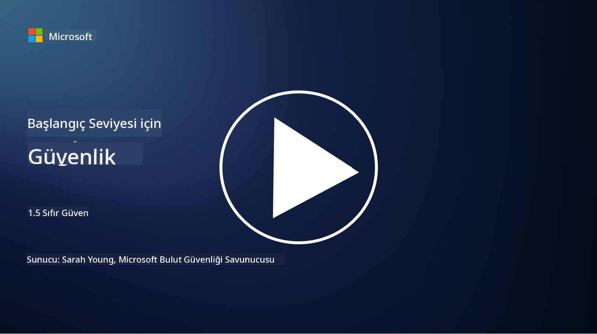
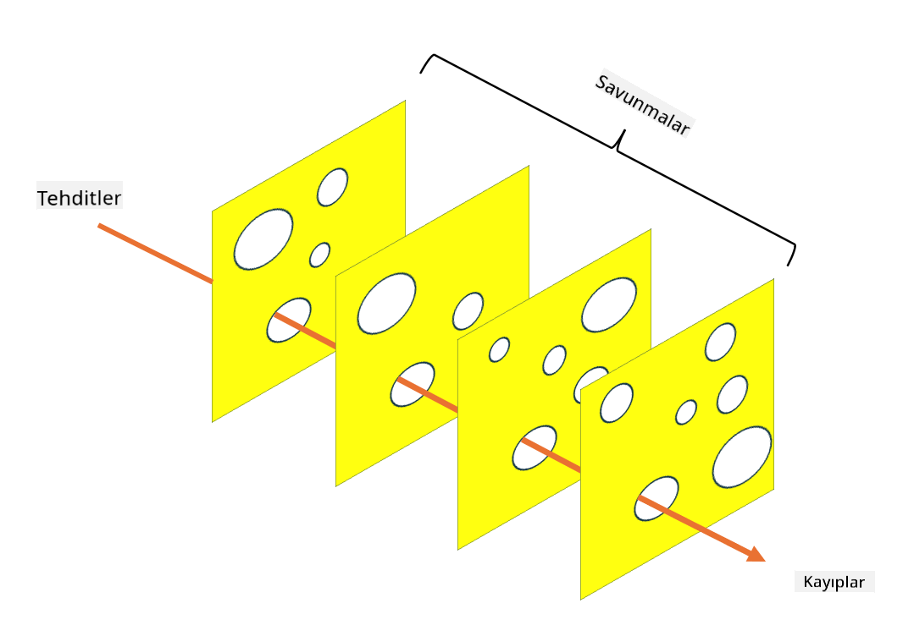

<!--
CO_OP_TRANSLATOR_METADATA:
{
  "original_hash": "75f77f972d2233c584f87c1eb96c983b",
  "translation_date": "2025-09-03T23:47:02+00:00",
  "source_file": "1.5 Zero trust.md",
  "language_code": "tr"
}
-->
# Sıfır Güven

“Sıfır güven” günümüzde güvenlik çevrelerinde sıkça kullanılan bir ifade. Peki, bu ne anlama geliyor, sadece bir moda sözcük mü? Bu derste, sıfır güvenin tam olarak ne olduğunu inceleyeceğiz.

## Giriş

 - Bu derste ele alacağımız konular:
   
   
 - Sıfır güven nedir?

   
  

 - Sıfır güven, geleneksel güvenlik mimarilerinden nasıl farklıdır?

   
   

 - Derinlemesine savunma nedir?

## Sıfır Güven

Sıfır Güven, "güven ama doğrula" şeklindeki geleneksel anlayışı sorgulayan ve bir kuruluşun ağı içinde veya dışında hiçbir varlığın doğrudan güvenilir kabul edilmemesi gerektiğini varsayan bir siber güvenlik yaklaşımıdır. Bunun yerine, Sıfır Güven, konumdan bağımsız olarak kaynaklara erişmeye çalışan her kullanıcı, cihaz ve uygulamanın doğrulanmasını savunur. Sıfır Güven'in temel ilkesi, "saldırı yüzeyini" en aza indirmek ve güvenlik ihlallerinin potansiyel etkisini azaltmaktır.

Sıfır Güven modelinde şu ilkeler vurgulanır:

1. **Kimliği Doğrula**: Kimlik doğrulama ve yetkilendirme, konumdan bağımsız olarak tüm kullanıcılar ve cihazlar için titizlikle uygulanır. Unutmayın, bir kimlik mutlaka insan olmak zorunda değildir: bir cihaz, bir uygulama vb. olabilir.

2. **En Az Ayrıcalık**: Kullanıcılar ve cihazlara, görevlerini yerine getirmek için gereken minimum erişim düzeyi verilir, böylece ele geçirilmeleri durumunda oluşabilecek zarar azaltılır.

3. **Mikro-Segmentasyon**: Ağ kaynakları, bir ihlal durumunda ağ içinde yatay hareketi sınırlamak için daha küçük segmentlere bölünür.

4. **Sürekli İzleme**: Kullanıcı ve cihaz davranışlarının sürekli izlenmesi ve analiz edilmesi, anormallikleri ve potansiyel tehditleri tespit etmek için yapılır. Modern izleme teknikleri, makine öğrenimi, yapay zeka ve tehdit istihbaratını kullanarak izlemeye ek ayrıntı ve bağlam sağlar.

5. **Veri Şifreleme**: Veri, hem aktarım sırasında hem de depolama sırasında yetkisiz erişimi önlemek için şifrelenir.

6. **Katı Erişim Kontrolü**: Erişim kontrolleri, kullanıcı rolleri, cihaz sağlığı ve ağ konumu gibi bağlama dayalı olarak uygulanır.

Microsoft, sıfır güveni beş sütuna ayırır ve bunları sonraki bir derste tartışacağız.

## Geleneksel Güvenlik Mimarilerinden Farkları

Sıfır Güven, geleneksel güvenlik mimarilerinden, örneğin çevre tabanlı modellerden, birkaç şekilde farklılık gösterir:

1. **Çevre vs. Kimlik Merkezli**: Geleneksel modeller, ağın çevresini güvence altına almayı ve iç kullanıcılar ile cihazların içeri girdikten sonra güvenilir olduğunu varsaymayı hedefler. Sıfır Güven ise tehditlerin hem ağın içinden hem de dışından gelebileceğini varsayar ve kimlik tabanlı sıkı kontroller uygular.

2. **Zımni vs. Açık Güven**: Geleneksel modeller, ağ içindeki cihazlara ve kullanıcılara aksi kanıtlanana kadar zımni olarak güvenir. Sıfır Güven, kimlikleri açıkça doğrular ve anormallikleri sürekli izler.

3. **Düz vs. Segmentli Ağ**: Geleneksel mimariler genellikle iç kullanıcıların geniş erişime sahip olduğu düz ağlar içerir. Sıfır Güven, ağın daha küçük, izole bölgelere ayrılmasını savunur ve potansiyel ihlalleri sınırlar.

4. **Tepkisel vs. Proaktif**: Geleneksel güvenlik genellikle çevre güvenlik duvarları ve saldırı tespiti gibi tepkisel önlemlere dayanır. Sıfır Güven, ihlallerin olası olduğunu varsayarak ve etkilerini en aza indirerek proaktif bir yaklaşım benimser.

## Derinlemesine Savunma

Derinlemesine savunma, aynı zamanda katmanlı güvenlik olarak da bilinir, bir kuruluşun varlıklarını korumak için birden fazla güvenlik kontrolü ve önlemi uygulamayı içeren bir siber güvenlik stratejisidir. Amaç, bir katman ihlal edilirse diğerlerinin hala koruma sağlayabileceği üst üste binen savunma katmanları oluşturmaktır. Her katman, güvenliğin farklı bir yönüne odaklanır ve bir kuruluşun genel güvenlik duruşunu artırır.

Derinlemesine savunma, teknik, prosedürel ve fiziksel güvenlik önlemlerinin bir kombinasyonunu içerir. Bunlar arasında güvenlik duvarları, saldırı tespit sistemleri, erişim kontrolleri, şifreleme, kullanıcı eğitimi, güvenlik politikaları ve daha fazlası bulunabilir. Amaç, bir kuruluşun sistemlerine ve ağlarına saldırganların nüfuz etmesini zorlaştıran birden fazla bariyer oluşturmaktır. Bu bazen diğer endüstrilerde (örneğin, ulaşım) kaza önleme için kullanılan "İsviçre peyniri" modeli olarak da adlandırılır.

## Daha Fazla Okuma

[Zero Trust Nedir?](https://learn.microsoft.com/security/zero-trust/zero-trust-overview?WT.mc_id=academic-96948-sayoung)

[Evrilen Zero Trust – Microsoft Pozisyon Belgesi](https://query.prod.cms.rt.microsoft.com/cms/api/am/binary/RWJJdT?WT.mc_id=academic-96948-sayoung)

[Zero Trust ve BeyondCorp Google Cloud | Google Cloud Blog](https://cloud.google.com/blog/topics/developers-practitioners/zero-trust-and-beyondcorp-google-cloud)

---

**Feragatname**:  
Bu belge, AI çeviri hizmeti [Co-op Translator](https://github.com/Azure/co-op-translator) kullanılarak çevrilmiştir. Doğruluk için çaba göstersek de, otomatik çevirilerin hata veya yanlışlık içerebileceğini lütfen unutmayın. Belgenin orijinal dili, yetkili kaynak olarak kabul edilmelidir. Kritik bilgiler için profesyonel insan çevirisi önerilir. Bu çevirinin kullanımından kaynaklanan yanlış anlamalar veya yanlış yorumlamalardan sorumlu değiliz.