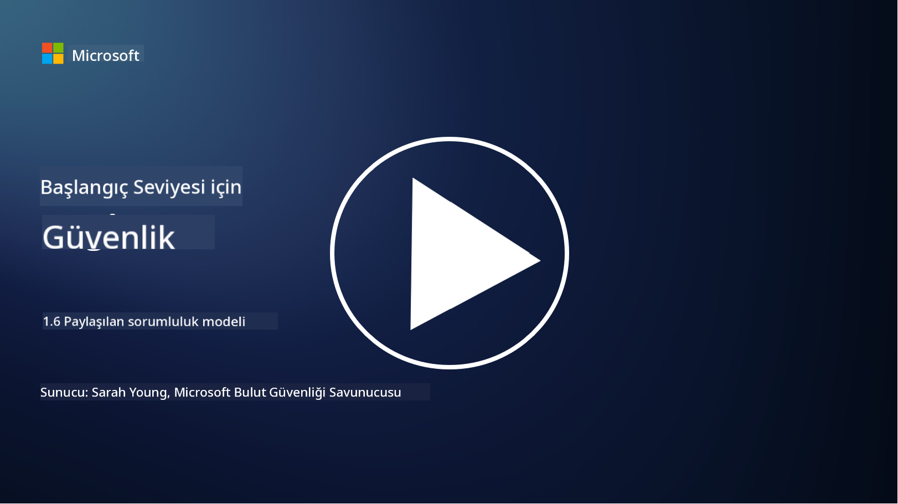

<!--
CO_OP_TRANSLATOR_METADATA:
{
  "original_hash": "a48db640d80c786b928ca178c414f084",
  "translation_date": "2025-09-04T00:25:35+00:00",
  "source_file": "1.6 Shared responsibility model.md",
  "language_code": "tr"
}
-->
# Paylaşılan Sorumluluk Modeli

Paylaşılan sorumluluk, bulut bilişimin ortaya çıkışıyla birlikte BT'de daha yeni bir kavram olarak ortaya çıkmıştır. Siber güvenlik açısından, hangi güvenlik kontrollerinin kim tarafından sağlandığını anlamak, savunmada boşlukların oluşmaması için kritik öneme sahiptir.

## Giriş

Bu derste şunları ele alacağız:

 - Siber güvenlik bağlamında paylaşılan sorumluluk nedir?
   
 - IaaS, PaaS ve SaaS arasında güvenlik kontrolleri için paylaşılan sorumluluk farkı nedir?

 - Bulut platformunuzun hangi güvenlik kontrollerini sağladığını nereden öğrenebilirsiniz?

 - “Güven ama doğrula” ne anlama gelir?

## Siber güvenlik bağlamında paylaşılan sorumluluk nedir?

Siber güvenlikte paylaşılan sorumluluk, bir bulut hizmeti sağlayıcısı (CSP) ile müşterileri arasındaki güvenlik sorumluluklarının dağıtımını ifade eder. Altyapı Hizmeti (IaaS), Platform Hizmeti (PaaS) ve Yazılım Hizmeti (SaaS) gibi bulut bilişim ortamlarında, hem CSP hem de müşteri, verilerin, uygulamaların ve sistemlerin güvenliğini sağlamak için roller üstlenir.

## IaaS, PaaS ve SaaS arasında güvenlik kontrolleri için paylaşılan sorumluluk farkı nedir?

Sorumlulukların dağılımı genellikle kullanılan bulut hizmetinin türüne bağlıdır:

 - **IaaS (Altyapı Hizmeti)**: CSP, temel altyapıyı (sunucular, ağ, depolama) sağlar, müşteri ise bu altyapı üzerindeki işletim sistemlerini, uygulamaları ve güvenlik yapılandırmalarını yönetmekten sorumludur.
   
 - **PaaS (Platform Hizmeti):** CSP, müşterilerin uygulama geliştirebileceği ve dağıtabileceği bir platform sunar. CSP, altyapıyı yönetirken, müşteri uygulama geliştirme ve veri güvenliğine odaklanır.

 - **SaaS (Yazılım Hizmeti):** CSP, internet üzerinden erişilebilen tam işlevsel uygulamalar sağlar. Bu durumda, CSP uygulamanın güvenliği ve altyapısından sorumluyken, müşteri kullanıcı erişimini ve veri kullanımını yönetir.

Paylaşılan sorumluluğu anlamak önemlidir çünkü bu, hangi güvenlik unsurlarının CSP tarafından karşılandığını ve hangilerinin müşteri tarafından ele alınması gerektiğini netleştirir. Bu, yanlış anlamaları önler ve güvenlik önlemlerinin bütünsel bir şekilde uygulanmasını sağlar.

## Bulut platformunuzun hangi güvenlik kontrollerini sağladığını nereden öğrenebilirsiniz?

Bulut platformunuzun hangi güvenlik kontrollerini sağladığını öğrenmek için bulut hizmeti sağlayıcısının dokümantasyonuna ve kaynaklarına başvurmanız gerekir. Bunlar şunları içerir:

 - **CSP’nin web sitesi ve dokümantasyonu**: CSP’nin web sitesi, sundukları hizmetlerin bir parçası olarak sağlanan güvenlik özellikleri ve kontrolleri hakkında bilgi içerir. CSP’ler genellikle güvenlik uygulamalarını, kontrollerini ve önerilerini açıklayan ayrıntılı dokümantasyon sunar. Bu, teknik dokümanlar, güvenlik kılavuzları ve beyaz kitaplar içerebilir.
   
 - **Güvenlik Değerlendirmeleri ve Denetimler**: Çoğu CSP, güvenlik kontrollerini bağımsız güvenlik uzmanları ve kuruluşlar tarafından değerlendirtir. Bu incelemeler, CSP’nin güvenlik önlemlerinin kalitesi hakkında bilgi sağlayabilir. Bazen bu, CSP’nin bir güvenlik uyumluluk sertifikası almasına yol açar (bir sonraki maddeye bakın).
   
 - **Güvenlik uyumluluk sertifikaları**: Çoğu CSP, ISO:27001, SOC 2 ve FedRAMP gibi sertifikalar alır. Bu sertifikalar, sağlayıcının belirli güvenlik ve uyumluluk standartlarını karşıladığını gösterir.

Unutmayın, bilgi düzeyi ve erişilebilirlik bulut sağlayıcıları arasında değişiklik gösterebilir. Bulut tabanlı varlıklarınızın güvenliği hakkında bilinçli kararlar almak için her zaman bulut hizmeti sağlayıcısının resmi ve güncel kaynaklarını kullandığınızdan emin olun.

## “Güven ama doğrula” ne anlama gelir?

Bir CSP, üçüncü taraf yazılımı veya başka bir BT güvenlik hizmeti kullanımı bağlamında, bir kuruluş başlangıçta sağlayıcının güvenlik önlemleriyle ilgili iddialarına güvenebilir. Ancak, verilerinin ve sistemlerinin güvenliğini gerçekten sağlamak için, bu iddiaları güvenlik değerlendirmeleri, penetrasyon testleri ve dış tarafın güvenlik kontrollerinin gözden geçirilmesi yoluyla doğrular. Tüm bireyler ve kuruluşlar, sorumlu olmadıkları güvenlik kontrollerini güven ama doğrula yaklaşımıyla ele almalıdır.

## Bir kuruluş içinde paylaşılan sorumluluk

Unutmayın, bir kuruluş içinde farklı ekipler arasında güvenlik için paylaşılan sorumluluk da dikkate alınmalıdır. Güvenlik ekibi genellikle tüm kontrolleri tek başına uygulamaz ve bir kuruluşu güvende tutmak için gereken tüm güvenlik kontrollerini uygulamak üzere operasyon ekipleri, geliştiriciler ve işin diğer bölümleriyle iş birliği yapması gerekir.

## Daha fazla okuma
- [Bulutta paylaşılan sorumluluk - Microsoft Azure | Microsoft Learn](https://learn.microsoft.com/azure/security/fundamentals/shared-responsibility?WT.mc_id=academic-96948-sayoung)
- [Paylaşılan sorumluluk modeli nedir? – TechTarget.com’dan tanım](https://www.techtarget.com/searchcloudcomputing/definition/shared-responsibility-model)
- [Paylaşılan sorumluluk modeli açıklandı ve bulut güvenliği için ne anlama geliyor | CSO Online](https://www.csoonline.com/article/570779/the-shared-responsibility-model-explained-and-what-it-means-for-cloud-security.html)
- [Bulut Güvenliği için Paylaşılan Sorumluluk: Bilmeniz Gerekenler (cisecurity.org)](https://www.cisecurity.org/insights/blog/shared-responsibility-cloud-security-what-you-need-to-know)

---

**Feragatname**:  
Bu belge, AI çeviri hizmeti [Co-op Translator](https://github.com/Azure/co-op-translator) kullanılarak çevrilmiştir. Doğruluk için çaba göstersek de, otomatik çevirilerin hata veya yanlışlık içerebileceğini lütfen unutmayın. Belgenin orijinal dili, yetkili kaynak olarak kabul edilmelidir. Kritik bilgiler için profesyonel insan çevirisi önerilir. Bu çevirinin kullanımından kaynaklanan yanlış anlamalar veya yanlış yorumlamalar için sorumluluk kabul etmiyoruz.