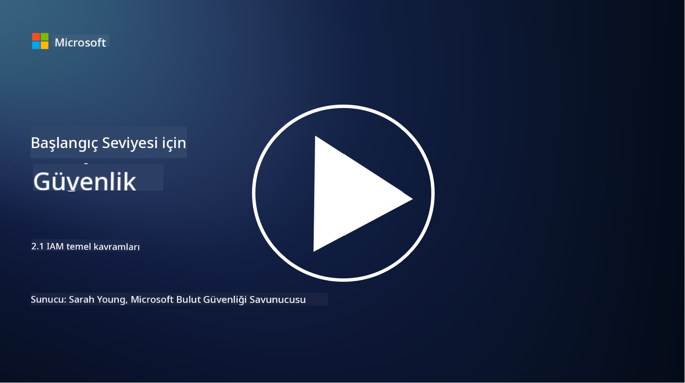

<!--
CO_OP_TRANSLATOR_METADATA:
{
  "original_hash": "2e3864e3d579f0dbb4ac2ec8c5f82acf",
  "translation_date": "2025-09-03T22:39:35+00:00",
  "source_file": "2.1 IAM key concepts.md",
  "language_code": "tr"
}
-->
# IAM Temel Kavramlar

Hiç bir bilgisayara veya web sitesine giriş yaptınız mı? Tabii ki yaptınız! Bu, günlük hayatınızda kimlik kontrollerini zaten kullandığınız anlamına geliyor. Kimlik ve erişim yönetimi (IAM), güvenliğin temel taşlarından biridir. Önümüzdeki derslerde bu konu hakkında daha fazla bilgi edineceğiz.

**Giriş**

Bu derste şunları ele alacağız:

- Siber güvenlik bağlamında kimlik ve erişim yönetimi (IAM) ile neyi kastediyoruz?

- En az ayrıcalık prensibi nedir?

- Görevlerin ayrımı nedir?

- Kimlik doğrulama ve yetkilendirme nedir?

## Siber güvenlik bağlamında kimlik ve erişim yönetimi (IAM) ile neyi kastediyoruz?

Kimlik ve Erişim Yönetimi (IAM), bir organizasyonun dijital ortamındaki kaynaklara doğru kişilerin uygun erişime sahip olmasını sağlamak için uygulanan bir dizi süreç, teknoloji ve politikayı ifade eder. IAM, dijital kimliklerin (kullanıcılar, çalışanlar, iş ortakları) ve bunların sistemlere, uygulamalara, verilere ve ağlara erişiminin yönetilmesini içerir. IAM'nin temel amacı güvenliği artırmak, kullanıcı erişimini kolaylaştırmak ve organizasyon politikaları ve düzenlemelerine uyumu sağlamaktır. IAM çözümleri genellikle kullanıcı kimlik doğrulama, yetkilendirme, kimlik sağlama, erişim kontrolü ve kullanıcı yaşam döngüsü yönetimini (artık kullanılmayan hesapların silinmesini sağlama) kapsar.

## En az ayrıcalık prensibi nedir?

En az ayrıcalık prensibi, kullanıcılar ve sistemlere yalnızca belirli görevlerini veya rollerini yerine getirmek için gerekli olan minimum ayrıcalıkların verilmesini savunan temel bir kavramdır. Bu prensip, bir güvenlik ihlali veya iç tehdit durumunda meydana gelebilecek potansiyel zararı sınırlamaya yardımcı olur. En az ayrıcalık prensibine uyarak, organizasyonlar saldırı yüzeyini azaltır ve yetkisiz erişim, veri ihlalleri ve ayrıcalıkların yanlışlıkla kötüye kullanılması riskini en aza indirir. Pratikte bu, kullanıcılara yalnızca iş rolleri için gerekli olan belirli kaynaklara ve işlevlere erişim verilmesi anlamına gelir, fazlası değil. Örneğin, sadece bir belgeyi okumanız gerekiyorsa, o belgeye tam yönetici ayrıcalıkları verilmesi gereksiz olur.

## Görevlerin ayrımı nedir?

Görevlerin ayrımı, çıkar çatışmalarını önlemeyi ve kritik görev ve sorumlulukları bir organizasyon içinde farklı bireyler arasında dağıtarak dolandırıcılık ve hatalar riskini azaltmayı amaçlayan bir prensiptir. Siber güvenlik bağlamında, görevlerin ayrımı, hiçbir bireyin kritik bir sürecin veya sistemin tüm yönleri üzerinde kontrol sahibi olmamasını sağlamayı içerir. Amaç, bir sürecin hem kurulum hem de onay aşamalarını gerçekleştirme yeteneğine sahip tek bir kişinin olmasını engelleyen bir kontrol sistemi oluşturmaktır. Örneğin, finansal sistemlerde bu, sisteme işlemleri giren kişinin aynı zamanda bu işlemleri onaylayan kişi olmaması gerektiğini belirtebilir. Bu, yetkisiz veya dolandırıcılık amaçlı eylemlerin fark edilmeden gerçekleşme riskini azaltır.

## Kimlik doğrulama ve yetkilendirme nedir?

Kimlik doğrulama ve yetkilendirme, bilgisayar sistemleri ve verilerin güvenliğini ve bütünlüğünü sağlamada önemli bir rol oynayan iki temel siber güvenlik kavramıdır. Bu kavramlar genellikle kaynaklara erişimi kontrol etmek ve hassas bilgileri korumak için birlikte kullanılır.

**1. Kimlik Doğrulama**: Kimlik doğrulama, bir bilgisayar sistemine veya belirli bir kaynağa erişmeye çalışan bir kullanıcı, sistem veya varlığın kimliğini doğrulama sürecidir. Bu, iddia edilen kimliğin gerçek ve doğru olduğunu garanti eder. Kimlik doğrulama yöntemleri genellikle aşağıdaki faktörlerden bir veya daha fazlasını içerir:

   a. Bildiğiniz bir şey: Şifreler, PIN'ler veya yalnızca yetkili kullanıcının sahip olması gereken diğer gizli bilgiler.

   b. Sahip olduğunuz bir şey: Akıllı kartlar, güvenlik jetonları veya kullanıcının kimliğini doğrulamak için kullanılan mobil cihazlar gibi fiziksel jetonlar veya cihazlar.

   c. Olduğunuz bir şey: Parmak izi, yüz tanıma veya retina taramaları gibi bir bireye özgü biyometrik faktörler.

Kimlik doğrulama mekanizmaları, bir kullanıcıya sistem veya kaynak erişimi verilmeden önce kullanıcının iddia ettiği kişi olduğunu doğrulamak için kullanılır. Bu, yetkisiz erişimi önler ve yalnızca meşru kullanıcıların bir sistem içinde işlem yapmasını sağlar.

**2. Yetkilendirme**: Yetkilendirme, kimliği doğrulanmış kullanıcıların veya varlıkların kimlikleri doğrulandıktan sonra belirli izin ve ayrıcalıkların verilmesi veya reddedilmesi sürecidir. Bu, bir kullanıcının bir sistem içinde veya belirli kaynaklar üzerinde gerçekleştirmesine izin verilen işlemleri veya eylemleri belirler. Yetkilendirme genellikle önceden tanımlanmış politikalar, erişim kontrol kuralları ve kullanıcılara atanan roller temelinde yapılır.

Yetkilendirme, "Kimliği doğrulanmış bir kullanıcı ne yapabilir?" sorusunu yanıtlamak olarak düşünülebilir. Hassas verileri ve kaynakları yetkisiz erişim veya değişikliklerden korumak için erişim kontrol politikalarını tanımlamayı ve uygulamayı içerir.

**Özetle:**

- Kimlik doğrulama, kullanıcıların veya varlıkların kimliğini belirler.

- Yetkilendirme, kimliği doğrulanmış kullanıcıların erişebileceği veya değiştirebileceği eylemleri ve kaynakları belirler.

## Daha fazla okuma

- [Describe identity concepts - Training | Microsoft Learn](https://learn.microsoft.com/training/modules/describe-identity-principles-concepts/?WT.mc_id=academic-96948-sayoung)
- [Introduction to identity - Microsoft Entra | Microsoft Learn](https://learn.microsoft.com/azure/active-directory/fundamentals/identity-fundamental-concepts?WT.mc_id=academic-96948-sayoung)
- [What is Identity Access Management (IAM)? | Microsoft Security](https://www.microsoft.com/security/business/security-101/what-is-identity-access-management-iam?WT.mc_id=academic-96948-sayoung)
- [What is IAM? Identity and access management explained | CSO Online](https://www.csoonline.com/article/518296/what-is-iam-identity-and-access-management-explained.html)
- [What is IAM? (auth0.com)](https://auth0.com/blog/what-is-iam/)
- [Security+: implementing Identity and Access Management (IAM) controls [updated 2021] | Infosec (infosecinstitute.com)](https://resources.infosecinstitute.com/certifications/securityplus/security-implementing-identity-and-access-management-iam-controls/)
- [least privilege - Glossary | CSRC (nist.gov)](https://csrc.nist.gov/glossary/term/least_privilege)
- [Security: The Principle of Least Privilege (POLP) - Microsoft Community Hub](https://techcommunity.microsoft.com/t5/azure-sql-blog/security-the-principle-of-least-privilege-polp/ba-p/2067390?WT.mc_id=academic-96948-sayoung)
- [Principle of least privilege | CERT NZ](https://www.cert.govt.nz/it-specialists/critical-controls/principle-of-least-privilege/)
- [Why is separation of duties required by NIST 800-171 and CMMC? - (totem.tech)](https://www.totem.tech/cmmc-separation-of-duties/)

---

**Feragatname**:  
Bu belge, AI çeviri hizmeti [Co-op Translator](https://github.com/Azure/co-op-translator) kullanılarak çevrilmiştir. Doğruluk için çaba göstersek de, otomatik çevirilerin hata veya yanlışlık içerebileceğini lütfen unutmayın. Belgenin orijinal dili, yetkili kaynak olarak kabul edilmelidir. Kritik bilgiler için profesyonel insan çevirisi önerilir. Bu çevirinin kullanımından kaynaklanan yanlış anlamalar veya yanlış yorumlamalardan sorumlu değiliz.