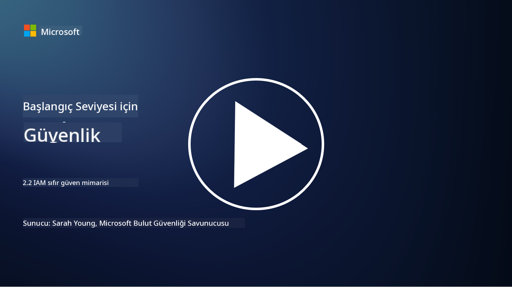

<!--
CO_OP_TRANSLATOR_METADATA:
{
  "original_hash": "4774a978af123f72ebb872199c4c4d4f",
  "translation_date": "2025-09-03T23:40:33+00:00",
  "source_file": "2.2 IAM zero trust architecture.md",
  "language_code": "tr"
}
-->
# IAM sıfır güven mimarisi

Kimlik, sıfır güven mimarisini uygulamanın ve herhangi bir BT ortamı için bir çevre oluşturmanın önemli bir parçasıdır. Bu bölümde, sıfır güveni uygulamak için kimlik kontrollerini kullanmanın neden önemli olduğunu inceleyeceğiz.

## Giriş

Bu derste şunları ele alacağız:

- Modern BT ortamlarında neden kimliği çevremiz olarak kullanmamız gerekiyor?

- Bu, geleneksel BT mimarilerinden nasıl farklıdır?

- Kimlik, sıfır güven mimarisini uygulamak için nasıl kullanılır?

## Modern BT ortamlarında neden kimliği çevremiz olarak kullanmamız gerekiyor?

Modern BT ortamlarında, fiziksel bir çevre kavramı (güvenlik duvarları ve ağ sınırları gibi araçlar kullanılarak) siber tehditlere karşı birincil savunma hattı olarak giderek daha az etkili hale geliyor. Bunun nedeni, teknolojinin artan karmaşıklığı, uzaktan çalışmanın yükselişi ve bulut hizmetlerinin benimsenmesidir. Bunun yerine, kuruluşlar kimliği yeni çevre olarak kullanmaya yöneliyor. Bu, güvenliğin, fiziksel konumlarından bağımsız olarak kaynaklara erişmeye çalışan kullanıcıların, cihazların ve uygulamaların kimliğini doğrulama ve yönetme etrafında döndüğü anlamına gelir.

Modern BT ortamlarında kimliği çevre olarak kullanmanın neden önemli olduğuna dair bazı nedenler:

**Uzaktan Çalışma**: Uzaktan çalışma ve mobil cihazlar norm haline geldiğinden, kullanıcılar çeşitli konumlar ve cihazlardan kaynaklara erişebilir. Geleneksel çevre yaklaşımı, kullanıcılar artık fiziksel bir ofisle sınırlı olmadığında işe yaramaz.

**Bulut ve Hibrit Ortamlar**: Kuruluşlar giderek daha fazla bulut hizmetlerini ve hibrit ortamları benimsiyor. Veri ve uygulamalar artık yalnızca bir kuruluşun tesislerinde bulunmuyor, bu da geleneksel çevre savunmalarını daha az geçerli hale getiriyor.

**Sıfır Güven Güvenliği**: Sıfır güven güvenliği konsepti, ağın içinde veya dışında olsun, hiçbir varlığın otomatik olarak güvenilir olmaması gerektiğini varsayar. Kimlik, erişim taleplerini doğrulamanın temeli haline gelir, nereden geldiklerinden bağımsız olarak.

**Tehdit Manzarası**: Siber tehditler gelişiyor ve saldırganlar geleneksel çevre savunmalarını atlamanın yollarını buluyor. Kimlik avı, sosyal mühendislik ve içeriden gelen tehditler genellikle ağ çevrelerini aşmaya çalışmaktan ziyade insan zayıflıklarını istismar eder.

**Veri Merkezli Yaklaşım**: Hassas verileri korumak çok önemlidir. Kimliğe odaklanarak, kuruluşlar kimin hangi verilere eriştiğini kontrol edebilir ve veri ihlali riskini azaltabilir.

## Bu, geleneksel BT mimarilerinden nasıl farklıdır?

Geleneksel BT mimarileri, tehditleri dışarıda tutmada güvenlik duvarları ve ağ sınırlarının önemli bir rol oynadığı çevre tabanlı güvenlik modellerine büyük ölçüde dayanıyordu. Geleneksel ve kimlik merkezli yaklaşımlar arasındaki temel farklar şunlardır:

|      Özellik               |      Geleneksel BT Mimarileri                                                                     |      Kimlik Merkezli Yaklaşım                                                                             |
|-----------------------------|----------------------------------------------------------------------------------------------------|------------------------------------------------------------------------------------------------------------|
|     Odak                   |     Çevre Odaklı: Güvenlik duvarları ve erişim kontrolü gibi çevre savunmalarına dayanır.          |     Kimlik Doğrulama Odaklı: Ağ sınırlarından kullanıcı/cihaz kimliğini doğrulamaya geçiş.                 |
|     Konum                  |     Konum Bağımlılığı: Güvenlik fiziksel ofis konumlarına ve ağ sınırlarına bağlıdır.              |     Konum Bağımsızlığı: Güvenlik belirli konumlara bağlı değildir; her yerden erişim sağlanabilir.          |
|     Güven Varsayımı        |     Varsayılan Güven: Ağ çevresi içindeki kullanıcılar/cihazlar için güven varsayılır.             |     Sıfır Güven Yaklaşımı: Güven asla varsayılmaz; erişim kimlik ve bağlama göre doğrulanır.               |
|     Cihaz Dikkate Alımı    |     Cihaz Çeşitliliği: Ağ çevresi içindeki cihazların güvenli olduğu varsayılır.                   |     Cihaz Farkındalığı: Konumdan bağımsız olarak cihaz sağlığı ve güvenlik durumu dikkate alınır.          |
|     Veri Koruma            |     Veri Koruma: Veri koruma için ağ çevrelerini güvence altına almaya odaklanır.                  |     Veri Merkezli Koruma: Kimlik ve veri hassasiyetine dayalı veri erişimini kontrol etmeye odaklanır.      |
|                             |                                                                                                    |                                                                                                            |

## Kimlik, sıfır güven mimarisini uygulamak için nasıl kullanılır?

Sıfır güven mimarisinde temel ilke, ağ çevresinin içinde veya dışında olsun, hiçbir varlığa otomatik olarak güvenilmemesidir. Kimlik, kaynaklara erişmeye çalışan varlıkların sürekli doğrulanmasını sağlayarak sıfır güven yaklaşımını uygulamada merkezi bir rol oynar. Modern kimlik güvenlik kontrolleri, kaynaklara erişim talep eden her kullanıcı, cihaz, uygulama ve hizmetin kapsamlı bir şekilde tanımlanmasını ve kimlik doğrulamasını sağlar. Bu, kullanıcı adı/parola kombinasyonları, çok faktörlü kimlik doğrulama (MFA), biyometrik yöntemler ve diğer güçlü kimlik doğrulama mekanizmaları gibi yöntemlerle dijital kimliklerini doğrulamayı içerir.

## Daha fazla okuma

- [Securing identity with Zero Trust | Microsoft Learn](https://learn.microsoft.com/security/zero-trust/deploy/identity?WT.mc_id=academic-96948-sayoung)
- [Zero Trust Principles and Guidance for Identity and Access | CSA (cloudsecurityalliance.org)](https://cloudsecurityalliance.org/artifacts/zero-trust-principles-and-guidance-for-iam/)
- [Zero Trust Identity Controls - Essentials Series - Episode 2 - YouTube](https://www.youtube.com/watch?v=fQZQznIKcGM&list=PLXtHYVsvn_b_gtX1-NB62wNervQx1Fhp4&index=13)

---

**Feragatname**:  
Bu belge, [Co-op Translator](https://github.com/Azure/co-op-translator) adlı yapay zeka çeviri hizmeti kullanılarak çevrilmiştir. Doğruluk için çaba göstersek de, otomatik çevirilerin hata veya yanlışlıklar içerebileceğini lütfen unutmayın. Belgenin orijinal dili, yetkili kaynak olarak kabul edilmelidir. Kritik bilgiler için profesyonel insan çevirisi önerilir. Bu çevirinin kullanımından kaynaklanan yanlış anlamalar veya yanlış yorumlamalar için sorumluluk kabul etmiyoruz.