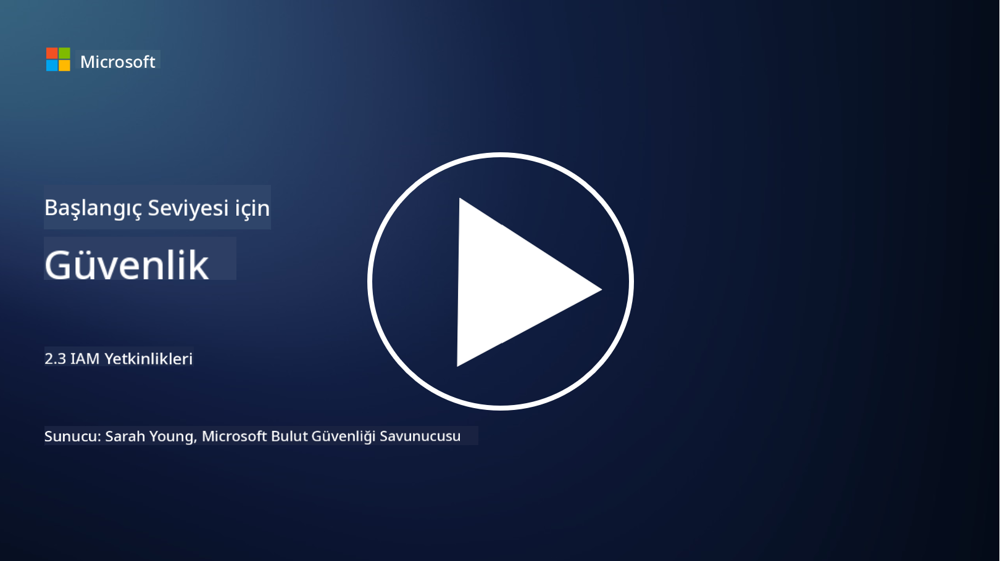

<!--
CO_OP_TRANSLATOR_METADATA:
{
  "original_hash": "bf0b8a54f2c69951744df5a94bc923f7",
  "translation_date": "2025-09-04T01:55:08+00:00",
  "source_file": "2.3 IAM capabilities.md",
  "language_code": "tr"
}
-->
# IAM Yetkinlikleri

Bu bölümde, kimlik güvenliğinde kullanılan temel araçlar ve yetkinlikler hakkında daha fazla ayrıntıya değineceğiz.

## Giriş

Bu derste şunları ele alacağız:

 - Dizin hizmeti nedir?
      
     
    
 - Kimlikleri güvence altına almak için hangi yetkinlikler kullanılabilir?
>
>        Çok Faktörlü Kimlik Doğrulama (MFA)
> 
>        Tek Oturum Açma (SSO)
> 
>        Rol Tabanlı Erişim Kontrolü (RBAC)
> 
>        Uyarlanabilir Kimlik Doğrulama
> 
>        Biyometrik Kimlik Doğrulama
> 
>        Ayrıcalıklı Erişim Yönetimi (PAM)
> 
>        Kimlik Yönetimi ve İdare (IGA)
> 
>        Davranış Analitiği

## Dizin hizmeti nedir?

Dizin hizmeti, kullanıcılar, gruplar, cihazlar, uygulamalar ve diğer nesneler dahil olmak üzere ağ kaynakları hakkında bilgi depolayan ve yöneten özel bir veritabanıdır. Kimlik ve erişimle ilgili verilerin merkezi bir deposu olarak hizmet verir ve kuruluşların kullanıcı kimlik doğrulama, yetkilendirme ve diğer güvenlikle ilgili görevleri verimli bir şekilde yönetmesine ve kontrol etmesine olanak tanır.

Dizin hizmetleri, modern BT ortamlarında kimlik ve erişim yönetimi (IAM) çözümleri için bir temel sağlayarak kritik bir rol oynar. Kaynaklara güvenli erişim sağlar, erişim politikalarını uygular ve yönetim görevlerini basitleştirir. En bilinen dizin hizmetlerinden biri Microsoft Active Directory'dir, ancak benzer amaçlara hizmet eden LDAP (Hafif Dizin Erişim Protokolü) gibi diğer çözümler de bulunmaktadır.

Siber güvenlik bağlamında bir dizin hizmetinin temel işlevleri ve özellikleri şunlardır:

 - **Kullanıcı Kimlik Doğrulama**: Dizin hizmetleri, yalnızca yetkili kullanıcıların ağa ve kaynaklarına erişmesini sağlamak için kullanıcı kimlik bilgilerini (kullanıcı adı ve şifre gibi) doğrular.
 - **Kullanıcı Yetkilendirme**: Kullanıcıların rolü, grup üyeliği ve diğer özelliklerine göre erişim seviyesini belirler. Bu, kullanıcıların yalnızca yetkili oldukları kaynaklara erişmesini sağlar.
 - **Grup Yönetimi**: Dizin hizmetleri, yöneticilerin kullanıcıları mantıksal gruplar halinde organize etmesine olanak tanır ve erişim kontrol yönetimini basitleştirir. İzinler bireysel kullanıcılardan ziyade gruplara atanabilir.
 - **Şifre Politikaları**: Şifre karmaşıklığı ve süresiyle ilgili kuralları uygular, kullanıcı hesaplarının güvenliğini artırır.
 - **Tek Oturum Açma (SSO)**: Bazı dizin hizmetleri, kullanıcıların tek bir kimlik bilgisi setiyle birden fazla uygulama ve hizmete erişmesini sağlayan SSO'yu destekler.
 - **Merkezi Kullanıcı Yönetimi**: Dizin hizmetleri, kullanıcı bilgilerini merkezi bir yerde toplar, kullanıcı hesaplarını, profillerini ve özelliklerini yönetmeyi kolaylaştırır.
 - **Denetim ve Günlükleme**: Kullanıcı kimlik doğrulama ve erişim etkinliklerini kaydedebilir, güvenlik denetimleri ve uyumluluk çabalarına yardımcı olur.

## Kimlikleri güvence altına almak için hangi yetkinlikler kullanılabilir?

**Çok Faktörlü Kimlik Doğrulama (MFA)**

MFA, kullanıcıların erişim izni verilmeden önce birden fazla doğrulama yöntemi sağlamasını gerektirir. Genellikle kullanıcının bildiği bir şey (şifre), sahip olduğu bir şey (akıllı telefon veya güvenlik tokeni) ve kendisiyle ilgili bir şey (parmak izi veya yüz tanıma gibi biyometrik veri) içerir.

**Tek Oturum Açma (SSO)**

SSO, kullanıcıların tek bir kimlik bilgisi setiyle birden fazla uygulama ve sisteme erişmesini sağlar. Bu, kullanıcı deneyimini iyileştirir ve birden fazla şifre yönetimiyle ilgili riskleri azaltır.

**Rol Tabanlı Erişim Kontrolü (RBAC)**

RBAC, izinleri önceden tanımlanmış rollere göre atar. Kullanıcılara, organizasyon içindeki rollerine göre erişim izni verilir.

**Uyarlanabilir Kimlik Doğrulama**

Uyarlanabilir kimlik doğrulama, konum, cihaz, erişim zamanı ve kullanıcı davranışı gibi risk faktörlerini değerlendirerek gerekli kimlik doğrulama seviyesini dinamik olarak ayarlar. Bir istek şüpheli görünüyorsa, ek kimlik doğrulama adımları tetiklenebilir.

**Biyometrik Kimlik Doğrulama**

Biyometrik kimlik doğrulama, parmak izi, yüz özellikleri, ses kalıpları ve hatta yazma hızı gibi benzersiz biyolojik özellikleri kimlik doğrulama için kullanır.

**Ayrıcalıklı Erişim Yönetimi (PAM)**

PAM, ayrıcalıklı hesaplar üzerinde sıkı kontroller uygulayarak kritik sistemlere ve verilere erişimi güvence altına almayı hedefler. Anlık erişim ve oturum izleme gibi özellikleri içerir.

**Kimlik Yönetimi ve İdare (IGA)**

IGA çözümleri, kullanıcı kimliklerini ve kaynaklara erişimlerini yaşam döngüsü boyunca yönetir. Bu, işe alım, yetkilendirme, rol tabanlı erişim kontrolü ve işten çıkarma süreçlerini içerir.

**Davranış Analitiği**

Davranış analitiği, kullanıcı davranışlarını izler ve temel kalıplar oluşturur. Normdan sapmalar, daha fazla araştırma için uyarılar tetikleyebilir.

# Daha fazla okuma
- [Azure Active Directory temel belgeleri - Microsoft Entra | Microsoft Learn](https://learn.microsoft.com/azure/active-directory/fundamentals/?WT.mc_id=academic-96948-sayoung)
- [Azure Active Directory nedir? - Microsoft Entra | Microsoft Learn](https://learn.microsoft.com/azure/active-directory/fundamentals/whatis?WT.mc_id=academic-96948-sayoung)
- [Microsoft Entra ile çoklu bulut kimlik altyapınızı yönetin - YouTube](https://www.youtube.com/watch?v=9qQiq3wTS2Y&list=PLXtHYVsvn_b_gtX1-NB62wNervQx1Fhp4&index=18)

---

**Feragatname**:  
Bu belge, [Co-op Translator](https://github.com/Azure/co-op-translator) adlı yapay zeka çeviri hizmeti kullanılarak çevrilmiştir. Doğruluk için çaba göstersek de, otomatik çevirilerin hata veya yanlışlıklar içerebileceğini lütfen unutmayın. Belgenin orijinal dili, yetkili kaynak olarak kabul edilmelidir. Kritik bilgiler için profesyonel insan çevirisi önerilir. Bu çevirinin kullanımından kaynaklanan yanlış anlamalar veya yanlış yorumlamalar için sorumluluk kabul etmiyoruz.