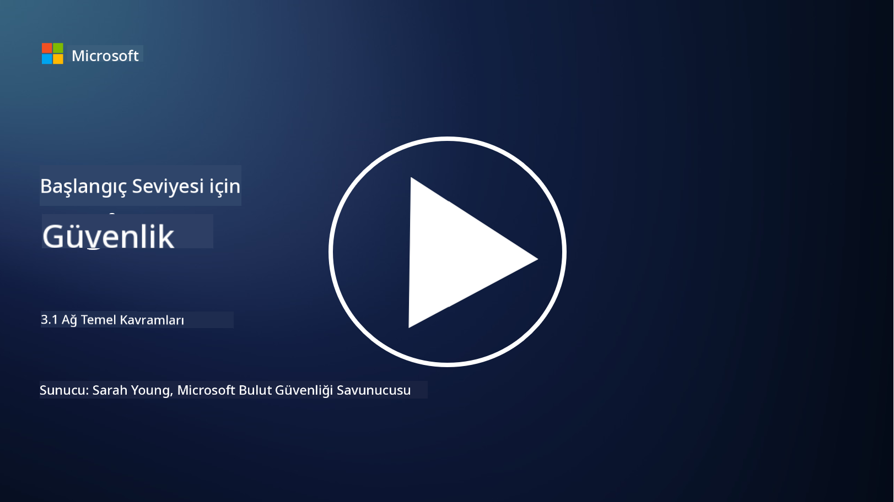
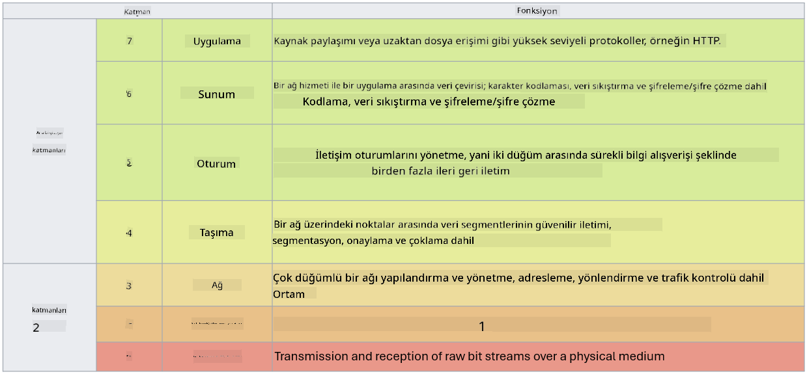

<!--
CO_OP_TRANSLATOR_METADATA:
{
  "original_hash": "252724eceeb183fb9018f88c5e1a3f0c",
  "translation_date": "2025-09-04T01:45:47+00:00",
  "source_file": "3.1 Networking key concepts.md",
  "language_code": "tr"
}
-->
# Ağ Temel Kavramları

Eğer IT alanında herhangi bir çalışma yaptıysanız, muhtemelen ağ kavramlarına aşinasınızdır. Modern ortamlarda kimliği birincil çevre kontrolü olarak kullansak da, bu ağ kontrollerinin gereksiz olduğu anlamına gelmez. Bu geniş bir konu olsa da, bu derste bazı temel ağ kavramlarını ele alacağız.

Bu derste şunları ele alacağız:

- IP adresleme nedir?

- OSI modeli nedir?

- TCP/UDP nedir?

- Port numaraları nedir?

- Dinamik ve taşınan verilerin şifrelenmesi nedir?

## IP Adresleme Nedir?

IP adresleme, yani İnternet Protokol adresleme, İnternet Protokolü kullanarak iletişim kuran bir bilgisayar ağına bağlı her cihaza atanan sayısal bir etikettir. Bu, cihazların bir ağ içinde benzersiz bir şekilde tanımlanmasını sağlar ve internet veya diğer bağlı ağlar üzerinden veri gönderip almasına olanak tanır. IP adreslemenin iki ana versiyonu vardır: IPv4 (İnternet Protokol versiyon 4) ve IPv6 (İnternet Protokol versiyon 6). Bir IP adresi genellikle IPv4 formatında (örneğin, 192.168.1.1) veya IPv6 formatında (örneğin, 2001:0db8:85a3:0000:0000:8a2e:0370:7334) temsil edilir.

## OSI Modeli Nedir?

OSI (Open Systems Interconnection) modeli, bir iletişim sisteminin işlevlerini yedi farklı katmana standartlaştıran kavramsal bir çerçevedir. Her katman belirli görevleri yerine getirir ve cihazlar arasında verimli ve güvenilir veri iletişimini sağlamak için bitişik katmanlarla iletişim kurar. Katmanlar, aşağıdan yukarıya doğru şu şekildedir:

1. Fiziksel Katman

2. Veri Bağlantı Katmanı

3. Ağ Katmanı

4. Taşıma Katmanı

5. Oturum Katmanı

6. Sunum Katmanı

7. Uygulama Katmanı

OSI modeli, donanım veya yazılım uygulamalarından bağımsız olarak ağ protokollerinin ve teknolojilerinin nasıl etkileşimde bulunduğunu anlamak için ortak bir referans sağlar.

_ref: https://en.wikipedia.org/wiki/OSI_model_

## TCP/UDP Nedir?

TCP (Transmission Control Protocol) ve UDP (User Datagram Protocol), cihazlar arasında internet veya yerel ağ üzerinden iletişimi kolaylaştırmak için kullanılan iki temel taşıma katmanı protokolüdür. Bu protokoller, veriyi iletim için paketlere böler ve alıcı tarafta bu paketleri orijinal veri haline getirir. Ancak, özellikleri ve kullanım alanları açısından farklılık gösterirler.

**TCP (Transmission Control Protocol)**:

TCP, bağlantı odaklı bir protokoldür ve cihazlar arasında güvenilir ve sıralı veri teslimi sağlar. Veri alışverişi başlamadan önce gönderici ve alıcı arasında bir bağlantı kurar. TCP, veri paketlerinin doğru sırada ulaşmasını sağlar ve kaybolan paketlerin yeniden iletimini gerçekleştirerek veri bütünlüğünü ve eksiksizliğini garanti eder. Bu, web tarama, e-posta, dosya transferi (FTP) ve veri tabanı iletişimi gibi güvenilir veri teslimi gerektiren uygulamalar için uygundur.

**UDP (User Datagram Protocol)**:

UDP, bağlantısız bir protokoldür ve daha hızlı veri iletimi sağlar ancak TCP kadar güvenilirlik sunmaz. Veri göndermeden önce resmi bir bağlantı kurmaz ve kaybolan paketlerin yeniden iletimi veya onaylanması için mekanizmalar içermez. UDP, hız ve verimliliğin güvenilir teslimattan daha önemli olduğu gerçek zamanlı iletişim, medya akışı, çevrimiçi oyunlar ve DNS sorguları gibi uygulamalar için uygundur.

Özetle, TCP güvenilirlik ve sıralı teslimi önceliklendirir ve veri doğruluğu gerektiren uygulamalar için uygundur. UDP ise hız ve verimliliği önceliklendirir ve küçük veri kaybı veya sıralama değişikliklerinin kabul edilebilir olduğu, düşük gecikme süresi gerektiren uygulamalar için uygundur. TCP ve UDP arasındaki seçim, kullanılan uygulama veya hizmetin özel gereksinimlerine bağlıdır.

## Port Numaraları Nedir?

Ağlarda, bir port numarası, bir cihazda çalışan farklı hizmet veya uygulamaları ayırt etmek için kullanılan sayısal bir tanımlayıcıdır. Portlar, gelen veriyi uygun uygulamaya yönlendirmeye yardımcı olur. Port numaraları 16 bitlik işaretsiz tamsayılar olup, 0 ile 65535 arasında değişir. Üç aralığa ayrılırlar:

- İyi Bilinen Portlar (0-1023): HTTP (port 80) ve FTP (port 21) gibi standart hizmetler için ayrılmıştır.

- Kayıtlı Portlar (1024-49151): İyi bilinen aralığın bir parçası olmayan ancak resmi olarak kaydedilmiş uygulamalar ve hizmetler için kullanılır.

- Dinamik/Özel Portlar (49152-65535): Uygulamalar tarafından geçici veya özel kullanım için uygundur.

## Dinamik ve Taşınan Verilerin Şifrelenmesi Nedir?

Şifreleme, veriyi yetkisiz erişim veya müdahaleden korumak için güvenli bir formata dönüştürme işlemidir. Şifreleme, hem "dinamik" (bir cihazda veya sunucuda depolandığında) hem de "taşınan" (cihazlar arasında veya ağlar üzerinden iletilirken) verilere uygulanabilir.

Dinamik Verilerin Şifrelenmesi: Bu, cihazlarda, sunucularda veya depolama sistemlerinde depolanan verilerin şifrelenmesini içerir. Bir saldırgan depolama ortamına fiziksel erişim sağlasa bile, şifreleme anahtarları olmadan verilere erişemez. Bu, cihaz hırsızlığı, veri ihlalleri veya yetkisiz erişim durumlarında hassas verilerin korunması için önemlidir.

Taşınan Verilerin Şifrelenmesi: Bu, cihazlar arasında veya ağlar üzerinden iletilen verilerin şifrelenmesini içerir. Bu, veri iletimi sırasında dinleme ve yetkisiz müdahaleyi önler. Taşınan verilerin şifrelenmesi için yaygın protokoller arasında web iletişimi için HTTPS ve çeşitli ağ trafiğini güvence altına almak için TLS/SSL bulunur.

## Daha Fazla Okuma
- [IP Adresleri Nasıl Çalışır? (howtogeek.com)](https://www.howtogeek.com/341307/how-do-ip-addresses-work/)
- [IP Adresini Anlamak: Giriş Kılavuzu (geekflare.com)](https://geekflare.com/understanding-ip-address/)
- [OSI modeli nedir? OSI'nin 7 katmanı açıklaması (techtarget.com)](https://www.techtarget.com/searchnetworking/definition/OSI)
- [OSI Modeli – Ağ Katmanlarının Açıklaması (freecodecamp.org)](https://www.freecodecamp.org/news/osi-model-networking-layers-explained-in-plain-english/)
- [TCP/IP protokolleri - IBM Belgeleri](https://www.ibm.com/docs/en/aix/7.3?topic=protocol-tcpip-protocols)
- [Ortak Portlar Cheat Sheet: Nihai Portlar ve Protokoller Listesi (stationx.net)](https://www.stationx.net/common-ports-cheat-sheet/)
- [Azure'da Dinamik Veri Şifreleme - Azure Güvenlik | Microsoft Learn](https://learn.microsoft.com/azure/security/fundamentals/encryption-atrest?WT.mc_id=academic-96948-sayoung)

---

**Feragatname**:  
Bu belge, [Co-op Translator](https://github.com/Azure/co-op-translator) adlı yapay zeka çeviri hizmeti kullanılarak çevrilmiştir. Doğruluk için çaba göstersek de, otomatik çevirilerin hata veya yanlışlıklar içerebileceğini lütfen unutmayın. Belgenin orijinal dili, yetkili kaynak olarak kabul edilmelidir. Kritik bilgiler için profesyonel insan çevirisi önerilir. Bu çevirinin kullanımından kaynaklanan herhangi bir yanlış anlama veya yanlış yorumlama durumunda sorumluluk kabul edilmez.