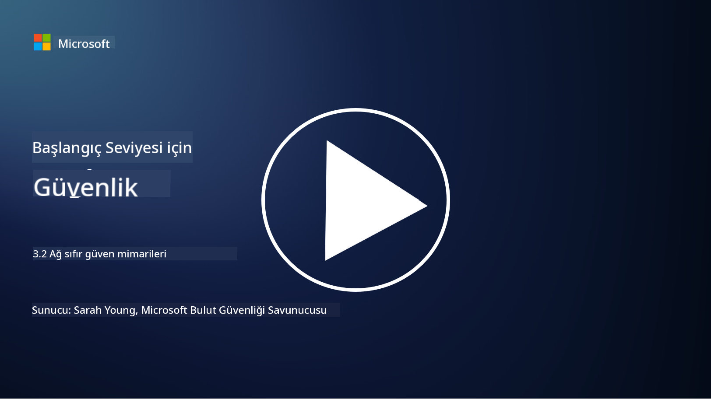

<!--
CO_OP_TRANSLATOR_METADATA:
{
  "original_hash": "680d6e14d9d33fc471c22f44679713f8",
  "translation_date": "2025-09-04T00:37:42+00:00",
  "source_file": "3.2 Networking zero trust architecture.md",
  "language_code": "tr"
}
-->
# Ağlarda Sıfır Güven Mimarileri

Ağ, sıfır güven kontrollerinde kritik bir katman sağlar. Bu derste şunları öğreneceğiz:

- Ağ segmentasyonu nedir?  
- Ağ segmentasyonu sıfır güveni nasıl uygular?  
- Uçtan uca şifreleme nedir?  

## Ağ Segmentasyonu Nedir?

Ağ segmentasyonu, bir ağı daha küçük, izole edilmiş segmentlere veya alt ağlara bölme uygulamasıdır. Her segment diğerlerinden izole edilir ve segmentler arası erişim, belirli güvenlik politikalarına dayalı olarak kontrol edilir ve kısıtlanır. Ağ segmentasyonu, olası ihlallerin etkisini sınırlayarak ve saldırganların ağ içinde yatay hareketini engelleyerek güvenliği artırmak için kullanılır.

Ağ segmentasyonu uygulayarak bir organizasyon, farklı kullanıcı türlerini, uygulamaları ve verileri ayıran "bölgeler" oluşturabilir. Bu, saldırı yüzeyini azaltır ve bir güvenlik olayının neden olabileceği potansiyel zararı en aza indirir. Ağ segmentasyonu, sanal LAN'lar (VLAN'lar), güvenlik duvarları ve erişim kontrolleri gibi teknolojilerle gerçekleştirilebilir.

## Ağ Segmentasyonu Sıfır Güveni Nasıl Uygular?

Ağ segmentasyonu, Sıfır Güven modelinin prensipleriyle yakından uyumludur. Sıfır Güven mimarisinde, ağ segmentasyonu "en az ayrıcalık" ilkesini uygulamaya yardımcı olur; bu, kullanıcıların ve cihazların yalnızca görevlerini yerine getirmek için ihtiyaç duydukları belirli kaynaklara ve hizmetlere erişim sağlamasını garanti eder. Ağı daha küçük bölgelere ayırarak, organizasyonlar sıkı erişim kontrolleri uygulayabilir, kritik varlıkları izole edebilir ve saldırganların yatay hareketini engelleyebilir.

Ağ segmentasyonu ayrıca kimlik tabanlı erişim kontrollerini uygulamaya yardımcı olur; burada kullanıcılar ve cihazlar belirli segmentlere erişmeden önce kapsamlı bir şekilde kimlik doğrulama ve yetkilendirme süreçlerinden geçer. Bu, hassas kaynaklara yetkisiz erişimi önler ve ele geçirilmiş kimlik bilgilerinin potansiyel etkisini azaltır.

## Uçtan Uca Şifreleme Nedir?

Uçtan uca (E2E) şifreleme, verilerin göndericiden alıcıya kadar olan tüm yolculuğu boyunca şifreli kalmasını sağlayan bir güvenlik önlemidir. Bu süreçte, veriler göndericinin tarafında şifrelenir ve yalnızca alıcı, verileri açıp okuyabilmek için gerekli olan şifre çözme anahtarına sahiptir. Şifreleme ve şifre çözme işlemleri uç noktalarda gerçekleşir, bu da yetkisiz tarafların, hizmet sağlayıcılar ve aracıların dahil olduğu durumlarda bile, düz metin verilere erişmesini son derece zorlaştırır.

E2E şifreleme, verilerin çeşitli ara sistemler veya ağlar üzerinden geçse bile yüksek düzeyde gizlilik ve güvenlik sağlar. Güvenli mesajlaşma uygulamaları, e-posta hizmetleri ve diğer iletişim platformlarında hassas bilgileri müdahaleden ve yetkisiz erişimden korumak için yaygın olarak kullanılır.

Bu şifreleme yöntemi, saldırganlar verileri aktarım sırasında ele geçirse bile yalnızca şifrelenmiş ve şifre çözme anahtarı olmadan anlamsız olan içerikleri göreceklerini garanti eder. Uçtan uca şifreleme, kullanıcı gizliliğini korumada ve hassas bilgilerin yetkisiz taraflara maruz kalmasını önlemede önemli bir rol oynar.

## SASE Nedir?

SASE, "Secure Access Service Edge" (Güvenli Erişim Hizmet Kenarı) anlamına gelir ve ağ güvenliği ile geniş alan ağı (WAN) yeteneklerini tek bir bulut tabanlı hizmette birleştiren bir siber güvenlik çerçevesi ve mimarisidir. SASE, uzaktan ve mobil kullanıcılar için ağ kaynaklarına, uygulamalara ve verilere güvenli ve ölçeklenebilir erişim sağlarken, ağ yönetimini basitleştirir ve geleneksel ağ ve güvenlik mimarilerinin karmaşıklığını azaltır.

SASE'nin temel özellikleri ve bileşenleri şunlardır:

1. **Bulut Tabanlı:** SASE, bir bulut hizmeti olarak sunulur; bu, güvenlik ve ağ işlevlerinin geleneksel yerinde donanım ve cihazlara dayanmaktan ziyade buluttan sağlandığı anlamına gelir.  

2. **Güvenlik ve Ağın Entegrasyonu:** SASE, güvenli web ağ geçitleri (SWG), hizmet olarak güvenlik duvarı (FWaaS), veri kaybı önleme (DLP), sıfır güven ağ erişimi (ZTNA) ve WAN optimizasyonu gibi çeşitli güvenlik hizmetlerini geniş alan ağı yetenekleriyle entegre eder. Bu entegrasyon, güvenlik ve ağ operasyonlarını kolaylaştırır.  

3. **Sıfır Güven:** SASE, sıfır güven prensibiyle çalışır; bu, sıkı erişim kontrolleri ve en az ayrıcalık erişim politikalarını uygular. Kullanıcılar ve cihazlar varsayılan olarak güvenilmezdir ve kaynaklara erişmeden önce kimlik doğrulama ve yetkilendirme süreçlerinden geçmelidir.  

4. **Kimlik Merkezli:** SASE, erişim kontrolünün temeli olarak kullanıcı ve cihaz kimliklerine odaklanır. Kimlik ve bağlam tabanlı politikalar, erişim izinlerini belirlemek için kullanılır ve bu politikalar kullanıcı davranışına ve bağlama göre dinamik olarak uyarlanır.  

5. **Ölçeklenebilirlik ve Esneklik:** SASE, çok sayıda kullanıcı ve cihazı kolayca destekleyebilir, bu da çeşitli ve değişen ağ ve güvenlik ihtiyaçlarına sahip organizasyonlar için uygun hale getirir.  

SASE, uzaktan çalışma ve bulut benimseme çağında özellikle önemlidir, çünkü ağ erişimini güvence altına almak ve yönetmek için kapsamlı ve esnek bir yaklaşım sunar. Kullanıcı merkezli ve sıfır güven güvenlik modellerine güçlü bir odaklanma ile organizasyonların değişen güvenlik ve ağ gereksinimlerine uyum sağlamasına yardımcı olur.

## Daha Fazla Okuma

- [What Is Network Segmentation? - Cisco](https://www.cisco.com/c/en/us/products/security/what-is-network-segmentation.html#~benefits)  
- [What Is Micro-Segmentation? - Cisco](https://www.cisco.com/c/en/us/products/security/what-is-microsegmentation.html)  
- [Implementing Network Segmentation and Segregation | Cyber.gov.au](https://www.cyber.gov.au/resources-business-and-government/maintaining-devices-and-systems/system-hardening-and-administration/network-hardening/implementing-network-segmentation-and-segregation)  
- [What Is Network Segmentation and Why It Matters | CompTIA](https://www.comptia.org/blog/security-awareness-training-network-segmentation)  
- [Network Segmentation: Concepts and Practices (cmu.edu)](https://insights.sei.cmu.edu/blog/network-segmentation-concepts-and-practices/)  
- [Secure networks with Zero Trust | Microsoft Learn](https://learn.microsoft.com/security/zero-trust/deploy/networks?WT.mc_id=academic-96948-sayoung)  
- [What is end-to-end encryption? | IBM](https://www.ibm.com/topics/end-to-end-encryption)  
- [What Is End-to-End Encryption, and Why Does It Matter? (howtogeek.com)](https://www.howtogeek.com/711656/what-is-end-to-end-encryption-and-why-does-it-matter/)  
- [Definition of Secure Access Service Edge (SASE) - Gartner Information Technology Glossary](https://www.gartner.com/en/information-technology/glossary/secure-access-service-edge-sase)  
- [What Is Secure Access Service Edge (SASE)? | Microsoft Security](https://www.microsoft.com/security/business/security-101/what-is-sase?WT.mc_id=academic-96948-sayoung)  

---

**Feragatname**:  
Bu belge, [Co-op Translator](https://github.com/Azure/co-op-translator) adlı yapay zeka çeviri hizmeti kullanılarak çevrilmiştir. Doğruluk için çaba göstersek de, otomatik çevirilerin hata veya yanlışlıklar içerebileceğini lütfen unutmayın. Belgenin orijinal dili, yetkili kaynak olarak kabul edilmelidir. Kritik bilgiler için profesyonel insan çevirisi önerilir. Bu çevirinin kullanımından kaynaklanan yanlış anlama veya yanlış yorumlamalardan sorumlu değiliz.