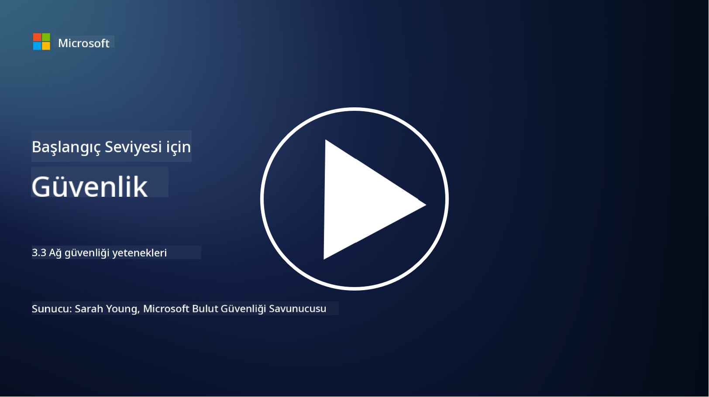

<!--
CO_OP_TRANSLATOR_METADATA:
{
  "original_hash": "c3aba077bb98eebc925dd58d870229ab",
  "translation_date": "2025-09-03T23:33:11+00:00",
  "source_file": "3.3 Network security capabilities.md",
  "language_code": "tr"
}
-->
# Ağ Güvenliği Yetkinlikleri

Bu derste, bir ağı güvence altına almak için kullanılabilecek aşağıdaki yetkinlikleri öğreneceğiz:

 - Geleneksel güvenlik duvarları
 - Web uygulama güvenlik duvarları
 - Bulut güvenlik grupları
 - CDN
 - Yük dengeleyiciler
 - Bastion sunucuları
 - VPN'ler
 - DDoS koruma

## Geleneksel Güvenlik Duvarları

Geleneksel güvenlik duvarları, önceden tanımlanmış güvenlik kurallarına göre gelen ve giden ağ trafiğini kontrol eden ve izleyen güvenlik cihazlarıdır. Güvenilir bir iç ağ ile güvenilmeyen dış ağlar arasında bir bariyer görevi görerek, yetkisiz erişimi ve potansiyel tehditleri önlemek için trafiği filtreler.

## Web Uygulama Güvenlik Duvarları

Web Uygulama Güvenlik Duvarları (WAF), web uygulamalarını SQL enjeksiyonu, çapraz site betikleme ve diğer güvenlik açıkları gibi çeşitli saldırılardan korumak için tasarlanmış özel güvenlik duvarlarıdır. HTTP isteklerini ve yanıtlarını analiz ederek, web uygulamalarını hedef alan kötü niyetli trafiği tespit eder ve engeller.

## Bulut Güvenlik Grupları

Güvenlik grupları, bulut hizmet sağlayıcıları tarafından sunulan temel ağ güvenliği özellikleridir. Sanal güvenlik duvarları gibi çalışarak, sanal makineler (VM'ler) ve örnekler gibi bulut kaynaklarına gelen ve giden trafiği kontrol eder. Güvenlik grupları, hangi tür trafiğin izinli ve hangisinin reddedileceğini belirleyen kurallar tanımlamaya olanak tanır ve bulut dağıtımlarına ek bir savunma katmanı ekler.

## İçerik Dağıtım Ağı (CDN)

İçerik Dağıtım Ağı, çeşitli coğrafi konumlarda bulunan dağıtılmış bir sunucu ağıdır. CDN'ler, içeriği önbelleğe alarak ve kullanıcıya daha yakın sunuculardan hizmet vererek web sitelerinin performansını ve erişilebilirliğini artırır. Ayrıca, trafiği birden fazla sunucu konumu arasında dağıtarak DDoS saldırılarına karşı belirli bir koruma sağlar.

## Yük Dengeleyiciler

Yük dengeleyiciler, gelen ağ trafiğini birden fazla sunucuya dağıtarak kaynak kullanımını optimize eder, yüksek erişilebilirlik sağlar ve uygulama performansını artırır. Sunucu aşırı yüklenmesini önler ve ağın dayanıklılığını artırarak verimli yanıt sürelerini korur.

## Bastion Sunucuları

Bastion sunucuları, dışarıdan (örneğin internet gibi güvenilmeyen bir ağdan) bir ağa kontrollü erişim sağlayan son derece güvenli ve izole edilmiş sunuculardır. Yöneticilerin iç sistemlere güvenli bir şekilde erişim sağlaması için giriş noktası olarak hizmet verirler. Bastion sunucuları genellikle saldırı yüzeyini en aza indirmek için güçlü güvenlik önlemleriyle yapılandırılır.

## Sanal Özel Ağlar (VPN'ler)

VPN'ler, kullanıcı cihazı ile uzak bir sunucu arasında şifrelenmiş tüneller oluşturarak, internet gibi potansiyel olarak güvensiz ağlar üzerinden güvenli ve özel iletişim sağlar. VPN'ler genellikle iç ağlara uzaktan erişim sağlamak için kullanılır ve kullanıcıların kaynaklara fiziksel olarak aynı ağdaymış gibi erişmesine olanak tanır.

## DDoS Koruma Araçları

DDoS (Dağıtılmış Hizmet Reddi) koruma araçları ve hizmetleri, bir ağ veya hizmeti aşırı yüklemek için birden fazla ele geçirilmiş cihazın kullanıldığı DDoS saldırılarının etkisini azaltmak için tasarlanmıştır. DDoS koruma çözümleri, kötü niyetli trafiği tespit eder ve filtreler, böylece meşru trafiğin hedeflenen yere ulaşmasını sağlar.

## Daha Fazla Okuma

- [Firewall Nedir? - Cisco](https://www.cisco.com/c/en/us/products/security/firewalls/what-is-a-firewall.html#~types-of-firewalls)
- [Firewall Gerçekte Ne Yapar? (howtogeek.com)](https://www.howtogeek.com/144269/htg-explains-what-firewalls-actually-do/)
- [Firewall Nedir? Firewall Nasıl Çalışır ve Türleri (kaspersky.com)](https://www.kaspersky.com/resource-center/definitions/firewall)
- [Ağ güvenlik grubu - nasıl çalışır | Microsoft Learn](https://learn.microsoft.com/azure/virtual-network/network-security-group-how-it-works)
- [Azure İçerik Dağıtım Ağına Giriş (CDN) - Eğitim | Microsoft Learn](https://learn.microsoft.com/training/modules/intro-to-azure-content-delivery-network/?WT.mc_id=academic-96948-sayoung)
- [İçerik dağıtım ağı (CDN) nedir? - Azure | Microsoft Learn](https://learn.microsoft.com/azure/cdn/cdn-overview?WT.mc_id=academic-96948-sayoung)
- [Yük Dengeleme Nedir? Yük Dengeleyiciler Nasıl Çalışır (nginx.com)](https://www.nginx.com/resources/glossary/load-balancing/)
- [Bastion sunucuları vs. VPN'ler · Tailscale](https://tailscale.com/learn/bastion-hosts-vs-vpns/)
- [VPN Nedir? Nasıl Çalışır, VPN Türleri (kaspersky.com)](https://www.kaspersky.com/resource-center/definitions/what-is-a-vpn)
- [Azure DDoS Korumasına Giriş - Eğitim | Microsoft Learn](https://learn.microsoft.com/training/modules/introduction-azure-ddos-protection/?WT.mc_id=academic-96948-sayoung)
- [DDoS Saldırısı Nedir? | Microsoft Security](https://www.microsoft.com/security/business/security-101/what-is-a-ddos-attack?WT.mc_id=academic-96948-sayoung)

---

**Feragatname**:  
Bu belge, AI çeviri hizmeti [Co-op Translator](https://github.com/Azure/co-op-translator) kullanılarak çevrilmiştir. Doğruluk için çaba göstersek de, otomatik çevirilerin hata veya yanlışlıklar içerebileceğini lütfen unutmayın. Belgenin orijinal dili, yetkili kaynak olarak kabul edilmelidir. Kritik bilgiler için profesyonel insan çevirisi önerilir. Bu çevirinin kullanımından kaynaklanan yanlış anlamalar veya yanlış yorumlamalar için sorumluluk kabul etmiyoruz.