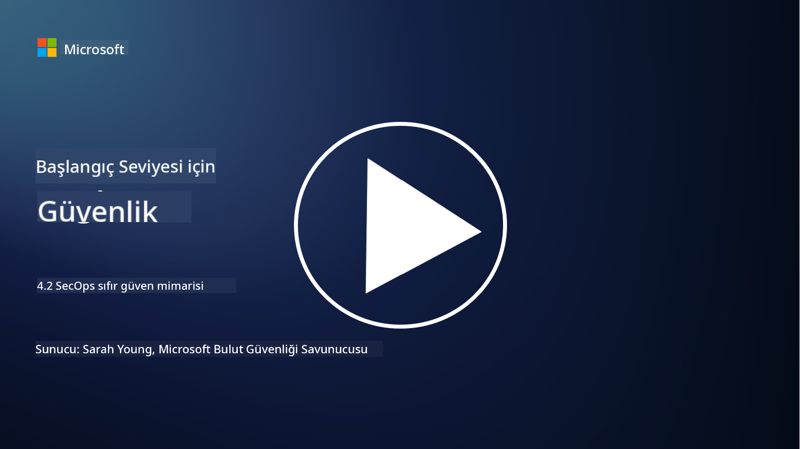

<!--
CO_OP_TRANSLATOR_METADATA:
{
  "original_hash": "45bbdc114e70936816b0b3e7c40189cf",
  "translation_date": "2025-09-04T00:44:37+00:00",
  "source_file": "4.2 SecOps zero trust architecture.md",
  "language_code": "tr"
}
-->
# SecOps sıfır güven mimarisi

Güvenlik operasyonları, sıfır güven mimarisinin iki parçasını oluşturur ve bu derste her iki konuyu da öğreneceğiz:

- Merkezi log toplama için BT mimarileri nasıl inşa edilmelidir?

- Modern BT ortamlarında güvenlik operasyonları için en iyi uygulamalar nelerdir?

## Merkezi log toplama için BT mimarileri nasıl inşa edilmelidir?

Merkezi log toplama, modern güvenlik operasyonlarının kritik bir bileşenidir. Bu, kuruluşların sunucular, uygulamalar, ağ cihazları ve güvenlik araçları gibi çeşitli kaynaklardan gelen logları ve verileri bir merkezde toplayarak analiz, izleme ve olay müdahalesi için kullanmalarını sağlar. Merkezi log toplamayı desteklemek için BT mimarilerini oluştururken dikkate alınması gereken en iyi uygulamalar şunlardır:

1. **Log Kaynağı Entegrasyonu**:

- Tüm ilgili cihazların ve sistemlerin log üretmek üzere yapılandırıldığından emin olun. Buna sunucular, güvenlik duvarları, yönlendiriciler, anahtarlar, uygulamalar ve güvenlik cihazları dahildir.

- Log kaynaklarını, logları merkezi bir log toplayıcıya veya yönetim sistemine iletecek şekilde yapılandırın.

2. **Doğru SIEM (Güvenlik Bilgi ve Olay Yönetimi) aracını seçin**:

- Kuruluşunuzun ihtiyaçlarına ve ölçeğine uygun bir SIEM (Güvenlik Bilgi ve Olay Yönetimi) çözümü seçin.

- Seçilen çözümün log toplama, birleştirme, analiz ve raporlama işlevlerini desteklediğinden emin olun.

3. **Ölçeklenebilirlik ve Yedeklilik**:

- Artan log kaynakları ve log hacmini karşılayacak şekilde ölçeklenebilir bir mimari tasarlayın.

- Donanım veya ağ arızalarından kaynaklanan kesintileri önlemek için yüksek erişilebilirlik sağlayan yedeklilik uygulayın.

4. **Logları Güvenli Bir Şekilde Taşıyın**:

- Logları kaynaklardan merkezi depoya taşımak için TLS/SSL veya IPsec gibi güvenli protokoller kullanın.

- Log gönderebilecek cihazların yalnızca yetkilendirilmiş olduğundan emin olmak için kimlik doğrulama ve erişim kontrolleri uygulayın.

5. **Normalleştirme**:

- Log formatlarını standartlaştırın ve verileri analiz kolaylığı ve tutarlılık için normalleştirin.

6. **Depolama ve Saklama**:

- Uyumluluk ve güvenlik gereksinimlerine göre loglar için uygun bir saklama süresi belirleyin.

- Logları yetkisiz erişim ve tahribattan koruyarak güvenli bir şekilde saklayın.

## Modern BT ortamlarında güvenlik operasyonları için en iyi uygulamalar nelerdir?

Merkezi log toplamanın yanı sıra, modern BT ortamlarında güvenlik operasyonları için aşağıdaki en iyi uygulamalar dikkate alınmalıdır:

1. **Sürekli İzleme**: Ağ ve sistem aktivitelerini gerçek zamanlı olarak izlemek ve tehditlere hızlı bir şekilde yanıt vermek için sürekli izleme uygulayın.

2. **Tehdit İstihbaratı**: Tehdit istihbaratı akışları ve hizmetlerinden yararlanarak ortaya çıkan tehditler ve güvenlik açıkları hakkında bilgi sahibi olun.

3. **Kullanıcı Eğitimi**: Sosyal mühendislik ve oltalama saldırılarıyla ilgili riskleri azaltmak için düzenli güvenlik farkındalık eğitimleri düzenleyin.

4. **Olay Müdahale Planı**: Güvenlik olaylarına hızlı ve etkili bir şekilde yanıt verebilmek için bir olay müdahale planı geliştirin ve test edin.

5. **Güvenlik Otomasyonu**: Olay müdahalesini ve tekrarlayan görevleri kolaylaştırmak için güvenlik otomasyonu ve orkestrasyon araçlarından yararlanın.

6. **Yedekleme ve Kurtarma**: Veri kaybı veya fidye yazılımı saldırıları durumunda verilerin erişilebilirliğini sağlamak için sağlam yedekleme ve felaket kurtarma çözümleri uygulayın.

## Daha fazla okuma

- [Microsoft Güvenlik En İyi Uygulamaları modülü: Güvenlik operasyonları | Microsoft Learn](https://learn.microsoft.com/security/operations/security-operations-videos-and-decks?WT.mc_id=academic-96948-sayoung)
- [Güvenlik operasyonları - Bulut Benimseme Çerçevesi | Microsoft Learn](https://learn.microsoft.com/azure/cloud-adoption-framework/secure/security-operations?WT.mc_id=academic-96948-sayoung)
- [Güvenlik Operasyonları ve Analitik Platform Mimarisi nedir? SOAPA'nın Tanımı, Nasıl Çalışır, Faydaları ve Daha Fazlası (digitalguardian.com)](https://www.digitalguardian.com/blog/what-security-operations-and-analytics-platform-architecture-definition-soapa-how-it-works#:~:text=All%20in%20all%2C%20security%20operations%20and%20analytics%20platform,become%20more%20efficient%20and%20operative%20with%20your%20security.)

---

**Feragatname**:  
Bu belge, AI çeviri hizmeti [Co-op Translator](https://github.com/Azure/co-op-translator) kullanılarak çevrilmiştir. Doğruluk için çaba göstersek de, otomatik çevirilerin hata veya yanlışlıklar içerebileceğini lütfen unutmayın. Belgenin orijinal dili, yetkili kaynak olarak kabul edilmelidir. Kritik bilgiler için profesyonel insan çevirisi önerilir. Bu çevirinin kullanımından kaynaklanan yanlış anlamalar veya yanlış yorumlamalar için sorumluluk kabul etmiyoruz.