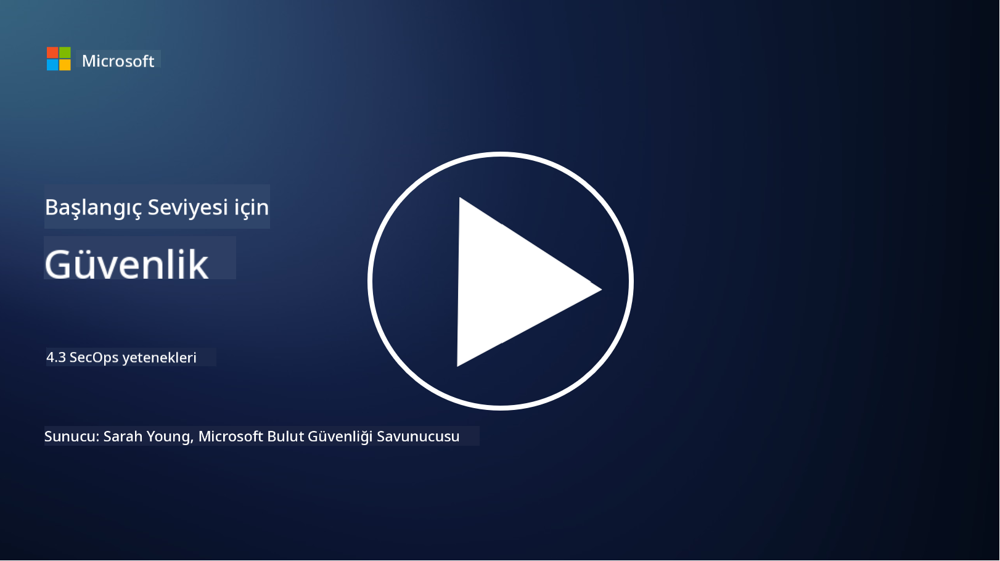

<!--
CO_OP_TRANSLATOR_METADATA:
{
  "original_hash": "553eb694c89f1caca0694e8d8ab89e0e",
  "translation_date": "2025-09-04T01:18:09+00:00",
  "source_file": "4.3 SecOps capabilities.md",
  "language_code": "tr"
}
-->
# SecOps yetenekleri

Bu bölümde, güvenlik operasyonlarında kullanılabilecek temel araçlar ve yetenekler hakkında daha fazla ayrıntıya değineceğiz.

Bu derste şunları ele alacağız:

- Güvenlik bilgi ve olay yönetimi (SIEM) aracı nedir?

- XDR nedir?

- Güvenlik operasyonlarını geliştirmek için hangi yetenekler kullanılabilir?

## Güvenlik bilgi ve olay yönetimi (SIEM) aracı nedir?

Güvenlik Bilgi ve Olay Yönetimi (SIEM) aracı, bir organizasyonun BT ortamında üretilen güvenlik uyarılarının analizini sağlar. Bu araçlar, ağ cihazları, sunucular, uygulamalar ve güvenlik sistemleri gibi çeşitli kaynaklardan gelen günlük verilerini ve güvenlik olaylarını toplar, birleştirir, ilişkilendirir ve analiz eder.

SIEM araçlarının temel işlevleri ve yetenekleri şunlardır:

1. **Günlük Toplama**: SIEM araçları, güvenlik duvarları, saldırı tespit sistemleri, antivirüs yazılımları ve daha fazlası dahil olmak üzere çok çeşitli cihazlardan, sistemlerden ve uygulamalardan günlük ve güvenlik olayı verilerini toplar.

2. **Veri Normalizasyonu**: Analiz ve ilişkilendirmeyi kolaylaştırmak için günlük verilerini ortak bir formata dönüştürürler.

3. **Olay İlişkilendirme**: SIEM araçları, güvenlik olaylarını ilişkilendirerek güvenlik ihlalleri veya tehditleri gösterebilecek desenleri ve anormallikleri tespit eder.

4. **Uyarı ve Bildirim**: Şüpheli aktiviteler veya güvenlik ihlalleri tespit edildiğinde, SIEM araçları gerçek zamanlı olarak uyarılar ve bildirimler oluşturur, böylece anında müdahale sağlanır.

5. **Olay Tespiti**: Yetkisiz erişim, veri ihlalleri, kötü amaçlı yazılım enfeksiyonları ve içeriden gelen tehditler gibi güvenlik olaylarının tespitini kolaylaştırır.

6. **Kullanıcı ve Varlık Davranış Analitiği (UEBA)**: Bazı SIEM araçları, hesapların ele geçirilmesi veya içeriden gelen tehditleri gösterebilecek anormal kullanıcı ve varlık davranışlarını tespit etmek için UEBA yeteneklerini içerir.

7. **Tehdit İstihbaratı Entegrasyonu**: SIEM araçları, bilinen tehdit göstergelerini (IOC'ler) ağ etkinliğiyle karşılaştırarak tehdit tespitini geliştirmek için tehdit istihbaratı akışlarıyla entegre olabilir.

8. **Otomasyon ve Orkestrasyon**: Otomasyon özellikleri, yaygın güvenlik olaylarına yanıtları otomatikleştirerek yanıt sürelerini kısaltır ve manuel çabayı azaltır.

9. **Gösterge Tablosu ve Görselleştirme**: Güvenlik verilerini izlemek ve özel raporlar oluşturmak için gösterge tabloları ve görselleştirme araçları sunar.

10. **Diğer Güvenlik Araçlarıyla Entegrasyon**: SIEM araçları, bir organizasyonun güvenlik duruşunun bütünsel bir görünümünü sağlamak için genellikle uç nokta algılama ve yanıt (EDR) çözümleri gibi diğer güvenlik araçları ve teknolojileriyle entegre olur.

## XDR nedir?

XDR (Genişletilmiş Algılama ve Yanıt), geleneksel Uç Nokta Algılama ve Yanıt (EDR) yeteneklerini genişleten ve bunları çeşitli kaynaklardan gelen daha geniş güvenlik telemetrisiyle birleştiren bir teknolojidir. XDR, yalnızca EDR, SIEM veya diğer bireysel güvenlik araçlarına güvenmenin sınırlamalarını ele alarak tehdit algılama, olay müdahalesi ve genel güvenliği geliştirmeyi amaçlar.

XDR'nin temel özellikleri ve bileşenleri şunlardır:

1. **Veri Entegrasyonu**: XDR, uç noktalar, ağ trafiği, bulut hizmetleri, e-posta ve daha fazlası dahil olmak üzere birden fazla kaynaktan veri entegre eder. Bu kapsamlı veri toplama, tehdit algılama ve analiz için daha geniş bir bağlam sağlar.

2. **Gelişmiş Analitik**: XDR, güvenlik tehditlerini tanımlamak ve önceliklendirmek için gelişmiş analitik, makine öğrenimi ve davranış analizi kullanır. Entegre verilerdeki desenleri ve anormallikleri hem bilinen hem de bilinmeyen tehditleri tespit etmek için inceler.

3. **Otomatik Tehdit Algılama**: XDR, çeşitli kaynaklardan gelen bilgileri ilişkilendirerek güvenlik tehditlerini ve anormallikleri otomatik olarak algılar. Birden fazla vektöre yayılabilecek karmaşık saldırı zincirlerini tespit edebilir.

4. **Olay Soruşturması ve Müdahalesi**: XDR, güvenlik ekiplerinin olayların kapsamını ve etkisini hızlı bir şekilde değerlendirmesine ve uygun düzeltici eylemleri gerçekleştirmesine yardımcı olan araçlar sağlar.

5. **Tehdit İstihbaratı Entegrasyonu**: Bilinen tehdit göstergelerini (IOC'ler) organizasyonun ağ ve uç nokta etkinliğiyle karşılaştırarak tehdit algılamayı geliştirmek için tehdit istihbaratı akışlarını ve verilerini entegre eder.

6. **Birleşik Konsol**: XDR genellikle güvenlik ekiplerinin farklı kaynaklardan gelen güvenlik uyarılarını ve olaylarını merkezi bir şekilde görüntüleyip yönetebileceği birleşik bir konsol veya gösterge tablosu sunar.

7. **Çapraz Platform Kapsamı**: XDR çözümleri, uç noktalar, sunucular, bulut ortamları ve mobil cihazlar dahil olmak üzere çok çeşitli platformları kapsar ve modern, çok platformlu BT ortamları için uygundur.

## Güvenlik operasyonlarını geliştirmek için hangi yetenekler kullanılabilir?

Güvenlik operasyonlarını geliştirmek için organizasyonlar, SIEM araçlarına ek olarak çeşitli yeteneklerden yararlanabilir:

1. **Makine Öğrenimi ve Yapay Zeka**: Gelişen tehditleri tespit etmek ve tehdit avını otomatikleştirmek için gelişmiş analitik, makine öğrenimi ve yapay zeka uygulayın.

2. **Kullanıcı ve Varlık Davranış Analitiği (UEBA)**: Anormallikleri ve içeriden gelen tehditleri tespit etmek için kullanıcı ve varlık davranışlarını analiz edin.

3. **Tehdit İstihbaratı Akışları**: En son tehditler ve tehdit göstergeleri hakkında güncel kalmak için tehdit istihbaratı akışlarını entegre edin.

4. **Güvenlik Orkestrasyonu, Otomasyon ve Yanıt (SOAR)**: Olay müdahalesini otomatikleştirmek ve güvenlik operasyonları iş akışlarını kolaylaştırmak için SOAR platformlarını uygulayın.

5. **Aldatma Teknolojileri**: Ağ içinde saldırganları yanıltmak ve tespit etmek için aldatma teknolojilerini devreye alın.

## Daha fazla okuma

- [What is SIEM? | Microsoft Security](https://www.microsoft.com/security/business/security-101/what-is-siem?WT.mc_id=academic-96948-sayoung)
- [What Is SIEM? - Security Information and Event Management - Cisco](https://www.cisco.com/c/en/us/products/security/what-is-siem.html)
- [Security information and event management - Wikipedia](https://en.wikipedia.org/wiki/Security_information_and_event_management)
- [What Is XDR? | Microsoft Security](https://www.microsoft.com/security/business/security-101/what-is-xdr?WT.mc_id=academic-96948-sayoung)
- [XDR & XDR Security (kaspersky.com.au)](https://www.kaspersky.com.au/resource-center/definitions/what-is-xdr)
- [The Power of SecOps: Redefining Core Security Capabilities - The New Stack](https://thenewstack.io/the-power-of-secops-redefining-core-security-capabilities/)
- [Seven Steps to Improve Your Security Operations and Response (securityintelligence.com)](https://securityintelligence.com/seven-steps-to-improve-your-security-operations-and-response/)

---

**Feragatname**:  
Bu belge, [Co-op Translator](https://github.com/Azure/co-op-translator) adlı yapay zeka çeviri hizmeti kullanılarak çevrilmiştir. Doğruluk için çaba göstersek de, otomatik çevirilerin hata veya yanlışlıklar içerebileceğini lütfen unutmayın. Belgenin orijinal dili, yetkili kaynak olarak kabul edilmelidir. Kritik bilgiler için profesyonel insan çevirisi önerilir. Bu çevirinin kullanımından kaynaklanan yanlış anlamalar veya yanlış yorumlamalar için sorumluluk kabul etmiyoruz.