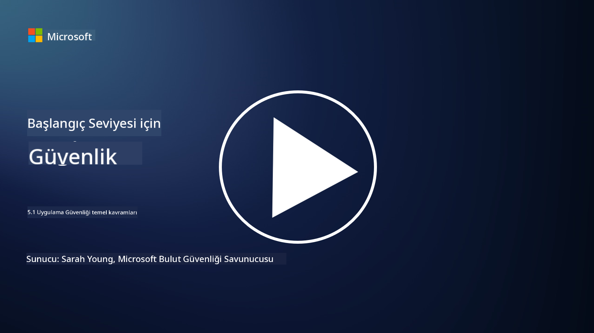

<!--
CO_OP_TRANSLATOR_METADATA:
{
  "original_hash": "e4b56bb23078d3ffb7ad407d280b0c36",
  "translation_date": "2025-09-04T00:31:55+00:00",
  "source_file": "5.1 AppSec key concepts.md",
  "language_code": "tr"
}
-->
# Uygulama Güvenliği Temel Kavramları

Uygulama güvenliği, kendi başına bir güvenlik uzmanlık alanıdır. Bu dersin bu bölümünde uygulama güvenliğini daha detaylı inceleyeceğiz.

## Giriş

Bu derste ele alacağız:

- Uygulama güvenliği nedir?

- Uygulama güvenliğinin temel kavramları/prensipleri nelerdir?

## Uygulama güvenliği nedir?

Uygulama güvenliği, genellikle "AppSec" olarak kısaltılır, yazılım uygulamalarını güvenlik tehditlerinden, zafiyetlerden ve saldırılardan koruma pratiğini ifade eder. Uygulamanın geliştirme, dağıtım ve bakım yaşam döngüsü boyunca güvenlik risklerini tanımlamak, azaltmak ve önlemek için kullanılan süreçleri, teknikleri ve araçları kapsar.

Uygulama güvenliği kritik öneme sahiptir çünkü uygulamalar siber saldırılar için yaygın hedeflerdir. Kötü niyetli aktörler, yazılımdaki zafiyetleri ve zayıflıkları kullanarak yetkisiz erişim sağlamak, veri çalmak, hizmetleri aksatmak veya başka kötü niyetli faaliyetler gerçekleştirmek için bu açıkları kullanır. Etkili bir uygulama güvenliği, bir uygulamanın ve ilişkili verilerinin gizliliğini, bütünlüğünü ve erişilebilirliğini sağlamaya yardımcı olur.

## Uygulama güvenliğinin temel kavramları/prensipleri nelerdir?

Uygulama güvenliğini destekleyen temel kavramlar ve prensipler şunlardır:

1. **Tasarımda Güvenlik**:

- Güvenlik, uygulamanın tasarımına ve mimarisine en başından entegre edilmelidir; sonradan eklenmemelidir.

2. **Girdi Doğrulama**:

- Tüm kullanıcı girdileri, beklenen formatlara uygun olduğundan ve kötü niyetli kod veya veri içermediğinden emin olmak için doğrulanmalıdır.

3. **Çıktı Kodlama**:

- İstemciye gönderilen veriler, çapraz site betikleme (XSS) gibi zafiyetleri önlemek için uygun şekilde kodlanmalıdır.

4. **Kimlik Doğrulama ve Yetkilendirme**:

- Kullanıcıları kimlik doğrulama yaparak tanımlayın ve rollerine ve izinlerine göre kaynaklara erişimlerini yetkilendirin.

5. **Veri Koruma**:

- Hassas veriler, depolanırken, iletilirken ve işlenirken yetkisiz erişimi önlemek için şifrelenmelidir.

6. **Oturum Yönetimi**:

- Güvenli oturum yönetimi, kullanıcı oturumlarının ele geçirilmesini ve yetkisiz erişimi önler.

7. **Güvenli Bağımlılıklar**:

- Yazılım bağımlılıklarını güvenlik yamalarıyla güncel tutarak zafiyetleri önleyin.

8. **Hata Yönetimi ve Günlükleme**:

- Hassas bilgilerin açığa çıkmasını önlemek için güvenli hata yönetimi uygulayın ve güvenli günlükleme yöntemlerini kullanın.

9. **Güvenlik Testi**:

- Uygulamaları düzenli olarak zafiyetlere karşı test edin; penetrasyon testleri, kod incelemeleri ve otomatik tarama araçları gibi yöntemler kullanın.

10. **Güvenli Yazılım Geliştirme Yaşam Döngüsü (SDLC)**:

- Yazılım geliştirme yaşam döngüsünün her aşamasına, gereksinimlerden dağıtıma ve bakıma kadar güvenlik uygulamalarını entegre edin.

## Daha fazla okuma

- [SheHacksPurple: Uygulama Güvenliği Nedir? - YouTube](https://www.youtube.com/watch?v=eNmccQNzSSY)
- [Uygulama Güvenliği Nedir? - Cisco](https://www.cisco.com/c/en/us/solutions/security/application-first-security/what-is-application-security.html#~how-does-it-work)
- [Uygulama güvenliği nedir? Yazılımı güvence altına almak için süreç ve araçlar | CSO Online](https://www.csoonline.com/article/566471/what-is-application-security-a-process-and-tools-for-securing-software.html)
- [OWASP Cheat Sheet Serisi | OWASP Vakfı](https://owasp.org/www-project-cheat-sheets/)

---

**Feragatname**:  
Bu belge, [Co-op Translator](https://github.com/Azure/co-op-translator) adlı yapay zeka çeviri hizmeti kullanılarak çevrilmiştir. Doğruluk için çaba göstersek de, otomatik çevirilerin hata veya yanlışlıklar içerebileceğini lütfen unutmayın. Belgenin orijinal dili, yetkili kaynak olarak kabul edilmelidir. Kritik bilgiler için profesyonel insan çevirisi önerilir. Bu çevirinin kullanımından kaynaklanan yanlış anlamalar veya yanlış yorumlamalar için sorumluluk kabul etmiyoruz.