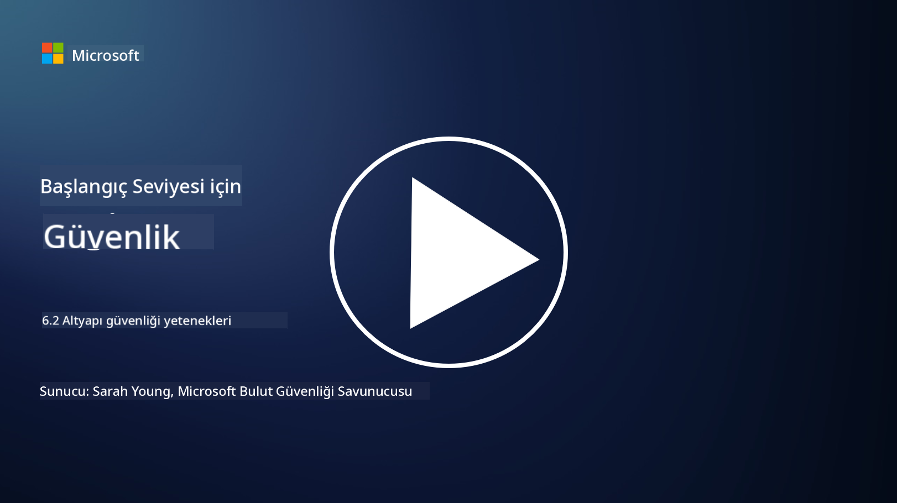

<!--
CO_OP_TRANSLATOR_METADATA:
{
  "original_hash": "7d79ba0e7668b3bdae1fba7aa047f6c0",
  "translation_date": "2025-09-04T00:11:44+00:00",
  "source_file": "6.2 Infrastructure security capabilities.md",
  "language_code": "tr"
}
-->
# Altyapı güvenliği yetenekleri

Bu bölümde, altyapı güvenliğinde kullanılan temel araçlar ve yetenekler hakkında daha fazla ayrıntıya değineceğiz.

**Giriş**

Bu derste şunları ele alacağız:

- Zafiyet yönetimi nedir?

- CSPM nedir?

- CNAPP nedir?

## Zafiyet yönetimi nedir?

Zafiyet yönetimi, bilgisayar sistemleri, yazılımlar, ağlar ve altyapılardaki zafiyetleri belirleme, değerlendirme, önceliklendirme, azaltma ve izleme sürecini sistematik bir şekilde ele alan bir yaklaşımdır. Zafiyet yönetiminin temel amacı, bilinen zafiyetleri kötü niyetli aktörler tarafından kullanılmadan önce proaktif bir şekilde ele alarak bir kuruluşun güvenlik risklerine maruz kalmasını azaltmaktır. İşte bu sürecin temel adımlarının bir özeti:

- **Belirleme**: Sunucular, uygulamalar, ağ cihazları ve uç noktalar gibi kuruluşun varlıklarında zafiyetleri tarama ve keşfetme.

- **Değerlendirme**: Zafiyetlerin ciddiyetini ve potansiyel etkisini, Common Vulnerability Scoring System (CVSS) puanı ve iş bağlamı gibi faktörlere dayanarak değerlendirme.

- **Önceliklendirme**: Zafiyetleri, risk seviyelerine ve kuruluşun operasyonları ile verileri üzerindeki potansiyel etkilerine göre sıralama.

- **Azaltma**: Zafiyetleri gidermek veya hafifletmek için stratejiler geliştirme ve uygulama. Bu stratejiler arasında yamaların uygulanması, güvenlik ayarlarının yapılandırılması veya telafi edici kontrollerin devreye alınması yer alabilir.

- **Doğrulama**: Azaltma önlemlerinin zafiyetleri ele almakta etkili olduğunu doğrulama.

- **Sürekli İzleme**: Düzenli zafiyet taramaları ve değerlendirmelerle zafiyetlerin ve potansiyel tehditlerin sürekli takibi.

Zafiyet yönetimi, kuruluşların güçlü bir güvenlik duruşu sürdürmesine ve güvenlik ihlallerinin olasılığını azaltmasına yardımcı olan siber güvenliğin kritik bir bileşenidir. Zafiyet yönetimi araçlarına örnek olarak Defender for Cloud, Nessus ve Qualys verilebilir.

## CSPM nedir?

Cloud Security Posture Management (CSPM), bulut ortamlarında güvenlik yapılandırmalarını ve en iyi uygulamaları değerlendirmek, izlemek ve uygulamak için tasarlanmış bir araç, süreç ve uygulama setidir. CSPM çözümleri, Amazon Web Services (AWS), Microsoft Azure, Google Cloud Platform (GCP) ve diğer bulut sağlayıcılar gibi bulut altyapısındaki yanlış yapılandırmaları, güvenlik açıklarını ve uyumluluk ihlallerini belirlemeye ve düzeltmeye yardımcı olur.

CSPM'nin temel unsurları şunlardır:

- **Yapılandırma Değerlendirmesi**: Bulut kaynaklarını ve hizmetlerini tarayarak yanlış yapılandırmaları, güvensiz ayarları ve güvenlik en iyi uygulamalarından sapmaları belirleme.

- **Güvenlik Politikası Uygulaması**: Yanlış yapılandırmaları otomatik olarak düzeltme veya uyarılar oluşturarak bulut ortamlarında güvenlik politikalarını ve uyumluluk standartlarını uygulama.

- **Sürekli İzleme**: Bulut varlıklarının ve kaynaklarının güvenlik duruşuna sürekli görünürlük sağlama ve güvenlik olayları için gerçek zamanlı uyarılar sunma.

- **Uyumluluk Raporlama**: Düzenleyici gereklilikler ve endüstri standartlarına uyumu göstermek için raporlar ve panolar oluşturma.

CSPM, kuruluşların bulut altyapısının güvenli, uyumlu ve en iyi uygulamalarla uyumlu olmasını sağlayarak bulutla ilgili güvenlik olaylarının riskini azaltır. CSPM araçlarına örnek olarak Defender for Cloud ve Snyk verilebilir.

## CNAPP nedir?

CNAPP, Cloud-Native Application Protection Platform'un kısaltmasıdır. Bu, potansiyel bulut güvenlik tehditlerini ve zafiyetlerini izlemeyi, tespit etmeyi ve bunlara karşı harekete geçmeyi kolaylaştıran hepsi bir arada bir bulut tabanlı yazılım platformudur. CNAPP, birden fazla araç ve yeteneği tek bir yazılım çözümünde birleştirerek karmaşıklığı azaltır ve DevOps ile DevSecOps ekiplerinin operasyonlarını kolaylaştırır. CNAPP, CI/CD uygulama yaşam döngüsü boyunca, geliştirmeden üretime kadar uçtan uca bulut ve uygulama güvenliği sunar. Modern bulut güvenliği izleme, duruş yönetimi, ihlal önleme ve kontrol araçlarına yönelik endüstri ihtiyacını karşılar. CNAPP çözümleri, güvenlik ekiplerine bulut ortamındaki riskleri ölçme ve bunlara yanıt verme yeteneği sağlar. CNAPP'nin bazı özellikleri arasında gelişmiş görünürlük, risklerin ölçülmesi, güvenli yazılım geliştirme ve birleşik bir bulut güvenlik çözümü bulunur. CNAPP, geleneksel olarak ayrı ayrı kullanılan birden fazla bulut güvenlik çözümünü tek bir kullanıcı arayüzünde birleştirerek kuruluşların tüm bulut uygulama ayak izini korumasını kolaylaştırır. CNAPP'ler, konteyner tarama, bulut güvenlik duruş yönetimi, kod olarak altyapı tarama, bulut altyapısı yetkilendirme yönetimi ve çalışma zamanında bulut iş yükü koruma platformları gibi birden fazla bulut tabanlı güvenlik aracını ve veri kaynağını bir araya getirir.

## Daha fazla okuma
- [What is CSPM? | Microsoft Security](https://www.microsoft.com/security/business/security-101/what-is-cspm?WT.mc_id=academic-96948-sayoung)
- [What is Cloud Security Posture Management (CSPM)? | HackerOne](https://www.hackerone.com/knowledge-center/what-cloud-security-posture-management)
- [Function of cloud security posture management - Cloud Adoption Framework | Microsoft Learn](https://learn.microsoft.com/azure/cloud-adoption-framework/organize/cloud-security-posture-management?WT.mc_id=academic-96948-sayoung)
- [What Is a CNAPP? | Microsoft Security](https://www.microsoft.com/security/business/security-101/what-is-cnapp?WT.mc_id=academic-96948-sayoung)
- [Why Everyone Is Talking About CNAPP (forbes.com)](https://www.forbes.com/sites/forbestechcouncil/2021/12/10/why-everyone-is-talking-about-cnapp/?sh=567275ca1549)
- [Improving Your Multi-Cloud Security with a Cloud-Native Application Protection Platform (CNAPP)](https://www.youtube.com/watch?v=5w42kQ_QjZg&t=212s)

---

**Feragatname**:  
Bu belge, [Co-op Translator](https://github.com/Azure/co-op-translator) adlı yapay zeka çeviri hizmeti kullanılarak çevrilmiştir. Doğruluk için çaba göstersek de, otomatik çevirilerin hata veya yanlışlıklar içerebileceğini lütfen unutmayın. Belgenin orijinal dili, yetkili kaynak olarak kabul edilmelidir. Kritik bilgiler için profesyonel insan çevirisi önerilir. Bu çevirinin kullanımından kaynaklanan yanlış anlama veya yanlış yorumlamalardan sorumlu değiliz.